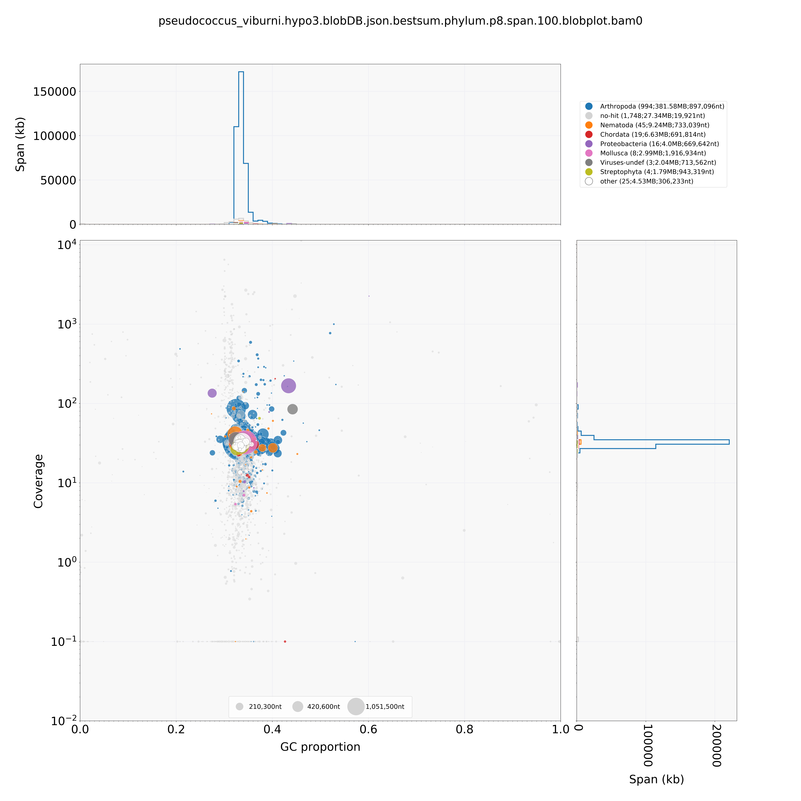
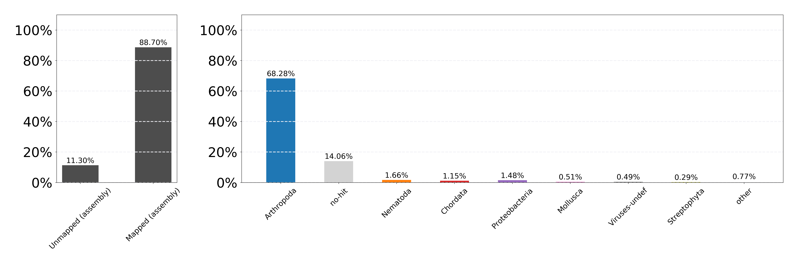

# Generating a *P. viburni* assembly

Start date: 08.10.2019, restarted 21.04.2020

	# Working directory	
	/data/ross/mealybugs/analyses/B_viburni_andres/1_pacbio_assembly
    qlogin -pe smp 1 -N samtools 

## 1. Raw reads

PacBio (/data/ross/mealybugs/analyses/B_viburni_andres/1_pacbio_assembly/0_reads/)

	ln -s /data/ross/mealybugs/raw/11718_Ross_Laura/raw_data/20190530/PV_18-13/m54041_190522_233005.subreads.bam
	ln -s /data/ross/mealybugs/raw/11718_Ross_Laura/raw_data/20190530/PV_18-13/m54041_190524_131016.subreads.bam
	ln -s /data/ross/mealybugs/raw/11718_Ross_Laura/raw_data/20190530/PV_18-13/m54041_190524_233023.subreads.bam

Illumina (/data/ross/mealybugs/analyses/B_viburni_andres/2_short_read_DNA_seq/0_reads)
	
	ln -s /data/ross/mealybugs/raw/transfer.genomics.ed.ac.uk/11372_Ross_Laura/raw_data/all_reads/18_13_1B_350/180608_A00291_0042_BH3CC3DRXX_2_11372RL0002L01_1.fastq.gz
	ln -s /data/ross/mealybugs/raw/transfer.genomics.ed.ac.uk/11372_Ross_Laura/raw_data/all_reads/18_13_1B_350/180608_A00291_0042_BH3CC3DRXX_2_11372RL0002L01_2.fastq.gz
	ln -s /data/ross/mealybugs/raw/transfer.genomics.ed.ac.uk/11372_Ross_Laura/raw_data/all_reads/18_13_1B_550/180608_A00291_0042_BH3CC3DRXX_2_11372RL0001L01_1.fastq.gz
	ln -s /data/ross/mealybugs/raw/transfer.genomics.ed.ac.uk/11372_Ross_Laura/raw_data/all_reads/18_13_1B_550/180608_A00291_0042_BH3CC3DRXX_2_11372RL0001L01_2.fastq.gz

## 2. Bam to fasta

Index bam (conda env pacbio)

	pbindex m54041_190522_233005.subreads.bam
	pbindex m54041_190524_131016.subreads.bam
	pbindex m54041_190524_233023.subreads.bam

Convert fasta to bam (conda env pacbio)
	
	bam2fasta -o /scratch/afilia/PV_18-13.1.subreads m54041_190522_233005.subreads.bam && rsync -av /scratch/afilia/PV_18-13.1.subreads /.
	bam2fasta -o /scratch/afilia/PV_18-13.2.subreads m54041_190524_131016.subreads.bam && rsync -av /scratch/afilia/PV_18-13.2.subreads /.
	bam2fasta -o /scratch/afilia/PV_18-13.3.subreads m54041_190524_233023.subreads.bam && rsync -av /scratch/afilia/PV_18-13.3.subreads /.

## 3. Read length distribution

	/ceph/users/dlaetsch/software/falen PV_18-13.1.subreads.fasta.gz | cut -f2 | sort -rn > PV_18-13.1.subreads.read_length.txt
	/ceph/users/dlaetsch/software/falen PV_18-13.2.subreads.fasta.gz | cut -f2 | sort -rn > PV_18-13.2.subreads.read_length.txt
	/ceph/users/dlaetsch/software/falen PV_18-13.3.subreads.fasta.gz | cut -f2 | sort -rn > PV_18-13.3.subreads.read_length.txt

## 4. Plot lengths

Use plrl.py (D. Laetsch, copied in /data/ross/mealybugs/analyses/B_viburni_andres/scripts)
	
	# conda install tqdm seaborn matplotlib numpy docopt
	python /data/ross/mealybugs/analyses/B_viburni_andres/scripts/plrl.py -d . -f 2 -m 40000

## 5. Raw assembly with wtdbg2 

Initial assembly with wtdbg2 (redbean) v2.5 (conda env afilia)
	
	wtdbg2 -x sq -g 327m -t 64 -i /data/ross/mealybugs/analyses/B_viburni_andres/1_pacbio_assembly/0_reads/PV_18-13.1.subreads.fasta.gz -i /data/ross/mealybugs/analyses/B_viburni_andres/1_pacbio_assembly/0_reads/PV_18-13.2.subreads.fasta.gz -i /data/ross/mealybugs/analyses/B_viburni_andres/1_pacbio_assembly/0_reads/PV_18-13.3.subreads.fasta.gz -o /scratch/afilia/pseudococcus_viburni.redbean && wtpoa-cns -t 64 -i /scratch/afilia/pseudococcus_viburni.redbean.ctg.lay.gz -fo /scratch/afilia/pseudococcus_viburni.redbean.raw.fa 

## 6. Assembly assessment

Run Busco

	conda create -n afilia_busco
	conda install -c bioconda -c conda-forge busco=4.0.6
	conda install -c bioconda blast
	conda install -c bioconda augustus (v 3.3.3)
	export AUGUSTUS_CONFIG_PATH="/ceph/software/busco_augustus_config_path/config/" && busco -m genome -c 16 -i pseudococcus_viburni.redbean.raw.fa -o pseudococcus_viburni.redbean.raw.busco -l insecta_odb10
	export AUGUSTUS_CONFIG_PATH="/ceph/software/busco_augustus_config_path/config/" && busco -m genome -c 16 -i pseudococcus_viburni.redbean.raw.fa -o pseudococcus_viburni.redbean.raw.busco.hemiptera -l hemiptera_odb10

Get assembly metrics

	/ceph/software/scripts/scaffold_stats.pl -t 200 1000 -d " " -f pseudococcus_viburni.redbean.raw.fa > pseudococcus_viburni.redbean.raw.stats

Stats for raw:
  * For scaffolds longer than 1000 bp:
  	- Num 2861
  	- Span 439642885
  	- Min 1394
  	- Mean 153667
  	- N50 816797
  	- NumN50 164
  	- GC 0.336
  * Busco (insecta) C:83.1%[S:82.0%,D:1.1%],F:6.7%,M:10.2%,n:1367
  * Busco (hemiptera) C:85.7%[S:83.4%,D:2.3%],F:2.2%,M:12.1%,n:2510  

## 7. Preliminary polishing of the genome

Polish with minimap2 v2.17-r941 (conda env afilia)
	
	minimap2 -t16 -ax map-pb -r2k ../raw/pseudococcus_viburni.redbean.raw.fa /data/ross/mealybugs/analyses/B_viburni_andres/1_pacbio_assembly/0_reads/PV_18-13.1.subreads.fasta.gz /data/ross/mealybugs/analyses/B_viburni_andres/1_pacbio_assembly/0_reads/PV_18-13.2.subreads.fasta.gz /data/ross/mealybugs/analyses/B_viburni_andres/1_pacbio_assembly/0_reads/PV_18-13.3.subreads.fasta.gz | samtools sort -@4 > pseudococcus_viburni.redbean.int.fa
	samtools view -F0x900 pseudococcus_viburni.redbean.int.fa | wtpoa-cns -t 15 -d ../raw/pseudococcus_viburni.redbean.raw.fa -i - -fo pseudococcus_viburni.redbean.cns.fa

	export AUGUSTUS_CONFIG_PATH="/ceph/software/busco_augustus_config_path/config/" && busco -m genome -c 16 -i pseudococcus_viburni.redbean.cns.fa -o pseudococcus_viburni.redbean.cns.busco.hemiptera -f -l hemiptera_odb10

Stats for cns:
  * For scaffolds longer than 1000 bp:
	-	Num 2852
	-	Span 436032832
	-	Min 1041
	-	Mean 152886
	-	N50 816708
	-	NumN50 163
	-	GC 0.336  
  * Busco (hemiptera) C:90.3%[S:87.8%,D:2.5%],F:1.4%,M:8.3%,n:2510

Additional polishment using short reads

	bwa index pseudococcus_viburni.redbean.cns.fa
	bwa mem -t 32 pseudococcus_viburni.redbean.cns.fa /data/ross/mealybugs/analyses/B_viburni_andres/2_short_read_DNA_seq/0_reads/PV_18-13.Illumina.350.trimmed_1.fq.gz /data/ross/mealybugs/analyses/B_viburni_andres/2_short_read_DNA_seq/0_reads/PV_18-13.Illumina.350.trimmed_2.fq.gz | samtools sort -O SAM -o /scratch/afilia/PV_18-13.Illumina.350.alignedtocns.sorted.sam
	bwa mem -t 32 pseudococcus_viburni.redbean.cns.fa /data/ross/mealybugs/analyses/B_viburni_andres/2_short_read_DNA_seq/0_reads/PV_18-13.Illumina.550.trimmed_1.fq.gz /data/ross/mealybugs/analyses/B_viburni_andres/2_short_read_DNA_seq/0_reads/PV_18-13.Illumina.550.trimmed_2.fq.gz | samtools sort -O SAM -o /scratch/afilia/PV_18-13.Illumina.550.alignedtocns.sorted.sam
	samtools merge /scratch/afilia/PV_18-13.Illumina.alignedtocns.sorted.sam /scratch/afilia/PV_18-13.Illumina.350.alignedtocns.sorted.sam /scratch/afilia/PV_18-13.Illumina.alignedtocns.550.sorted.sam
	
	wtpoa-cns -t 32 -x sam-sr -d pseudococcus_viburni.redbean.cns.fa -i /scratch/afilia/PV_18-13.Illumina.alignedtocns.sorted.sam -fo pseudococcus_viburni.redbean.cns.srp.fa
	/ceph/software/scripts/scaffold_stats.pl -t 200 1000 -d " " -f pseudococcus_viburni.redbean.cns.srp.fa > pseudococcus_viburni.redbean.cns.srp.stats  

	export AUGUSTUS_CONFIG_PATH="/ceph/software/busco_augustus_config_path/config/" && busco -m genome -c 16 -i pseudococcus_viburni.redbean.cns.srp.fa -o pseudococcus_viburni.redbean.cns.srp.busco.hemiptera -f -l hemiptera_odb10
	export AUGUSTUS_CONFIG_PATH="/ceph/software/busco_augustus_config_path/config/" && busco -m genome -c 16 -i pseudococcus_viburni.redbean.cns.srp.fa -o pseudococcus_viburni.redbean.cns.srp.busco.insecta -f -l insecta_odb10
	export AUGUSTUS_CONFIG_PATH="/ceph/software/busco_augustus_config_path/config/" && busco -m genome -c 16 -i pseudococcus_viburni.redbean.cns.srp.fa -o pseudococcus_viburni.redbean.cns.srp.busco.arthropoda -f -l arthropoda_odb10

Stats for cns-srp:
  * For scaffolds longer than 1000 bp:
	-	Num 2848
	-	Span 422785487
	-	Min 1010
	-	Mean 148449
	-	N50 797178
	-	NumN50 163
	-	GC 0.336
* Busco (hemiptera) C:91.7%[S:88.6%,D:3.1%],F:1.0%,M:7.3%,n:2510
* Busco (insecta) C:93.0%[S:90.1%,D:2.9%],F:1.3%,M:5.7%,n:1367
* Busco (arthropoda) C:94.5%[S:92.2%,D:2.3%],F:1.5%,M:4.0%,n:1013 

## 8. Further polishing: 3x rounds with long reads, 1x rounds with Illumina reads

Polish cns assembly 2 more times with minimap2

	minimap2 -t32 -ax map-pb -r2k pseudococcus_viburni.redbean.cns.fa /data/ross/mealybugs/analyses/B_viburni_andres/1_pacbio_assembly/0_reads/PV_18-13.1.subreads.fasta.gz /data/ross/mealybugs/analyses/B_viburni_andres/1_pacbio_assembly/0_reads/PV_18-13.2.subreads.fasta.gz /data/ross/mealybugs/analyses/B_viburni_andres/1_pacbio_assembly/0_reads/PV_18-13.3.subreads.fasta.gz | samtools sort -@4 > pseudococcus_viburni.redbean.cns2.int.fa
	samtools view -F0x900 pseudococcus_viburni.redbean.cns2.int.fa | wtpoa-cns -t 32 -d pseudococcus_viburni.redbean.cns.fa -i - -fo pseudococcus_viburni.redbean.cns2.fa
	minimap2 -t32 -ax map-pb -r2k pseudococcus_viburni.redbean.cns2.fa /data/ross/mealybugs/analyses/B_viburni_andres/1_pacbio_assembly/0_reads/PV_18-13.1.subreads.fasta.gz /data/ross/mealybugs/analyses/B_viburni_andres/1_pacbio_assembly/0_reads/PV_18-13.2.subreads.fasta.gz /data/ross/mealybugs/analyses/B_viburni_andres/1_pacbio_assembly/0_reads/PV_18-13.3.subreads.fasta.gz | samtools sort -@32 > /scratch/afilia/pseudococcus_viburni.redbean.cns3.int.fa
	samtools view -F0x900 /scratch/afilia/pseudococcus_viburni.redbean.cns3.int.fa | wtpoa-cns -t 32 -d pseudococcus_viburni.redbean.cns2.fa -i - -fo pseudococcus_viburni.redbean.cns3.fa

BUSCO for cns2 and 3:

	export AUGUSTUS_CONFIG_PATH="/ceph/software/busco_augustus_config_path/config/" && busco -m genome -c 24 -i ../pseudococcus_viburni.redbean.cns2.fa -o pseudococcus_viburni.redbean.cns2.busco.hemiptera -f -l hemiptera_odb10
	export AUGUSTUS_CONFIG_PATH="/ceph/software/busco_augustus_config_path/config/" && busco -m genome -c 24 -i ../pseudococcus_viburni.redbean.cns3.fa -o pseudococcus_viburni.redbean.cns3.busco.hemiptera -f -l hemiptera_odb10

* C:90.2%[S:87.6%,D:2.6%],F:1.4%,M:8.4%,n:2510 (cns2)
* C:90.6%[S:88.2%,D:2.4%],F:1.4%,M:8.0%,n:2510 (cns3)

Polishing with short reads

	bwa index pseudococcus_viburni.redbean.cns3.fa
	bwa mem -t 32 pseudococcus_viburni.redbean.cns3.fa /data/ross/mealybugs/analyses/B_viburni_andres/2_short_read_DNA_seq/0_reads/PV_18-13.Illumina.350.trimmed_1.fq.gz /data/ross/mealybugs/analyses/B_viburni_andres/2_short_read_DNA_seq/0_reads/PV_18-13.Illumina.350.trimmed_2.fq.gz | samtools sort -O SAM -o /scratch/afilia/PV_18-13.Illumina.350.alignedtocns3.sorted.sam
	bwa mem -t 32 pseudococcus_viburni.redbean.cns3.fa /data/ross/mealybugs/analyses/B_viburni_andres/2_short_read_DNA_seq/0_reads/PV_18-13.Illumina.550.trimmed_1.fq.gz /data/ross/mealybugs/analyses/B_viburni_andres/2_short_read_DNA_seq/0_reads/PV_18-13.Illumina.550.trimmed_2.fq.gz | samtools sort -O SAM -o /scratch/afilia/PV_18-13.Illumina.550.alignedtocns3.sorted.sam
	samtools merge /scratch/afilia/PV_18-13.Illumina.alignedtocns3.sorted.sam /scratch/afilia/PV_18-13.Illumina.350.alignedtocns3.sorted.sam /scratch/afilia/PV_18-13.Illumina.550.alignedtocns3.sorted.sam
	wtpoa-cns -t 32 -x sam-sr -d pseudococcus_viburni.redbean.cns3.fa -i /scratch/afilia/PV_18-13.Illumina.alignedtocns3.sorted.sam -fo pseudococcus_viburni.redbean.cns3.srp1.fa
	
	/ceph/software/scripts/scaffold_stats.pl -t 200 1000 -d " " -f pseudococcus_viburni.redbean.cns3.srp1.fa -o pseudococcus_viburni.redbean.cns3.srp1.stats
	export AUGUSTUS_CONFIG_PATH="/ceph/software/busco_augustus_config_path/config/" && busco -m genome -c 24 -i ../pseudococcus_viburni.redbean.cns3.srp1.fa -o pseudococcus_viburni.redbean.cns3.srp1.busco.hemiptera -f -l hemiptera_odb10
	export AUGUSTUS_CONFIG_PATH="/ceph/software/busco_augustus_config_path/config/" && busco -m genome -c 24 -i ../pseudococcus_viburni.redbean.cns3.srp1.fa -o pseudococcus_viburni.redbean.cns3.srp1.busco.insecta -f -l insecta_odb10

Stats for cns-srp:
  * For scaffolds longer than 1000 bp:
	-	Num 2859
	-	Span 420719638
	-	Min 222
	-	Mean 147156
	-	N50 801500
	-	NumN50 162
	-	GC 0.336
* Busco (hemiptera) C:92.0%[S:89.0%,D:3.0%],F:1.0%,M:7.0%,n:2510 
* Busco (insecta) C:92.7%[S:89.8%,D:2.9%],F:2.1%,M:5.2%,n:1367 

## 9. Alternative polishing: use HyPo

conda activate afilia_hypo  
conda install -c bioconda hypo

Mapping short and long reads to contigs

	cat /data/ross/mealybugs/analyses/B_viburni_2020/2_short_read_DNA_seq/0_reads/PV_18-13.Illumina.350.trimmed_1.fq.gz /data/ross/mealybugs/analyses/B_viburni_2020/2_short_read_DNA_seq/0_reads/PV_18-13.Illumina.550.trimmed_1.fq.gz > PV_18-13.Illumina.merged.trimmed_1.fq.gz
	cat /data/ross/mealybugs/analyses/B_viburni_2020/2_short_read_DNA_seq/0_reads/PV_18-13.Illumina.350.trimmed_2.fq.gz /data/ross/mealybugs/analyses/B_viburni_2020/2_short_read_DNA_seq/0_reads/PV_18-13.Illumina.550.trimmed_2.fq.gz > PV_18-13.Illumina.merged.trimmed_2.fq.gz

	minimap2 --secondary=no --MD -ax sr -t 32 ../raw/pseudococcus_viburni.redbean.raw.fa PV_18-13.Illumina.merged.trimmed_1.fq.gz PV_18-13.Illumina.merged.trimmed_2.fq.gz | samtools view -Sb - > /scratch/afilia/hypo1-mapped-sr.bam
	samtools sort -@32 -o /scratch/afilia/hypo1-mapped-sr.sorted.bam /scratch/afilia/hypo1-mapped-sr.bam && rsync -av /scratch/afilia/hypo1-mapped-sr.sorted.bam .
	samtools index hypo1-mapped-sr.sorted.bam
	minimap2 --secondary=no --MD -ax map-pb -t 32 ../raw/pseudococcus_viburni.redbean.raw.fa ../../0_reads/PV_18-13.1.subreads.fasta.gz ../../0_reads/PV_18-13.2.subreads.fasta.gz ../../0_reads/PV_18-13.3.subreads.fasta.gz | samtools view -Sb - > /scratch/afilia/hypo1-mapped-lg.bam
	samtools sort -@32 -o /scratch/afilia/hypo1-mapped-lg.sorted.bam /scratch/afilia/hypo1-mapped-lg.bam && rsync -av /scratch/afilia/hypo1-mapped-lg.sorted.bam .
	samtools index hypo1-mapped-lg.sorted.bam

Run hypo (three rounds)

	hypo -d ../raw/pseudococcus_viburni.redbean.raw.fa -i -r @il_names.txt -s 440m -c 100 -b hypo1-mapped-sr.sorted.bam -B hypo1-mapped-lg.sorted.bam -p 96 -t 48 -o pseudococcus_viburni.hypo1.fa

* For scaffolds longer than 1000 bp:
	-	Num 2861
	-	Span 440705122
	-	Min 1356
	-	Mean 154038
	-	N50 818128
	-	NumN50 164
	-	GC 0.336

* Busco scores (round 1 to 3)
 - C:92.2%[S:89.1%,D:3.1%],F:0.9%,M:6.9%,n:2510  
 - C:92.5%[S:89.2%,D:3.3%],F:0.8%,M:6.7%,n:2510 
 - C:92.5%[S:89.2%,D:3.3%],F:0.9%,M:6.6%,n:2510	

## 9. Blobtools

Homology searches

	blastn -task megablast -query pseudococcus_viburni.hypo3.fa -db /ceph/software/databases/ncbi_2020_02/nt -outfmt '6 qseqid staxids bitscore std' -max_target_seqs 10 -max_hsps 1 -num_threads 32 -evalue 1e-25 -out /scratch/afilia/pseudococcus_viburni.hypo3.blast.out && rsync /scratch/afilia/pseudococcus_viburni.hypo3.blast.out .
	diamond blastx --query pseudococcus_viburni.hypo3.fa --max-target-seqs 1 --sensitive --threads 32 --db /ceph/software/databases/uniprot_2019_08/full/reference_proteomes.dmnd --evalue 1e-25 --tmpdir /scratch/afilia/ --outfmt 6 --out /scratch/afilia/pseudococcus_viburni.hypo3.diamond.out && rsync /scratch/afilia/pseudococcus_viburni.hypo3.diamond.out .
	cp /ceph/software/databases/uniprot_2019_08/full/reference_proteomes.taxid_map.gz .
	/ceph/software/blobtools/blobtools taxify -f pseudococcus_viburni.hypo3.diamond.out -m reference_proteomes.taxid_map -s 0 -t 1

Mapping reads to reference (without secondary and supplemetary alignments)

	minimap2 --secondary=no -ax map-pb -t 32 pseudococcus_viburni.hypo3.fa ../../0_reads/PV_18-13.1.subreads.fasta.gz ../../0_reads/PV_18-13.2.subreads.fasta.gz ../../0_reads/PV_18-13.3.subreads.fasta.gz | samtools view -hF 0x900 - | samtools sort -@32 -O BAM -o /scratch/afilia/pseudococcus_viburni.hypo3.sorted.bam - && rsync -av /scratch/afilia/pseudococcus_viburni.hypo3.sorted.bam .
	
Running blobtools (v1.1.1)

	/ceph/software/blobtools/blobtools create -i ../pseudococcus_viburni.hypo3.fa -b ../pseudococcus_viburni.hypo3.sorted.bam -t ../pseudococcus_viburni.hypo3.blast.out -t ../pseudococcus_viburni.hypo3.diamond.taxified.out -o pseudococcus_viburni.hypo3
	/ceph/software/blobtools/blobtools view -i pseudococcus_viburni.hypo3.blobDB.json -b -f genus
	/ceph/software/blobtools/blobtools plot -i pseudococcus_viburni.hypo3.blobDB.json
	
The blobplots look good.

### 9.1. Decontamination  

I can now filter out contaminant contigs. Let's see what we have:

 - Annelida    1
 - Arthropoda  994
 - Brachiopoda    2
 - Chlamydiae    5
 - Chordata   19
 - Cnidaria    2
 - Echinodermata    2
 - Euryarchaeota    1
 - Mollusca    8
 - Mucoromycota    1
 - Nematoda   45
 - no-hit 1748
 - Porifera    5
 - Proteobacteria   16
 - Rotifera    3
 - Spirochaetes    2
 - Streptophyta    4
 - Thermotogae    1
 - Viruses-undef    3

Let's keep all metazoan contigs, except those with extremely low coverage (>2)

	contigs.animals <- contigs.bestsum[(contigs.bestsum$phylum == "Annelida" | contigs.bestsum$phylum == "Arthropoda" | contigs.bestsum$phylum == "Brachiopoda" | contigs.bestsum$phylum == "Chordata" | contigs.bestsum$phylum == "Cnidaria" | contigs.bestsum$phylum == "Echinodermata" | contigs.bestsum$phylum == "Mollusca" | contigs.bestsum$phylum == "Nematoda" | contigs.bestsum$phylum == "Porifera" | contigs.bestsum$phylum == "Rotifera"),]
	contigs.animals.remove <- contigs.animals[contigs.animals$cov < 2,]

There are three contigs with best hit to viruses, but genome-like coverage and secondary hits to arthropods. Keeping those too.

	contigs.virus <- contigs.bestsum[(contigs.bestsum$phylum == "Viruses-undef"),]

There are a lot of contigs with best hits to prokaryotes. Let's be careful with these -- some will belong to the endosymbionts, and we want to remove these, but others might be HGT events.

	contigs.other <- contigs.bestsum[(contigs.bestsum$phylum == "Chlamydiae" | contigs.bestsum$phylum == "Euryarchaeota" | contigs.bestsum$phylum == "Spirochaetes" | contigs.bestsum$phylum == "Thermotogae" | contigs.bestsum$phylum == "Proteobacteria" | contigs.bestsum$phylum == "Streptophyta" | contigs.bestsum$phylum == "Mucoromycota"),]

There are four contigs with high coverage, all Proteobacteria.

 - ctg2741	4807	0.6012	0	2255.7811	Proteobacteria	34803.5	0	tax0=Proteobacteria:34562.0;tax1=Proteobacteria:241.5;
 - ctg182	754563	0.4338	0	167.0993	Proteobacteria	70356.9	0	tax0=Proteobacteria:67808.0;tax1=Proteobacteria:2548.9;
 - ctg376	281389	0.2748	0	134.9322	Proteobacteria	48935.1	0	tax0=Proteobacteria:46533.0;tax1=Proteobacteria:2402.1;
 - ctg1645	13152	0.3933	0	78.1342		Proteobacteria	39194.9	0	tax0=Proteobacteria:38317.0;tax1=Proteobacteria:877.9;

 * Primary endosymbiont:
	- ctg2741: Candidatus *Tremblaya princeps* (however too short); another hit to *Tremblaya* in ctg64 might be HGT (tax0=Proteobacteria:1198.0|Arthropoda:557.0|Streptophyta:185.0;tax1=Brachiopoda:1218.33)
 * Secondary endosymbionts:
	- ctg182, ctg1645: Candidatus *Sodalis*, gamma proteobacterium endosymbiont of *P. viburni* isolate (PLON gamma 1)
	- ctg376, *Morganella/Buchnera/Gullanella/Sodalis* (PLON gamma 1)

These four contigs will be removed from the assembly. No contigs with cov < 2 here, so keeping all the rest.

	contigs.other.remove <- contigs.other[contigs.other$contig == 'ctg2741' | contigs.other$contig == 'ctg182' | contigs.other$contig == 'ctg376' | contigs.other$contig == 'ctg1645',]

It would be interesting to take a look at proteobacteria contigs with genome-like coverage and see if we can find HGT genes from Husnik et al. 2013.

 - ctg436: *cysK* (*Dickeya*, related to PLON gamma 2)
 - ctg571: N-acetylmuramoyl-L-alanine amidase
 - ctg662: AAA-type ATPase
 - ctg716: AAA-ATPase_like domain-containing protein
 - ctg936: Putative AAA-ATPase
 - ctg1140: AAA family ATPase
 - ctg1568: *murF* (UDP-N-acetylmuramoyl-tripeptide--D-alanyl-D-alanine ligase)
 - ctg2111: AAA-ATPase_like domain-containing protein
 - ctg2265: ATPase AAA

Finally, let's look at the contigs without hits. We have quite a lot (1,748), with very variable coverages. There are ca. 230 contigs with very high coverage (>100, up to >10,000). These are probably highly repetitive sequences that should be kept (they might be B-linked). For now, let's just filter low coverage (<2) no-hit contigs 

	contigs.nohit <- contigs.bestsum[(contigs.bestsum$phylum == "no-hit"),]
	contigs.nohit.remove <- contigs.nohit[contigs.nohit$cov < 2,]

In total, 401 contigs will be removed.

### 9.2. Blobtools with the Illumina data

We can also use the Illumina data to create a blobplot. Nothing really changes, which is reassuring.

	/ceph/software/blobtools/blobtools create -i ../pseudococcus_viburni.hypo3.fa -b ../pseudococcus_viburni.hypo3.sr.sorted.bam -t ../pseudococcus_viburni.hypo3.blast.out -t ../pseudococcus_viburni.hypo3.diamond.taxified.out -o pseudococcus_viburni.hypo3.sr
	/ceph/software/blobtools/blobtools view -i pseudococcus_viburni.hypo3.sr.blobDB.json -b
	/ceph/software/blobtools/blobtools plot -i pseudococcus_viburni.hypo3.sr.blobDB.json

## 10. Filtered assembly

Extract contigs and reads

	/ceph/software/assemblage/fastaqual_select.pl -f pseudococcus_viburni.hypo3.fa -i blobtools/contigs.to.keep.txt > pseudococcus_viburni.hypo3.filtered.fa
	bamtools convert -format fasta -in pseudococcus_viburni.hypo3.sorted.bam -out pseudococcus_viburni.lr.hypo3.decon.fasta

We could try to extract the reads and reassemble the genome, as below, but this results in a more fragmented and less complete assembly. Since there was no contamination and we haven't removed much, let's just work with the filtered assembly.

	minimap2 -ax map-pb -t 32 ../polished/pseudococcus_viburni.redbean.cns3.srp1.blobtools.fa /data/ross/mealybugs/analyses/B_viburni_andres/1_pacbio_assembly/0_reads/PV_18-13.1.subreads.fasta.gz /data/ross/mealybugs/analyses/B_viburni_andres/1_pacbio_assembly/0_reads/PV_18-13.2.subreads.fasta.gz /data/ross/mealybugs/analyses/B_viburni_andres/1_pacbio_assembly/0_reads/PV_18-13.3.subreads.fasta.gz | samtools view -hF 256 - | samtools sort -@32 -O BAM -o /scratch/afilia/p.viburni.decon.to.cns3.srp1.blobtools.sorted.bam - && rsync -av /scratch/afilia/p.viburni.decon.to.cns3.srp1.blobtools.sorted.bam .
	# Keep mapped reads only, excluding unmapped and supplementary alignments
	samtools view -bhF 0x904 p.viburni.decon.to.cns3.srp1.blobtools.sorted.bam > /scratch/afilia/p.viburni.decon.to.cns3.srp1.blobtools.sorted.mapped.primary.bam && rsync -av /scratch/afilia/p.viburni.decon.to.cns3.srp1.blobtools.sorted.mapped.primary.bam .
	# Extract reads
	bamtools convert -format fasta -in p.viburni.decon.to.cns3.srp1.blobtools.sorted.mapped.primary.bam -out p.viburni.decon.subreads.fasta
	# Reassemble with redbean reads
	wtdbg2 -x sq -g 400m -t 64 -i p.viburni.decon.subreads.fasta -o /scratch/afilia/pseudococcus_viburni.2nd.pass && wtpoa-cns -t 64 -i /scratch/afilia/pseudococcus_viburni.2nd.pass.ctg.lay.gz -fo /scratch/afilia/pseudococcus_viburni.2nd.pass.raw.fa
	export AUGUSTUS_CONFIG_PATH="/ceph/software/busco_augustus_config_path/config/" && busco -m genome -c 24 -i pseudococcus_viburni.2nd.pass.raw.fa -o pseudococcus_viburni.2nd.pass.raw.busco.hemiptera -f -l hemiptera_odb10

Stats for the filtered assembly

* For scaffolds longer than 1000 bp:
	- Num 2461
	- Span 435312763
	- Min 1350
	- Mean 176884
	- N50 826556
	- NumN50 161
	- GC 0.337
* C:92.6%[S:89.4%,D:3.2%],F:0.8%,M:6.6%,n:2510 (hemiptera)
* C:95.7%[S:92.6%,D:3.1%],F:1.1%,M:3.2%,n:1013 (arthropoda)
* C:95.2%[S:91.8%,D:3.4%],F:0.9%,M:3.9%,n:1367 (insecta)

## 11. Scaffolding

Try redundans to scaffold the genome and remove duplication: https://github.com/Gabaldonlab/redundans. It makes more sense to start with the non-decontaminated assembly for now.

conda create -n afilia_scaffold python=2.7 anaconda
conda install -c numpy matplotlib
conda install -c forge docopt numpy seaborn tqdm parallel 

Try the whole thing (scaffolding, reducing and gap closing with paired-end and long reads)

	/ceph/software/redundans/redundans_v0.13c/redundans/redundans.py -v -f ../1_first_pass/pseudococcus_viburni.redbean.raw.fa -i /data/ross/mealybugs/analyses/B_viburni_2020/2_short_read_DNA_seq/0_reads/PV_18-13.Illumina.350.trimmed_1.fq.gz /data/ross/mealybugs/analyses/B_viburni_2020/2_short_read_DNA_seq/0_reads/PV_18-13.Illumina.350.trimmed_2.fq.gz /data/ross/mealybugs/analyses/B_viburni_2020/2_short_read_DNA_seq/0_reads/PV_18-13.Illumina.550.trimmed_1.fq.gz /data/ross/mealybugs/analyses/B_viburni_2020/2_short_read_DNA_seq/0_reads/PV_18-13.Illumina.550.trimmed_2.fq.gz -l /data/ross/mealybugs/analyses/B_viburni_2020/1_pacbio_assembly/0_reads/PV_18-13.1.subreads.fasta.gz /data/ross/mealybugs/analyses/B_viburni_2020/1_pacbio_assembly/0_reads/PV_18-13.2.subreads.fasta.gz /data/ross/mealybugs/analyses/B_viburni_2020/1_pacbio_assembly/0_reads/PV_18-13.3.subreads.fasta.gz -t 64 -o pseudococcus_viburni.hypo3.redundans --log redundans.full.log --tmp /scratch/afilia/

What has redundans done? These are the stats for the first whole run. A concern with this approach is that it might be too aggresive and collapse A and B chromosomes.

| filename                                                      | contigs | bases     | GC [%] | contigs >1kb | bases in contigs >1kb | N50     | N90    | Ns      | longest  |
|---------------------------------------------------------------|---------|-----------|--------|--------------|-----------------------|---------|--------|---------|----------|
| hypo_polished/pseudococcus_viburni.hypo3.fa                   | 2862    | 440158428 | 33.616 | 2861         | 440158066             | 818128  | 134743 | 0       | 4205925  |
| pseudococcus_viburni.hypo3.redundans/contigs.fa               | 2862    | 440158428 | 33.616 | 2861         | 440158066             | 818128  | 134743 | 0       | 4205925  |
| pseudococcus_viburni.hypo3.redundans/contigs.reduced.fa       | 2012    | 430067313 | 33.661 | 2011         | 430066951             | 839433  | 171845 | 0       | 4205925  |
| pseudococcus_viburni.hypo3.redundans/scaffolds.fa             | 2012    | 430067313 | 33.661 | 2011         | 430066951             | 839433  | 171845 | 0       | 4205925  |
| pseudococcus_viburni.hypo3.redundans/scaffolds.longreads.1.fa | 1390    | 366464480 | 33.64  | 1389         | 366464118             | 1611949 | 226033 | 1978058 | 13658032 |
| pseudococcus_viburni.hypo3.redundans/scaffolds.longreads.fa   | 1390    | 366464480 | 33.64  | 1389         | 366464118             | 1611949 | 226033 | 1978058 | 13658032 |
| pseudococcus_viburni.hypo3.redundans/scaffolds.filled.fa      | 1390    | 366464480 | 33.64  | 1389         | 366464118             | 1611949 | 226033 | 1978058 | 13658032 |
| pseudococcus_viburni.hypo3.redundans/scaffolds.reduced.fa     | 1179    | 361230558 | 33.64  | 1178         | 361230196             | 1626777 | 249128 | 1977901 | 13658032 |

What do we know about the expected genome size? Our *P. longispinus* assembly (v1) is 317Mb long. There are flow cytometry estimates of genome sizes available: https://atrium.lib.uoguelph.ca/xmlui/bitstream/handle/10214/12989/Kelly_Darren_201805_Msc.pdf?sequence=5&isAllowed=y (0.394 for *longispinus*, 0.638 for *viburni*). Therefore we could expect a haploid genome size of ca. 500Mb; out scaffolded assembly seems to be way too small. We can still do some BUSCO and blobtools and see where we stand.

 -	contigs.reduced.fa   	C:92.4%[S:89.2%,D:3.2%],F:0.8%,M:6.8%,n:2510 (basically the same)
 -	scaffolds.filled.fa 	C:81.2%[S:78.7%,D:2.5%],F:1.0%,M:17.8%,n:2510
 -  scaffolds.reduced.fa 	C:80.3%[S:77.8%,D:2.5%],F:1.0%,M:18.7%,n:2510

 This is rather disappointing -- scaffolding with long reads dramatically impacts the BUSCO scores.

/ceph/software/redundans/redundans_v0.13c/redundans/redundans.py -v -f ../1_first_pass/pseudococcus_viburni.redbean.raw.fa -i /data/ross/mealybugs/analyses/B_viburni_2020/2_short_read_DNA_seq/0_reads/PV_18-13.Illumina.350.trimmed_1.fq.gz /data/ross/mealybugs/analyses/B_viburni_2020/2_short_read_DNA_seq/0_reads/PV_18-13.Illumina.350.trimmed_2.fq.gz /data/ross/mealybugs/analyses/B_viburni_2020/2_short_read_DNA_seq/0_reads/PV_18-13.Illumina.550.trimmed_1.fq.gz /data/ross/mealybugs/analyses/B_viburni_2020/2_short_read_DNA_seq/0_reads/PV_18-13.Illumina.550.trimmed_2.fq.gz -l /data/ross/mealybugs/analyses/B_viburni_2020/1_pacbio_assembly/0_reads/PV_18-13.1.subreads.fasta.gz  /data/ross/mealybugs/analyses/B_viburni_2020/1_pacbio_assembly/0_reads/PV_18-13.2.subreads.fasta.gz /data/ross/mealybugs/analyses/B_viburni_2020/1_pacbio_assembly/0_reads/PV_18-13.3.subreads.fasta.gz -t 64 -o pseudococcus_viburni.hypo3.redundans --log redundans.full.log --tmp /scratch/afilia/

#!/bin/bash
 
#$ -V
#$ -cwd
#$ -j y
#$ -o redundans.$JOB_ID.log
 
# Submit using:
# qsub -pe smp32
/ceph/software/redundans/redundans_v0.13c/redundans/redundans.py -v -f ../1_first_pass/pseudococcus_viburni.redbean.raw.fa -i /data/ross/mealybugs/analyses/B_viburni_2020/2_short_read_DNA_seq/0_reads/PV_18-13.Illumina.350.trimmed_1.fq.gz /data/ross/mealybugs/analyses/B_viburni_2020/2_short_read_DNA_seq/0_reads/PV_18-13.Illumina.350.trimmed_2.fq.gz /data/ross/mealybugs/analyses/B_viburni_2020/2_short_read_DNA_seq/0_reads/PV_18-13.Illumina.550.trimmed_1.fq.gz /data/ross/mealybugs/analyses/B_viburni_2020/2_short_read_DNA_seq/0_reads/PV_18-13.Illumina.550.trimmed_2.fq.gz -l /data/ross/mealybugs/analyses/B_viburni_2020/1_pacbio_assembly/0_reads/PV_18-13.1.subreads.fasta.gz /data/ross/mealybugs/analyses/B_viburni_2020/1_pacbio_assembly/0_reads/PV_18-13.2.subreads.fasta.gz /data/ross/mealybugs/analyses/B_viburni_2020/1_pacbio_assembly/0_reads/PV_18-13.3.subreads.fasta.gz -t 64 -o redundans_1/pseudococcus_viburni.raw.redundans --log redundans.hypo.log --tmp /scratch/afilia/