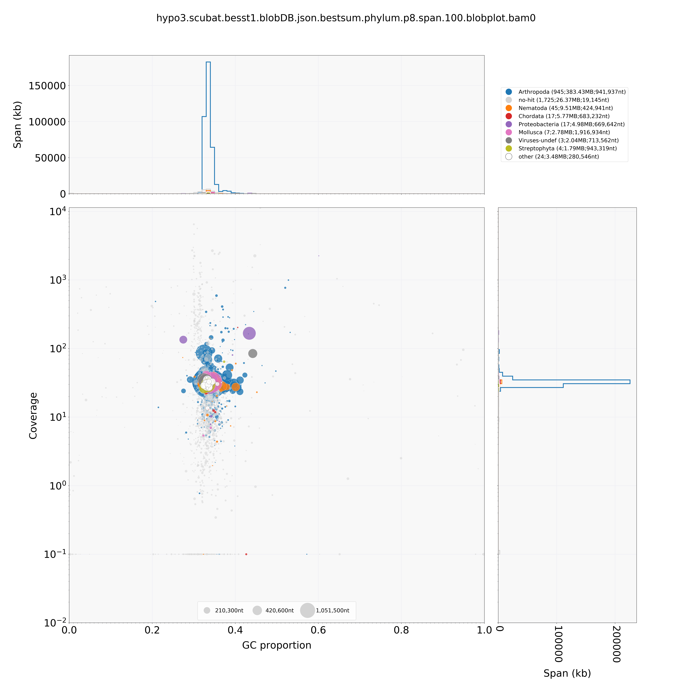

# Generating a *P. viburni* assembly

Start date: 08.10.2019, restarted 21.04.2020

	# Working directory	
	/data/ross/mealybugs/analyses/B_viburni_2020/1_pacbio_assembly
    qlogin -pe smp 24 -N busco

# Assembly

## 1. Raw reads

PacBio (/data/ross/mealybugs/analyses/B_viburni_2020/1_pacbio_assembly/0_reads/)

	ln -s /data/ross/mealybugs/raw/11718_Ross_Laura/raw_data/20190530/PV_18-13/m54041_190522_233005.subreads.bam
	ln -s /data/ross/mealybugs/raw/11718_Ross_Laura/raw_data/20190530/PV_18-13/m54041_190524_131016.subreads.bam
	ln -s /data/ross/mealybugs/raw/11718_Ross_Laura/raw_data/20190530/PV_18-13/m54041_190524_233023.subreads.bam

Illumina (/data/ross/mealybugs/analyses/B_viburni_2020/2_short_read_DNA_seq/0_reads)
	
	ln -s /data/ross/mealybugs/raw/transfer.genomics.ed.ac.uk/11372_Ross_Laura/raw_data/all_reads/18_13_1B_350/180608_A00291_0042_BH3CC3DRXX_2_11372RL0002L01_1.fastq.gz
	ln -s /data/ross/mealybugs/raw/transfer.genomics.ed.ac.uk/11372_Ross_Laura/raw_data/all_reads/18_13_1B_350/180608_A00291_0042_BH3CC3DRXX_2_11372RL0002L01_2.fastq.gz
	ln -s /data/ross/mealybugs/raw/transfer.genomics.ed.ac.uk/11372_Ross_Laura/raw_data/all_reads/18_13_1B_550/180608_A00291_0042_BH3CC3DRXX_2_11372RL0001L01_1.fastq.gz
	ln -s /data/ross/mealybugs/raw/transfer.genomics.ed.ac.uk/11372_Ross_Laura/raw_data/all_reads/18_13_1B_550/180608_A00291_0042_BH3CC3DRXX_2_11372RL0001L01_2.fastq.gz

## 2. Bam to fasta

Index bam (conda env pacbio)

	pbindex m54041_190522_233005.subreads.bam
	pbindex m54041_190524_131016.subreads.bam
	pbindex m54041_190524_233023.subreads.bam

Convert fasta to bam (conda env pacbio)
	
	bam2fasta -o /scratch/afilia/PV_18-13.1.subreads m54041_190522_233005.subreads.bam && rsync -av /scratch/afilia/PV_18-13.1.subreads /.
	bam2fasta -o /scratch/afilia/PV_18-13.2.subreads m54041_190524_131016.subreads.bam && rsync -av /scratch/afilia/PV_18-13.2.subreads /.
	bam2fasta -o /scratch/afilia/PV_18-13.3.subreads m54041_190524_233023.subreads.bam && rsync -av /scratch/afilia/PV_18-13.3.subreads /.

## 3. Read length distribution

	/ceph/users/dlaetsch/software/falen PV_18-13.1.subreads.fasta.gz | cut -f2 | sort -rn > PV_18-13.1.subreads.read_length.txt
	/ceph/users/dlaetsch/software/falen PV_18-13.2.subreads.fasta.gz | cut -f2 | sort -rn > PV_18-13.2.subreads.read_length.txt
	/ceph/users/dlaetsch/software/falen PV_18-13.3.subreads.fasta.gz | cut -f2 | sort -rn > PV_18-13.3.subreads.read_length.txt

## 4. Plot lengths

Use plrl.py (D. Laetsch, copied in /data/ross/mealybugs/analyses/B_viburni_2020/scripts)
	
	# conda install tqdm seaborn matplotlib numpy docopt
	python /data/ross/mealybugs/analyses/B_viburni_2020/scripts/plrl.py -d . -f 2 -m 40000

## 5. Raw assembly with wtdbg2 

Initial assembly with wtdbg2 (redbean) v2.5 (conda env afilia)
	
	wtdbg2 -x sq -g 327m -t 64 -i /data/ross/mealybugs/analyses/B_viburni_2020/1_pacbio_assembly/0_reads/PV_18-13.1.subreads.fasta.gz -i /data/ross/mealybugs/analyses/B_viburni_2020/1_pacbio_assembly/0_reads/PV_18-13.2.subreads.fasta.gz -i /data/ross/mealybugs/analyses/B_viburni_2020/1_pacbio_assembly/0_reads/PV_18-13.3.subreads.fasta.gz -o /scratch/afilia/pseudococcus_viburni.redbean && wtpoa-cns -t 64 -i /scratch/afilia/pseudococcus_viburni.redbean.ctg.lay.gz -fo /scratch/afilia/pseudococcus_viburni.redbean.raw.fa 

## 6. Assembly assessment

Run Busco

	conda create -n afilia_busco
	conda install -c bioconda -c conda-forge busco=4.0.6
	conda install -c bioconda blast
	conda install -c bioconda augustus (v 3.3.3)
	export AUGUSTUS_CONFIG_PATH="/ceph/software/busco_augustus_config_path/config/" && busco -m genome -c 16 -i pseudococcus_viburni.redbean.raw.fa -o pseudococcus_viburni.redbean.raw.busco -l insecta_odb10
	export AUGUSTUS_CONFIG_PATH="/ceph/software/busco_augustus_config_path/config/" && busco -m genome -c 16 -i pseudococcus_viburni.redbean.raw.fa -o pseudococcus_viburni.redbean.raw.busco.hemiptera -l hemiptera_odb10

Get assembly metrics

	/ceph/software/scripts/scaffold_stats.pl -t 200 1000 -d " " -f pseudococcus_viburni.redbean.raw.fa > pseudococcus_viburni.redbean.raw.stats

Stats for raw:
  * For scaffolds longer than 1000 bp:
  	- Num 2861
  	- Span 439642885
  	- Min 1394
  	- Mean 153667
  	- N50 816797
  	- NumN50 164
  	- GC 0.336
  * Busco (insecta) C:83.1%[S:82.0%,D:1.1%],F:6.7%,M:10.2%,n:1367
  * Busco (hemiptera) C:85.7%[S:83.4%,D:2.3%],F:2.2%,M:12.1%,n:2510  

## 7. Preliminary polishing of the genome

Polish with minimap2 v2.17-r941 (conda env afilia)
	
	minimap2 -t16 -ax map-pb -r2k ../raw/pseudococcus_viburni.redbean.raw.fa /data/ross/mealybugs/analyses/B_viburni_2020/1_pacbio_assembly/0_reads/PV_18-13.1.subreads.fasta.gz /data/ross/mealybugs/analyses/B_viburni_2020/1_pacbio_assembly/0_reads/PV_18-13.2.subreads.fasta.gz /data/ross/mealybugs/analyses/B_viburni_2020/1_pacbio_assembly/0_reads/PV_18-13.3.subreads.fasta.gz | samtools sort -@4 > pseudococcus_viburni.redbean.int.fa
	samtools view -F0x900 pseudococcus_viburni.redbean.int.fa | wtpoa-cns -t 15 -d ../raw/pseudococcus_viburni.redbean.raw.fa -i - -fo pseudococcus_viburni.redbean.cns.fa

	export AUGUSTUS_CONFIG_PATH="/ceph/software/busco_augustus_config_path/config/" && busco -m genome -c 16 -i pseudococcus_viburni.redbean.cns.fa -o pseudococcus_viburni.redbean.cns.busco.hemiptera -f -l hemiptera_odb10

Stats for cns:
  * For scaffolds longer than 1000 bp:
	-	Num 2852
	-	Span 436032832
	-	Min 1041
	-	Mean 152886
	-	N50 816708
	-	NumN50 163
	-	GC 0.336  
  * Busco (hemiptera) C:90.3%[S:87.8%,D:2.5%],F:1.4%,M:8.3%,n:2510

Additional polishment using short reads

	bwa index pseudococcus_viburni.redbean.cns.fa
	bwa mem -t 32 pseudococcus_viburni.redbean.cns.fa /data/ross/mealybugs/analyses/B_viburni_2020/2_short_read_DNA_seq/0_reads/PV_18-13.Illumina.350.trimmed_1.fq.gz /data/ross/mealybugs/analyses/B_viburni_2020/2_short_read_DNA_seq/0_reads/PV_18-13.Illumina.350.trimmed_2.fq.gz | samtools sort -O SAM -o /scratch/afilia/PV_18-13.Illumina.350.alignedtocns.sorted.sam
	bwa mem -t 32 pseudococcus_viburni.redbean.cns.fa /data/ross/mealybugs/analyses/B_viburni_2020/2_short_read_DNA_seq/0_reads/PV_18-13.Illumina.550.trimmed_1.fq.gz /data/ross/mealybugs/analyses/B_viburni_2020/2_short_read_DNA_seq/0_reads/PV_18-13.Illumina.550.trimmed_2.fq.gz | samtools sort -O SAM -o /scratch/afilia/PV_18-13.Illumina.550.alignedtocns.sorted.sam
	samtools merge /scratch/afilia/PV_18-13.Illumina.alignedtocns.sorted.sam /scratch/afilia/PV_18-13.Illumina.350.alignedtocns.sorted.sam /scratch/afilia/PV_18-13.Illumina.alignedtocns.550.sorted.sam
	
	wtpoa-cns -t 32 -x sam-sr -d pseudococcus_viburni.redbean.cns.fa -i /scratch/afilia/PV_18-13.Illumina.alignedtocns.sorted.sam -fo pseudococcus_viburni.redbean.cns.srp.fa
	/ceph/software/scripts/scaffold_stats.pl -t 200 1000 -d " " -f pseudococcus_viburni.redbean.cns.srp.fa > pseudococcus_viburni.redbean.cns.srp.stats  

	export AUGUSTUS_CONFIG_PATH="/ceph/software/busco_augustus_config_path/config/" && busco -m genome -c 16 -i pseudococcus_viburni.redbean.cns.srp.fa -o pseudococcus_viburni.redbean.cns.srp.busco.hemiptera -f -l hemiptera_odb10
	export AUGUSTUS_CONFIG_PATH="/ceph/software/busco_augustus_config_path/config/" && busco -m genome -c 16 -i pseudococcus_viburni.redbean.cns.srp.fa -o pseudococcus_viburni.redbean.cns.srp.busco.insecta -f -l insecta_odb10
	export AUGUSTUS_CONFIG_PATH="/ceph/software/busco_augustus_config_path/config/" && busco -m genome -c 16 -i pseudococcus_viburni.redbean.cns.srp.fa -o pseudococcus_viburni.redbean.cns.srp.busco.arthropoda -f -l arthropoda_odb10

Stats for cns-srp:
  * For scaffolds longer than 1000 bp:
	-	Num 2848
	-	Span 422785487
	-	Min 1010
	-	Mean 148449
	-	N50 797178
	-	NumN50 163
	-	GC 0.336
* Busco (hemiptera) C:91.7%[S:88.6%,D:3.1%],F:1.0%,M:7.3%,n:2510
* Busco (insecta) C:93.0%[S:90.1%,D:2.9%],F:1.3%,M:5.7%,n:1367
* Busco (arthropoda) C:94.5%[S:92.2%,D:2.3%],F:1.5%,M:4.0%,n:1013 

## 8. Further polishing: 3x rounds with long reads, 1x rounds with Illumina reads

Polish cns assembly 2 more times with minimap2

	minimap2 -t32 -ax map-pb -r2k pseudococcus_viburni.redbean.cns.fa /data/ross/mealybugs/analyses/B_viburni_2020/1_pacbio_assembly/0_reads/PV_18-13.1.subreads.fasta.gz /data/ross/mealybugs/analyses/B_viburni_2020/1_pacbio_assembly/0_reads/PV_18-13.2.subreads.fasta.gz /data/ross/mealybugs/analyses/B_viburni_2020/1_pacbio_assembly/0_reads/PV_18-13.3.subreads.fasta.gz | samtools sort -@4 > pseudococcus_viburni.redbean.cns2.int.fa
	samtools view -F0x900 pseudococcus_viburni.redbean.cns2.int.fa | wtpoa-cns -t 32 -d pseudococcus_viburni.redbean.cns.fa -i - -fo pseudococcus_viburni.redbean.cns2.fa
	minimap2 -t32 -ax map-pb -r2k pseudococcus_viburni.redbean.cns2.fa /data/ross/mealybugs/analyses/B_viburni_2020/1_pacbio_assembly/0_reads/PV_18-13.1.subreads.fasta.gz /data/ross/mealybugs/analyses/B_viburni_2020/1_pacbio_assembly/0_reads/PV_18-13.2.subreads.fasta.gz /data/ross/mealybugs/analyses/B_viburni_2020/1_pacbio_assembly/0_reads/PV_18-13.3.subreads.fasta.gz | samtools sort -@32 > /scratch/afilia/pseudococcus_viburni.redbean.cns3.int.fa
	samtools view -F0x900 /scratch/afilia/pseudococcus_viburni.redbean.cns3.int.fa | wtpoa-cns -t 32 -d pseudococcus_viburni.redbean.cns2.fa -i - -fo pseudococcus_viburni.redbean.cns3.fa

BUSCO for cns2 and 3:

	export AUGUSTUS_CONFIG_PATH="/ceph/software/busco_augustus_config_path/config/" && busco -m genome -c 24 -i ../pseudococcus_viburni.redbean.cns2.fa -o pseudococcus_viburni.redbean.cns2.busco.hemiptera -f -l hemiptera_odb10
	export AUGUSTUS_CONFIG_PATH="/ceph/software/busco_augustus_config_path/config/" && busco -m genome -c 24 -i ../pseudococcus_viburni.redbean.cns3.fa -o pseudococcus_viburni.redbean.cns3.busco.hemiptera -f -l hemiptera_odb10

* C:90.2%[S:87.6%,D:2.6%],F:1.4%,M:8.4%,n:2510 (cns2)
* C:90.6%[S:88.2%,D:2.4%],F:1.4%,M:8.0%,n:2510 (cns3)

Polishing with short reads

	bwa index pseudococcus_viburni.redbean.cns3.fa
	bwa mem -t 32 pseudococcus_viburni.redbean.cns3.fa /data/ross/mealybugs/analyses/B_viburni_2020/2_short_read_DNA_seq/0_reads/PV_18-13.Illumina.350.trimmed_1.fq.gz /data/ross/mealybugs/analyses/B_viburni_2020/2_short_read_DNA_seq/0_reads/PV_18-13.Illumina.350.trimmed_2.fq.gz | samtools sort -O SAM -o /scratch/afilia/PV_18-13.Illumina.350.alignedtocns3.sorted.sam
	bwa mem -t 32 pseudococcus_viburni.redbean.cns3.fa /data/ross/mealybugs/analyses/B_viburni_2020/2_short_read_DNA_seq/0_reads/PV_18-13.Illumina.550.trimmed_1.fq.gz /data/ross/mealybugs/analyses/B_viburni_2020/2_short_read_DNA_seq/0_reads/PV_18-13.Illumina.550.trimmed_2.fq.gz | samtools sort -O SAM -o /scratch/afilia/PV_18-13.Illumina.550.alignedtocns3.sorted.sam
	samtools merge /scratch/afilia/PV_18-13.Illumina.alignedtocns3.sorted.sam /scratch/afilia/PV_18-13.Illumina.350.alignedtocns3.sorted.sam /scratch/afilia/PV_18-13.Illumina.550.alignedtocns3.sorted.sam
	wtpoa-cns -t 32 -x sam-sr -d pseudococcus_viburni.redbean.cns3.fa -i /scratch/afilia/PV_18-13.Illumina.alignedtocns3.sorted.sam -fo pseudococcus_viburni.redbean.cns3.srp1.fa
	
	/ceph/software/scripts/scaffold_stats.pl -t 200 1000 -d " " -f pseudococcus_viburni.redbean.cns3.srp1.fa -o pseudococcus_viburni.redbean.cns3.srp1.stats
	export AUGUSTUS_CONFIG_PATH="/ceph/software/busco_augustus_config_path/config/" && busco -m genome -c 24 -i ../pseudococcus_viburni.redbean.cns3.srp1.fa -o pseudococcus_viburni.redbean.cns3.srp1.busco.hemiptera -f -l hemiptera_odb10
	export AUGUSTUS_CONFIG_PATH="/ceph/software/busco_augustus_config_path/config/" && busco -m genome -c 24 -i ../pseudococcus_viburni.redbean.cns3.srp1.fa -o pseudococcus_viburni.redbean.cns3.srp1.busco.insecta -f -l insecta_odb10

Stats for cns-srp:
  * For scaffolds longer than 1000 bp:
	-	Num 2859
	-	Span 420719638
	-	Min 222
	-	Mean 147156
	-	N50 801500
	-	NumN50 162
	-	GC 0.336
* Busco (hemiptera) C:92.0%[S:89.0%,D:3.0%],F:1.0%,M:7.0%,n:2510 
* Busco (insecta) C:92.7%[S:89.8%,D:2.9%],F:2.1%,M:5.2%,n:1367 

### 8.2. Alternative polishing: use HyPo

conda activate afilia_hypo  
conda install -c bioconda hypo

Mapping short and long reads to contigs

	cat /data/ross/mealybugs/analyses/B_viburni_2020/2_short_read_DNA_seq/0_reads/PV_18-13.Illumina.350.trimmed_1.fq.gz /data/ross/mealybugs/analyses/B_viburni_2020/2_short_read_DNA_seq/0_reads/PV_18-13.Illumina.550.trimmed_1.fq.gz > PV_18-13.Illumina.merged.trimmed_1.fq.gz
	cat /data/ross/mealybugs/analyses/B_viburni_2020/2_short_read_DNA_seq/0_reads/PV_18-13.Illumina.350.trimmed_2.fq.gz /data/ross/mealybugs/analyses/B_viburni_2020/2_short_read_DNA_seq/0_reads/PV_18-13.Illumina.550.trimmed_2.fq.gz > PV_18-13.Illumina.merged.trimmed_2.fq.gz

	minimap2 --secondary=no --MD -ax sr -t 32 ../raw/pseudococcus_viburni.redbean.raw.fa PV_18-13.Illumina.merged.trimmed_1.fq.gz PV_18-13.Illumina.merged.trimmed_2.fq.gz | samtools view -Sb - > /scratch/afilia/hypo1-mapped-sr.bam
	samtools sort -@32 -o /scratch/afilia/hypo1-mapped-sr.sorted.bam /scratch/afilia/hypo1-mapped-sr.bam && rsync -av /scratch/afilia/hypo1-mapped-sr.sorted.bam .
	samtools index hypo1-mapped-sr.sorted.bam
	minimap2 --secondary=no --MD -ax map-pb -t 32 ../raw/pseudococcus_viburni.redbean.raw.fa ../../0_reads/PV_18-13.1.subreads.fasta.gz ../../0_reads/PV_18-13.2.subreads.fasta.gz ../../0_reads/PV_18-13.3.subreads.fasta.gz | samtools view -Sb - > /scratch/afilia/hypo1-mapped-lg.bam
	samtools sort -@32 -o /scratch/afilia/hypo1-mapped-lg.sorted.bam /scratch/afilia/hypo1-mapped-lg.bam && rsync -av /scratch/afilia/hypo1-mapped-lg.sorted.bam .
	samtools index hypo1-mapped-lg.sorted.bam

Run hypo (three rounds)

	hypo -d ../raw/pseudococcus_viburni.redbean.raw.fa -i -r @il_names.txt -s 440m -c 100 -b hypo1-mapped-sr.sorted.bam -B hypo1-mapped-lg.sorted.bam -p 96 -t 48 -o pseudococcus_viburni.hypo1.fa

* For scaffolds longer than 1000 bp:
	-	Num 2861
	-	Span 440705122
	-	Min 1356
	-	Mean 154038
	-	N50 818128
	-	NumN50 164
	-	GC 0.336

* Busco scores (round 1 to 3)
 - C:92.2%[S:89.1%,D:3.1%],F:0.9%,M:6.9%,n:2510  
 - C:92.5%[S:89.2%,D:3.3%],F:0.8%,M:6.7%,n:2510 
 - C:92.5%[S:89.2%,D:3.3%],F:0.9%,M:6.6%,n:2510	

## 9. Blobtools

Homology searches

	blastn -task megablast -query pseudococcus_viburni.hypo3.fa -db /ceph/software/databases/ncbi_2020_02/nt -outfmt '6 qseqid staxids bitscore std' -max_target_seqs 10 -max_hsps 1 -num_threads 32 -evalue 1e-25 -out /scratch/afilia/pseudococcus_viburni.hypo3.blast.out && rsync /scratch/afilia/pseudococcus_viburni.hypo3.blast.out .
	diamond blastx --query pseudococcus_viburni.hypo3.fa --max-target-seqs 1 --sensitive --threads 32 --db /ceph/software/databases/uniprot_2019_08/full/reference_proteomes.dmnd --evalue 1e-25 --tmpdir /scratch/afilia/ --outfmt 6 --out /scratch/afilia/pseudococcus_viburni.hypo3.diamond.out && rsync /scratch/afilia/pseudococcus_viburni.hypo3.diamond.out .
	cp /ceph/software/databases/uniprot_2019_08/full/reference_proteomes.taxid_map.gz .
	/ceph/software/blobtools/blobtools taxify -f pseudococcus_viburni.hypo3.diamond.out -m reference_proteomes.taxid_map -s 0 -t 1

Mapping reads to reference (without secondary and supplemetary alignments)

	minimap2 --secondary=no -ax map-pb -t 32 pseudococcus_viburni.hypo3.fa ../../0_reads/PV_18-13.1.subreads.fasta.gz ../../0_reads/PV_18-13.2.subreads.fasta.gz ../../0_reads/PV_18-13.3.subreads.fasta.gz | samtools view -hF 0x900 - | samtools sort -@32 -O BAM -o /scratch/afilia/pseudococcus_viburni.hypo3.sorted.bam - && rsync -av /scratch/afilia/pseudococcus_viburni.hypo3.sorted.bam .
	
Running blobtools (v1.1.1)

	/ceph/software/blobtools/blobtools create -i ../pseudococcus_viburni.hypo3.fa -b ../pseudococcus_viburni.hypo3.sorted.bam -t ../pseudococcus_viburni.hypo3.blast.out -t ../pseudococcus_viburni.hypo3.diamond.taxified.out -o pseudococcus_viburni.hypo3
	/ceph/software/blobtools/blobtools view -i pseudococcus_viburni.hypo3.blobDB.json -b -r all
	/ceph/software/blobtools/blobtools plot -i pseudococcus_viburni.hypo3.blobDB.json
	
The blobplots look good.

### 9.1. Decontamination  

I can now filter out contaminant contigs. Let's see what we have:

 - Annelida    1
 - Arthropoda  994
 - Brachiopoda    2
 - Chlamydiae    5
 - Chordata   19
 - Cnidaria    2
 - Echinodermata    2
 - Euryarchaeota    1
 - Mollusca    8
 - Mucoromycota    1
 - Nematoda   45
 - no-hit 1748
 - Porifera    5
 - Proteobacteria   16
 - Rotifera    3
 - Spirochaetes    2
 - Streptophyta    4
 - Thermotogae    1
 - Viruses-undef    3

Let's keep all metazoan contigs, except those with extremely low coverage (>2)

	contigs.animals <- contigs.bestsum[(contigs.bestsum$phylum == "Annelida" | contigs.bestsum$phylum == "Arthropoda" | contigs.bestsum$phylum == "Brachiopoda" | contigs.bestsum$phylum == "Chordata" | contigs.bestsum$phylum == "Cnidaria" | contigs.bestsum$phylum == "Echinodermata" | contigs.bestsum$phylum == "Mollusca" | contigs.bestsum$phylum == "Nematoda" | contigs.bestsum$phylum == "Porifera" | contigs.bestsum$phylum == "Rotifera"),]
	contigs.animals.remove <- contigs.animals[contigs.animals$cov < 2,]

There are three contigs with best hit to viruses, but genome-like coverage and secondary hits to arthropods. Keeping those too.

	contigs.virus <- contigs.bestsum[(contigs.bestsum$phylum == "Viruses-undef"),]

There are a lot of contigs with best hits to prokaryotes. Let's be careful with these -- some will belong to the endosymbionts, and we want to remove these, but others might be HGT events.

	contigs.other <- contigs.bestsum[(contigs.bestsum$phylum == "Chlamydiae" | contigs.bestsum$phylum == "Euryarchaeota" | contigs.bestsum$phylum == "Spirochaetes" | contigs.bestsum$phylum == "Thermotogae" | contigs.bestsum$phylum == "Proteobacteria" | contigs.bestsum$phylum == "Streptophyta" | contigs.bestsum$phylum == "Mucoromycota"),]

There are four contigs with high coverage, all Proteobacteria.

 - ctg2741	4807	0.6012	0	2255.7811	Proteobacteria	34803.5	0	tax0=Proteobacteria:34562.0;tax1=Proteobacteria:241.5;
 - ctg182	754563	0.4338	0	167.0993	Proteobacteria	70356.9	0	tax0=Proteobacteria:67808.0;tax1=Proteobacteria:2548.9;
 - ctg376	281389	0.2748	0	134.9322	Proteobacteria	48935.1	0	tax0=Proteobacteria:46533.0;tax1=Proteobacteria:2402.1;
 - ctg1645	13152	0.3933	0	78.1342		Proteobacteria	39194.9	0	tax0=Proteobacteria:38317.0;tax1=Proteobacteria:877.9;

 * Primary endosymbiont:
	- ctg2741: Candidatus *Tremblaya princeps* (however too short); another hit to *Tremblaya* in ctg64 might be HGT (tax0=Proteobacteria:1198.0|Arthropoda:557.0|Streptophyta:185.0;tax1=Brachiopoda:1218.33)
 * Secondary endosymbionts:
	- ctg182, ctg1645: Candidatus *Sodalis*, gamma proteobacterium endosymbiont of *P. viburni* isolate (PLON gamma 1)
	- ctg376, *Morganella/Buchnera/Gullanella/Sodalis* (PLON gamma 1)

These four contigs will be removed from the assembly. No contigs with cov < 2 here, so keeping all the rest.

	contigs.other.remove <- contigs.other[contigs.other$contig == 'ctg2741' | contigs.other$contig == 'ctg182' | contigs.other$contig == 'ctg376' | contigs.other$contig == 'ctg1645',]

It would be interesting to take a look at proteobacteria contigs with genome-like coverage and see if we can find HGT genes from Husnik et al. 2013.

 - ctg436: *cysK* (*Sodalis*/*Dickeya*, related to PLON gamma 2?)
 - ctg571: N-acetylmuramoyl-L-alanine amidase
 - ctg662: AAA-type ATPase
 - ctg716: AAA-ATPase_like domain-containing protein
 - ctg936: Putative AAA-ATPase
 - ctg1140: AAA family ATPase
 - ctg1568: *murF* (UDP-N-acetylmuramoyl-tripeptide--D-alanyl-D-alanine ligase)
 - ctg2111: AAA-ATPase_like domain-containing protein
 - ctg2265: ATPase AAA

Finally, let's look at the contigs without hits. We have quite a lot (1,748), with very variable coverages. There are ca. 230 contigs with very high coverage (>100, up to >10,000). These are probably highly repetitive sequences that should be kept (they might be B-linked). For now, let's just filter low coverage (<2) no-hit contigs 

	contigs.nohit <- contigs.bestsum[(contigs.bestsum$phylum == "no-hit"),]
	contigs.nohit.remove <- contigs.nohit[contigs.nohit$cov < 2,]

In total, 401 contigs will be removed.

### 9.2. Blobtools with the Illumina data

We can also use the Illumina data to create a blobplot. Nothing really changes, which is reassuring.

	/ceph/software/blobtools/blobtools create -i ../pseudococcus_viburni.hypo3.fa -b ../pseudococcus_viburni.hypo3.sr.sorted.bam -t ../pseudococcus_viburni.hypo3.blast.out -t ../pseudococcus_viburni.hypo3.diamond.taxified.out -o pseudococcus_viburni.hypo3.sr
	/ceph/software/blobtools/blobtools view -i pseudococcus_viburni.hypo3.sr.blobDB.json -b
	/ceph/software/blobtools/blobtools plot -i pseudococcus_viburni.hypo3.sr.blobDB.json

## 10. Filtered assembly

Extract contigs and reads

	/ceph/software/assemblage/fastaqual_select.pl -f pseudococcus_viburni.hypo3.fa -i blobtools/contigs.to.keep.txt > pseudococcus_viburni.hypo3.filtered.fa
	bamtools convert -format fasta -in pseudococcus_viburni.hypo3.sorted.bam -out pseudococcus_viburni.lr.hypo3.decon.fasta

We could try to extract the reads and reassemble the genome, as below, but this results in a more fragmented and less complete assembly. Since there was no contamination and we haven't removed much, let's just work with the filtered assembly.

	minimap2 -ax map-pb -t 32 ../polished/pseudococcus_viburni.redbean.cns3.srp1.blobtools.fa /data/ross/mealybugs/analyses/B_viburni_2020/1_pacbio_assembly/0_reads/PV_18-13.1.subreads.fasta.gz /data/ross/mealybugs/analyses/B_viburni_2020/1_pacbio_assembly/0_reads/PV_18-13.2.subreads.fasta.gz /data/ross/mealybugs/analyses/B_viburni_2020/1_pacbio_assembly/0_reads/PV_18-13.3.subreads.fasta.gz | samtools view -hF 256 - | samtools sort -@32 -O BAM -o /scratch/afilia/p.viburni.decon.to.cns3.srp1.blobtools.sorted.bam - && rsync -av /scratch/afilia/p.viburni.decon.to.cns3.srp1.blobtools.sorted.bam .
	# Keep mapped reads only, excluding unmapped and supplementary alignments
	samtools view -bhF 0x904 p.viburni.decon.to.cns3.srp1.blobtools.sorted.bam > /scratch/afilia/p.viburni.decon.to.cns3.srp1.blobtools.sorted.mapped.primary.bam && rsync -av /scratch/afilia/p.viburni.decon.to.cns3.srp1.blobtools.sorted.mapped.primary.bam .
	# Extract reads
	bamtools convert -format fasta -in p.viburni.decon.to.cns3.srp1.blobtools.sorted.mapped.primary.bam -out p.viburni.decon.subreads.fasta
	# Reassemble with redbean reads
	wtdbg2 -x sq -g 400m -t 64 -i p.viburni.decon.subreads.fasta -o /scratch/afilia/pseudococcus_viburni.2nd.pass && wtpoa-cns -t 64 -i /scratch/afilia/pseudococcus_viburni.2nd.pass.ctg.lay.gz -fo /scratch/afilia/pseudococcus_viburni.2nd.pass.raw.fa
	export AUGUSTUS_CONFIG_PATH="/ceph/software/busco_augustus_config_path/config/" && busco -m genome -c 24 -i pseudococcus_viburni.2nd.pass.raw.fa -o pseudococcus_viburni.2nd.pass.raw.busco.hemiptera -f -l hemiptera_odb10

Stats for the filtered assembly

* For scaffolds longer than 1000 bp:
	- Num 2461
	- Span 435312763
	- Min 1350
	- Mean 176884
	- N50 826556
	- NumN50 161
	- GC 0.337
* C:92.6%[S:89.4%,D:3.2%],F:0.8%,M:6.6%,n:2510 (hemiptera)
* C:95.7%[S:92.6%,D:3.1%],F:1.1%,M:3.2%,n:1013 (arthropoda)
* C:95.2%[S:91.8%,D:3.4%],F:0.9%,M:3.9%,n:1367 (insecta)

## 11. Scaffolding

### 11.1 With redundans

Try redundans to scaffold the genome and remove duplication: https://github.com/Gabaldonlab/redundans. It makes more sense to start with the non-decontaminated assembly for now.

conda create -n afilia_scaffold python=2.7 anaconda
conda install -c numpy matplotlib
conda install -c forge docopt numpy seaborn tqdm parallel 

Try the whole thing (scaffolding, reducing and gap closing with paired-end and long reads)

	/ceph/software/redundans/redundans_v0.13c/redundans/redundans.py -v -f ../1_first_pass/hypo_polished/pseudococcus_viburni.hypo3.fa -i /data/ross/mealybugs/analyses/B_viburni_2020/2_short_read_DNA_seq/0_reads/PV_18-13.Illumina.350.trimmed_1.fq.gz /data/ross/mealybugs/analyses/B_viburni_2020/2_short_read_DNA_seq/0_reads/PV_18-13.Illumina.350.trimmed_2.fq.gz /data/ross/mealybugs/analyses/B_viburni_2020/2_short_read_DNA_seq/0_reads/PV_18-13.Illumina.550.trimmed_1.fq.gz /data/ross/mealybugs/analyses/B_viburni_2020/2_short_read_DNA_seq/0_reads/PV_18-13.Illumina.550.trimmed_2.fq.gz -l /data/ross/mealybugs/analyses/B_viburni_2020/1_pacbio_assembly/0_reads/PV_18-13.1.subreads.fasta.gz /data/ross/mealybugs/analyses/B_viburni_2020/1_pacbio_assembly/0_reads/PV_18-13.2.subreads.fasta.gz /data/ross/mealybugs/analyses/B_viburni_2020/1_pacbio_assembly/0_reads/PV_18-13.3.subreads.fasta.gz  -t 64 -o redundans_1/pseudococcus_viburni.hypo3.redundans --log redundans.hypo.log --tmp /scratch/afilia/

It has taken an awful amount of time (>5 days) and the results are not really encouraging. The scaffolding with short reads failed ("No pairs were aligned!"; why?) and the scaffolding with long reads destroyed the BUSCO score.

fname  	contigs bases   GC [%]  contigs >1kb    bases in contigs >1kb   N50     N90     Ns      longest
contigs.fa     2862    440158428       33.616  2861    440158066       818128  134743  0       4205925
contigs.reduced.fa     2012    430067313       33.661  2011    430066951       839433  171845  0       4205925
scaffolds.fa   2012    430067313       33.661  2011    430066951       839433  171845  0       4205925 # C:92.4%[S:89.1%,D:3.3%],F:0.8%,M:6.8%,n:2510 
scaffolds.longreads.fa 1424    358798159       33.652  1423    358797797       1419267 213831  1733564 13627736 # C:77.2%[S:74.8%,D:2.4%],F:0.8%,M:22.0%,n:2510 
scaffolds.filled.fa    1424    358800001       33.652  1423    358799639       1419269 213831  1599319 13627760
scaffolds.reduced.fa   1230    355697034       33.651  1229    355696672       1435353 237609  1599316 13627760

### 11.2 Alternative scaffolding using SCUBAT2 (transcript based)

This will use the assembled transcriptome (see assembly and transcript quantification in 2_Transcriptome.md). Let's try scaffolding with two set of transcripts: all those with average tpm > 2 in either males or females (scaffold.keep.r, 54,377 transcripts) and all those with average tpm > 5 in either males or females (scaffold.keep.s, 32,821 transcripts).

To filter out transcripts that don't meet this criteria, I need to modify the header of the assembled transcriptome first.

	awk '/^>/ {$0=$1} 1' viburni.trinity.fasta > viburni.trinity.header.mod.fasta
	/ceph/software/assemblage/fastaqual_select.pl -f viburni.trinity.header.mod.fasta -i scaffold.keep.r.txt > viburni.trinity.header.r.fasta
	/ceph/software/assemblage/fastaqual_select.pl -f viburni.trinity.header.mod.fasta -i scaffold.keep.s.txt > viburni.trinity.header.s.fasta
	makeblastdb -in pseudococcus_viburni.hypo3.fa -dbtype nucl
	blastn -query viburni.trinity.header.s.fasta -db pseudococcus_viburni.hypo3.fa -evalue 1e-25 -outfmt 5 -out strict.transcripts.blast.xml -num_threads 32
	blastn -query viburni.trinity.header.r.fasta -db pseudococcus_viburni.hypo3.fa -evalue 1e-25 -outfmt 5 -out relaxed.transcripts.blast.xml -num_threads 32

Run in afilia_scaffold after installing biopython and numpy

	python2 /data/ross/mealybugs/analyses/B_viburni_2020/scripts/SCUBAT_v2.py -b strict.transcripts.blast.xml -f pseudococcus_viburni.hypo3.fa --intron_size_run --maximum_intron_size 50000
	python2 /data/ross/mealybugs/analyses/B_viburni_2020/scripts/SCUBAT_v2.py -b relaxed.transcripts.blast.xml -f pseudococcus_viburni.hypo3.fa --intron_size_run --maximum_intron_size 50000
	
Inspecting the intron size file, we have a minority of extremely large introns (>100,000-1,500,000bp). However, only 1-1.6% introns are bigger than 50,000bp and 2.5-3% are bigger than 20,000. Let's use 50,000 and 20,000 as the maximum permitted intron size.

	python2 /data/ross/mealybugs/analyses/B_viburni_2020/scripts/SCUBAT_v2.py -b ../strict.transcripts.blast.xml -f ../pseudococcus_viburni.hypo3.fa --maximum_intron_size 50000
	python2 /data/ross/mealybugs/analyses/B_viburni_2020/scripts/SCUBAT_v2.py -b ../relaxed.transcripts.blast.xml -f pseudococcus_viburni.hypo3.fa --maximum_intron_size 50000
	python2 /data/ross/mealybugs/analyses/B_viburni_2020/scripts/SCUBAT_v2.py -b ../strict.transcripts.blast.xml -f ../pseudococcus_viburni.hypo3.fa --maximum_intron_size 20000
	python2 /data/ross/mealybugs/analyses/B_viburni_2020/scripts/SCUBAT_v2.py -b ../relaxed.transcripts.blast.xml -f ../pseudococcus_viburni.hypo3.fa --maximum_intron_size 20000

Remove backslashes from the fasta headers to run BUSCO

	sed -i 's/\//_/g' strict/SCUBAT_scaffolds.fasta
	sed -i 's/\//_/g' relaxed/SCUBAT_scaffolds.fasta
	export AUGUSTUS_CONFIG_PATH="/ceph/software/busco_augustus_config_path/config/" && busco -m genome -c 32 -i strict/SCUBAT_scaffolds.fasta -o SCUBAT_scaffolds.strict.busco.hemiptera -l hemiptera_odb10 #C:92.5%[S:89.2%,D:3.3%],F:0.8%,M:6.7%,n:2510
	export AUGUSTUS_CONFIG_PATH="/ceph/software/busco_augustus_config_path/config/" && busco -m genome -c 32 -i relaxed/SCUBAT_scaffolds.fasta -o SCUBAT_scaffolds.relaxed.busco.hemiptera -l hemiptera_odb10 -f C:92.6%[S:89.3%,D:3.3%],F:0.8%,M:6.6%,n:2510  
	export AUGUSTUS_CONFIG_PATH="/ceph/software/busco_augustus_config_path/config/" && busco -m genome -c 32 -i strict_20000/SCUBAT_scaffolds.fasta -o SCUBAT_scaffolds.strict_20000.busco.hemiptera -l hemiptera_odb10 -f C:92.6%[S:89.3%,D:3.3%],F:0.8%,M:6.6%,n:2510
	export AUGUSTUS_CONFIG_PATH="/ceph/software/busco_augustus_config_path/config/" && busco -m genome -c 32 -i relaxed_20000/SCUBAT_scaffolds.fasta -o SCUBAT_scaffolds.relaxed_20000.busco.hemiptera -l hemiptera_odb10 -f :92.6%[S:89.3%,D:3.3%],F:0.8%,M:6.6%,n:2510   

The "relaxed" scaffolded assembly with 50,000 insert size is the best of the bunch.

* For contigs longer than 100 bp (scaffolds split at >= 10 Ns):
	- LongestContig 4205925
	- Num 2862
	- Span 440158428
	- Min 362f
	- Mean 153794
	- N50 818128
	- NumN50 164
	- GC 0.336

* For scaffolds longer than 200 bp:
	- Num 2789
	- Span 440165728
	- Min 362
	- Mean 157822
	- N50 863585
	- NumN50 155
	- GC 0.336

### 11.3 BESST

We can also try sr scaffolding with https://github.com/ksahlin/BESST

	bwa index pseudococcus_viburni.hypo3.fa
	bwa mem -t 16 -w 0 -O 99 pseudococcus_viburni.hypo3.fa /data/ross/mealybugs/analyses/B_viburni_2020/2_short_read_DNA_seq/0_reads/PV_18-13.Illumina.350.trimmed_1.fq.gz /data/ross/mealybugs/analyses/B_viburni_2020/2_short_read_DNA_seq/0_reads/PV_18-13.Illumina.350.trimmed_2.fq.gz | samtools view -bS - | samtools sort - > /scratch/afilia/mapping.350.bam
	bwa mem -t 16 -w 0 -O 99 pseudococcus_viburni.hypo3.fa /data/ross/mealybugs/analyses/B_viburni_2020/2_short_read_DNA_seq/0_reads/PV_18-13.Illumina.550.trimmed_1.fq.gz /data/ross/mealybugs/analyses/B_viburni_2020/2_short_read_DNA_seq/0_reads/PV_18-13.Illumina.550.trimmed_2.fq.gz | samtools view -bS - | samtools sort - > /scratch/afilia/mapping.550.bam
	samtools index mapping.350.bam
	samtools index mapping.550.bam
	/data/ross/mealybugs/analyses/B_viburni_2020/scripts/BESST/runBESST -c pseudococcus_viburni.hypo3.fa -f mapping.350.bam mapping.550.bam -orientation fr fr

* First pass:
	- For scaffolds longer than 200 bp: Num 2805, Span 440148723, Min 362, Mean 156915, N50 848934
	- C:92.6%[S:89.3%,D:3.3%],F:0.8%,M:6.6%,n:2510
* Second pass:
	- For scaffolds longer than 200 bp: Num 2748, Span 440151317, Min 362, Mean 160171, N50 874986
	- C:92.5%[S:89.2%,D:3.3%],F:0.8%,M:6.7%,n:2510 

BUSCO is slightly worse for the second pass, although it's a more contiguous assembly.

### 11.4 SCUBAT + BESST

Can we get better scaffolded assemblies if we do both?

Run BESST with the relaxed/SCUBAT_scaffolds.fasta assembly

	bwa index hypo3.scubat.fa
	bwa mem -t 16 -w 0 -O 99 hypo3.scubat.fa /data/ross/mealybugs/analyses/B_viburni_2020/2_short_read_DNA_seq/0_reads/PV_18-13.Illumina.350.trimmed_	1.fq.gz /data/ross/mealybugs/analyses/B_viburni_2020/2_short_read_DNA_seq/0_reads/PV_18-13.Illumina.350.trimmed_2.fq.gz | samtools view -bS - | 	samtools sort - > /scratch/afilia/mapping.350.bam && rsync -av /scratch/afilia/mapping.350.bam .
	bwa mem -t 16 -w 0 -O 99 hypo3.scubat.fa /data/ross/mealybugs/analyses/B_viburni_2020/2_short_read_DNA_seq/0_reads/PV_18-13.Illumina.550.trimmed_	1.fq.gz /data/ross/mealybugs/analyses/B_viburni_2020/2_short_read_DNA_seq/0_reads/PV_18-13.Illumina.550.trimmed_2.fq.gz | samtools view -bS - | 	samtools sort - > /scratch/afilia/mapping.550.bam && rsync -av /scratch/afilia/mapping.550.bam .
	samtools index mapping.350.bam
	samtools index mapping.550.bam
	/data/ross/mealybugs/analyses/B_viburni_2020/scripts/BESST/runBESST -c hypo3.scubat.fa -f mapping.350.bam mapping.550.bam -orientation fr fr

Run SCUBAT with the pass1 and pass2 BESST assemblies

	bwa index hypo3.scubat.fa
	bwa mem -t 16 -w 0 -O 99 hypo3.scubat.fa /data/ross/mealybugs/analyses/B_viburni_2020/2_short_read_DNA_seq/0_reads/PV_18-13.Illumina.350.trimmed_1.fq.gz /data/ross/mealybugs/analyses/B_viburni_2020/2_short_read_DNA_seq/0_reads/PV_18-13.Illumina.350.trimmed_2.fq.gz | samtools view -bS - | 	samtools sort - > /scratch/afilia/mapping.350.bam && rsync -av /scratch/afilia/mapping.350.bam .
	bwa mem -t 16 -w 0 -O 99 hypo3.scubat.fa /data/ross/mealybugs/analyses/B_viburni_2020/2_short_read_DNA_seq/0_reads/PV_18-13.Illumina.550.trimmed_1.fq.gz /data/ross/mealybugs/analyses/B_viburni_2020/2_short_read_DNA_seq/0_reads/PV_18-13.Illumina.550.trimmed_2.fq.gz | samtools view -bS - | 	samtools sort - > /scratch/afilia/mapping.550.bam && rsync -av /scratch/afilia/mapping.550.bam .
	samtools index mapping.350.bam
	samtools index mapping.550.bam
	/data/ross/mealybugs/analyses/B_viburni_2020/scripts/BESST/runBESST -c hypo3.scubat.fa -f mapping.350.bam mapping.550.bam -orientation fr fr

We have 4 assemblies to compare. Let's rename the besst outputs -- otherwise BUSCO fails to include scaffolds and the scores drop.

 - hypo3.besst1.scubat.fa: 2787 scaffolds, N50 863585
 - hypo3.besst2.scubat.fa: 2787 scaffolds, N50 863585
 - hypo3.scubat.besst1.fa: 2746 scaffolds, N50 894209
 - hypo3.scubat.besst2.fa: 2696 scaffolds, N50 916731

Let's rename the besst outputs -- otherwise BUSCO fails to include scaffolds and the scores drop.

	bioawk -c fastx '{ print ">scaffold_" ++i"-"length($seq)"\n"$seq }' < hypo3.scubat.besst1.fa > hypo3.scubat.besst1.renamed.fa
	paste <(grep ">" hypo3.scubat.besst1.fa) <(grep ">" hypo3.scubat.besst1.renamed.fa) | sed 's/>//g' > hypo3.scubat.besst1.renamed.assoc
	bioawk -c fastx '{ print ">scaffold_" ++i"-"length($seq)"\n"$seq }' < hypo3.scubat.besst2.fa > hypo3.scubat.besst2.renamed.fa
	paste <(grep ">" hypo3.scubat.besst2.fa) <(grep ">" hypo3.scubat.besst2.renamed.fa) | sed 's/>//g' > hypo3.scubat.besst2.renamed.assoc

hypo3.scubat.besst1.fa is the best one, according to BUSCO scores.

## 12. Benchmarking with RNAseq

Let's use STAR (v2.7.4a) to map the RNAseq reads to the assemblies and see which one is best.

	STAR runThreadN 32 --runMode genomeGenerate --genomeDir genomes/raw --genomeFastaFiles genomes/raw/raw.fa
	STAR runThreadN 32 --runMode genomeGenerate --genomeDir genomes/hypo1 --genomeFastaFiles genomes/hypo1/hypo1.fa
	STAR runThreadN 32 --runMode genomeGenerate --genomeDir genomes/hypo2 --genomeFastaFiles genomes/hypo2/hypo2.fa
	STAR runThreadN 32 --runMode genomeGenerate --genomeDir genomes/hypo3 --genomeFastaFiles genomes/hypo3/hypo3.fa
	STAR runThreadN 32 --runMode genomeGenerate --genomeDir genomes/relaxed --genomeFastaFiles genomes/relaxed/relaxed.fa
	STAR runThreadN 32 --runMode genomeGenerate --genomeDir genomes/relaxed20 --genomeFastaFiles genomes/relaxed20/relaxed20.fa
	STAR runThreadN 32 --runMode genomeGenerate --genomeDir genomes/strict20 --genomeFastaFiles genomes/strict20/strict20.fa
	STAR runThreadN 32 --runMode genomeGenerate --genomeDir genomes/besst_1 --genomeFastaFiles genomes/besst_1/hypo3.bess.pass1.fa
	STAR runThreadN 32 --runMode genomeGenerate --genomeDir genomes/besst_2 --genomeFastaFiles genomes/besst_2/hypo3.bess.pass2.fa

	STAR --runThreadN 32 --readFilesIn reads/13F_1.trimmed_1.fastq.gz,reads/13F_2.trimmed_1.fastq.gz,reads/13F_3.trimmed_1.fastq.gz,reads/13M_1.trimmed_1.fastq.gz,reads/13M_2.trimmed_1.fastq.gz,reads/13M_3.trimmed_1.fastq.gz,reads/13M_4.trimmed_1.fastq.gz reads/13F_1.trimmed_2.fastq.gz,reads/13F_2.trimmed_2.fastq.gz,reads/13F_3.trimmed_2.fastq.gz,reads/13M_1.trimmed_2.fastq.gz,reads/13M_2.trimmed_2.fastq.gz,reads/13M_3.trimmed_2.fastq.gz,reads/13M_4.trimmed_2.fastq.gz --readFilesCommand zcat --twopassMode Basic --outSAMtype None --outFileNamePrefix /scratch/afilia/hypo3 --genomeDir genomes/hypo3 && rsync -av /scratch/afilia/hypo3* .
	STAR --runThreadN 32 --readFilesIn reads/13F_1.trimmed_1.fastq.gz,reads/13F_2.trimmed_1.fastq.gz,reads/13F_3.trimmed_1.fastq.gz,reads/13M_1.trimmed_1.fastq.gz,reads/13M_2.trimmed_1.fastq.gz,reads/13M_3.trimmed_1.fastq.gz,reads/13M_4.trimmed_1.fastq.gz reads/13F_1.trimmed_2.fastq.gz,reads/13F_2.trimmed_2.fastq.gz,reads/13F_3.trimmed_2.fastq.gz,reads/13M_1.trimmed_2.fastq.gz,reads/13M_2.trimmed_2.fastq.gz,reads/13M_3.trimmed_2.fastq.gz,reads/13M_4.trimmed_2.fastq.gz --readFilesCommand zcat --twopassMode Basic --outSAMtype None --outFileNamePrefix /scratch/afilia/relaxed --genomeDir genomes/relaxed && rsync -av /scratch/afilia/relaxed* .
	STAR --runThreadN 32 --readFilesIn reads/13F_1.trimmed_1.fastq.gz,reads/13F_2.trimmed_1.fastq.gz,reads/13F_3.trimmed_1.fastq.gz,reads/13M_1.trimmed_1.fastq.gz,reads/13M_2.trimmed_1.fastq.gz,reads/13M_3.trimmed_1.fastq.gz,reads/13M_4.trimmed_1.fastq.gz reads/13F_1.trimmed_2.fastq.gz,reads/13F_2.trimmed_2.fastq.gz,reads/13F_3.trimmed_2.fastq.gz,reads/13M_1.trimmed_2.fastq.gz,reads/13M_2.trimmed_2.fastq.gz,reads/13M_3.trimmed_2.fastq.gz,reads/13M_4.trimmed_2.fastq.gz --readFilesCommand zcat --twopassMode Basic --outSAMtype None --outFileNamePrefix /scratch/afilia/relaxed20 --genomeDir genomes/relaxed20 && rsync -av /scratch/afilia/relaxed20* .
	STAR --runThreadN 32 --readFilesIn reads/13F_1.trimmed_1.fastq.gz,reads/13F_2.trimmed_1.fastq.gz,reads/13F_3.trimmed_1.fastq.gz,reads/13M_1.trimmed_1.fastq.gz,reads/13M_2.trimmed_1.fastq.gz,reads/13M_3.trimmed_1.fastq.gz,reads/13M_4.trimmed_1.fastq.gz reads/13F_1.trimmed_2.fastq.gz,reads/13F_2.trimmed_2.fastq.gz,reads/13F_3.trimmed_2.fastq.gz,reads/13M_1.trimmed_2.fastq.gz,reads/13M_2.trimmed_2.fastq.gz,reads/13M_3.trimmed_2.fastq.gz,reads/13M_4.trimmed_2.fastq.gz --readFilesCommand zcat --twopassMode Basic --outSAMtype None --outFileNamePrefix /scratch/afilia/strict20 --genomeDir genomes/strict20 && rsync -av /scratch/afilia/strict20* .
	STAR --runThreadN 32 --readFilesIn reads/13F_1.trimmed_1.fastq.gz,reads/13F_2.trimmed_1.fastq.gz,reads/13F_3.trimmed_1.fastq.gz,reads/13M_1.trimmed_1.fastq.gz,reads/13M_2.trimmed_1.fastq.gz,reads/13M_3.trimmed_1.fastq.gz,reads/13M_4.trimmed_1.fastq.gz reads/13F_1.trimmed_2.fastq.gz,reads/13F_2.trimmed_2.fastq.gz,reads/13F_3.trimmed_2.fastq.gz,reads/13M_1.trimmed_2.fastq.gz,reads/13M_2.trimmed_2.fastq.gz,reads/13M_3.trimmed_2.fastq.gz,reads/13M_4.trimmed_2.fastq.gz --readFilesCommand zcat --twopassMode Basic --outSAMtype None --outFileNamePrefix /scratch/afilia/hypo3.bess.pass1 --genomeDir genomes/besst_1 && rsync -av /scratch/afilia/hypo3.bess.pass1* .
	STAR --runThreadN 32 --readFilesIn reads/13F_1.trimmed_1.fastq.gz,reads/13F_2.trimmed_1.fastq.gz,reads/13F_3.trimmed_1.fastq.gz,reads/13M_1.trimmed_1.fastq.gz,reads/13M_2.trimmed_1.fastq.gz,reads/13M_3.trimmed_1.fastq.gz,reads/13M_4.trimmed_1.fastq.gz reads/13F_1.trimmed_2.fastq.gz,reads/13F_2.trimmed_2.fastq.gz,reads/13F_3.trimmed_2.fastq.gz,reads/13M_1.trimmed_2.fastq.gz,reads/13M_2.trimmed_2.fastq.gz,reads/13M_3.trimmed_2.fastq.gz,reads/13M_4.trimmed_2.fastq.gz --readFilesCommand zcat --twopassMode Basic --outSAMtype None --outFileNamePrefix /scratch/afilia/hypo3.bess.pass2 --genomeDir genomes/besst_2 && rsync -av /scratch/afilia/hypo3.bess.pass2* .

hypo3.scubat.besst2.fa has slighly higher mapping rates than hypo3.scubat.besst1.fa -- but let's go with the BUSCO scores and keep hypo3.scubat.besst1.fa as our assembly.

## 13. Blobtools

We are keeping:
 - all animal contigs (including low coverage ones)
 - 3 "Viruses-undef" contigs (secondary hits to Arthropoda, genome-like cov)
 - all no-hit contigs with coverage > 2
 - all "other contigs" including Proteobacteria, except for the following (based on cov):

The proteobacteria contigs (taxonomic assignation, coverage):

 - ctg2741	4807	0.6012	2253.3872	Proteobacteria	tax0=Proteobacteria:34562.0;tax1=Proteobacteria:241.5;
 - ctg182	754563	0.4338	167.0443	Proteobacteria	tax0=Proteobacteria:67802.0;tax1=Proteobacteria:2548.9;
 - ctg376	281389	0.2748	134.8842	Proteobacteria	tax0=Proteobacteria:47741.0;tax1=Proteobacteria:2402.1;
 - ctg1645	13152	0.3933	80.5699	Proteobacteria	tax0=Proteobacteria:38317.0;tax1=Proteobacteria:877.9;

 * Primary endosymbiont:
	- ctg2741: Candidatus *Tremblaya princeps* (however too short); another hit to *Tremblaya* in ctg64 might be HGT (tax0=Proteobacteria:1198.0|Arthropoda:557.0|Streptophyta:185.0;tax1=Brachiopoda:1218.33)
 * Secondary endosymbionts (PLON gamma 2):
	- ctg182: *Sodalis glossinidius*
	- ctg1645: Candidatus *Sodalis pierantonius*
	- ctg376, *Morganella/Buchnera/Gullanella/Sodalis* (secondary endosymbiont of *Dysmicoccus neobrevipes*)

Other contigs to remove:

 - ctg968	29449	0.3732	64.3328	Streptophyta	tax0=no-hit:0.0;tax1=Streptophyta:468.8;
 - ctg2361	6689	0.3397	59.2066	Chlamydiae	tax0=no-hit:0.0;tax1=Chlamydiae:223.4;
 - scaffold_81_uid_1592524719	5818	0.3109	40.4742	Mucoromycota	tax0=no-hit:0.0;tax1=Mucoromycota:280.8;

## 14. Assembly v1: QC

Stats for the filtered scaffolded assembly (let's call it p.viburni.freeze.v0.fa). It's sorted by decreasing length and renamed to something sensible. It is possible to keep track of which contigs have been scaffolded by SCUBAT and BESST and the renaming checking the following files: connections.dict.txt (SCUBAT), info-pass1.gff (BESST), rename.association

 * Num 2392
 * Span 435362022
 * Min 1350
 * Mean 182007
 * N50 874986
 * NumN50 152
 * GC 0.337
 * BUSCO hemiptera: C:92.6%[S:89.3%,D:3.3%],F:0.8%,M:6.6%,n:2510
 * BUSCO insecta: C:95.2%[S:91.7%,D:3.5%],F:0.9%,M:3.9%,n:1367
 * BUSCO arthropoda: C:95.9%[S:92.7%,D:3.2%],F:0.9%,M:3.2%,n:1013	 

# Annotation