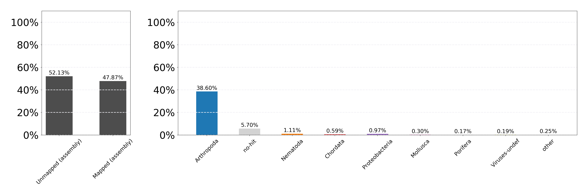
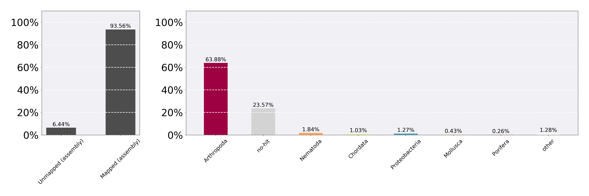

# Generating a *P. viburni* assembly

Start date: 08.10.2019, restarted 21.04.2020

	# Working directory	
	/data/ross/mealybugs/analyses/B_viburni_andres/1_pacbio_assembly
    qlogin -pe smp 4 -N samtools 

## 1. Raw reads

PacBio (/data/ross/mealybugs/analyses/B_viburni_andres/1_pacbio_assembly/0_reads/)

	ln -s /data/ross/mealybugs/raw/11718_Ross_Laura/raw_data/20190530/PV_18-13/m54041_190522_233005.subreads.bam
	ln -s /data/ross/mealybugs/raw/11718_Ross_Laura/raw_data/20190530/PV_18-13/m54041_190524_131016.subreads.bam
	ln -s /data/ross/mealybugs/raw/11718_Ross_Laura/raw_data/20190530/PV_18-13/m54041_190524_233023.subreads.bam

Illumina (/data/ross/mealybugs/analyses/B_viburni_andres/2_short_read_DNA_seq/0_reads)
	
	ln -s /data/ross/mealybugs/raw/transfer.genomics.ed.ac.uk/11372_Ross_Laura/raw_data/all_reads/18_13_1B_350/180608_A00291_0042_BH3CC3DRXX_2_11372RL0002L01_1.fastq.gz
	ln -s /data/ross/mealybugs/raw/transfer.genomics.ed.ac.uk/11372_Ross_Laura/raw_data/all_reads/18_13_1B_350/180608_A00291_0042_BH3CC3DRXX_2_11372RL0002L01_2.fastq.gz
	ln -s /data/ross/mealybugs/raw/transfer.genomics.ed.ac.uk/11372_Ross_Laura/raw_data/all_reads/18_13_1B_550/180608_A00291_0042_BH3CC3DRXX_2_11372RL0001L01_1.fastq.gz
	ln -s /data/ross/mealybugs/raw/transfer.genomics.ed.ac.uk/11372_Ross_Laura/raw_data/all_reads/18_13_1B_550/180608_A00291_0042_BH3CC3DRXX_2_11372RL0001L01_2.fastq.gz

## 2. Bam to fasta

Index bam (conda env pacbio)

	pbindex m54041_190522_233005.subreads.bam
	pbindex m54041_190524_131016.subreads.bam
	pbindex m54041_190524_233023.subreads.bam

Convert fasta to bam (conda env pacbio)
	
	bam2fasta -o /scratch/afilia/PV_18-13.1.subreads m54041_190522_233005.subreads.bam && rsync -av /scratch/afilia/PV_18-13.1.subreads /.
	bam2fasta -o /scratch/afilia/PV_18-13.2.subreads m54041_190524_131016.subreads.bam && rsync -av /scratch/afilia/PV_18-13.2.subreads /.
	bam2fasta -o /scratch/afilia/PV_18-13.3.subreads m54041_190524_233023.subreads.bam && rsync -av /scratch/afilia/PV_18-13.3.subreads /.

## 3. Read length distribution

	/ceph/users/dlaetsch/software/falen PV_18-13.1.subreads.fasta.gz | cut -f2 | sort -rn > PV_18-13.1.subreads.read_length.txt
	/ceph/users/dlaetsch/software/falen PV_18-13.2.subreads.fasta.gz | cut -f2 | sort -rn > PV_18-13.2.subreads.read_length.txt
	/ceph/users/dlaetsch/software/falen PV_18-13.3.subreads.fasta.gz | cut -f2 | sort -rn > PV_18-13.3.subreads.read_length.txt

## 4. Plot lengths

Use plrl.py (D. Laetsch, copied in /data/ross/mealybugs/analyses/B_viburni_andres/scripts)
	
	# conda install tqdm seaborn matplotlib numpy docopt
	python /data/ross/mealybugs/analyses/B_viburni_andres/scripts/plrl.py -d . -f 2 -m 40000

## 5. Raw assembly with wtdbg2 

Initial assembly with wtdbg2 (redbean) v2.5 (conda env afilia)
	
	wtdbg2 -x sq -g 327m -t 64 -i /data/ross/mealybugs/analyses/B_viburni_andres/1_pacbio_assembly/0_reads/PV_18-13.1.subreads.fasta.gz -i /data/ross/mealybugs/analyses/B_viburni_andres/1_pacbio_assembly/0_reads/PV_18-13.2.subreads.fasta.gz -i /data/ross/mealybugs/analyses/B_viburni_andres/1_pacbio_assembly/0_reads/PV_18-13.3.subreads.fasta.gz -o /scratch/afilia/pseudococcus_viburni.redbean && wtpoa-cns -t 64 -i /scratch/afilia/pseudococcus_viburni.redbean.ctg.lay.gz -fo /scratch/afilia/pseudococcus_viburni.redbean.raw.fa 

## 6. Assembly assessment

Run Busco

	conda create -n afilia_busco
	conda install -c bioconda -c conda-forge busco=4.0.6
	conda install -c bioconda blast
	conda install -c bioconda augustus (v 3.3.3)
	export AUGUSTUS_CONFIG_PATH="/ceph/software/busco_augustus_config_path/config/" && busco -m genome -c 16 -i pseudococcus_viburni.redbean.raw.fa -o pseudococcus_viburni.redbean.raw.busco -l insecta_odb10
	export AUGUSTUS_CONFIG_PATH="/ceph/software/busco_augustus_config_path/config/" && busco -m genome -c 16 -i pseudococcus_viburni.redbean.raw.fa -o pseudococcus_viburni.redbean.raw.busco.hemiptera -l hemiptera_odb10

Get assembly metrics

	/ceph/software/scripts/scaffold_stats.pl -t 200 1000 -d " " -f pseudococcus_viburni.redbean.raw.fa > pseudococcus_viburni.redbean.raw.stats

Stats for raw:
  * For scaffolds longer than 1000 bp:
  	- Num 2861
  	- Span 439642885
  	- Min 1394
  	- Mean 153667
  	- N50 816797
  	- NumN50 164
  	- GC 0.336
  * Busco (insecta) C:83.1%[S:82.0%,D:1.1%],F:6.7%,M:10.2%,n:1367
  * Busco (hemiptera) C:85.7%[S:83.4%,D:2.3%],F:2.2%,M:12.1%,n:2510   

## 7. Preliminary polishing of the genome

Polish with minimap2 v2.17-r941 (conda env afilia)
	
	minimap2 -t16 -ax map-pb -r2k ../raw/pseudococcus_viburni.redbean.raw.fa /data/ross/mealybugs/analyses/B_viburni_andres/1_pacbio_assembly/0_reads/PV_18-13.1.subreads.fasta.gz /data/ross/mealybugs/analyses/B_viburni_andres/1_pacbio_assembly/0_reads/PV_18-13.2.subreads.fasta.gz /data/ross/mealybugs/analyses/B_viburni_andres/1_pacbio_assembly/0_reads/PV_18-13.3.subreads.fasta.gz | samtools sort -@4 > pseudococcus_viburni.redbean.int.fa
	samtools view -F0x900 pseudococcus_viburni.redbean.int.fa | wtpoa-cns -t 15 -d ../raw/pseudococcus_viburni.redbean.raw.fa -i - -fo pseudococcus_viburni.redbean.cns.fa

	export AUGUSTUS_CONFIG_PATH="/ceph/software/busco_augustus_config_path/config/" && busco -m genome -c 16 -i pseudococcus_viburni.redbean.cns.fa -o pseudococcus_viburni.redbean.cns.busco.hemiptera -f -l hemiptera_odb10

Stats for cns:
  * For scaffolds longer than 1000 bp:
	-	Num 2852
	-	Span 436032832
	-	Min 1041
	-	Mean 152886
	-	N50 816708
	-	NumN50 163
	-	GC 0.336  
  * Busco (hemiptera) C:90.3%[S:87.8%,D:2.5%],F:1.4%,M:8.3%,n:2510

Additional polishment using short reads

	bwa index pseudococcus_viburni.redbean.cns.fa
	bwa mem -t 32 pseudococcus_viburni.redbean.cns.fa /data/ross/mealybugs/analyses/B_viburni_andres/2_short_read_DNA_seq/0_reads/PV_18-13.Illumina.350.trimmed_1.fq.gz /data/ross/mealybugs/analyses/B_viburni_andres/2_short_read_DNA_seq/0_reads/PV_18-13.Illumina.350.trimmed_2.fq.gz | samtools sort -O SAM -o /scratch/afilia/PV_18-13.Illumina.350.alignedtocns.sorted.sam
	bwa mem -t 32 pseudococcus_viburni.redbean.cns.fa /data/ross/mealybugs/analyses/B_viburni_andres/2_short_read_DNA_seq/0_reads/PV_18-13.Illumina.550.trimmed_1.fq.gz /data/ross/mealybugs/analyses/B_viburni_andres/2_short_read_DNA_seq/0_reads/PV_18-13.Illumina.550.trimmed_2.fq.gz | samtools sort -O SAM -o /scratch/afilia/PV_18-13.Illumina.550.alignedtocns.sorted.sam
	samtools merge /scratch/afilia/PV_18-13.Illumina.alignedtocns.sorted.sam /scratch/afilia/PV_18-13.Illumina.350.alignedtocns.sorted.sam /scratch/afilia/PV_18-13.Illumina.alignedtocns.550.sorted.sam
	
	wtpoa-cns -t 32 -x sam-sr -d pseudococcus_viburni.redbean.cns.fa -i /scratch/afilia/PV_18-13.Illumina.alignedtocns.sorted.sam -fo pseudococcus_viburni.redbean.cns.srp.fa
	/ceph/software/scripts/scaffold_stats.pl -t 200 1000 -d " " -f pseudococcus_viburni.redbean.cns.srp.fa > pseudococcus_viburni.redbean.cns.srp.stats  

	export AUGUSTUS_CONFIG_PATH="/ceph/software/busco_augustus_config_path/config/" && busco -m genome -c 16 -i pseudococcus_viburni.redbean.cns.srp.fa -o pseudococcus_viburni.redbean.cns.srp.busco.hemiptera -f -l hemiptera_odb10
	export AUGUSTUS_CONFIG_PATH="/ceph/software/busco_augustus_config_path/config/" && busco -m genome -c 16 -i pseudococcus_viburni.redbean.cns.srp.fa -o pseudococcus_viburni.redbean.cns.srp.busco.insecta -f -l insecta_odb10
	export AUGUSTUS_CONFIG_PATH="/ceph/software/busco_augustus_config_path/config/" && busco -m genome -c 16 -i pseudococcus_viburni.redbean.cns.srp.fa -o pseudococcus_viburni.redbean.cns.srp.busco.arthropoda -f -l arthropoda_odb10

Stats for cns-srp:
  * For scaffolds longer than 1000 bp:
	-	Num 2848
	-	Span 422785487
	-	Min 1010
	-	Mean 148449
	-	N50 797178
	-	NumN50 163
	-	GC 0.336
* Busco (hemiptera) C:91.7%[S:88.6%,D:3.1%],F:1.0%,M:7.3%,n:2510
* Busco (insecta) C:93.0%[S:90.1%,D:2.9%],F:1.3%,M:5.7%,n:1367
* Busco (arthropoda) C:94.5%[S:92.2%,D:2.3%],F:1.5%,M:4.0%,n:1013 

## 8. Further polishing: 3x rounds with long reads, 1x rounds with Illumina reads

Polish cns assembly 2 more times with minimap2

	minimap2 -t32 -ax map-pb -r2k pseudococcus_viburni.redbean.cns.fa /data/ross/mealybugs/analyses/B_viburni_andres/1_pacbio_assembly/0_reads/PV_18-13.1.subreads.fasta.gz /data/ross/mealybugs/analyses/B_viburni_andres/1_pacbio_assembly/0_reads/PV_18-13.2.subreads.fasta.gz /data/ross/mealybugs/analyses/B_viburni_andres/1_pacbio_assembly/0_reads/PV_18-13.3.subreads.fasta.gz | samtools sort -@4 > pseudococcus_viburni.redbean.cns2.int.fa
	samtools view -F0x900 pseudococcus_viburni.redbean.cns2.int.fa | wtpoa-cns -t 32 -d pseudococcus_viburni.redbean.cns.fa -i - -fo pseudococcus_viburni.redbean.cns2.fa
	minimap2 -t32 -ax map-pb -r2k pseudococcus_viburni.redbean.cns2.fa /data/ross/mealybugs/analyses/B_viburni_andres/1_pacbio_assembly/0_reads/PV_18-13.1.subreads.fasta.gz /data/ross/mealybugs/analyses/B_viburni_andres/1_pacbio_assembly/0_reads/PV_18-13.2.subreads.fasta.gz /data/ross/mealybugs/analyses/B_viburni_andres/1_pacbio_assembly/0_reads/PV_18-13.3.subreads.fasta.gz | samtools sort -@32 > /scratch/afilia/pseudococcus_viburni.redbean.cns3.int.fa
	samtools view -F0x900 /scratch/afilia/pseudococcus_viburni.redbean.cns3.int.fa | wtpoa-cns -t 32 -d pseudococcus_viburni.redbean.cns2.fa -i - -fo pseudococcus_viburni.redbean.cns3.fa

BUSCO for cns2 and 3:

	export AUGUSTUS_CONFIG_PATH="/ceph/software/busco_augustus_config_path/config/" && busco -m genome -c 24 -i ../pseudococcus_viburni.redbean.cns2.fa -o pseudococcus_viburni.redbean.cns2.busco.hemiptera -f -l hemiptera_odb10
	export AUGUSTUS_CONFIG_PATH="/ceph/software/busco_augustus_config_path/config/" && busco -m genome -c 24 -i ../pseudococcus_viburni.redbean.cns3.fa -o pseudococcus_viburni.redbean.cns3.busco.hemiptera -f -l hemiptera_odb10

* C:90.2%[S:87.6%,D:2.6%],F:1.4%,M:8.4%,n:2510 (cns2)
* C:90.6%[S:88.2%,D:2.4%],F:1.4%,M:8.0%,n:2510 (cns3)

Polishing with short reads

	bwa index pseudococcus_viburni.redbean.cns3.fa
	bwa mem -t 32 pseudococcus_viburni.redbean.cns3.fa /data/ross/mealybugs/analyses/B_viburni_andres/2_short_read_DNA_seq/0_reads/PV_18-13.Illumina.350.trimmed_1.fq.gz /data/ross/mealybugs/analyses/B_viburni_andres/2_short_read_DNA_seq/0_reads/PV_18-13.Illumina.350.trimmed_2.fq.gz | samtools sort -O SAM -o /scratch/afilia/PV_18-13.Illumina.350.alignedtocns3.sorted.sam
	bwa mem -t 32 pseudococcus_viburni.redbean.cns3.fa /data/ross/mealybugs/analyses/B_viburni_andres/2_short_read_DNA_seq/0_reads/PV_18-13.Illumina.550.trimmed_1.fq.gz /data/ross/mealybugs/analyses/B_viburni_andres/2_short_read_DNA_seq/0_reads/PV_18-13.Illumina.550.trimmed_2.fq.gz | samtools sort -O SAM -o /scratch/afilia/PV_18-13.Illumina.550.alignedtocns3.sorted.sam
	samtools merge /scratch/afilia/PV_18-13.Illumina.alignedtocns3.sorted.sam /scratch/afilia/PV_18-13.Illumina.350.alignedtocns3.sorted.sam /scratch/afilia/PV_18-13.Illumina.550.alignedtocns3.sorted.sam
	wtpoa-cns -t 32 -x sam-sr -d pseudococcus_viburni.redbean.cns3.fa -i /scratch/afilia/PV_18-13.Illumina.alignedtocns3.sorted.sam -fo pseudococcus_viburni.redbean.cns3.srp1.fa
	
	/ceph/software/scripts/scaffold_stats.pl -t 200 1000 -d " " -f pseudococcus_viburni.redbean.cns3.srp1.fa -o pseudococcus_viburni.redbean.cns3.srp1.stats
	export AUGUSTUS_CONFIG_PATH="/ceph/software/busco_augustus_config_path/config/" && busco -m genome -c 24 -i ../pseudococcus_viburni.redbean.cns3.srp1.fa -o pseudococcus_viburni.redbean.cns3.srp1.busco.hemiptera -f -l hemiptera_odb10
	export AUGUSTUS_CONFIG_PATH="/ceph/software/busco_augustus_config_path/config/" && busco -m genome -c 24 -i ../pseudococcus_viburni.redbean.cns3.srp1.fa -o pseudococcus_viburni.redbean.cns3.srp1.busco.insecta -f -l insecta_odb10

Stats for cns-srp:
  * For scaffolds longer than 1000 bp:
	-	Num 2859
	-	Span 420719638
	-	Min 222
	-	Mean 147156
	-	N50 801500
	-	NumN50 162
	-	GC 0.336
* Busco (hemiptera) C:92.0%[S:89.0%,D:3.0%],F:1.0%,M:7.0%,n:2510 
* Busco (insecta) C:92.7%[S:89.8%,D:2.9%],F:2.1%,M:5.2%,n:1367 

## 9. Blobtools

Homology searches

	blastn -task megablast -query ../polished/pseudococcus_viburni.redbean.cns3.srp1.fa -db  /ceph/software/databases/ncbi_2020_02/nt -outfmt '6 qseqid staxids bitscore std' -max_target_seqs 10 -max_hsps 1 -num_threads 32 -evalue 1e-25 -out /scratch/afilia/p.viburni.decon.blast.out && rsync /scratch/afilia/p.viburni.decon.blast.out .
	diamond blastx --query ../polished/pseudococcus_viburni.redbean.cns3.srp1.fa --max-target-seqs 1 --sensitive --threads 32 --db /ceph/software/databases/uniprot_2019_08/full/reference_proteomes.dmnd --evalue 1e-25 --tmpdir /scratch/afilia/ --outfmt 6 --out /scratch/afilia/p.viburni.decon.diamond.out && rsync /scratch/afilia/p.viburni.decon.diamond.out .
	# add taxIDs to diamond 
	cp /ceph/software/databases/uniprot_2019_08/full/reference_proteomes.taxid_map.gz .
	/ceph/software/blobtools/blobtools taxify -f p.viburni.decon.diamond.out -m reference_proteomes.taxid_map -s 0 -t 1

Mapping reads to reference

	minimap2 -ax map-pb -t 32 ../polished/pseudococcus_viburni.redbean.cns3.srp1.fa /data/ross/mealybugs/analyses/B_viburni_andres/1_pacbio_assembly/0_reads/PV_18-13.1.subreads.fasta.gz /data/ross/mealybugs/analyses/B_viburni_andres/1_pacbio_assembly/0_reads/PV_18-13.2.subreads.fasta.gz /data/ross/mealybugs/analyses/B_viburni_andres/1_pacbio_assembly/0_reads/PV_18-13.3.subreads.fasta.gz | samtools view -hF 256 - | samtools sort -@32 -O BAM -o /scratch/afilia/p.viburni.decon.to.cns3.srp1.sorted.bam - && rsync -av /scratch/afilia/p.viburni.decon.to.cns3.srp1.sorted.bam .

Mapping stats:
  - raw total sequences:	1696469
  -	filtered sequences:	0
  -	sequences:	1696469
  -	is sorted:	1
  -	last fragments:	0
  -	reads mapped:	1495328
  -	reads mapped and paired:	0	# paired-end technology bit set + both mates mapped
  -	reads unmapped:	201141
  -	reads properly paired:	0	# proper-pair bit set
  -	reads paired:	0	# paired-end technology bit set
  -	reads duplicated:	0	# PCR or optical duplicate bit set
  -	reads MQ0:	3523	# mapped and MQ=0
  -	reads QC failed:	0
  -	non-primary alignments:	0
	
Running blobtools (v1.1.1)

	/ceph/software/blobtools/blobtools create -i ../polished/pseudococcus_viburni.redbean.cns3.srp1.fa -b p.viburni.decon.to.cns3.srp1.sorted.bam -t p.viburni.decon.blast.out -t p.viburni.decon.diamond.taxified.out -o p.viburni.decon
	/ceph/software/blobtools/blobtools view -i p.viburni.decon.blobDB.json -b
	/ceph/software/blobtools/blobtools plot -i p.viburni.decon.blobDB.json
	
The blobplots look good. However, note the low propotion of mapping reads in the ReadCovPlot.

	
This is not a concern: blobtools v1.1 plots mapped reads/the total number of alignments estimate with pysam (which is misleading). With v1.0, I obtain something much more reasonable:

	/ceph/users/afilia/.conda/envs/afilia_blobtools/bin/blobtools create -i ../polished/pseudococcus_viburni.redbean.cns3.srp1.fa -b p.viburni.decon.to.cns3.srp1.sorted.bam -t p.viburni.decon.blast.out -t p.viburni.decon.diamond.taxified.out -o p.viburni.decon2
	

I can now filter out contaminant contigs. Let's see what we have:

 - Arthropoda  970
 - Ascomycota    2
 - Bacteroidetes    1
 - Brachiopoda    1
 - Candidatus Tectomicrobia    1
 - Chlamydiae    1
 - Chordata   21
 - Cnidaria    5
 - Echinodermata    1
 - Euryarchaeota    1
 - Mollusca    9
 - Nematoda   45
 - no-hit 1773
 - Porifera    3
 - Proteobacteria   20
 - Rotifera    1
 - Spirochaetes    1
 - Streptophyta    3
 - Thermodesulfobacteria    1
 - Viruses-undef    2

 I will extract all metazoan contigs + contigs with good secondary hits to Arthopoda, and filter our too short/low coverage contigs as well (contigs with very high coverage *might* be B-chromosome related, let's keep these).

 	contigs.animals <- contigs.bestsum[(contigs.bestsum$phylum == "Arthropoda" | contigs.bestsum$phylum == "Brachiopoda" | contigs.bestsum$phylum == "Chordata" | contigs.bestsum$phylum == "Cnidaria" | contigs.bestsum$phylum == "Echinodermata" | contigs.bestsum$phylum == "Mollusca" | contigs.bestsum$phylum == "Nematoda" | contigs.bestsum$phylum == "Porifera" | contigs.bestsum$phylum == "Rotifera"),]
	contigs.no.hit <- contigs.bestsum[(contigs.bestsum$phylum == "no-hit"),]
	contigs.animals.no.hit <- rbind(contigs.animals,contigs.no.hit)
	contigs.other <- anti_join(contigs.bestsum,contigs.animals.no.hit,by="contig")
	contigs.other.arthropoda.2nd <- contigs.other[grepl('Arthropoda', contigs.other$phylum_hits),]
	contigs.animals.no.hit.other.arthropoda.2nd <- rbind(contigs.animals.no.hit,contigs.other.arthropoda.2nd)
	p.viburni.decon.contigs.keep <- contigs.animals.no.hit.other.arthropoda.2nd[(contigs.animals.no.hit.other.arthropoda.2nd$len > 1000) & (contigs.animals.no.hit.other.arthropoda.2nd$cov > 2),]

### A detour: the endosymbionts

We have 20 proteobacterial contigs adding up to ~5.6Mb. What do we know about endosymbionts in *P. viburni*?
 * Primary endosymbiont: beta Candidatus *Tremblaya princeps* (Gatehouse et al. 2012), genome size ~150kb in *longispinus* (Husnik & McCutcheon 2016)
 * Secondary embosymbionts: two massive gamma endosymbionts in *longispinus* (>4 Mbp each) (one of them belonging to the *Sodalis* clade; the other one more related to *Dickeya*) (Husnik & McCutcheon 2016)

|contig  | length | GC    | cov   | hits                                                                                                     |
|--------|--------|-------|-------|----------------------------------------------------------------------------------------------------------|
|ctg82   | 654212 | 0.339 | 18.4  | tax0=Arthropoda:305.0;tax1=Proteobacteria:676.0;                                                         |
|ctg88   | 644353 | 0.342 | 22.9  | tax0=Arthropoda:444.0;tax1=Proteobacteria:587.4;                                                         |
|ctg182  | 751204 | 0.434 | 94.2  | tax0=Proteobacteria:67094.0;tax1=Proteobacteria:2548.9;                                                  |
|ctg300  | 688257 | 0.323 | 23.0  | tax0=Proteobacteria:2839.0\|Viruses-undef:2412.0\|Arthropoda:1388.0\|undef:850.0;tax1=Arthropoda:1146.3; |
|ctg332  | 897554 | 0.34  | 18.2  | tax0=Arthropoda:207.0;tax1=Proteobacteria:489.6;                                                         |
|ctg376  | 268281 | 0.278 | 93.7  | tax0=Proteobacteria:43296.0;tax1=Nematoda:4144.8;                                                        |
|ctg390  | 253583 | 0.328 | 21.3  | tax0=Arthropoda:603.0;tax1=Proteobacteria:686.8;                                                         |
|ctg436  | 311299 | 0.332 | 21.5  | tax0=Proteobacteria:265.0;tax1=Proteobacteria:505.8;                                                     |
|ctg455  | 217774 | 0.335 | 19.7  | tax0=Arthropoda:337.0;tax1=Proteobacteria:465.6;                                                         |
|ctg497  | 260073 | 0.336 | 19.9  | tax0=Arthropoda:560.0;tax1=Proteobacteria:592.4;                                                         |
|ctg500  | 189316 | 0.342 | 17.4  | tax0=no-hit:0.0;tax1=Proteobacteria:211.1;                                                               |
|ctg513  | 177649 | 0.336 | 19.5  | tax0=no-hit:0.0;tax1=Proteobacteria:639.7;                                                               |
|ctg571  | 151401 | 0.322 | 19.1  | tax0=no-hit:0.0;tax1=Proteobacteria:168.7;                                                               |
|ctg1140 | 33216  | 0.339 | 7.13  | tax0=no-hit:0.0;tax1=Proteobacteria:163.7;                                                               |
|ctg1458 | 14519  | 0.338 | 4.53  | tax0=no-hit:0.0;tax1=Proteobacteria:512.3;                                                               |
|ctg1645 | 12289  | 0.397 | 469.  | tax0=Proteobacteria:31102.0;tax1=Proteobacteria:877.9;                                                   |
|ctg1772 | 10591  | 0.316 | 9.31  | tax0=no-hit:0.0;tax1=Proteobacteria:324.3;                                                               |
|ctg2111 | 8641   | 0.359 | 7.61  | tax0=no-hit:0.0;tax1=Proteobacteria:204.9;                                                               |
|ctg2236 | 6947   | 0.34  | 49.2  | tax0=no-hit:0.0;tax1=Proteobacteria:654.8;                                                               |
|ctg2741 | 4803   | 0.601 | 1386. | tax0=Proteobacteria:34512.0;tax1=Proteobacteria:241.5;                                                   |

According to coverage and GC content differences, these contigs look like promising candidates:

 * Primary endosymbiont:
	- ctg2741: Candidatus *Tremblaya princeps* (however too short); another hit to *Tremblaya* in ctg64 might be HGT (tax0=Arthropoda:1101.0|Proteobacteria:633.0|Streptophyta:185.0;tax1=Chordata:1565.3)
 * Secondary endosymbionts:
	- ctg182, ctg1645: Candidatus *Sodalis*, gamma proteobacterium endosymbiont of *P. viburni* isolate Vib 1-1 p505BB11 (~750kb) (PLON gamma 1)
	- ctg376, *Morganella/Buchnera/Gullanella* (*Sodalis?*) (~300kb)
	- ctg300, *Wolbachia* (~700kb)
	- ctg436, *Dickeya* (pathogens from herbaceous plants, related to PLON gamma 2) (~300Mb)

## 10. Reassemble

Extract contigs

	/ceph/software/assemblage/fastaqual_select.pl -f ../polished/pseudococcus_viburni.redbean.cns3.srp1.fa -i p.viburni.decon.contigs.keep.txt > ../polished/pseudococcus_viburni.redbean.cns3.srp1.blobtools.fa

Remap reads

	minimap2 -ax map-pb -t 32 ../polished/pseudococcus_viburni.redbean.cns3.srp1.blobtools.fa /data/ross/mealybugs/analyses/B_viburni_andres/1_pacbio_assembly/0_reads/PV_18-13.1.subreads.fasta.gz /data/ross/mealybugs/analyses/B_viburni_andres/1_pacbio_assembly/0_reads/PV_18-13.2.subreads.fasta.gz /data/ross/mealybugs/analyses/B_viburni_andres/1_pacbio_assembly/0_reads/PV_18-13.3.subreads.fasta.gz | samtools view -hF 256 - | samtools sort -@32 -O BAM -o /scratch/afilia/p.viburni.decon.to.cns3.srp1.blobtools.sorted.bam - && rsync -av /scratch/afilia/p.viburni.decon.to.cns3.srp1.blobtools.sorted.bam .

Keep mapped reads only, excluding unmapped and supplementary alignments
	
	samtools view -bhF 0x904 p.viburni.decon.to.cns3.srp1.blobtools.sorted.bam > /scratch/afilia/p.viburni.decon.to.cns3.srp1.blobtools.sorted.mapped.primary.bam && rsync -av /scratch/afilia/p.viburni.decon.to.cns3.srp1.blobtools.sorted.mapped.primary.bam .

Extract reads

	bamtools convert -format fasta -in p.viburni.decon.to.cns3.srp1.blobtools.sorted.mapped.primary.bam -out p.viburni.decon.subreads.fasta

Reassemble with redbean reads

#!/bin/bash

#$ -V
#$ -cwd
#$ -j y
#$ -o wtdbg2.$JOB_ID.log
 
# Submit using:
# qsub -pe smp 64
wtdbg2 -x sq -g 400m -t 64 -i p.viburni.decon.subreads.fasta -o /scratch/afilia/pseudococcus_viburni.2nd.pass && wtpoa-cns -t 64 -i /scratch/afilia/pseudococcus_viburni.2nd.pass.ctg.lay.gz -fo /scratch/afilia/pseudococcus_viburni.2nd.pass.raw.fa