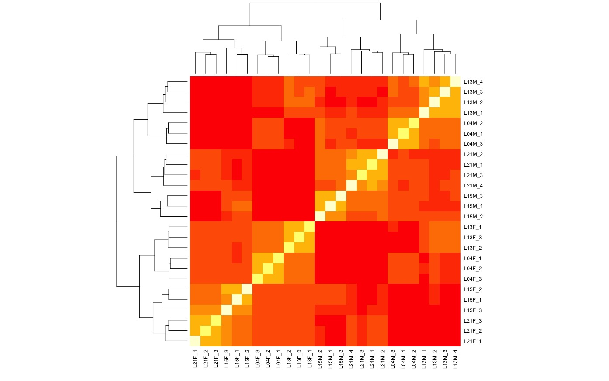
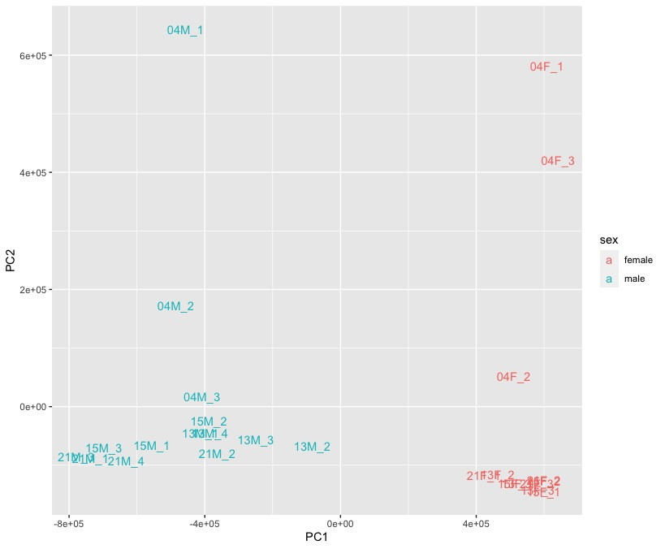
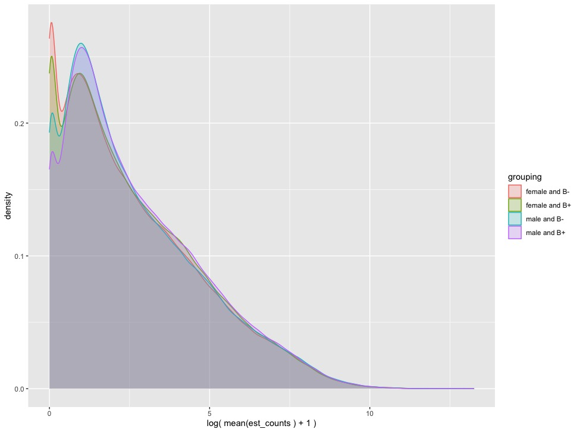
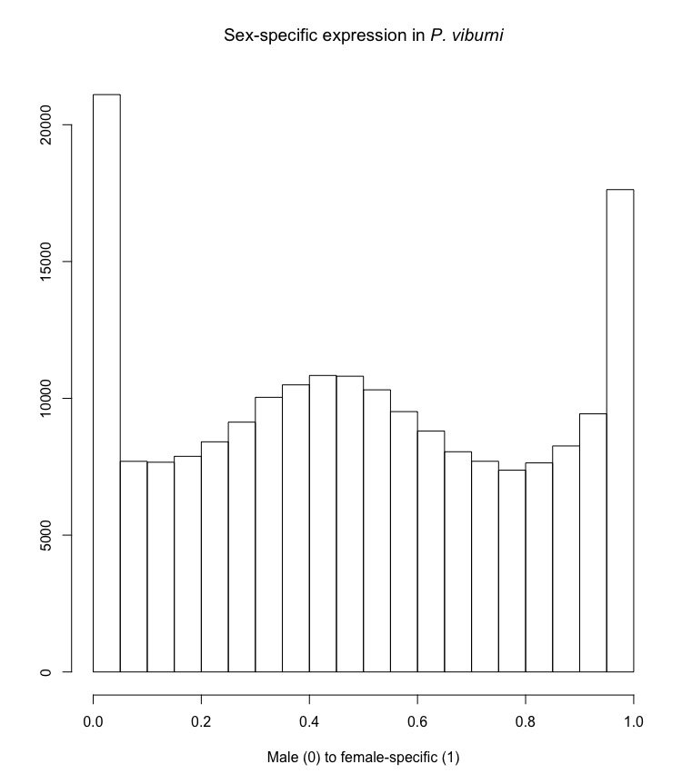
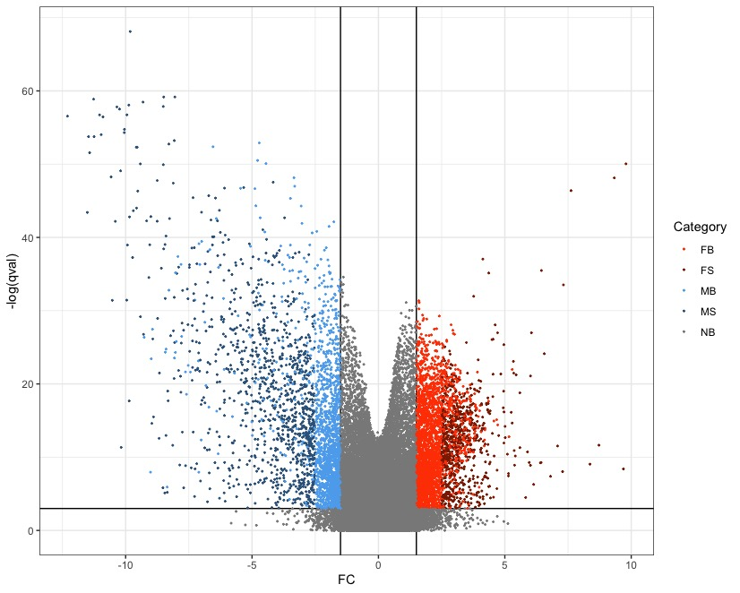
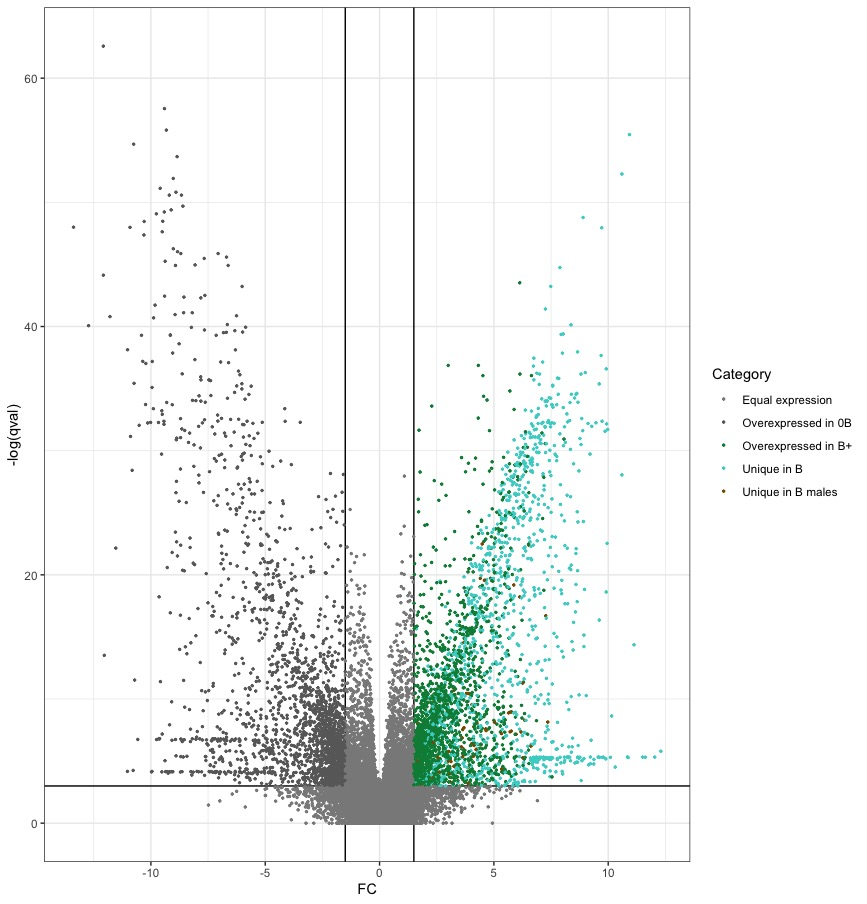
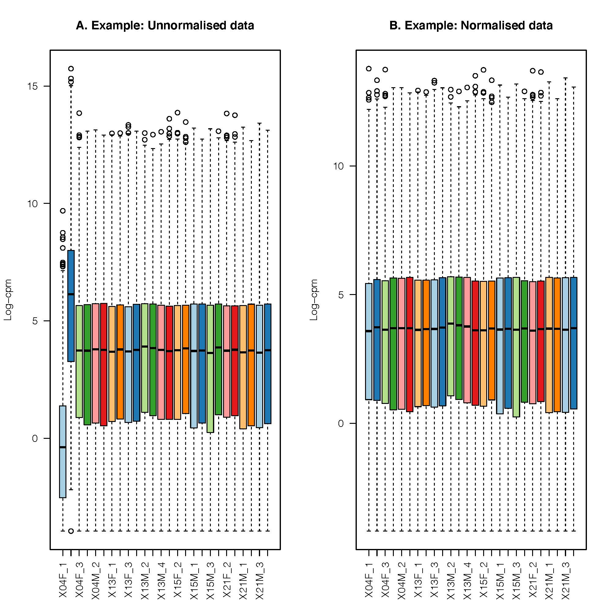
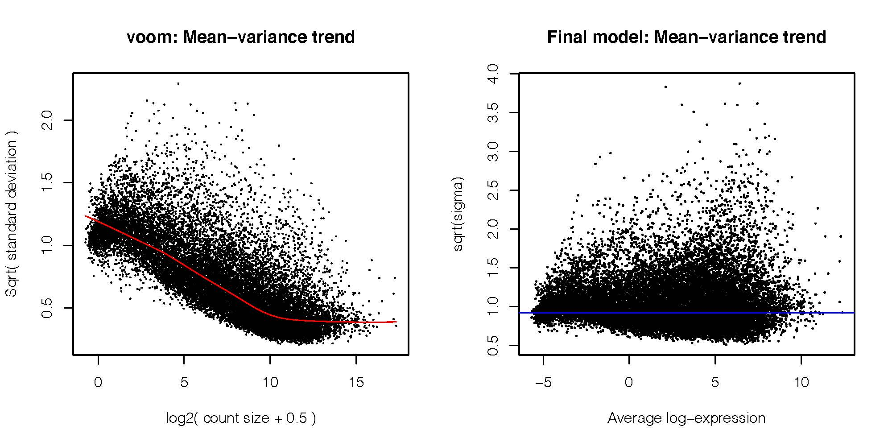
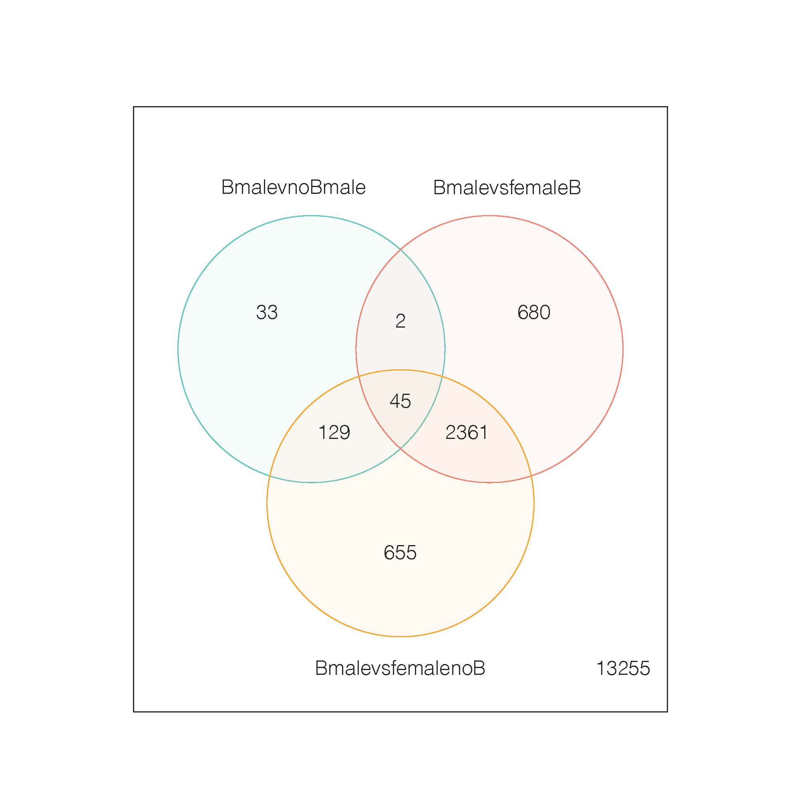

# Transcriptome assembly and annotation

	# working directory	
	/data/ross/mealybugs/analyses/B_viburni_andres/2_short_read_DNA_seq/0_reads
	# raw reads
	/data/ross/mealybugs/raw/11791_Ross_Laura/raw_data/20190812


# I. TRANSCRIPTOME ASSEMBLY

## 1. Raw RNAseq reads

	# Novaseq (/data/ross/mealybugs/analyses/B_viburni_andres/2_short_read_DNA_seq/0_reads)
	ln -s /data/ross/mealybugs/raw/11791_Ross_Laura/raw_data/20190812/13F_1/190805_A00291_0195_AHKLMLDMXX_2_11791RL0015L01_1.fastq.gz 13F_1_1.fastq.gz
	ln -s /data/ross/mealybugs/raw/11791_Ross_Laura/raw_data/20190812/13F_1/190805_A00291_0195_AHKLMLDMXX_2_11791RL0015L01_2.fastq.gz 13F_1_2.fastq.gz
	ln -s /data/ross/mealybugs/raw/11791_Ross_Laura/raw_data/20190812/13F_2/190805_A00291_0195_AHKLMLDMXX_2_11791RL0016L01_1.fastq.gz 13F_2_1.fastq.gz
	ln -s /data/ross/mealybugs/raw/11791_Ross_Laura/raw_data/20190812/13F_2/190805_A00291_0195_AHKLMLDMXX_2_11791RL0016L01_2.fastq.gz 13F_2_2.fastq.gz
	ln -s /data/ross/mealybugs/raw/11791_Ross_Laura/raw_data/20190812/13F_3/190805_A00291_0195_AHKLMLDMXX_2_11791RL0017L01_1.fastq.gz 13F_3_1.fastq.gz
	ln -s /data/ross/mealybugs/raw/11791_Ross_Laura/raw_data/20190812/13F_3/190805_A00291_0195_AHKLMLDMXX_2_11791RL0017L01_2.fastq.gz 13F_3_2.fastq.gz
	ln -s /data/ross/mealybugs/raw/11791_Ross_Laura/raw_data/20190812/13M_1/190805_A00291_0195_AHKLMLDMXX_2_11791RL0018L01_1.fastq.gz 13M_1_1.fastq.gz
	ln -s /data/ross/mealybugs/raw/11791_Ross_Laura/raw_data/20190812/13M_1/190805_A00291_0195_AHKLMLDMXX_2_11791RL0018L01_2.fastq.gz 13M_1_2.fastq.gz
	ln -s /data/ross/mealybugs/raw/11791_Ross_Laura/raw_data/20190812/13M_2/190805_A00291_0195_AHKLMLDMXX_2_11791RL0019L01_1.fastq.gz 13M_2_1.fastq.gz
	ln -s /data/ross/mealybugs/raw/11791_Ross_Laura/raw_data/20190812/13M_2/190805_A00291_0195_AHKLMLDMXX_2_11791RL0019L01_2.fastq.gz 13M_2_2.fastq.gz
	ln -s /data/ross/mealybugs/raw/11791_Ross_Laura/raw_data/20190812/13M_3/190805_A00291_0195_AHKLMLDMXX_2_11791RL0020L01_1.fastq.gz 13M_3_1.fastq.gz
	ln -s /data/ross/mealybugs/raw/11791_Ross_Laura/raw_data/20190812/13M_3/190805_A00291_0195_AHKLMLDMXX_2_11791RL0020L01_2.fastq.gz 13M_3_2.fastq.gz
	ln -s /data/ross/mealybugs/raw/11791_Ross_Laura/raw_data/20190812/13M_4/190805_A00291_0195_AHKLMLDMXX_2_11791RL0021L01_1.fastq.gz 13M_4_1.fastq.gz
	ln -s /data/ross/mealybugs/raw/11791_Ross_Laura/raw_data/20190812/13M_4/190805_A00291_0195_AHKLMLDMXX_2_11791RL0021L01_2.fastq.gz 13M_4_2.fastq.gz
	ln -s /data/ross/mealybugs/raw/11791_Ross_Laura/raw_data/20190812/15F_1/190805_A00291_0195_AHKLMLDMXX_2_11791RL0022L01_1.fastq.gz 15F_1_1.fastq.gz
	ln -s /data/ross/mealybugs/raw/11791_Ross_Laura/raw_data/20190812/15F_1/190805_A00291_0195_AHKLMLDMXX_2_11791RL0022L01_2.fastq.gz 15F_1_2.fastq.gz
	ln -s /data/ross/mealybugs/raw/11791_Ross_Laura/raw_data/20190812/15F_2/190805_A00291_0195_AHKLMLDMXX_2_11791RL0023L01_1.fastq.gz 15F_2_1.fastq.gz
	ln -s /data/ross/mealybugs/raw/11791_Ross_Laura/raw_data/20190812/15F_2/190805_A00291_0195_AHKLMLDMXX_2_11791RL0023L01_2.fastq.gz 15F_2_2.fastq.gz
	ln -s /data/ross/mealybugs/raw/11791_Ross_Laura/raw_data/20190812/15F_3/190805_A00291_0195_AHKLMLDMXX_2_11791RL0024L01_1.fastq.gz 15F_3_1.fastq.gz
	ln -s /data/ross/mealybugs/raw/11791_Ross_Laura/raw_data/20190812/15F_3/190805_A00291_0195_AHKLMLDMXX_2_11791RL0024L01_2.fastq.gz 15F_3_2.fastq.gz
	ln -s /data/ross/mealybugs/raw/11791_Ross_Laura/raw_data/20190812/15M_1/190805_A00291_0195_AHKLMLDMXX_2_11791RL0025L01_1.fastq.gz 15M_1_1.fastq.gz
	ln -s /data/ross/mealybugs/raw/11791_Ross_Laura/raw_data/20190812/15M_1/190805_A00291_0195_AHKLMLDMXX_2_11791RL0025L01_2.fastq.gz 15M_1_2.fastq.gz
	ln -s /data/ross/mealybugs/raw/11791_Ross_Laura/raw_data/20190812/15M_2/190805_A00291_0195_AHKLMLDMXX_2_11791RL0026L01_1.fastq.gz 15M_2_1.fastq.gz
	ln -s /data/ross/mealybugs/raw/11791_Ross_Laura/raw_data/20190812/15M_2/190805_A00291_0195_AHKLMLDMXX_2_11791RL0026L01_2.fastq.gz 15M_2_2.fastq.gz
	ln -s /data/ross/mealybugs/raw/11791_Ross_Laura/raw_data/20190812/15M_3/190805_A00291_0195_AHKLMLDMXX_2_11791RL0027L01_1.fastq.gz 15M_3_1.fastq.gz
	ln -s /data/ross/mealybugs/raw/11791_Ross_Laura/raw_data/20190812/15M_3/190805_A00291_0195_AHKLMLDMXX_2_11791RL0027L01_2.fastq.gz 15M_3_2.fastq.gz
	ln -s /data/ross/mealybugs/raw/11791_Ross_Laura/raw_data/20190812/21F_1/190805_A00291_0195_AHKLMLDMXX_2_11791RL0028L01_1.fastq.gz 21F_1_1.fastq.gz
	ln -s /data/ross/mealybugs/raw/11791_Ross_Laura/raw_data/20190812/21F_1/190805_A00291_0195_AHKLMLDMXX_2_11791RL0028L01_2.fastq.gz 21F_1_2.fastq.gz
	ln -s /data/ross/mealybugs/raw/11791_Ross_Laura/raw_data/20190812/21F_2/190805_A00291_0195_AHKLMLDMXX_2_11791RL0029L01_1.fastq.gz 21F_2_1.fastq.gz
	ln -s /data/ross/mealybugs/raw/11791_Ross_Laura/raw_data/20190812/21F_2/190805_A00291_0195_AHKLMLDMXX_2_11791RL0029L01_2.fastq.gz 21F_2_2.fastq.gz
	ln -s /data/ross/mealybugs/raw/11791_Ross_Laura/raw_data/20190812/21F_3/190805_A00291_0195_AHKLMLDMXX_2_11791RL0030L01_1.fastq.gz 21F_3_1.fastq.gz
	ln -s /data/ross/mealybugs/raw/11791_Ross_Laura/raw_data/20190812/21F_3/190805_A00291_0195_AHKLMLDMXX_2_11791RL0030L01_2.fastq.gz 21F_3_2.fastq.gz
	ln -s /data/ross/mealybugs/raw/11791_Ross_Laura/raw_data/20190812/21M_1/190805_A00291_0195_AHKLMLDMXX_2_11791RL0031L01_1.fastq.gz 21M_1_1.fastq.gz
	ln -s /data/ross/mealybugs/raw/11791_Ross_Laura/raw_data/20190812/21M_1/190805_A00291_0195_AHKLMLDMXX_2_11791RL0031L01_2.fastq.gz 21M_1_2.fastq.gz
	ln -s /data/ross/mealybugs/raw/11791_Ross_Laura/raw_data/20190812/21M_2/190805_A00291_0195_AHKLMLDMXX_2_11791RL0032L01_1.fastq.gz 21M_2_1.fastq.gz
	ln -s /data/ross/mealybugs/raw/11791_Ross_Laura/raw_data/20190812/21M_2/190805_A00291_0195_AHKLMLDMXX_2_11791RL0032L01_2.fastq.gz 21M_2_2.fastq.gz
	ln -s /data/ross/mealybugs/raw/11791_Ross_Laura/raw_data/20190812/21M_3/190805_A00291_0195_AHKLMLDMXX_2_11791RL0033L01_1.fastq.gz 21M_3_1.fastq.gz
	ln -s /data/ross/mealybugs/raw/11791_Ross_Laura/raw_data/20190812/21M_3/190805_A00291_0195_AHKLMLDMXX_2_11791RL0033L01_2.fastq.gz 21M_3_2.fastq.gz
	ln -s /data/ross/mealybugs/raw/11791_Ross_Laura/raw_data/20190812/21M_4/190805_A00291_0195_AHKLMLDMXX_2_11791RL0034L01_1.fastq.gz 21M_4_1.fastq.gz
	ln -s /data/ross/mealybugs/raw/11791_Ross_Laura/raw_data/20190812/21M_4/190805_A00291_0195_AHKLMLDMXX_2_11791RL0034L01_2.fastq.gz 21M_4_2.fastq.gz
	ln -s /data/ross/mealybugs/raw/11791_Ross_Laura/raw_data/20190812/4F_1/190805_A00291_0195_AHKLMLDMXX_2_11791RL0009L01_1.fastq.gz 04F_1_1.fastq.gz
	ln -s /data/ross/mealybugs/raw/11791_Ross_Laura/raw_data/20190812/4F_1/190805_A00291_0195_AHKLMLDMXX_2_11791RL0009L01_2.fastq.gz 04F_1_2.fastq.gz
	ln -s /data/ross/mealybugs/raw/11791_Ross_Laura/raw_data/20190812/4F_2/190805_A00291_0195_AHKLMLDMXX_2_11791RL0010L01_1.fastq.gz 04F_2_1.fastq.gz
	ln -s /data/ross/mealybugs/raw/11791_Ross_Laura/raw_data/20190812/4F_2/190805_A00291_0195_AHKLMLDMXX_2_11791RL0010L01_2.fastq.gz 04F_2_2.fastq.gz
	ln -s /data/ross/mealybugs/raw/11791_Ross_Laura/raw_data/20190812/4F_3/190805_A00291_0195_AHKLMLDMXX_2_11791RL0011L01_1.fastq.gz 04F_3_1.fastq.gz
	ln -s /data/ross/mealybugs/raw/11791_Ross_Laura/raw_data/20190812/4F_3/190805_A00291_0195_AHKLMLDMXX_2_11791RL0011L01_2.fastq.gz 04F_3_2.fastq.gz
	ln -s /data/ross/mealybugs/raw/11791_Ross_Laura/raw_data/20190812/4M_1/190805_A00291_0195_AHKLMLDMXX_2_11791RL0012L01_1.fastq.gz 04M_1_1.fastq.gz
	ln -s /data/ross/mealybugs/raw/11791_Ross_Laura/raw_data/20190812/4M_1/190805_A00291_0195_AHKLMLDMXX_2_11791RL0012L01_2.fastq.gz 04M_1_2.fastq.gz
	ln -s /data/ross/mealybugs/raw/11791_Ross_Laura/raw_data/20190812/4M_2/190805_A00291_0195_AHKLMLDMXX_2_11791RL0013L01_1.fastq.gz 04M_2_1.fastq.gz
	ln -s /data/ross/mealybugs/raw/11791_Ross_Laura/raw_data/20190812/4M_2/190805_A00291_0195_AHKLMLDMXX_2_11791RL0013L01_2.fastq.gz 04M_2_2.fastq.gz
	ln -s /data/ross/mealybugs/raw/11791_Ross_Laura/raw_data/20190812/4M_3/190805_A00291_0195_AHKLMLDMXX_2_11791RL0014L01_1.fastq.gz 04M_3_1.fastq.gz
	ln -s /data/ross/mealybugs/raw/11791_Ross_Laura/raw_data/20190812/4M_3/190805_A00291_0195_AHKLMLDMXX_2_11791RL0014L01_2.fastq.gz 04M_3_2.fastq.gz

## 2. Trim reads

	# fastp version 0.20.0 (conda env afilia)
	fastp -i 13F_1_1.fastq.gz -I 13F_1_2.fastq.gz -o /scratch/afilia/13F_1.trimmed_1.fastq.gz -O /scratch/afilia/13F_1.trimmed_2.fastq.gz --cut_by_quality5 --cut_by_quality3 --cut_window_size 4 --cut_mean_quality 20 --detect_adapter_for_pe --trim_poly_g
	fastp -i 13F_2_1.fastq.gz -I 13F_2_2.fastq.gz -o /scratch/afilia/13F_2.trimmed_1.fastq.gz -O /scratch/afilia/13F_2.trimmed_2.fastq.gz --cut_by_quality5 --cut_by_quality3 --cut_window_size 4 --cut_mean_quality 20 --detect_adapter_for_pe 	--trim_poly_g
	fastp -i 13F_3_1.fastq.gz -I 13F_3_2.fastq.gz -o /scratch/afilia/13F_3.trimmed_1.fastq.gz -O /scratch/afilia/13F_3.trimmed_2.fastq.gz --cut_by_quality5 --cut_by_quality3 --cut_window_size 4 --cut_mean_quality 20 --detect_adapter_for_pe 	--trim_poly_g
	fastp -i 13M_1_1.fastq.gz -I 13M_1_2.fastq.gz -o /scratch/afilia/13M_1.trimmed_1.fastq.gz -O /scratch/afilia/13M_1.trimmed_2.fastq.gz --cut_by_quality5 --cut_by_quality3 --cut_window_size 4 --cut_mean_quality 20 --detect_adapter_for_pe 	--trim_poly_g
	fastp -i 13M_2_1.fastq.gz -I 13M_2_2.fastq.gz -o /scratch/afilia/13M_2.trimmed_1.fastq.gz -O /scratch/afilia/13M_2.trimmed_2.fastq.gz --cut_by_quality5 --cut_by_quality3 --cut_window_size 4 --cut_mean_quality 20 --detect_adapter_for_pe 	--trim_poly_g
	fastp -i 13M_3_1.fastq.gz -I 13M_3_2.fastq.gz -o /scratch/afilia/13M_3.trimmed_1.fastq.gz -O /scratch/afilia/13M_3.trimmed_2.fastq.gz --cut_by_quality5 --cut_by_quality3 --cut_window_size 4 --cut_mean_quality 20 --detect_adapter_for_pe 	--trim_poly_g
	fastp -i 13M_4_1.fastq.gz -I 13M_4_2.fastq.gz -o /scratch/afilia/13M_4.trimmed_1.fastq.gz -O /scratch/afilia/13M_4.trimmed_2.fastq.gz --cut_by_quality5 --cut_by_quality3 --cut_window_size 4 --cut_mean_quality 20 --detect_adapter_for_pe 	--trim_poly_g
	fastp -i 15F_1_1.fastq.gz -I 15F_1_2.fastq.gz -o /scratch/afilia/15F_1.trimmed_1.fastq.gz -O /scratch/afilia/15F_1.trimmed_2.fastq.gz --cut_by_quality5 --cut_by_quality3 --cut_window_size 4 --cut_mean_quality 20 --detect_adapter_for_pe 	--trim_poly_g
	fastp -i 15F_2_1.fastq.gz -I 15F_2_2.fastq.gz -o /scratch/afilia/15F_2.trimmed_1.fastq.gz -O /scratch/afilia/15F_2.trimmed_2.fastq.gz --cut_by_quality5 --cut_by_quality3 --cut_window_size 4 --cut_mean_quality 20 --detect_adapter_for_pe 	--trim_poly_g
	fastp -i 15F_3_1.fastq.gz -I 15F_3_2.fastq.gz -o /scratch/afilia/15F_3.trimmed_1.fastq.gz -O /scratch/afilia/15F_3.trimmed_2.fastq.gz --cut_by_quality5 --cut_by_quality3 --cut_window_size 4 --cut_mean_quality 20 --detect_adapter_for_pe 	--trim_poly_g
	fastp -i 15M_1_1.fastq.gz -I 15M_1_2.fastq.gz -o /scratch/afilia/15M_1.trimmed_1.fastq.gz -O /scratch/afilia/15M_1.trimmed_2.fastq.gz --cut_by_quality5 --cut_by_quality3 --cut_window_size 4 --cut_mean_quality 20 --detect_adapter_for_pe 	--trim_poly_g
	fastp -i 15M_2_1.fastq.gz -I 15M_2_2.fastq.gz -o /scratch/afilia/15M_2.trimmed_1.fastq.gz -O /scratch/afilia/15M_2.trimmed_2.fastq.gz --cut_by_quality5 --cut_by_quality3 --cut_window_size 4 --cut_mean_quality 20 --detect_adapter_for_pe 	--trim_poly_g
	fastp -i 15M_3_1.fastq.gz -I 15M_3_2.fastq.gz -o /scratch/afilia/15M_3.trimmed_1.fastq.gz -O /scratch/afilia/15M_3.trimmed_2.fastq.gz --cut_by_quality5 --cut_by_quality3 --cut_window_size 4 --cut_mean_quality 20 --detect_adapter_for_pe 	--trim_poly_g
	fastp -i 21F_1_1.fastq.gz -I 21F_1_2.fastq.gz -o /scratch/afilia/21F_1.trimmed_1.fastq.gz -O /scratch/afilia/21F_1.trimmed_2.fastq.gz --cut_by_quality5 --cut_by_quality3 --cut_window_size 4 --cut_mean_quality 20 --detect_adapter_for_pe 	--trim_poly_g
	fastp -i 21F_2_1.fastq.gz -I 21F_2_2.fastq.gz -o /scratch/afilia/21F_2.trimmed_1.fastq.gz -O /scratch/afilia/21F_2.trimmed_2.fastq.gz --cut_by_quality5 --cut_by_quality3 --cut_window_size 4 --cut_mean_quality 20 --detect_adapter_for_pe 	--trim_poly_g
	fastp -i 21F_3_1.fastq.gz -I 21F_3_2.fastq.gz -o /scratch/afilia/21F_3.trimmed_1.fastq.gz -O /scratch/afilia/21F_3.trimmed_2.fastq.gz --cut_by_quality5 --cut_by_quality3 --cut_window_size 4 --cut_mean_quality 20 --detect_adapter_for_pe 	--trim_poly_g
	fastp -i 21M_1_1.fastq.gz -I 21M_1_2.fastq.gz -o /scratch/afilia/21M_1.trimmed_1.fastq.gz -O /scratch/afilia/21M_1.trimmed_2.fastq.gz --cut_by_quality5 --cut_by_quality3 --cut_window_size 4 --cut_mean_quality 20 --detect_adapter_for_pe 	--trim_poly_g
	fastp -i 21M_2_1.fastq.gz -I 21M_2_2.fastq.gz -o /scratch/afilia/21M_2.trimmed_1.fastq.gz -O /scratch/afilia/21M_2.trimmed_2.fastq.gz --cut_by_quality5 --cut_by_quality3 --cut_window_size 4 --cut_mean_quality 20 --detect_adapter_for_pe 	--trim_poly_g
	fastp -i 21M_3_1.fastq.gz -I 21M_3_2.fastq.gz -o /scratch/afilia/21M_3.trimmed_1.fastq.gz -O /scratch/afilia/21M_3.trimmed_2.fastq.gz --cut_by_quality5 --cut_by_quality3 --cut_window_size 4 --cut_mean_quality 20 --detect_adapter_for_pe 	--trim_poly_g
	fastp -i 21M_4_1.fastq.gz -I 21M_4_2.fastq.gz -o /scratch/afilia/21M_4.trimmed_1.fastq.gz -O /scratch/afilia/21M_4.trimmed_2.fastq.gz --cut_by_quality5 --cut_by_quality3 --cut_window_size 4 --cut_mean_quality 20 --detect_adapter_for_pe 	--trim_poly_g
	fastp -i 04F_1_1.fastq.gz -I 04F_1_2.fastq.gz -o /scratch/afilia/04F_1.trimmed_1.fastq.gz -O /scratch/afilia/04F_1.trimmed_2.fastq.gz --cut_by_quality5 --cut_by_quality3 --cut_window_size 4 --cut_mean_quality 20 --detect_adapter_for_pe 	--trim_poly_g
	fastp -i 04F_2_1.fastq.gz -I 04F_2_2.fastq.gz -o /scratch/afilia/04F_2.trimmed_1.fastq.gz -O /scratch/afilia/04F_2.trimmed_2.fastq.gz --cut_by_quality5 --cut_by_quality3 --cut_window_size 4 --cut_mean_quality 20 --detect_adapter_for_pe 	--trim_poly_g
	fastp -i 04F_3_1.fastq.gz -I 04F_3_2.fastq.gz -o /scratch/afilia/04F_3.trimmed_1.fastq.gz -O /scratch/afilia/04F_3.trimmed_2.fastq.gz --cut_by_quality5 --cut_by_quality3 --cut_window_size 4 --cut_mean_quality 20 --detect_adapter_for_pe 	--trim_poly_g
	fastp -i 04M_1_1.fastq.gz -I 04M_1_2.fastq.gz -o /scratch/afilia/04M_1.trimmed_1.fastq.gz -O /scratch/afilia/04M_1.trimmed_2.fastq.gz --cut_by_quality5 --cut_by_quality3 --cut_window_size 4 --cut_mean_quality 20 --detect_adapter_for_pe 	--trim_poly_g
	fastp -i 04M_2_1.fastq.gz -I 04M_2_2.fastq.gz -o /scratch/afilia/04M_2.trimmed_1.fastq.gz -O /scratch/afilia/04M_2.trimmed_2.fastq.gz --cut_by_quality5 --cut_by_quality3 --cut_window_size 4 --cut_mean_quality 20 --detect_adapter_for_pe 	--trim_poly_g
	fastp -i 04M_3_1.fastq.gz -I 04M_3_2.fastq.gz -o /scratch/afilia/04M_3.trimmed_1.fastq.gz -O /scratch/afilia/04M_3.trimmed_2.fastq.gz --cut_by_quality5 --cut_by_quality3 --cut_window_size 4 --cut_mean_quality 20 --detect_adapter_for_pe 	--trim_poly_g

## 3. Trinity

	# Trinity-v2.8.5 - strand-specific
	Trinity --seqType fq --left 04F_1.trimmed_1.fastq.gz,04F_2.trimmed_1.fastq.gz,04F_3.trimmed_1.fastq.gz,04M_1.trimmed_1.fastq.gz,04M_2.trimmed_1.fastq.gz,04M_3.trimmed_1.fastq.gz,13F_1.trimmed_1.fastq.gz,13F_2.trimmed_1.fastq.gz,13F_3.trimmed_1.fastq.gz,13M_1.trimmed_1.fastq.gz,13M_2.trimmed_1.fastq.gz,13M_3.trimmed_1.fastq.gz,13M_4.trimmed_1.fastq.gz,15F_1.trimmed_1.fastq.gz,15F_2.trimmed_1.fastq.gz,15F_3.trimmed_1.fastq.gz,15M_1.trimmed_1.fastq.gz,15M_2.trimmed_1.fastq.gz,15M_3.trimmed_1.fastq.gz,21F_1.trimmed_1.fastq.gz,21F_2.trimmed_1.fastq.gz,21F_3.trimmed_1.fastq.gz,21M_1.trimmed_1.fastq.gz,21M_2.trimmed_1.fastq.gz,21M_3.trimmed_1.fastq.gz,21M_4.trimmed_1.fastq.gz --right 04F_1.trimmed_2.fastq.gz,04F_2.trimmed_2.fastq.gz,04F_3.trimmed_2.fastq.gz,04M_1.trimmed_2.fastq.gz,04M_2.trimmed_2.fastq.gz,04M_3.trimmed_2.fastq.gz,13F_1.trimmed_2.fastq.gz,13F_2.trimmed_2.fastq.gz,13F_3.trimmed_2.fastq.gz,13M_1.trimmed_2.fastq.gz,13M_2.trimmed_2.fastq.gz,13M_3.trimmed_2.fastq.gz,13M_4.trimmed_2.fastq.gz,15F_1.trimmed_2.fastq.gz,15F_2.trimmed_2.fastq.gz,15F_3.trimmed_2.fastq.gz,15M_1.trimmed_2.fastq.gz,15M_2.trimmed_2.fastq.gz,15M_3.trimmed_2.fastq.gz,21F_1.trimmed_2.fastq.gz,21F_2.trimmed_2.fastq.gz,21F_3.trimmed_2.fastq.gz,21M_1.trimmed_2.fastq.gz,21M_2.trimmed_2.fastq.gz,21M_3.trimmed_2.fastq.gz,21M_4.trimmed_2.fastq.gz --SS_lib_type RF --max_memory 100G --CPU 32 --full_cleanup

## 4. Annotate using the Trinonate pipeline

	conda install -c bioconda trinotate (3.2.0) # link to eggnoc doesn't work, had to update it manually using the 3.2.1 version (not in conda)
	conda install -c anaconda sqlite (3.31.1)
	# don't do signalP, tmhhm, rnammer for now

	# build sqlite database and prepare sequences
	Build_Trinotate_Boilerplate_SQLite_db.pl Trinotate
	makeblastdb -in uniprot_sprot.pep -dbtype prot
	gunzip Pfam-A.hmm.gz
	hmmpress Pfam-A.hmm

	# use Transdecoder to predict ORFs and protein coding regions
	TransDecoder.LongOrfs -t ../viburni.trinity.fasta
	TransDecoder.Predict -t ../viburni.trinity.fasta (without homology options)

	# homology searches
	blastx -query ../viburni.trinity.fasta -db uniprot_sprot.pep -num_threads 16 -max_target_seqs 1 -outfmt 6 -evalue 1e-3 > blastx.outfmt6
	blastp -query viburni.trinity.fasta.transdecoder.pep -db uniprot_sprot.pep -num_threads 16 -max_target_seqs 1 -outfmt 6 -evalue 1e-3 > blastp.outfmt6
	hmmscan --cpu 16 --domtblout TrinotatePFAM.out Pfam-A.hmm viburni.trinity.fasta.transdecoder.pep > pfam.log

	# Load transcripts and coding regions
	Trinotate Trinotate.sqlite init --gene_trans_map ../viburni.trinity.fasta.gene_trans_map --transcript_fasta ../viburni.trinity.fasta --transdecoder_pep viburni.trinity.fasta.transdecoder.pep

	# Loading BLAST homologies
	Trinotate Trinotate.sqlite LOAD_swissprot_blastp blastp.outfmt6
	Trinotate Trinotate.sqlite LOAD_swissprot_blastx blastx.outfmt6
	Trinotate Trinotate.sqlite LOAD_pfam TrinotatePFAM.out

	# Generate report and extract GO terms
	Trinotate Trinotate.sqlite report -E 1e-3 > trinotate_annotation_report.xls
	extract_GO_assignments_from_Trinotate_xls.pl --Trinotate_xls trinotate_annotation_report.xls --trans --include_ancestral_terms > go_annotations_viburni_with_ancestral.txt


# II. PRELIMINARY DIFFERENTIAL EXPRESSION ANALYSIS

## 1. Explore the data

First, the distribution of samples looks okay -- no clear outlier


We know from Scott's miniproject that the males cluster nicely according to B+/B-. Let's check that the samples cluster primarily by sex.

	/ceph/users/afilia/.conda/envs/afilia_trinity/bin/align_and_estimate_abundance.pl --transcripts ../1_trinity/viburni.trinity.fasta --seqType fq --samples_file trinity_sample_file.txt --est_method kallisto --SS_lib_type RF --thread_count 16 --trinity_mode --prep_reference --kallisto_add_opts "-b 100"
	# import tpm values to R, explore correlation
	tpm.cor.plot <- cor(tpm.merge[c(-1)], method="spearman", use = "complete.obs")
	corrplot(tpm.cor.plot, method = "number",number.cex = .7, cl.lim = c(0.3, 1),order = "hclust", addrect = 2)
	heatmap(tpm.cor.plot, scale = "row")



They cluster as expected (sex -> B status -> line). We see a clear clustering by sex in the PCA of estimated counts running sleuth, but no clear clustering by B status (note that the default threshold to filter out transcripts in sleuth has been lowered to at least 5 counts in 20% of samples)



We see a similar thing when we look at the density plot of estimated counts.



Let's inspect SPM distribition, which looks less extreme than in *P. citri* adults.



Sleuth has estimated differential expression for 41,372 annotated transcripts (out of ca. 150,000 transcripts that passed the filter). Let's focus on annotated transcripts only for the time being. Estimating expression FC as log2((female TPM + 0.01)/(male TPM + 0.01)), the data looks like this:



where NB are non-biased transcripts (q>0.05 and/or abs(FC) <= 1.5), FB and MB are sex-biased transcripts (q<0.05 and abs(FC) > 1.5) and FS and MS are sex-specific transcripts (sex-biased transcripts with FC > 2.5 and TPM in the other sex < 1).

- NB 35172
- FB  2644
- FS   747
- MB  1735
- MS  1074
- NB 35172

GO enrichment analysis for sex-biased transcripts

	find_enrichment.py --pval 0.05 --method fdr_bh --obo go-basic.obo --outfile results_sex/female.transcripts.GO.basic.tsv input_sex/female.biased.txt input_sex/backgound.pop.txt go_annotations_viburni_with_ancestral_for_GOATTOOLS.txt
	find_enrichment.py --pval 0.05 --method fdr_bh --obo go-basic.obo --outfile results_sex/male.transcripts.GO.basic.tsv input_sex/male.biased.txt input_sex/backgound.pop.txt go_annotations_viburni_with_ancestral_for_GOATTOOLS.txt

	find_enrichment.py --pval 0.05 --method fdr_bh --obo goslim_generic.obo --outfile results_sex/female.transcripts.GO.slim.tsv input_sex/female.biased.txt input_sex/backgound.pop.txt go_annotations_viburni_with_ancestral_for_GOATTOOLS.txt
	find_enrichment.py --pval 0.05 --method fdr_bh --obo goslim_generic.obo --outfile results_sex/male.transcripts.GO.slim.tsv input_sex/male.biased.txt input_sex/backgound.pop.txt go_annotations_viburni_with_ancestral_for_GOATTOOLS.txt

We have a lot of enriched/purified GO terms

 - 2536 female.transcripts.GO.basic.tsv
 - 118 female.transcripts.GO.slim.tsv
 - 837 male.transcripts.GO.basic.tsv
 - 52 male.transcripts.GO.slim.tsv

Let's narrow the datasets and look at sex-specific transcripts

	find_enrichment.py --pval 0.05 --method fdr_bh --obo go-basic.obo --outfile results_sex/female.sp.transcripts.GO.basic.tsv input_sex/female.sp.txt input_sex/backgound.pop.txt go_annotations_viburni_with_ancestral_for_GOATTOOLS.txt
	find_enrichment.py --pval 0.05 --method fdr_bh --obo go-basic.obo --outfile results_sex/male.sp.transcripts.GO.basic.tsv input_sex/male.sp.txt input_sex/backgound.pop.txt go_annotations_viburni_with_ancestral_for_GOATTOOLS.txt

	find_enrichment.py --pval 0.05 --method fdr_bh --obo goslim_generic.obo --outfile results_sex/female.sp.transcripts.GO.slim.tsv input_sex/female.sp.txt input_sex/backgound.pop.txt go_annotations_viburni_with_ancestral_for_GOATTOOLS.txt
	find_enrichment.py --pval 0.05 --method fdr_bh --obo goslim_generic.obo --outfile results_sex/male.sp.transcripts.GO.slim.tsv input_sex/male.sp.txt input_sex/backgound.pop.txt go_annotations_viburni_with_ancestral_for_GOATTOOLS.txt

## 2. Differential gene expression between B+ and B- samples (controlling for sex)

Sleuth has picked up 32,792 transcripts (23.1% out of 141,922 that passed the filters, and 16.3% of 200,993 transcripts) that are differentially expressed between B- and B+ samples. Of these, 9,518 transcrips are annotated (out of 41,372).

Let's categorise the transcripts according to the following criteria:

	sleuth.tpm.annotated$info <- "Equal expression"
	sleuth.tpm.annotated$info <- ifelse(sleuth.tpm.annotated$qval < 0.05 & sleuth.tpm.annotated$FC > 1.5,"Overexpressed in B+",sleuth.tpm.annotated$info)
	sleuth.tpm.annotated$info <- ifelse(sleuth.tpm.annotated$qval < 0.05 & sleuth.tpm.annotated$FC > 1.5 & sleuth.tpm.annotated$Bminus_F < 0.5 & sleuth.tpm.annotated$Bminus_M < 0.5,"Unique in B",sleuth.tpm.annotated$info)
	sleuth.tpm.annotated$info <- ifelse(sleuth.tpm.annotated$qval < 0.05 & sleuth.tpm.annotated$FC > 1.5 & sleuth.tpm.annotated$Bminus_F < 0.5 & sleuth.tpm.annotated$Bminus_M < 0.5 & sleuth.tpm.annotated$Bplus_F < 0.5 & sleuth.tpm.annotated$Bplus_M >= 0.5,"Unique in B males",sleuth.tpm.annotated$info)
	sleuth.tpm.annotated$info <- ifelse(sleuth.tpm.annotated$qval < 0.05 & sleuth.tpm.annotated$FC < -1.5,"Overexpressed in 0B",sleuth.tpm.annotated$info)

 - Equal expression 36192
 - Overexpressed in 0B  2113
 - Overexpressed in B+  1862
 - Unique in B  1128
 - Unique in B males    77



Let's examine the 77 transcripts unique to B males

| transcript_id            | qval       | Bminus_F | Bminus_M | Bplus_F | Bplus_M | sprot_Top_BLASTX_hit | sprot_Top_BLASTP_hit                                                                  | FC    | info              |
|--------------------------|------------|----------|----------|---------|---------|----------------------|---------------------------------------------------------------------------------------|-------|-------------------|
| TRINITY_DN5504_c0_g1_i1  | 0.00517178 | 0        | 0.03     | 0.06    | 3.76    | TC3A_CAEEL           | Transposable element Tc3 transposase                                                  | 6.263 | Unique in B males |
| TRINITY_DN18538_c0_g3_i2 | 0.00064676 | 0        | 0.08     | 0       | 7.26    | CAD99_DROME          | Cadherin 99C                                                                          | 6.186 | Unique in B males |
| TRINITY_DN35228_c2_g1_i1 | 0.00077706 | 0        | 0.02     | 0       | 2.49    | PSH_DROME            | Serine protease persephone / Hayan                                                    | 5.972 | Unique in B males |
| TRINITY_DN16637_c2_g1_i1 | 0.00012846 | 0.01     | 0.04     | 0.03    | 3.78    | POLX_TOBAC           | Retrovirus-related Pol polyprotein from transposon TNT                                | 5.774 | Unique in B males |
| TRINITY_DN59503_c0_g2_i2 | 0.00073557 | 0.09     | 0.03     | 0.07    | 5.54    | SVOP_XENLA           | Synaptic vesicle 2-related protein                                                    | 5.33  | Unique in B males |
| TRINITY_DN446_c0_g1_i3   | 0.00803567 | 0.01     | 0.01     | 0.04    | 1.44    | PCBP3                | Poly(rC)-binding protein 3 (RNA binding proteins, translational activation/silencing) | 5.229 | Unique in B males |
| TRINITY_DN315_c0_g1_i2   | 0.00010257 | 0        | 0        | 0.07    | 0.64    | C6A13_DROME          | Probable cytochrome P450 6a13                                                         | 5.19  | Unique in B males |
| TRINITY_DN95495_c0_g1_i1 | 0.00029193 | 0        | 0.02     | 0.02    | 1.26    | ZIG8_CAEEL           | Zwei Ig domain protein zig-8                                                          | 5.022 | Unique in B males |
| TRINITY_DN6798_c0_g1_i1  | 0.00431661 | 0        | 0.01     | 0.09    | 0.85    | HIBCH_HUMAN          | Hydroxyisobutyryl-CoA hydrolase, mitochondrial                                        | 5     | Unique in B males |
| TRINITY_DN1761_c0_g1_i13 | 0.00589816 | 0        | 0.02     | 0.09    | 0.53    | PMS2_CHICK           | Mismatch repair endonuclease PMS2 (cell cycle/meiosis)                                | 4     | Unique in B males |
| TRINITY_DN2563_c1_g1_i8  | 0.00083441 | 0.04     | 0        | 0.04    | 0.78    | CP4G1_DROME          | Cytochrome P450 4g1                                                                   | 3.807 | Unique in B males |
| TRINITY_DN53103_c0_g1_i8 | 0.00053123 | 0        | 0.07     | 0.04    | 1.06    | FIG4_MOUSE           | Polyphosphoinositide phosphatase                                                      | 3.637 | Unique in B males |
| TRINITY_DN93_c0_g1_i2    | 0.00472272 | 0.01     | 0.06     | 0.01    | 1.09    | NA                   | Myb/SANT-like DNA-binding domain                                                      | 3.637 | Unique in B males |
| TRINITY_DN12933_c0_g3_i3 | 0.00943168 | 0        | 0.08     | 0       | 0.97    | LRFN4_MOUSE          | Leucine-rich repeat and fibronectin type-III domain-containing protein                | 3.307 | Unique in B males |
| TRINITY_DN6614_c0_g1_i14 | 0.02067184 | 0.01     | 0.04     | 0.03    | 0.61    | LAS1L_MOUSE          | Ribosomal biogenesis protein LAS1L                                                    | 3.237 | Unique in B males |
| TRINITY_DN28663_c0_g1_i1 | 0.03459472 | 0.03     | 0.08     | 0.04    | 0.59    | POL_SIVG             | Gag-Pol polyprotein                                                                   | 2.322 | Unique in B males |


# III. GENOME-BASED DIFFERENTIAL EXPRESSION ANALYSIS

Let's redo the differential expression analysis working with the v0 freeze. The usual rsem (v1.3.3)/ebseq pipeline will do for now. Everything is installed in the afilia_trinity env.

### 1. Prepare reference

	rsem-prepare-reference  --gff3 /data/ross/mealybugs/analyses/B_viburni_2020/1_pacbio_assembly/8_freeze_v0/p.viburni.freeze.v0.braker.gff3 --star -p 24 /data/ross/mealybugs/analyses/B_viburni_2020/1_pacbio_assembly/8_freeze_v0/p.viburni.freeze.v0.fa p.viburni.freeze.v0.

### 2. Infer experiment to confirm strandedness

We have TruSeq stranded mRNA-seq, so the orientation must be "reverse". However, it's good to do this as a sanity check:

	infer_experiment.py -i 04F_1Aligned.sortedByCoord.out.bam -r ../8_freeze_v0/p.viburni.freeze.v0.braker.gff3.bed

### 3. Estimate expression

	rsem-calculate-expression -p 32 --paired-end --star-gzipped-read-file --strandedness reverse --calc-ci --calc-pme --star --no-bam-output ../0_reads/04F_1.trimmed_1.fastq.gz ../0_reads/04F_1.trimmed_2.fastq.gz STAR_ref/p.viburni.freeze.v0 results/04F_1
	rsem-calculate-expression -p 32 --paired-end --star-gzipped-read-file --strandedness reverse --calc-ci --calc-pme --star --no-bam-output ../0_reads/04F_2.trimmed_1.fastq.gz ../0_reads/04F_2.trimmed_2.fastq.gz STAR_ref/p.viburni.freeze.v0 results/04F_2
	rsem-calculate-expression -p 32 --paired-end --star-gzipped-read-file --strandedness reverse --calc-ci --calc-pme --star --no-bam-output ../0_reads/04F_3.trimmed_1.fastq.gz ../0_reads/04F_3.trimmed_2.fastq.gz STAR_ref/p.viburni.freeze.v0 results/04F_3
	rsem-calculate-expression -p 32 --paired-end --star-gzipped-read-file --strandedness reverse --calc-ci --calc-pme --star --no-bam-output ../0_reads/04M_1.trimmed_1.fastq.gz ../0_reads/04M_1.trimmed_2.fastq.gz STAR_ref/p.viburni.freeze.v0 results/04M_1
	rsem-calculate-expression -p 32 --paired-end --star-gzipped-read-file --strandedness reverse --calc-ci --calc-pme --star --no-bam-output ../0_reads/04M_2.trimmed_1.fastq.gz ../0_reads/04M_2.trimmed_2.fastq.gz STAR_ref/p.viburni.freeze.v0 results/04M_2
	rsem-calculate-expression -p 32 --paired-end --star-gzipped-read-file --strandedness reverse --calc-ci --calc-pme --star --no-bam-output ../0_reads/04M_3.trimmed_1.fastq.gz ../0_reads/04M_3.trimmed_2.fastq.gz STAR_ref/p.viburni.freeze.v0 results/04M_3
	rsem-calculate-expression -p 32 --paired-end --star-gzipped-read-file --strandedness reverse --calc-ci --calc-pme --star --no-bam-output ../0_reads/13F_1.trimmed_1.fastq.gz ../0_reads/13F_1.trimmed_2.fastq.gz STAR_ref/p.viburni.freeze.v0 results/13F_1
	rsem-calculate-expression -p 32 --paired-end --star-gzipped-read-file --strandedness reverse --calc-ci --calc-pme --star --no-bam-output ../0_reads/13F_2.trimmed_1.fastq.gz ../0_reads/13F_2.trimmed_2.fastq.gz STAR_ref/p.viburni.freeze.v0 results/13F_2
	rsem-calculate-expression -p 32 --paired-end --star-gzipped-read-file --strandedness reverse --calc-ci --calc-pme --star --no-bam-output ../0_reads/13F_3.trimmed_1.fastq.gz ../0_reads/13F_3.trimmed_2.fastq.gz STAR_ref/p.viburni.freeze.v0 results/13F_3
	rsem-calculate-expression -p 32 --paired-end --star-gzipped-read-file --strandedness reverse --calc-ci --calc-pme --star --no-bam-output ../0_reads/13M_1.trimmed_1.fastq.gz ../0_reads/13M_1.trimmed_2.fastq.gz STAR_ref/p.viburni.freeze.v0 results/13M_1
	rsem-calculate-expression -p 32 --paired-end --star-gzipped-read-file --strandedness reverse --calc-ci --calc-pme --star --no-bam-output ../0_reads/13M_2.trimmed_1.fastq.gz ../0_reads/13M_2.trimmed_2.fastq.gz STAR_ref/p.viburni.freeze.v0 results/13M_2
	rsem-calculate-expression -p 32 --paired-end --star-gzipped-read-file --strandedness reverse --calc-ci --calc-pme --star --no-bam-output ../0_reads/13M_3.trimmed_1.fastq.gz ../0_reads/13M_3.trimmed_2.fastq.gz STAR_ref/p.viburni.freeze.v0 results/13M_3
	rsem-calculate-expression -p 32 --paired-end --star-gzipped-read-file --strandedness reverse --calc-ci --calc-pme --star --no-bam-output ../0_reads/13M_4.trimmed_1.fastq.gz ../0_reads/13M_4.trimmed_2.fastq.gz STAR_ref/p.viburni.freeze.v0 results/13M_4
	rsem-calculate-expression -p 32 --paired-end --star-gzipped-read-file --strandedness reverse --calc-ci --calc-pme --star --no-bam-output ../0_reads/15F_1.trimmed_1.fastq.gz ../0_reads/15F_1.trimmed_2.fastq.gz STAR_ref/p.viburni.freeze.v0 results/15F_1
	rsem-calculate-expression -p 32 --paired-end --star-gzipped-read-file --strandedness reverse --calc-ci --calc-pme --star --no-bam-output ../0_reads/15F_2.trimmed_1.fastq.gz ../0_reads/15F_2.trimmed_2.fastq.gz STAR_ref/p.viburni.freeze.v0 results/15F_2
	rsem-calculate-expression -p 32 --paired-end --star-gzipped-read-file --strandedness reverse --calc-ci --calc-pme --star --no-bam-output ../0_reads/15F_3.trimmed_1.fastq.gz ../0_reads/15F_3.trimmed_2.fastq.gz STAR_ref/p.viburni.freeze.v0 results/15F_3
	rsem-calculate-expression -p 32 --paired-end --star-gzipped-read-file --strandedness reverse --calc-ci --calc-pme --star --no-bam-output ../0_reads/15M_1.trimmed_1.fastq.gz ../0_reads/15M_1.trimmed_2.fastq.gz STAR_ref/p.viburni.freeze.v0 results/15M_1
	rsem-calculate-expression -p 32 --paired-end --star-gzipped-read-file --strandedness reverse --calc-ci --calc-pme --star --no-bam-output ../0_reads/15M_2.trimmed_1.fastq.gz ../0_reads/15M_2.trimmed_2.fastq.gz STAR_ref/p.viburni.freeze.v0 results/15M_2
	rsem-calculate-expression -p 32 --paired-end --star-gzipped-read-file --strandedness reverse --calc-ci --calc-pme --star --no-bam-output ../0_reads/15M_3.trimmed_1.fastq.gz ../0_reads/15M_3.trimmed_2.fastq.gz STAR_ref/p.viburni.freeze.v0 results/15M_3
	rsem-calculate-expression -p 32 --paired-end --star-gzipped-read-file --strandedness reverse --calc-ci --calc-pme --star --no-bam-output ../0_reads/21F_1.trimmed_1.fastq.gz ../0_reads/21F_1.trimmed_2.fastq.gz STAR_ref/p.viburni.freeze.v0 results/21F_1
	rsem-calculate-expression -p 32 --paired-end --star-gzipped-read-file --strandedness reverse --calc-ci --calc-pme --star --no-bam-output ../0_reads/21F_2.trimmed_1.fastq.gz ../0_reads/21F_2.trimmed_2.fastq.gz STAR_ref/p.viburni.freeze.v0 results/21F_2
	rsem-calculate-expression -p 32 --paired-end --star-gzipped-read-file --strandedness reverse --calc-ci --calc-pme --star --no-bam-output ../0_reads/21F_3.trimmed_1.fastq.gz ../0_reads/21F_3.trimmed_2.fastq.gz STAR_ref/p.viburni.freeze.v0 results/21F_3
	rsem-calculate-expression -p 32 --paired-end --star-gzipped-read-file --strandedness reverse --calc-ci --calc-pme --star --no-bam-output ../0_reads/21M_1.trimmed_1.fastq.gz ../0_reads/21M_1.trimmed_2.fastq.gz STAR_ref/p.viburni.freeze.v0 results/21M_1
	rsem-calculate-expression -p 32 --paired-end --star-gzipped-read-file --strandedness reverse --calc-ci --calc-pme --star --no-bam-output ../0_reads/21M_2.trimmed_1.fastq.gz ../0_reads/21M_2.trimmed_2.fastq.gz STAR_ref/p.viburni.freeze.v0 results/21M_2
	rsem-calculate-expression -p 32 --paired-end --star-gzipped-read-file --strandedness reverse --calc-ci --calc-pme --star --no-bam-output ../0_reads/21M_3.trimmed_1.fastq.gz ../0_reads/21M_3.trimmed_2.fastq.gz STAR_ref/p.viburni.freeze.v0 results/21M_3
	rsem-calculate-expression -p 32 --paired-end --star-gzipped-read-file --strandedness reverse --calc-ci --calc-pme --star --no-bam-output ../0_reads/21M_4.trimmed_1.fastq.gz ../0_reads/21M_4.trimmed_2.fastq.gz STAR_ref/p.viburni.freeze.v0 results/21M_4

### 4. Calculate differentially expressed genes (fdr<0.05)


From here Isabelle 

Working directory
```
/data/ross/mealybugs/analyses/B_viburni_2020/3_RNA_seq/4_genome_based/
```

Copied results (.gene.results and .isoform.results) from RSEM expression to wd in this folder

```
/data/ross/mealybugs/analyses/B_viburni_2020/3_RNA_seq/4_genome_based/RSEM_results/
```

Checking number of lines in each file
```
wc -l *.genes.results
```

   23630 04F_1.genes.results
   23630 04F_2.genes.results
   23630 04F_3.genes.results
   23630 04M_1.genes.results
   23630 04M_2.genes.results
   23630 04M_3.genes.results
   23630 13F_1.genes.results
   23630 13F_2.genes.results
   23630 13F_3.genes.results
   23630 13M_1.genes.results
   23630 13M_2.genes.results
   23630 13M_3.genes.results
   23630 13M_4.genes.results
   23630 15F_1.genes.results
   23630 15F_2.genes.results
   23630 15F_3.genes.results
   23630 15M_1.genes.results
   23630 15M_2.genes.results
   23630 15M_3.genes.results
   23630 21F_1.genes.results
   23630 21F_2.genes.results
   23630 21F_3.genes.results
   23630 21M_1.genes.results
   23630 21M_2.genes.results
   23630 21M_3.genes.results
   23630 21M_4.genes.results
  614380 total


#### Generate matrix with RSEM that will be used for edgeR Limma DE analysis
Ran in afilia_trinity env

wd /data/ross/mealybugs/analyses/B_viburni_2020/3_RNA_seq/4_genome_based/RSEM_results/
```
rsem-generate-data-matrix 04F_1.genes.results 04F_2.genes.results 04F_3.genes.results 04M_1.genes.results 04M_2.genes.results 04M_3.genes.results 13F_1.genes.results 13F_2.genes.results 13F_3.genes.results 13M_1.genes.results 13M_2.genes.results 13M_3.genes.results 13M_4.genes.results 15F_1.genes.results 15F_2.genes.results 15F_3.genes.results 15M_1.genes.results 15M_2.genes.results 15M_3.genes.results 21F_1.genes.results 21F_2.genes.results 21F_3.genes.results 21M_1.genes.results 21M_2.genes.results 21M_3.genes.results 21M_4.genes.results  >RSEM_digi.counts.matrix
```

the matrix generated from RSEM uses expected counts and looks like this:

```
"04F_1.genes.results"	"04F_2.genes.results"	"04F_3.genes.results"	"04M_1.genes.results"	"04M_2.genes.results"	"04M_3.genes.results"	"13F_1.genes.results"	"13F_2.genes.results"	"13F_3.genes.results"	"13M_1.genes.results"	"13M_2.genes.results"	"13M_3.genes.results"	"13M_4.genes.results"	"15F_1.genes.results"	"15F_2.genes.results"	"15F_3.genes.results"	"15M_1.genes.results"	"15M_2.genes.results"	"15M_3.genes.results"	"21F_1.genes.results"	"21F_2.genes.results"	"21F_3.genes.results"	"21M_1.genes.results"	"21M_2.genes.results"	"21M_3.genes.results"	"21M_4.genes.results"
"g1"	0.00	19.00	2.66	0.00	0.00	0.00	1.72	0.00	6.17	0.00	0.00	5.41	0.00	0.00	4.00	3.34	0.00	0.00	0.00	1.24	9.00	3.33	0.00	0.00	0.00	0.00
"g10"	0.00	0.00	0.00	0.00	0.00	0.00	0.00	0.00	0.00	0.00	0.00	0.00	0.00	0.00	0.00	0.00	0.00	0.00	0.00	0.00	0.00	0.00	0.00	0.00	0.00	0.00
"g100"	220.35	243.72	175.32	318.32	220.37	187.48	90.45	231.73	164.25	173.39	260.54	214.72	205.74	104.47	93.12	219.31	149.21	135.14	207.42	59.34	94.38	84.40	105.56	93.56	93.71	93.07
"g1000"	1.00	0.00	2.00	2.00	1.00	4.00	0.00	0.00	5.00	2.00	4.00	3.00	4.00	3.00	1.00	0.00	4.00	3.00	2.00	1.00	2.00	1.00	8.00	6.00	5.00	3.00
"g10000"	1247.00	1572.00	1242.00	314.00	166.00	137.00	1577.00	1681.00	1633.00	457.00	1077.00	340.00	445.00	1062.00	711.00	1883.00	454.00	300.00	331.00	1443.00	1293.00	1472.00	415.00	542.00	341.00	365.00
"g10001"	3.00	0.00	1.00	1.00	5.00	0.00	5.00	2.00	9.00	0.00	3.00	9.00	2.00	2.00	1.00	0.00	7.00	1.00	0.00	0.00	3.00	3.00	4.00	3.00	3.00	0.00

```

From here, I used the following files that I ran in RStudio (see R script for packages here [add link]):

- /data/ross/mealybugs/analyses/B_viburni_2020/3_RNA_seq/4_genome_based/freeze_v0/p.viburni.freeze.v0.braker.interproscan.tsv
- /data/ross/mealybugs/analyses/B_viburni_2020/3_RNA_seq/4_genome_based/freeze_v0/p.viburni.freeze.v0.braker.transcripts.to.genes.txt

- /data/ross/mealybugs/analyses/B_viburni_2020/3_RNA_seq/4_genome_based/RSEM_results/RSEM_digi.counts.matrix: gene level matrix count
- sampleinfoPviburniB.csv[add github link]: file containing grouping


Steps:
1. prepared annotation dataframe and added the gene annotation after the analysis. I first tried to add it to the EdgeR object containing count matrix and sample names but something goes wrong during the model fit and the gene id don't match after.

The annotation dataframe looks like this
```{r}
        tid    gid                               V2  V3   V4      V5                   V6  V7
1     g1.t1     g1                             <NA>  NA <NA>    <NA>                 <NA>  NA
2    g10.t1    g10                             <NA>  NA <NA>    <NA>                 <NA>  NA
3   g100.t1   g100                             <NA>  NA <NA>    <NA>                 <NA>  NA
4  g1000.t1  g1000                             <NA>  NA <NA>    <NA>                 <NA>  NA
5 g10000.t1 g10000 0890440f5444913ec3431ae8f284a864 961 Pfam PF09820 Predicted AAA-ATPase 498
6 g10000.t1 g10000 0890440f5444913ec3431ae8f284a864 961 Pfam PF09820 Predicted AAA-ATPase  34
   V8      V9  V10        V11       V12                    V13  V14
1  NA    <NA>   NA       <NA>      <NA>                   <NA> <NA>
2  NA    <NA>   NA       <NA>      <NA>                   <NA> <NA>
3  NA    <NA>   NA       <NA>      <NA>                   <NA> <NA>
4  NA    <NA>   NA       <NA>      <NA>                   <NA> <NA>
5 820 1.8E-22 TRUE 27-07-2020 IPR018631 AAA-ATPase-like domain     
6 348 2.0E-22 TRUE 27-07-2020 IPR018631 AAA-ATPase-like domain  
```


2. Prepared the count matrix from rsem RSEM_digi.counts.matrix to create an EdgeR object using the function DGEList and called the object x. It looks like this:

```{r}
An object of class "DGEList"
$counts
       X04F_1 X04F_2 X04F_3 X04M_1 X04M_2 X04M_3 X13F_1 X13F_2 X13F_3 X13M_1 X13M_2 X13M_3 X13M_4 X15F_1 X15F_2 X15F_3 X15M_1
g1          0     19      3      0      0      0      2      0      6      0      0      5      0      0      4      3      0
g10         0      0      0      0      0      0      0      0      0      0      0      0      0      0      0      0      0
g100      220    244    175    318    220    187     90    232    164    173    261    215    206    104     93    219    149
g1000       1      0      2      2      1      4      0      0      5      2      4      3      4      3      1      0      4
g10000   1247   1572   1242    314    166    137   1577   1681   1633    457   1077    340    445   1062    711   1883    454
g10001      3      0      1      1      5      0      5      2      9      0      3      9      2      2      1      0      7
       X15M_2 X15M_3 X21F_1 X21F_2 X21F_3 X21M_1 X21M_2 X21M_3 X21M_4
g1          0      0      1      9      3      0      0      0      0
g10         0      0      0      0      0      0      0      0      0
g100      135    207     59     94     84    106     94     94     93
g1000       3      2      1      2      1      8      6      5      3
g10000    300    331   1443   1293   1472    415    542    341    365
g10001      1      0      0      3      3      4      3      3      0

$samples
       group lib.size norm.factors
X04F_1  X04F 37142198            1
X04F_2  X04F 32411693            1
X04F_3  X04F 33852367            1
X04M_1  X04M 29580152            1
X04M_2  X04M 28103293            1
21 more rows ...

$genes
        genes
g1         g1
g10       g10
g100     g100
g1000   g1000
g10000 g10000
g10001 g10001


```

3. Filtered out low counts

Before filtering, we had 23629 gene counts, after filtering 17160 gene counts are left.

3. Distribution normalization



4. MDS plots


Based on the groupings, male and female expression profiles are definitely different regardless of genotype of B presence. Additionally, if we group by B and no B, we see separation of groups by sex and B presence. Finally, if we group by genotype, 15 and 21 are together, which seems logical since they come from the same original population RBGE25. Female samples of 04 and 13 are together but separated when we look at males. This could indicate that in 04 and 13, we have different numbers of B and that this difference in B number only affects expression profile of males. 

Given this, I think the model (design2) should take into account the overall difference in expression profiles between male 04 and male 13 samples, and see if this would help increase power of B transcript detection?

5. Hierachical clustering heatmap of 1000 most variable gene expression


6. Model design

First, I defined groups that I want to compare. The first one is carrying out DE analysis using sex and B presence or absence only, that means that genotype 04 and 13 are put together (Group1). In group 2, I want to compare DE with the number of Bs, so if we assume that 04 has 2B, 04 and 13 are then separated. This scenario might be more tricky since we are not 100% sure about the numbers of B in these samples but also, we don't know if that would matter. If having different numbers of B changes the expression profiles of the samples, then this would be taken into account.

NB: separating samples into groups is the same as considering the factors (sex, b presence) separately and fitting the model with interaction between sex and B presence.

Design 1

```{r}
group1=c("FB","FB","FB","MB","MB","MB","FB","FB","FB","MB","MB","MB","MB","FnoB","FnoB","FnoB","MnoB","MnoB","MnoB","FnoB","FnoB","FnoB","MnoB","MnoB","MnoB","MnoB")

design1 <- model.matrix(~0 + group1)

```

7. limma fit and contrast matrix

```{r}
cont.matrix1 <- makeContrasts(BmalevnoBmale = group1MB - group1MnoB, BmalevsfemaleB = group1MB - group1FB, BmalevsfemalenoB = group1MB - group1FnoB, levels=design1)

```

8. Mean variance trend plots



9. DE only in male with B

```{r}
tfit <- treat(fit.cont1, lfc=1)
dt <- decideTests(tfit)
summary(dt)
de.common <- which(dt[,1]!=0 & dt[,2]!=0 &dt[,3]!=0)
length(de.common)


```
There are 45 genes left



List of the 45 genes specific to males with B

After adding annotation which includes transcripts, I had 65 rows in the dataframe and after removing the gene ids without annotation, I had 46 rows left:


|FIELD1|gene  |tid      |V2                              |V3  |V4         |V5          |V6                                                  |V7 |V8 |V9     |V10 |V11       |V12      |V13                                                |V14                                        |
|------|------|---------|--------------------------------|----|-----------|------------|----------------------------------------------------|---|---|-------|----|----------|---------|---------------------------------------------------|-------------------------------------------|
|2     |g1124 |g1124.t1 |e9eb5953ddbc66014bb41a03d9787572|145 |SignalP_EUK|SignalP-noTM|                                                    |1  |27 |-      |TRUE|27-07-2020|         |                                                   |                                           |
|3     |g1125 |g1125.t1 |709f0aa99384952687240585480e1b8b|107 |SignalP_EUK|SignalP-noTM|                                                    |1  |36 |-      |TRUE|27-07-2020|         |                                                   |                                           |
|6     |g11727|g11727.t1|d7d06c5fe30dc874329785d56ea1cecb|578 |Pfam       |PF13843     |Transposase IS4                                     |111|465|9.2E-71|TRUE|27-07-2020|IPR029526|PiggyBac transposable element-derived protein      |                                           |
|7     |g11911|g11911.t1|5db1fb730b4e3f95a3dd797ef0a42f6d|443 |SignalP_EUK|SignalP-noTM|                                                    |1  |23 |-      |TRUE|27-07-2020|         |                                                   |                                           |
|8     |g12210|g12210.t1|381d2bb2d0a016deecc182ebdd7cbc0c|387 |Pfam       |PF09820     |Predicted AAA-ATPase                                |1  |273|2.5E-57|TRUE|27-07-2020|IPR018631|AAA-ATPase-like domain                             |                                           |
|9     |g13191|g13191.t1|6a05b99f30c14885f53042d97e569a0b|318 |SignalP_EUK|SignalP-noTM|                                                    |1  |16 |-      |TRUE|27-07-2020|         |                                                   |                                           |
|10    |g13953|g13953.t3|a2532918e694ed470b678668bb26b225|494 |Pfam       |PF08214     |Histone acetylation protein                         |116|270|4.2E-12|TRUE|27-07-2020|IPR013178|Histone acetyltransferase Rtt109/CBP               |GO:0004402&#124;GO:0006355&#124;GO:0016573           |
|11    |g13953|g13953.t2|9206601204061ab3b79f8bc25291c098|495 |Pfam       |PF08214     |Histone acetylation protein                         |116|271|3.8E-12|TRUE|27-07-2020|IPR013178|Histone acetyltransferase Rtt109/CBP               |GO:0004402&#124;GO:0006355&#124;GO:0016573           |
|12    |g13953|g13953.t1|5053671a42897424faca29dc5af3aeb1|498 |Pfam       |PF08214     |Histone acetylation protein                         |116|270|4.8E-12|TRUE|27-07-2020|IPR013178|Histone acetyltransferase Rtt109/CBP               |GO:0004402&#124;GO:0006355&#124;GO:0016573           |
|13    |g14433|g14433.t1|3d0750ffb224ef3450c2f06195c78c4f|475 |Pfam       |PF04500     |FLYWCH zinc finger domain                           |7  |66 |1.7E-11|TRUE|27-07-2020|IPR007588|Zinc finger, FLYWCH-type                           |                                           |
|14    |g14433|g14433.t1|3d0750ffb224ef3450c2f06195c78c4f|475 |Pfam       |PF10551     |MULE transposase domain                             |236|305|6.7E-11|TRUE|27-07-2020|IPR018289|MULE transposase domain                            |                                           |
|15    |g1484 |g1484.t1 |c2851c2984bd08694cb88f4fb66ab486|655 |Pfam       |PF07722     |Peptidase C26                                       |33 |250|2.4E-17|TRUE|27-07-2020|IPR011697|Peptidase C26                                      |GO:0016787                                 |
|16    |g1484 |g1484.t1 |c2851c2984bd08694cb88f4fb66ab486|655 |Pfam       |PF07722     |Peptidase C26                                       |365|582|1.2E-18|TRUE|27-07-2020|IPR011697|Peptidase C26                                      |GO:0016787                                 |
|17    |g15418|g15418.t1|ddf940a790f741a98c7deca5ea86aa40|264 |SignalP_EUK|SignalP-noTM|                                                    |1  |23 |-      |TRUE|27-07-2020|         |                                                   |                                           |
|18    |g15418|g15418.t2|82d6c54ab02040c22dd90776d920ac3f|264 |Pfam       |PF00194     |Eukaryotic-type carbonic anhydrase                  |96 |238|7.7E-7 |TRUE|27-07-2020|IPR001148|Alpha carbonic anhydrase domain                    |                                           |
|19    |g15418|g15418.t1|ddf940a790f741a98c7deca5ea86aa40|264 |Pfam       |PF00194     |Eukaryotic-type carbonic anhydrase                  |96 |238|7.5E-7 |TRUE|27-07-2020|IPR001148|Alpha carbonic anhydrase domain                    |                                           |
|20    |g1752 |g1752.t1 |5076d4af268071262c779d80305627e8|354 |Pfam       |PF14223     |gag-polypeptide of LTR copia-type                   |78 |204|6.1E-12|TRUE|27-07-2020|         |                                                   |                                           |
|21    |g1752 |g1752.t1 |5076d4af268071262c779d80305627e8|354 |Pfam       |PF00098     |Zinc knuckle                                        |312|326|1.0E-4 |TRUE|27-07-2020|IPR001878|Zinc finger, CCHC-type                             |GO:0003676&#124;GO:0008270                      |
|22    |g17908|g17908.t1|ad109c9f9aa9548f8319f98691c5a4f0|455 |Pfam       |PF00067     |Cytochrome P450                                     |24 |418|2.0E-66|TRUE|27-07-2020|IPR001128|Cytochrome P450                                    |GO:0005506&#124;GO:0016705&#124;GO:0020037&#124;GO:0055114|
|25    |g19773|g19773.t1|375c4af4f4251343adfba5c4c02b6e89|842 |Pfam       |PF00003     |7 transmembrane sweet-taste receptor of 3 GCPR      |544|779|1.0E-47|TRUE|27-07-2020|IPR017978|GPCR family 3, C-terminal                          |GO:0004930&#124;GO:0007186&#124;GO:0016021           |
|26    |g19773|g19773.t1|375c4af4f4251343adfba5c4c02b6e89|842 |Pfam       |PF01094     |Receptor family ligand binding region               |193|407|2.7E-19|TRUE|27-07-2020|IPR001828|Receptor, ligand binding region                    |                                           |
|27    |g19773|g19773.t1|375c4af4f4251343adfba5c4c02b6e89|842 |Pfam       |PF01094     |Receptor family ligand binding region               |77 |178|7.5E-10|TRUE|27-07-2020|IPR001828|Receptor, ligand binding region                    |                                           |
|28    |g19773|g19773.t1|375c4af4f4251343adfba5c4c02b6e89|842 |Pfam       |PF07562     |Nine Cysteines Domain of family 3 GPCR              |459|510|7.8E-11|TRUE|27-07-2020|IPR011500|GPCR, family 3, nine cysteines domain              |GO:0004930&#124;GO:0007186                      |
|29    |g19773|g19773.t1|375c4af4f4251343adfba5c4c02b6e89|842 |SignalP_EUK|SignalP-noTM|                                                    |1  |20 |-      |TRUE|27-07-2020|         |                                                   |                                           |
|30    |g20279|g20279.t1|08f8412d4c0a351f5b60b9086926e288|472 |Pfam       |PF00083     |Sugar (and other) transporter                       |47 |455|1.2E-47|TRUE|27-07-2020|IPR005828|Major facilitator,  sugar transporter-like         |GO:0016021&#124;GO:0022857&#124;GO:0055085           |
|31    |g20279|g20279.t2|08f8412d4c0a351f5b60b9086926e288|472 |Pfam       |PF00083     |Sugar (and other) transporter                       |47 |455|1.2E-47|TRUE|27-07-2020|IPR005828|Major facilitator,  sugar transporter-like         |GO:0016021&#124;GO:0022857&#124;GO:0055085           |
|32    |g20946|g20946.t1|748d98a2d244dc4dc9a21aedab862a99|514 |Pfam       |PF04500     |FLYWCH zinc finger domain                           |9  |68 |2.6E-11|TRUE|27-07-2020|IPR007588|Zinc finger, FLYWCH-type                           |                                           |
|33    |g20946|g20946.t1|748d98a2d244dc4dc9a21aedab862a99|514 |Pfam       |PF10551     |MULE transposase domain                             |214|319|2.4E-15|TRUE|27-07-2020|IPR018289|MULE transposase domain                            |                                           |
|34    |g21055|g21055.t1|1e1364229b05eb8086874f3bbf2379bc|250 |Pfam       |PF14223     |gag-polypeptide of LTR copia-type                   |32 |107|3.2E-7 |TRUE|27-07-2020|         |                                                   |                                           |
|36    |g22019|g22019.t1|ea7f181f061009eb902b19244d12a485|1025|SignalP_EUK|SignalP-TM  |                                                    |1  |20 |-      |TRUE|27-07-2020|         |                                                   |                                           |
|37    |g22863|g22863.t1|2c13f42216962d4352a8d5449695a61b|366 |Pfam       |PF00651     |BTB/POZ domain                                      |193|303|2.1E-21|TRUE|27-07-2020|IPR000210|BTB/POZ domain                                     |GO:0005515                                 |
|38    |g23373|g23373.t1|efcd7dc1208b5db2751f62cbc335c353|669 |Pfam       |PF00083     |Sugar (and other) transporter                       |34 |138|2.6E-9 |TRUE|27-07-2020|IPR005828|Major facilitator,  sugar transporter-like         |GO:0016021&#124;GO:0022857&#124;GO:0055085           |
|41    |g3239 |g3239.t1 |9cf32fc67f9bf3cef71df16addac3442|499 |Pfam       |PF07993     |Male sterility protein                              |18 |287|7.2E-65|TRUE|27-07-2020|IPR013120|Male sterility, NAD-binding                        |                                           |
|42    |g3239 |g3239.t1 |9cf32fc67f9bf3cef71df16addac3442|499 |Pfam       |PF03015     |Male sterility protein                              |361|454|3.2E-26|TRUE|27-07-2020|IPR033640|Fatty acyl-CoA reductase, C-terminal               |                                           |
|43    |g4426 |g4426.t1 |99eb30a2bf65d290546aab1452505137|334 |Pfam       |PF13843     |Transposase IS4                                     |1  |110|1.6E-24|TRUE|27-07-2020|IPR029526|PiggyBac transposable element-derived protein      |                                           |
|44    |g4593 |g4593.t1 |cee2e29cd82b68fc3799b8696eac0597|220 |Pfam       |PF00194     |Eukaryotic-type carbonic anhydrase                  |5  |137|2.0E-8 |TRUE|27-07-2020|IPR001148|Alpha carbonic anhydrase domain                    |                                           |
|46    |g5312 |g5312.t1 |9f36cb5071e30728da7be23248f7110f|294 |Pfam       |PF13843     |Transposase IS4                                     |100|162|1.5E-9 |TRUE|27-07-2020|IPR029526|PiggyBac transposable element-derived protein      |                                           |
|48    |g5653 |g5653.t1 |0d240413892bba261044ce79d1251e17|895 |Pfam       |PF07727     |Reverse transcriptase (RNA-dependent DNA polymerase)|429|648|4.8E-41|TRUE|27-07-2020|IPR013103|Reverse transcriptase, RNA-dependent DNA polymerase|                                           |
|49    |g5653 |g5653.t1 |0d240413892bba261044ce79d1251e17|895 |Pfam       |PF00665     |Integrase core domain                               |117|233|1.5E-19|TRUE|27-07-2020|IPR001584|Integrase, catalytic core                          |GO:0015074                                 |
|50    |g5671 |g5671.t1 |e82237911f357a862be7f6987a1167ec|707 |Pfam       |PF13843     |Transposase IS4                                     |97 |298|7.6E-39|TRUE|27-07-2020|IPR029526|PiggyBac transposable element-derived protein      |                                           |
|51    |g5671 |g5671.t1 |e82237911f357a862be7f6987a1167ec|707 |Pfam       |PF13843     |Transposase IS4                                     |390|561|6.3E-24|TRUE|27-07-2020|IPR029526|PiggyBac transposable element-derived protein      |                                           |
|55    |g6828 |g6828.t2 |aa767126a6f707e70c172ab047b3b9f4|874 |Pfam       |PF05699     |hAT family C-terminal dimerisation region           |762|838|2.1E-7 |TRUE|27-07-2020|IPR008906|HAT, C-terminal dimerisation domain                |GO:0046983                                 |
|56    |g6828 |g6828.t2 |aa767126a6f707e70c172ab047b3b9f4|874 |Pfam       |PF14291     |Domain of unknown function (DUF4371)                |320|552|7.8E-35|TRUE|27-07-2020|IPR025398|Domain of unknown function DUF4371                 |                                           |
|57    |g6828 |g6828.t1 |6bf247a97ae565e921d5bb2e8058903e|663 |Pfam       |PF14291     |Domain of unknown function (DUF4371)                |320|552|4.6E-35|TRUE|27-07-2020|IPR025398|Domain of unknown function DUF4371                 |                                           |
|60    |g864  |g864.t1  |fa910916a14a0fd8cd8a882f82f1c867|148 |Pfam       |PF15868     |Transcription activator MBF2                        |55 |145|8.9E-10|TRUE|27-07-2020|IPR031734|Transcription activator MBF2                       |                                           |
|64    |g9431 |g9431.t1 |d13b551746dc22580756e2493a698df1|483 |SignalP_EUK|SignalP-noTM|                                                    |1  |19 |-      |TRUE|27-07-2020|         |                                                   |                                           |


I can also test Design 2 which separates genotype 04 (2Bs) and 13(1B) to account for number of Bs but I need to think about the contrast matrix. 
The design would look like this:

```{r}
group2=c("F2B","F2B","F2B","M2B","M2B","M2B","F1B","F1B","F1B","M1B","M1B","M1B","M1B","FnoB","FnoB","FnoB","MnoB","MnoB","MnoB","FnoB","FnoB","FnoB","MnoB","MnoB","MnoB","MnoB")
`
```


========================================================


Created matrix for isoform count
```
wc -l *.isoforms.results

```
25678 04F_1.isoforms.results
   25678 04F_2.isoforms.results
   25678 04F_3.isoforms.results
   25678 04M_1.isoforms.results
   25678 04M_2.isoforms.results
   25678 04M_3.isoforms.results
   25678 13F_1.isoforms.results
   25678 13F_2.isoforms.results
   25678 13F_3.isoforms.results
   25678 13M_1.isoforms.results
   25678 13M_2.isoforms.results
   25678 13M_3.isoforms.results
   25678 13M_4.isoforms.results
   25678 15F_1.isoforms.results
   25678 15F_2.isoforms.results
   25678 15F_3.isoforms.results
   25678 15M_1.isoforms.results
   25678 15M_2.isoforms.results
   25678 15M_3.isoforms.results
   25678 21F_1.isoforms.results
   25678 21F_2.isoforms.results
   25678 21F_3.isoforms.results
   25678 21M_1.isoforms.results
   25678 21M_2.isoforms.results
   25678 21M_3.isoforms.results
   25678 21M_4.isoforms.results
  667628 total


```
rsem-generate-data-matrix 04F_1.isoforms.results 04F_2.isoforms.results 04F_3.isoforms.results 04M_1.isoforms.results 04M_2.isoforms.results 04M_3.isoforms.results 13F_1.isoforms.results 13F_2.isoforms.results 13F_3.isoforms.results 13M_1.isoforms.results 13M_2.isoforms.results 13M_3.isoforms.results 13M_4.isoforms.results 15F_1.isoforms.results 15F_2.isoforms.results 15F_3.isoforms.results 15M_1.isoforms.results 15M_2.isoforms.results 15M_3.isoforms.results 21F_1.isoforms.results 21F_2.isoforms.results 21F_3.isoforms.results 21M_1.isoforms.results 21M_2.isoforms.results 21M_3.isoforms.results 21M_4.isoforms.results  >RSEM_digi_isoform.counts.matrix
```


