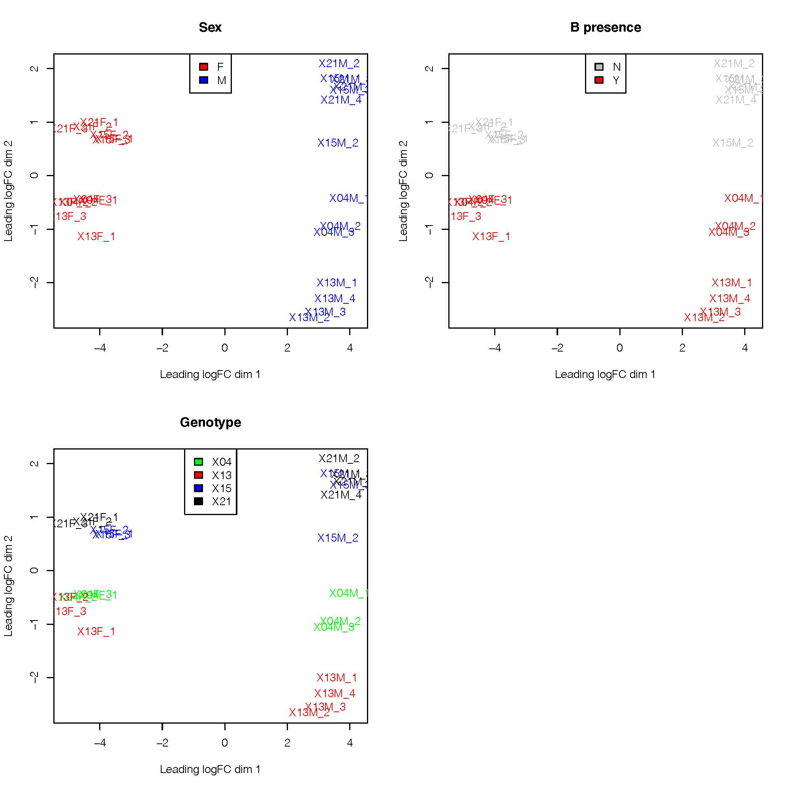
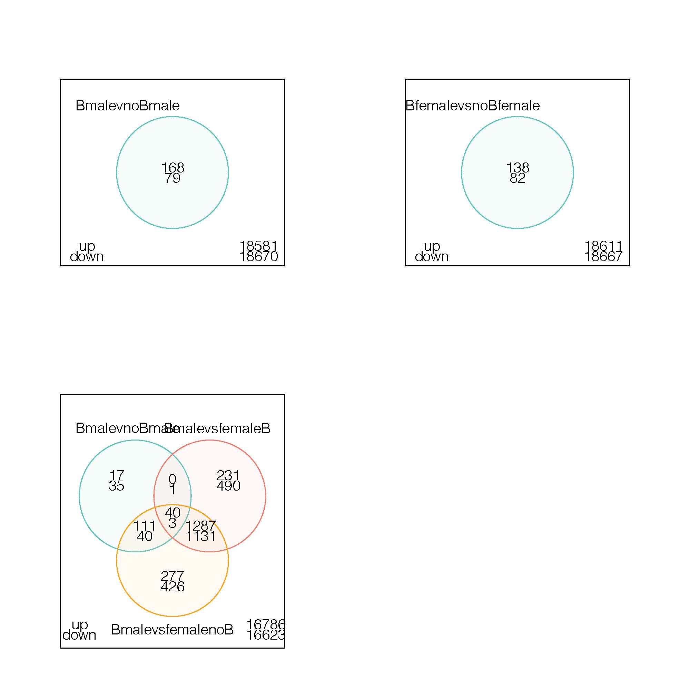
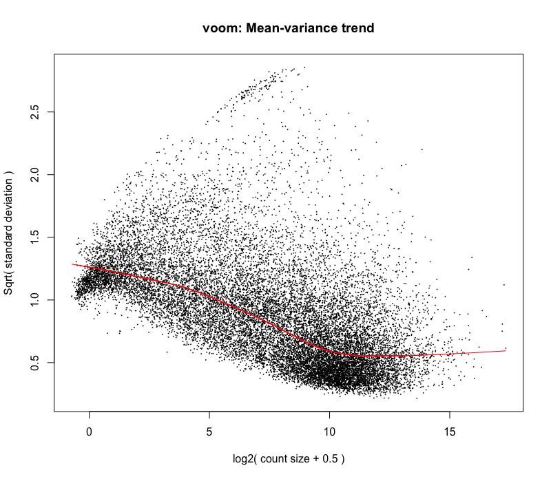
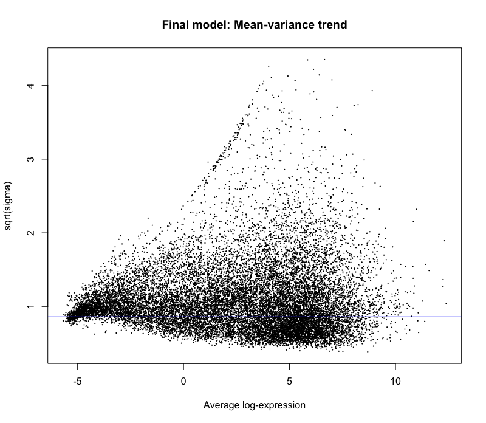

# Estimating expression

For transcriptome assembly and analysis (not used in the manuscript in the end), look at older commits (before 15.04.2023)

# I. PREPARING READS

## Trimming reads

```
	# fastp version 0.20.0 (conda env afilia)
	fastp -i 13F_1_1.fastq.gz -I 13F_1_2.fastq.gz -o 13F_1.trimmed_1.fastq.gz -O 13F_1.trimmed_2.fastq.gz --cut_by_quality5 --cut_by_quality3 --cut_window_size 4 --cut_mean_quality 20 --detect_adapter_for_pe --trim_poly_g
	fastp -i 13F_2_1.fastq.gz -I 13F_2_2.fastq.gz -o 13F_2.trimmed_1.fastq.gz -O 13F_2.trimmed_2.fastq.gz --cut_by_quality5 --cut_by_quality3 --cut_window_size 4 --cut_mean_quality 20 --detect_adapter_for_pe 	--trim_poly_g
	fastp -i 13F_3_1.fastq.gz -I 13F_3_2.fastq.gz -o 13F_3.trimmed_1.fastq.gz -O 13F_3.trimmed_2.fastq.gz --cut_by_quality5 --cut_by_quality3 --cut_window_size 4 --cut_mean_quality 20 --detect_adapter_for_pe 	--trim_poly_g
	fastp -i 13M_1_1.fastq.gz -I 13M_1_2.fastq.gz -o 13M_1.trimmed_1.fastq.gz -O 13M_1.trimmed_2.fastq.gz --cut_by_quality5 --cut_by_quality3 --cut_window_size 4 --cut_mean_quality 20 --detect_adapter_for_pe 	--trim_poly_g
	fastp -i 13M_2_1.fastq.gz -I 13M_2_2.fastq.gz -o 13M_2.trimmed_1.fastq.gz -O 13M_2.trimmed_2.fastq.gz --cut_by_quality5 --cut_by_quality3 --cut_window_size 4 --cut_mean_quality 20 --detect_adapter_for_pe 	--trim_poly_g
	fastp -i 13M_3_1.fastq.gz -I 13M_3_2.fastq.gz -o 13M_3.trimmed_1.fastq.gz -O 13M_3.trimmed_2.fastq.gz --cut_by_quality5 --cut_by_quality3 --cut_window_size 4 --cut_mean_quality 20 --detect_adapter_for_pe 	--trim_poly_g
	fastp -i 13M_4_1.fastq.gz -I 13M_4_2.fastq.gz -o 13M_4.trimmed_1.fastq.gz -O 13M_4.trimmed_2.fastq.gz --cut_by_quality5 --cut_by_quality3 --cut_window_size 4 --cut_mean_quality 20 --detect_adapter_for_pe 	--trim_poly_g
	fastp -i 15F_1_1.fastq.gz -I 15F_1_2.fastq.gz -o 15F_1.trimmed_1.fastq.gz -O 15F_1.trimmed_2.fastq.gz --cut_by_quality5 --cut_by_quality3 --cut_window_size 4 --cut_mean_quality 20 --detect_adapter_for_pe 	--trim_poly_g
	fastp -i 15F_2_1.fastq.gz -I 15F_2_2.fastq.gz -o 15F_2.trimmed_1.fastq.gz -O 15F_2.trimmed_2.fastq.gz --cut_by_quality5 --cut_by_quality3 --cut_window_size 4 --cut_mean_quality 20 --detect_adapter_for_pe 	--trim_poly_g
	fastp -i 15F_3_1.fastq.gz -I 15F_3_2.fastq.gz -o 15F_3.trimmed_1.fastq.gz -O 15F_3.trimmed_2.fastq.gz --cut_by_quality5 --cut_by_quality3 --cut_window_size 4 --cut_mean_quality 20 --detect_adapter_for_pe 	--trim_poly_g
	fastp -i 15M_1_1.fastq.gz -I 15M_1_2.fastq.gz -o 15M_1.trimmed_1.fastq.gz -O 15M_1.trimmed_2.fastq.gz --cut_by_quality5 --cut_by_quality3 --cut_window_size 4 --cut_mean_quality 20 --detect_adapter_for_pe 	--trim_poly_g
	fastp -i 15M_2_1.fastq.gz -I 15M_2_2.fastq.gz -o 15M_2.trimmed_1.fastq.gz -O 15M_2.trimmed_2.fastq.gz --cut_by_quality5 --cut_by_quality3 --cut_window_size 4 --cut_mean_quality 20 --detect_adapter_for_pe 	--trim_poly_g
	fastp -i 15M_3_1.fastq.gz -I 15M_3_2.fastq.gz -o 15M_3.trimmed_1.fastq.gz -O 15M_3.trimmed_2.fastq.gz --cut_by_quality5 --cut_by_quality3 --cut_window_size 4 --cut_mean_quality 20 --detect_adapter_for_pe 	--trim_poly_g
	fastp -i 21F_1_1.fastq.gz -I 21F_1_2.fastq.gz -o 21F_1.trimmed_1.fastq.gz -O 21F_1.trimmed_2.fastq.gz --cut_by_quality5 --cut_by_quality3 --cut_window_size 4 --cut_mean_quality 20 --detect_adapter_for_pe 	--trim_poly_g
	fastp -i 21F_2_1.fastq.gz -I 21F_2_2.fastq.gz -o 21F_2.trimmed_1.fastq.gz -O 21F_2.trimmed_2.fastq.gz --cut_by_quality5 --cut_by_quality3 --cut_window_size 4 --cut_mean_quality 20 --detect_adapter_for_pe 	--trim_poly_g
	fastp -i 21F_3_1.fastq.gz -I 21F_3_2.fastq.gz -o 21F_3.trimmed_1.fastq.gz -O 21F_3.trimmed_2.fastq.gz --cut_by_quality5 --cut_by_quality3 --cut_window_size 4 --cut_mean_quality 20 --detect_adapter_for_pe 	--trim_poly_g
	fastp -i 21M_1_1.fastq.gz -I 21M_1_2.fastq.gz -o 21M_1.trimmed_1.fastq.gz -O 21M_1.trimmed_2.fastq.gz --cut_by_quality5 --cut_by_quality3 --cut_window_size 4 --cut_mean_quality 20 --detect_adapter_for_pe 	--trim_poly_g
	fastp -i 21M_2_1.fastq.gz -I 21M_2_2.fastq.gz -o 21M_2.trimmed_1.fastq.gz -O 21M_2.trimmed_2.fastq.gz --cut_by_quality5 --cut_by_quality3 --cut_window_size 4 --cut_mean_quality 20 --detect_adapter_for_pe 	--trim_poly_g
	fastp -i 21M_3_1.fastq.gz -I 21M_3_2.fastq.gz -o 21M_3.trimmed_1.fastq.gz -O 21M_3.trimmed_2.fastq.gz --cut_by_quality5 --cut_by_quality3 --cut_window_size 4 --cut_mean_quality 20 --detect_adapter_for_pe 	--trim_poly_g
	fastp -i 21M_4_1.fastq.gz -I 21M_4_2.fastq.gz -o 21M_4.trimmed_1.fastq.gz -O 21M_4.trimmed_2.fastq.gz --cut_by_quality5 --cut_by_quality3 --cut_window_size 4 --cut_mean_quality 20 --detect_adapter_for_pe 	--trim_poly_g
	fastp -i 04F_1_1.fastq.gz -I 04F_1_2.fastq.gz -o 04F_1.trimmed_1.fastq.gz -O 04F_1.trimmed_2.fastq.gz --cut_by_quality5 --cut_by_quality3 --cut_window_size 4 --cut_mean_quality 20 --detect_adapter_for_pe 	--trim_poly_g
	fastp -i 04F_2_1.fastq.gz -I 04F_2_2.fastq.gz -o 04F_2.trimmed_1.fastq.gz -O 04F_2.trimmed_2.fastq.gz --cut_by_quality5 --cut_by_quality3 --cut_window_size 4 --cut_mean_quality 20 --detect_adapter_for_pe 	--trim_poly_g
	fastp -i 04F_3_1.fastq.gz -I 04F_3_2.fastq.gz -o 04F_3.trimmed_1.fastq.gz -O 04F_3.trimmed_2.fastq.gz --cut_by_quality5 --cut_by_quality3 --cut_window_size 4 --cut_mean_quality 20 --detect_adapter_for_pe 	--trim_poly_g
	fastp -i 04M_1_1.fastq.gz -I 04M_1_2.fastq.gz -o 04M_1.trimmed_1.fastq.gz -O 04M_1.trimmed_2.fastq.gz --cut_by_quality5 --cut_by_quality3 --cut_window_size 4 --cut_mean_quality 20 --detect_adapter_for_pe 	--trim_poly_g
	fastp -i 04M_2_1.fastq.gz -I 04M_2_2.fastq.gz -o 04M_2.trimmed_1.fastq.gz -O 04M_2.trimmed_2.fastq.gz --cut_by_quality5 --cut_by_quality3 --cut_window_size 4 --cut_mean_quality 20 --detect_adapter_for_pe 	--trim_poly_g
	fastp -i 04M_3_1.fastq.gz -I 04M_3_2.fastq.gz -o 04M_3.trimmed_1.fastq.gz -O 04M_3.trimmed_2.fastq.gz --cut_by_quality5 --cut_by_quality3 --cut_window_size 4 --cut_mean_quality 20 --detect_adapter_for_pe 	--trim_poly_g
```

# II. GENOME-BASED DIFFERENTIAL EXPRESSION ANALYSIS

Let's do the differential expression analysis working with the v0 freeze. The usual rsem (v1.3.3)/ebseq pipeline will do. Everything is installed in the afilia_trinity env.

### 1. Prepare reference

```
	rsem-prepare-reference  --gff3 /data/ross/mealybugs/analyses/B_viburni_2020/1_pacbio_assembly/8_freeze_v0/p.viburni.freeze.v0.braker.gff3 --star -p 24 /data/ross/mealybugs/analyses/B_viburni_2020/1_pacbio_assembly/8_freeze_v0/p.viburni.freeze.v0.fa p.viburni.freeze.v0.
```

### 2. Infer experiment to confirm strandedness

We have TruSeq stranded mRNA-seq, so the orientation must be "reverse". However, it's good to do this as a sanity check:

```
	infer_experiment.py -i 04F_1Aligned.sortedByCoord.out.bam -r ../8_freeze_v0/p.viburni.freeze.v0.braker.gff3.bed
```

### 3. Estimate expression

```
	rsem-calculate-expression -p 32 --paired-end --star-gzipped-read-file --strandedness reverse --calc-ci --calc-pme --star --no-bam-output 04F_1.trimmed_1.fastq.gz 04F_1.trimmed_2.fastq.gz STAR_ref/p.viburni.freeze.v0 results/04F_1
	rsem-calculate-expression -p 32 --paired-end --star-gzipped-read-file --strandedness reverse --calc-ci --calc-pme --star --no-bam-output 04F_2.trimmed_1.fastq.gz 04F_2.trimmed_2.fastq.gz STAR_ref/p.viburni.freeze.v0 results/04F_2
	rsem-calculate-expression -p 32 --paired-end --star-gzipped-read-file --strandedness reverse --calc-ci --calc-pme --star --no-bam-output 04F_3.trimmed_1.fastq.gz 04F_3.trimmed_2.fastq.gz STAR_ref/p.viburni.freeze.v0 results/04F_3
	rsem-calculate-expression -p 32 --paired-end --star-gzipped-read-file --strandedness reverse --calc-ci --calc-pme --star --no-bam-output 04M_1.trimmed_1.fastq.gz 04M_1.trimmed_2.fastq.gz STAR_ref/p.viburni.freeze.v0 results/04M_1
	rsem-calculate-expression -p 32 --paired-end --star-gzipped-read-file --strandedness reverse --calc-ci --calc-pme --star --no-bam-output 04M_2.trimmed_1.fastq.gz 04M_2.trimmed_2.fastq.gz STAR_ref/p.viburni.freeze.v0 results/04M_2
	rsem-calculate-expression -p 32 --paired-end --star-gzipped-read-file --strandedness reverse --calc-ci --calc-pme --star --no-bam-output 04M_3.trimmed_1.fastq.gz 04M_3.trimmed_2.fastq.gz STAR_ref/p.viburni.freeze.v0 results/04M_3
	rsem-calculate-expression -p 32 --paired-end --star-gzipped-read-file --strandedness reverse --calc-ci --calc-pme --star --no-bam-output 13F_1.trimmed_1.fastq.gz 13F_1.trimmed_2.fastq.gz STAR_ref/p.viburni.freeze.v0 results/13F_1
	rsem-calculate-expression -p 32 --paired-end --star-gzipped-read-file --strandedness reverse --calc-ci --calc-pme --star --no-bam-output 13F_2.trimmed_1.fastq.gz 13F_2.trimmed_2.fastq.gz STAR_ref/p.viburni.freeze.v0 results/13F_2
	rsem-calculate-expression -p 32 --paired-end --star-gzipped-read-file --strandedness reverse --calc-ci --calc-pme --star --no-bam-output 13F_3.trimmed_1.fastq.gz 13F_3.trimmed_2.fastq.gz STAR_ref/p.viburni.freeze.v0 results/13F_3
	rsem-calculate-expression -p 32 --paired-end --star-gzipped-read-file --strandedness reverse --calc-ci --calc-pme --star --no-bam-output 13M_1.trimmed_1.fastq.gz 13M_1.trimmed_2.fastq.gz STAR_ref/p.viburni.freeze.v0 results/13M_1
	rsem-calculate-expression -p 32 --paired-end --star-gzipped-read-file --strandedness reverse --calc-ci --calc-pme --star --no-bam-output 13M_2.trimmed_1.fastq.gz 13M_2.trimmed_2.fastq.gz STAR_ref/p.viburni.freeze.v0 results/13M_2
	rsem-calculate-expression -p 32 --paired-end --star-gzipped-read-file --strandedness reverse --calc-ci --calc-pme --star --no-bam-output 13M_3.trimmed_1.fastq.gz 13M_3.trimmed_2.fastq.gz STAR_ref/p.viburni.freeze.v0 results/13M_3
	rsem-calculate-expression -p 32 --paired-end --star-gzipped-read-file --strandedness reverse --calc-ci --calc-pme --star --no-bam-output 13M_4.trimmed_1.fastq.gz 13M_4.trimmed_2.fastq.gz STAR_ref/p.viburni.freeze.v0 results/13M_4
	rsem-calculate-expression -p 32 --paired-end --star-gzipped-read-file --strandedness reverse --calc-ci --calc-pme --star --no-bam-output 15F_1.trimmed_1.fastq.gz 15F_1.trimmed_2.fastq.gz STAR_ref/p.viburni.freeze.v0 results/15F_1
	rsem-calculate-expression -p 32 --paired-end --star-gzipped-read-file --strandedness reverse --calc-ci --calc-pme --star --no-bam-output 15F_2.trimmed_1.fastq.gz 15F_2.trimmed_2.fastq.gz STAR_ref/p.viburni.freeze.v0 results/15F_2
	rsem-calculate-expression -p 32 --paired-end --star-gzipped-read-file --strandedness reverse --calc-ci --calc-pme --star --no-bam-output 15F_3.trimmed_1.fastq.gz 15F_3.trimmed_2.fastq.gz STAR_ref/p.viburni.freeze.v0 results/15F_3
	rsem-calculate-expression -p 32 --paired-end --star-gzipped-read-file --strandedness reverse --calc-ci --calc-pme --star --no-bam-output 15M_1.trimmed_1.fastq.gz 15M_1.trimmed_2.fastq.gz STAR_ref/p.viburni.freeze.v0 results/15M_1
	rsem-calculate-expression -p 32 --paired-end --star-gzipped-read-file --strandedness reverse --calc-ci --calc-pme --star --no-bam-output 15M_2.trimmed_1.fastq.gz 15M_2.trimmed_2.fastq.gz STAR_ref/p.viburni.freeze.v0 results/15M_2
	rsem-calculate-expression -p 32 --paired-end --star-gzipped-read-file --strandedness reverse --calc-ci --calc-pme --star --no-bam-output 15M_3.trimmed_1.fastq.gz 15M_3.trimmed_2.fastq.gz STAR_ref/p.viburni.freeze.v0 results/15M_3
	rsem-calculate-expression -p 32 --paired-end --star-gzipped-read-file --strandedness reverse --calc-ci --calc-pme --star --no-bam-output 21F_1.trimmed_1.fastq.gz 21F_1.trimmed_2.fastq.gz STAR_ref/p.viburni.freeze.v0 results/21F_1
	rsem-calculate-expression -p 32 --paired-end --star-gzipped-read-file --strandedness reverse --calc-ci --calc-pme --star --no-bam-output 21F_2.trimmed_1.fastq.gz 21F_2.trimmed_2.fastq.gz STAR_ref/p.viburni.freeze.v0 results/21F_2
	rsem-calculate-expression -p 32 --paired-end --star-gzipped-read-file --strandedness reverse --calc-ci --calc-pme --star --no-bam-output 21F_3.trimmed_1.fastq.gz 21F_3.trimmed_2.fastq.gz STAR_ref/p.viburni.freeze.v0 results/21F_3
	rsem-calculate-expression -p 32 --paired-end --star-gzipped-read-file --strandedness reverse --calc-ci --calc-pme --star --no-bam-output 21M_1.trimmed_1.fastq.gz 21M_1.trimmed_2.fastq.gz STAR_ref/p.viburni.freeze.v0 results/21M_1
	rsem-calculate-expression -p 32 --paired-end --star-gzipped-read-file --strandedness reverse --calc-ci --calc-pme --star --no-bam-output 21M_2.trimmed_1.fastq.gz 21M_2.trimmed_2.fastq.gz STAR_ref/p.viburni.freeze.v0 results/21M_2
	rsem-calculate-expression -p 32 --paired-end --star-gzipped-read-file --strandedness reverse --calc-ci --calc-pme --star --no-bam-output 21M_3.trimmed_1.fastq.gz 21M_3.trimmed_2.fastq.gz STAR_ref/p.viburni.freeze.v0 results/21M_3
	rsem-calculate-expression -p 32 --paired-end --star-gzipped-read-file --strandedness reverse --calc-ci --calc-pme --star --no-bam-output 21M_4.trimmed_1.fastq.gz 21M_4.trimmed_2.fastq.gz STAR_ref/p.viburni.freeze.v0 results/21M_4

  cd results
	rsem-generate-data-matrix 04F_1.genes.results 04F_2.genes.results 04F_3.genes.results 04M_1.genes.results 04M_2.genes.results 04M_3.genes.results 13F_1.genes.results 13F_2.genes.results 13F_3.genes.results 13M_1.genes.results 13M_2.genes.results 13M_3.genes.results 13M_4.genes.results 15F_1.genes.results 15F_2.genes.results 15F_3.genes.results 15M_1.genes.results 15M_2.genes.results 15M_3.genes.results 21F_1.genes.results 21F_2.genes.results 21F_3.genes.results 21M_1.genes.results 21M_2.genes.results 21M_3.genes.results 21M_4.genes.results  >RSEM_digi.counts.matrix
```

### 4. Calculate differentially expressed genes (fdr<0.05)

the matrix generated from RSEM uses expected counts and looks like this:

```
"04F_1.genes.results"	"04F_2.genes.results"	"04F_3.genes.results"	"04M_1.genes.results"	"04M_2.genes.results"	"04M_3.genes.results"	"13F_1.genes.results"	"13F_2.genes.results"	"13F_3.genes.results"	"13M_1.genes.results"	"13M_2.genes.results"	"13M_3.genes.results"	"13M_4.genes.results"	"15F_1.genes.results"	"15F_2.genes.results"	"15F_3.genes.results"	"15M_1.genes.results"	"15M_2.genes.results"	"15M_3.genes.results"	"21F_1.genes.results"	"21F_2.genes.results"	"21F_3.genes.results"	"21M_1.genes.results"	"21M_2.genes.results"	"21M_3.genes.results"	"21M_4.genes.results"
"g1"	0.00	19.00	2.66	0.00	0.00	0.00	1.72	0.00	6.17	0.00	0.00	5.41	0.00	0.00	4.00	3.34	0.00	0.00	0.00	1.24	9.00	3.33	0.00	0.00	0.00	0.00
"g10"	0.00	0.00	0.00	0.00	0.00	0.00	0.00	0.00	0.00	0.00	0.00	0.00	0.00	0.00	0.00	0.00	0.00	0.00	0.00	0.00	0.00	0.00	0.00	0.00	0.00	0.00
"g100"	220.35	243.72	175.32	318.32	220.37	187.48	90.45	231.73	164.25	173.39	260.54	214.72	205.74	104.47	93.12	219.31	149.21	135.14	207.42	59.34	94.38	84.40	105.56	93.56	93.71	93.07
"g1000"	1.00	0.00	2.00	2.00	1.00	4.00	0.00	0.00	5.00	2.00	4.00	3.00	4.00	3.00	1.00	0.00	4.00	3.00	2.00	1.00	2.00	1.00	8.00	6.00	5.00	3.00
"g10000"	1247.00	1572.00	1242.00	314.00	166.00	137.00	1577.00	1681.00	1633.00	457.00	1077.00	340.00	445.00	1062.00	711.00	1883.00	454.00	300.00	331.00	1443.00	1293.00	1472.00	415.00	542.00	341.00	365.00
"g10001"	3.00	0.00	1.00	1.00	5.00	0.00	5.00	2.00	9.00	0.00	3.00	9.00	2.00	2.00	1.00	0.00	7.00	1.00	0.00	0.00	3.00	3.00	4.00	3.00	3.00	0.00

```

From here, I used the following files that I ran in RStudio (see R script for packages here [EdgeR-PviburniB_GENE.Rmd](add_link) ):

- /data/ross/mealybugs/analyses/B_viburni_2020/3_RNA_seq/4_genome_based/freeze_v0/p.viburni.freeze.v0.braker.interproscan.tsv
- /data/ross/mealybugs/analyses/B_viburni_2020/3_RNA_seq/4_genome_based/freeze_v0/p.viburni.freeze.v0.braker.transcripts.to.genes.txt

- /data/ross/mealybugs/analyses/B_viburni_2020/3_RNA_seq/4_genome_based/RSEM_results/RSEM_digi.counts.matrix: gene level matrix count
- [sampleinfoPviburniB.csv](https://github.com/RossLab/B_viburni/blob/master/R_scripts/sampleinfoPviburniB.csv): file containing grouping


Steps:
1. prepared annotation dataframe and added the gene annotation after the analysis. I first tried to add it to the EdgeR object containing count matrix and sample names but something goes wrong during the model fit and the gene id don't match after.

The annotation dataframe looks like this

```{r}
        tid    gid                               V2  V3   V4      V5                   V6  V7
1     g1.t1     g1                             <NA>  NA <NA>    <NA>                 <NA>  NA
2    g10.t1    g10                             <NA>  NA <NA>    <NA>                 <NA>  NA
3   g100.t1   g100                             <NA>  NA <NA>    <NA>                 <NA>  NA
4  g1000.t1  g1000                             <NA>  NA <NA>    <NA>                 <NA>  NA
5 g10000.t1 g10000 0890440f5444913ec3431ae8f284a864 961 Pfam PF09820 Predicted AAA-ATPase 498
6 g10000.t1 g10000 0890440f5444913ec3431ae8f284a864 961 Pfam PF09820 Predicted AAA-ATPase  34
   V8      V9  V10        V11       V12                    V13  V14
1  NA    <NA>   NA       <NA>      <NA>                   <NA> <NA>
2  NA    <NA>   NA       <NA>      <NA>                   <NA> <NA>
3  NA    <NA>   NA       <NA>      <NA>                   <NA> <NA>
4  NA    <NA>   NA       <NA>      <NA>                   <NA> <NA>
5 820 1.8E-22 TRUE 27-07-2020 IPR018631 AAA-ATPase-like domain     
6 348 2.0E-22 TRUE 27-07-2020 IPR018631 AAA-ATPase-like domain  
```


2. Prepared the count matrix from rsem RSEM_digi.counts.matrix to create an EdgeR object using the function DGEList and called the object x. It looks like this:

```{r}
An object of class "DGEList"
$counts
       X04F_1 X04F_2 X04F_3 X04M_1 X04M_2 X04M_3 X13F_1 X13F_2 X13F_3 X13M_1 X13M_2 X13M_3 X13M_4 X15F_1 X15F_2 X15F_3 X15M_1
g1          0     19      3      0      0      0      2      0      6      0      0      5      0      0      4      3      0
g10         0      0      0      0      0      0      0      0      0      0      0      0      0      0      0      0      0
g100      220    244    175    318    220    187     90    232    164    173    261    215    206    104     93    219    149
g1000       1      0      2      2      1      4      0      0      5      2      4      3      4      3      1      0      4
g10000   1247   1572   1242    314    166    137   1577   1681   1633    457   1077    340    445   1062    711   1883    454
g10001      3      0      1      1      5      0      5      2      9      0      3      9      2      2      1      0      7
       X15M_2 X15M_3 X21F_1 X21F_2 X21F_3 X21M_1 X21M_2 X21M_3 X21M_4
g1          0      0      1      9      3      0      0      0      0
g10         0      0      0      0      0      0      0      0      0
g100      135    207     59     94     84    106     94     94     93
g1000       3      2      1      2      1      8      6      5      3
g10000    300    331   1443   1293   1472    415    542    341    365
g10001      1      0      0      3      3      4      3      3      0

$samples
       group lib.size norm.factors
X04F_1  X04F 37142198            1
X04F_2  X04F 32411693            1
X04F_3  X04F 33852367            1
X04M_1  X04M 29580152            1
X04M_2  X04M 28103293            1
21 more rows ...

$genes
        genes
g1         g1
g10       g10
g100     g100
g1000   g1000
g10000 g10000
g10001 g10001


```

3. Filtered out low counts

Filtering options
```{r}
keep.exprs.sample <- filterByExpr(x, group=rownames(x$samples),min.count=5, min.prop = 20)

```

Before filtering, we had 23629 gene counts, after filtering 18749 gene counts are left.

3. Distribution normalization


4. MDS plots



Based on the groupings, male and female expression profiles are definitely different regardless of genotype of B presence. Additionally, if we group by B and no B, we see separation of groups by sex and B presence. Finally, if we group by genotype, 15 and 21 are together, which seems logical since they come from the same original population RBGE25. Female samples of 04 and 13 are together but separated when we look at males. This could indicate that in 04 and 13, we have different numbers of B and that this difference in B number only affects expression profile of males.

5. Hierachical clustering heatmap of 1000 most variable gene expression


6. Model design

First, I defined groups that I want to compare. The first one is carrying out DE analysis using sex and B presence or absence only, that means that genotype 04 and 13 are put together (Group1). In group 2, I want to compare DE with the number of Bs, so if we assume that 04 has 2B, 04 and 13 are then separated. This scenario might be more tricky since we are not 100% sure about the numbers of B in these samples but also, we don't know if that would matter. If having different numbers of B changes the expression profiles of the samples, then this would be taken into account.


```{r}
group1=c("FB","FB","FB","MB","MB","MB","FB","FB","FB","MB","MB","MB","MB","FnoB","FnoB","FnoB","MnoB","MnoB","MnoB","FnoB","FnoB","FnoB","MnoB","MnoB","MnoB","MnoB")

design1 <- model.matrix(~0 + group1)

```

7. limma fit and contrast matrix

```{r}
cont.matrix1 <- makeContrasts(BmalevnoBmale = group1MB - group1MnoB, BmalevsfemaleB = group1MB - group1FB, BmalevsfemalenoB = group1MB - group1FnoB,BfemalevsnoBfemale = group1FB - group1FnoB, noBmalevsnoBfemale = group1MnoB - group1FnoB, levels=design1)

```

8. Mean variance trend plots


9. MD plots for each comparison defined in the contrast matrix


10. Differentially expressed genes per 2-group comparison

FDR <0.05 and log2FC > 1


|        | malevnoBmale | BmalevsfemaleB | BmalevsfemalenoB | BfemalevsnoBfemale | noBmalevsnoBfemale |
|--------|--------------|----------------|------------------|--------------------|--------------------|
| Down   | 79           | 1625           | 1600             | 82                 | 2168               |
| NotSig | 18502        | 15566          | 15434            | 18529              | 14959              |
| Up     | 168          | 1558           | 1715             | 138                | 1622               |

All DE genes lists were annotated and exported as csv files in misc/


10. DE only in male with B

To obtain the transcript only expressed in male with B, I selected all the differentially expressed genes that are found in all the three comparisons.

```{r}
tfit <- treat(fit.cont1, lfc=1)
dt <- decideTests(tfit)
summary(dt)
de.common <- which(dt[,1]!=0 & dt[,2]!=0 &dt[,3]!=0)
length(de.common)

```
There are 53 genes left



Not sure why the Venn diagram show 43 DE genes that are B male.

List of annotated Bmale only transcripts are in misc/rsem_gene__Bmale_annot2.csv

---

Andrés taking over here: this looks very promising and I have replicated the analysis up to here. Above Isabelle has extracted the genes that *are differentially expressed* between B males and the other three groups, but not necessarily overexpressed or only expressed in B males. If we do:

	de.over.B.males <- which(dt[,1]==1 & dt[,2]==1 &dt[,3]==1)
	de.under.B.males <- which(dt[,1]==-1 & dt[,2]==-1 &dt[,3]==-1)
	length(de.over.B.males) # B genes overexpressed in B males compared to the rest of the groups (40)
	length(de.under.B.males) # B genes underexpressed in B males compared to the rest of the groups (3)

This makes sense now -- these are the 43 genes that Isabelle got in the 3-way intersection.

Also, there is a problem with extracting differentially expressed genes. Inspecting the files Isabelle produced, things don't add out.  For example, if we do:

```
	maleB.noB<-topTable(fit.cont1, coef=1, n = summary(dt)[1]+summary(dt)[3])
```

This gives us a list of 247 genes (as given by `n = summary(dt)[1]+summary(dt)[3])`) that should correspond to the 168 overexpressed genes + 79 underexpressed in B males with FDR < 0.05 and abs(logFC) > 1. However, by doing the above we get a list of differentially expressed genes ordered by increasing FDR (up to 0.0002). Some of these genes, however, have logFC < 1, and only 155 have positive fold changes (instead of the expected 168). So the line of code above will just give us the top 168 DE genes based on FDR only.

What we have to do is use the topTreat function with the treat object:

	maleB.noB<-topTreat(tfit, coef=1,number = summary(dt)[1]+summary(dt)[3])

### 5. Differentially expressed isoforms (fdr<0.05)

Not used in manuscript; to check this analysis look at any commit before 15.4.2023.

# DEGs B vs non B lines regardless of sex

## Using edgeR script

To obtain the DEGs in B compared to non B lines, the same data prep was made and a new Design was created (design2 in R script)
```
group2=c("B","B","B","B","B","B","B","B","B","B","B","B","B","noB","noB","noB","noB","noB","noB","noB","noB","noB","noB","noB","noB","noB")
design2 <- model.matrix(~0 + group2)
```

*Voom plot before contrast matrix*




*Contrast matrix*
```
cont.matrix2 <- makeContrasts(BnoB = group2B - group2noB, levels= design2)
```

*Voom plot after model fit*



* Venn Diagram *


There were 178 overexpressed and 70 underexpressed genes if we compared presence or absence of B, regardless of sex

The list of overexpressed genes was exported to output/
