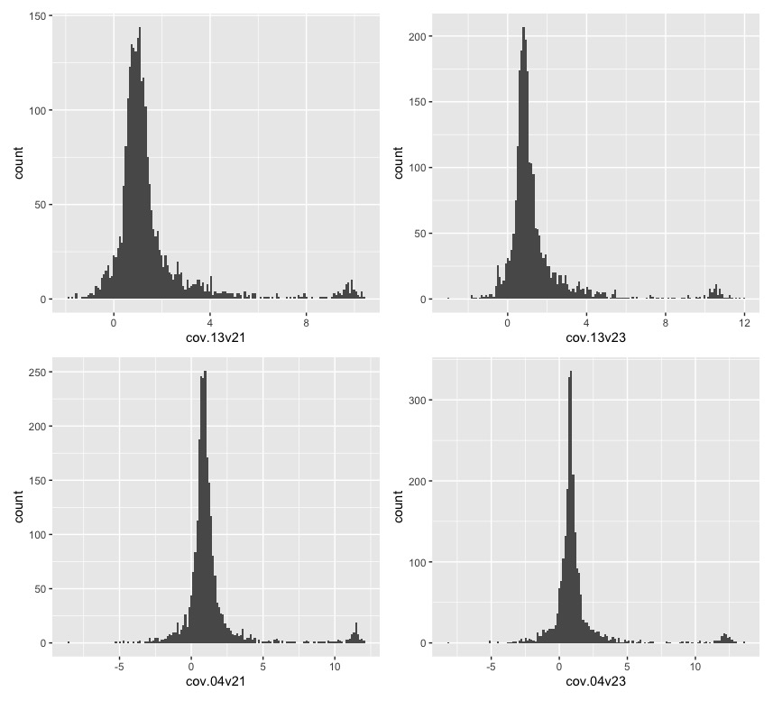
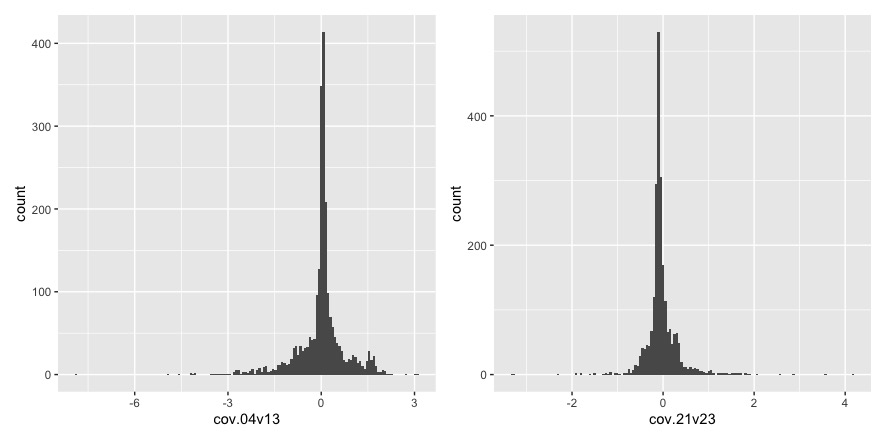
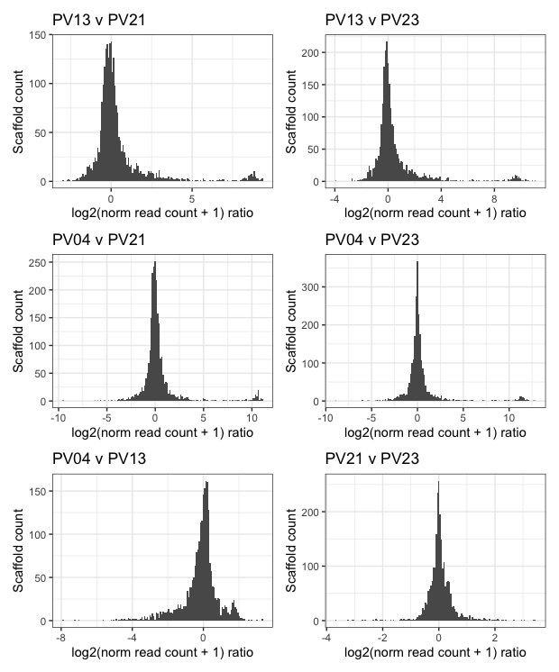
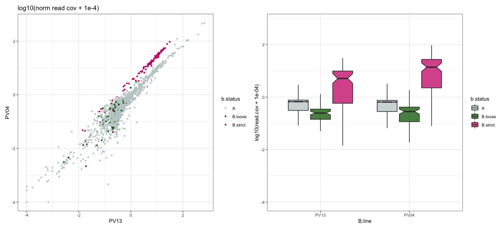
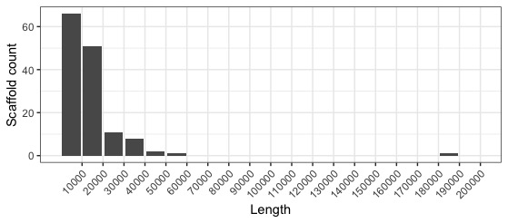
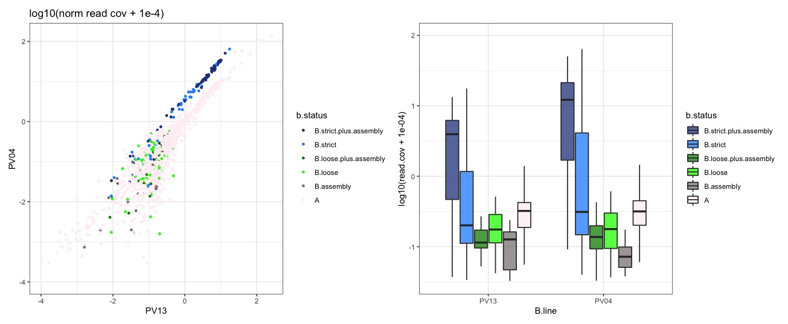
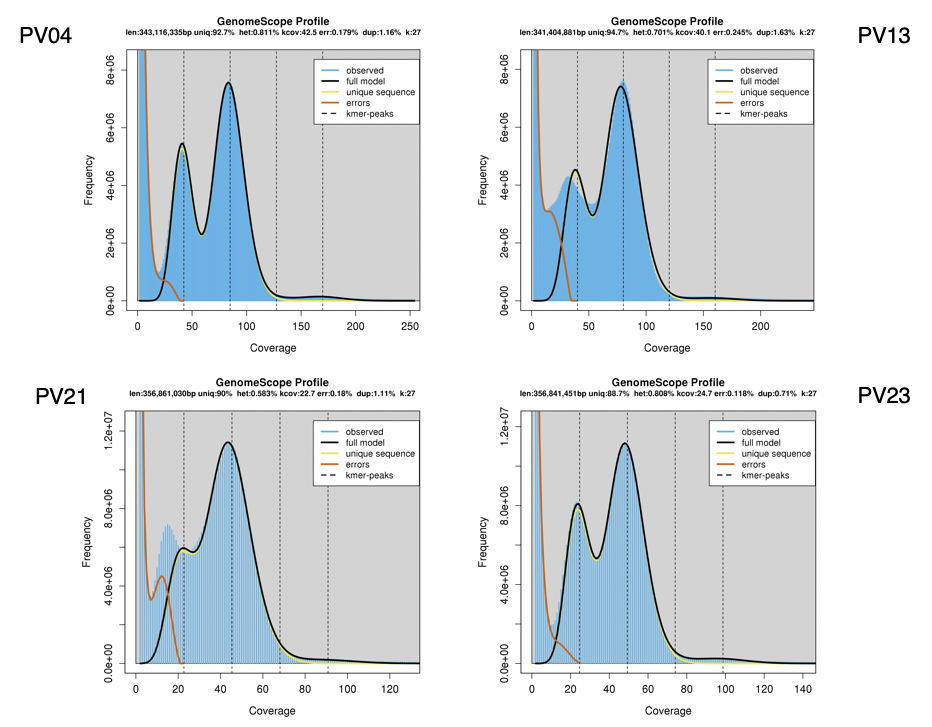
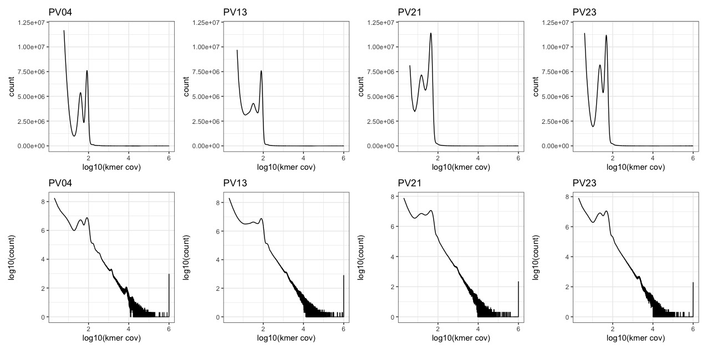
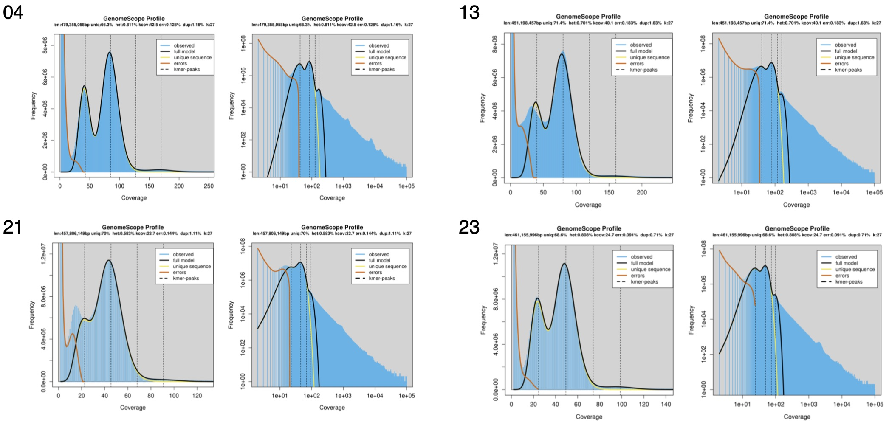
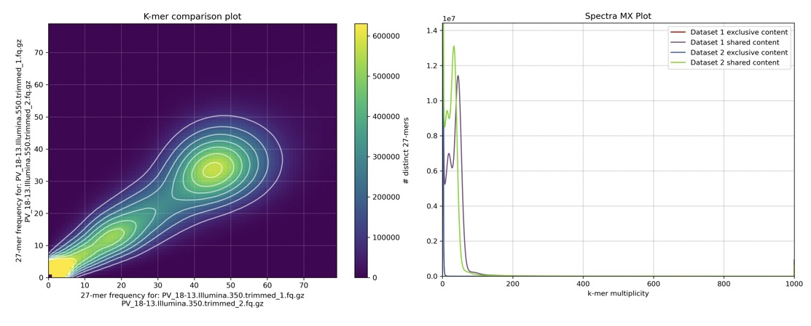

# Coverage analysis

	# working directory	
	/data/ross/mealybugs/analyses/B_viburni_andres/2_short_read_DNA_seq/0_reads
	qlogin -pe smp 24 -N busco
    /ceph/software/utilities/sge/qlogin -pe smp 1 -N QLOGIN

## 1. Raw reads

	# Novaseq reads (/data/ross/mealybugs/analyses/B_viburni_andres/2_short_read_DNA_seq/0_reads)
	180608_A00291_0042_BH3CC3DRXX_2_11372RL0001L01_1.fastq.gz -> /data/ross/mealybugs/raw/transfer.genomics.ed.ac.uk/11372_Ross_Laura/raw_data/all_reads/18_13_1B_550/180608_A00291_0042_BH3CC3DRXX_2_11372RL0001L01_1.fastq.gz
	180608_A00291_0042_BH3CC3DRXX_2_11372RL0001L01_2.fastq.gz -> /data/ross/mealybugs/raw/transfer.genomics.ed.ac.uk/11372_Ross_Laura/raw_data/all_reads/18_13_1B_550/180608_A00291_0042_BH3CC3DRXX_2_11372RL0001L01_2.fastq.gz
	180608_A00291_0042_BH3CC3DRXX_2_11372RL0002L01_1.fastq.gz -> /data/ross/mealybugs/raw/transfer.genomics.ed.ac.uk/11372_Ross_Laura/raw_data/all_reads/18_13_1B_350/180608_A00291_0042_BH3CC3DRXX_2_11372RL0002L01_1.fastq.gz
	180608_A00291_0042_BH3CC3DRXX_2_11372RL0002L01_2.fastq.gz -> /data/ross/mealybugs/raw/transfer.genomics.ed.ac.uk/11372_Ross_Laura/raw_data/all_reads/18_13_1B_350/180608_A00291_0042_BH3CC3DRXX_2_11372RL0002L01_2.fastq.gz
	180608_A00291_0042_BH3CC3DRXX_2_11372RL0002L01_1.fastq.gz -> /data/ross/mealybugs/raw/transfer.genomics.ed.ac.uk/11372_Ross_Laura/raw_data/all_reads/18_13_1B_350/180608_A00291_0042_BH3CC3DRXX_2_11372RL0002L01_1.fastq.gz
	180608_A00291_0042_BH3CC3DRXX_2_11372RL0002L01_2.fastq.gz -> /data/ross/mealybugs/raw/transfer.genomics.ed.ac.uk/11372_Ross_Laura/raw_data/all_reads/18_13_1B_350/180608_A00291_0042_BH3CC3DRXX_2_11372RL0002L01_2.fastq.gz
	pviburni.1821.0B.350.r1.fastq.gz -> /data/ross/mealybugs/raw/transfer.genomics.ed.ac.uk/11372_Ross_Laura/raw_data/data_by_date/20180618/all_reads/18_21_0B/180608_A00291_0042_BH3CC3DRXX_2_11372RL0004L01_1.fastq.gz
	pviburni.1821.0B.350.r2.fastq.gz -> /data/ross/mealybugs/raw/transfer.genomics.ed.ac.uk/11372_Ross_Laura/raw_data/data_by_date/20180618/all_reads/18_21_0B/180608_A00291_0042_BH3CC3DRXX_2_11372RL0004L01_2.fastq.gz
	pviburni.1823.0B.350.r1.fastq.gz -> /data/ross/mealybugs/raw/transfer.genomics.ed.ac.uk/11372_Ross_Laura/raw_data/data_by_date/20180618/all_reads/18_23_0B/180608_A00291_0042_BH3CC3DRXX_2_11372RL0005L01_1.fastq.gz
	pviburni.1823.0B.350.r2.fastq.gz -> /data/ross/mealybugs/raw/transfer.genomics.ed.ac.uk/11372_Ross_Laura/raw_data/data_by_date/20180618/all_reads/18_23_0B/180608_A00291_0042_BH3CC3DRXX_2_11372RL0005L01_2.fastq.gz
	pviburni.184.2B.350.r1.fastq.gz -> /data/ross/mealybugs/raw/transfer.genomics.ed.ac.uk/11372_Ross_Laura/raw_data/data_by_date/20180618/all_reads/18_4_2B/180608_A00291_0042_BH3CC3DRXX_2_11372RL0003L01_1.fastq.gz
	pviburni.184.2B.350.r2.fastq.gz -> /data/ross/mealybugs/raw/transfer.genomics.ed.ac.uk/11372_Ross_Laura/raw_data/data_by_date/20180618/all_reads/18_4_2B/180608_A00291_0042_BH3CC3DRXX_2_11372RL0003L01_2.fastq.gz

## 2. Trim with fastp

	# fastp version 0.20.0 (conda env afilia)
	fastp -i 180608_A00291_0042_BH3CC3DRXX_2_11372RL0001L01_1.fastq.gz -I 180608_A00291_0042_BH3CC3DRXX_2_11372RL0001L01_2.fastq.gz -o /scratch/afilia/PV_18-13.Illumina.550.trimmed_1.fq.gz -O /scratch/afilia/PV_18-13.Illumina.550.trimmed_2.fq.gz --cut_by_quality5 --cut_by_quality3 --cut_window_size 4 --cut_mean_quality 20 --detect_adapter_for_pe --trim_poly_g
	fastp -i 180608_A00291_0042_BH3CC3DRXX_2_11372RL0002L01_1.fastq.gz -I 180608_A00291_0042_BH3CC3DRXX_2_11372RL0002L01_2.fastq.gz -o /scratch/afilia/PV_18-13.Illumina.350.trimmed_1.fq.gz -O /scratch/afilia/PV_18-13.Illumina.350.trimmed_2.fq.gz --cut_by_quality5 --cut_by_quality3 --cut_window_size 4 --cut_mean_quality 20 --detect_adapter_for_pe --trim_poly_g
	fastp -i pviburni.1821.0B.350.r1.fastq.gz -I pviburni.1821.0B.350.r2.fastq.gz -o /scratch/afilia/PV_18-21.Illumina.350.trimmed_1.fq.gz -O /scratch/afilia/PV_18-21.Illumina.350.trimmed_2.fq.gz --cut_by_quality5 --cut_by_quality3 --cut_window_size 4 --cut_mean_quality 20 --detect_adapter_for_pe --trim_poly_g
	fastp -i pviburni.1823.0B.350.r1.fastq.gz -I pviburni.1823.0B.350.r2.fastq.gz -o /scratch/afilia/PV_18-23.Illumina.350.trimmed_1.fq.gz -O /scratch/afilia/PV_18-23.Illumina.350.trimmed_2.fq.gz --cut_by_quality5 --cut_by_quality3 --cut_window_size 4 --cut_mean_quality 20 --detect_adapter_for_pe --trim_poly_g
	fastp -i pviburni.184.2B.350.r1.fastq.gz -I pviburni.184.2B.350.r2.fastq.gz -o /scratch/afilia/PV_18-04.Illumina.350.trimmed_1.fq.gz -O /scratch/afilia/PV_18-04.Illumina.350.trimmed_2.fq.gz --cut_by_quality5 --cut_by_quality3 --cut_window_size 4 --cut_mean_quality 20 --detect_adapter_for_pe --trim_poly_g

Some basic QC (M sequences, average read length). 18-04 has twice as much data than the other samples (same as 18-13 if we pool data from the 350 and 550 libraries, which is probably the way to go)

| PV_18-04.Illumina.350.trimmed_1 | 204.97M | 147.2 |
| PV_18-04.Illumina.350.trimmed_2 | 204.97M | 147.1 |
| PV_18-13.Illumina.350.trimmed_1 | 104.48M | 147.2 |
| PV_18-13.Illumina.350.trimmed_2 | 104.48M | 147.2 |
| PV_18-13.Illumina.550.trimmed_1 | 81.16M  | 146.8 |
| PV_18-13.Illumina.550.trimmed_2 | 81.16M  | 146.7 |
| PV_18-21.Illumina.350.trimmed_1 | 101.60M | 147.5 |
| PV_18-21.Illumina.350.trimmed_2 | 101.60M | 147.4 |
| PV_18-23.Illumina.350.trimmed_1 | 108.02M | 147.6 |
| PV_18-23.Illumina.350.trimmed_2 | 108.02M | 147.6 |

Based on the assembly size (435.3Mb), we are looking at estimated coverages between 68-73X (B- lines) and 125-140X (B+ lines). That's good!

## 3. Initial mapping

	bwa index /data/ross/mealybugs/analyses/B_viburni_2020/1_pacbio_assembly/8_freeze_v0/p.viburni.freeze.v0.softmasked.fa
	bwa mem -M -t 32 /data/ross/mealybugs/analyses/B_viburni_2020/1_pacbio_assembly/8_freeze_v0/p.viburni.freeze.v0.softmasked.fa ../0_reads/PV_18-13.Illumina.350.trimmed_1.fq.gz ../0_reads/PV_18-13.Illumina.350.trimmed_2.fq.gz | samtools sort -O BAM -o /scratch/afilia/PV_18-13.Illumina.350.sorted.bam
	bwa mem -M -t 32 /data/ross/mealybugs/analyses/B_viburni_2020/1_pacbio_assembly/8_freeze_v0/p.viburni.freeze.v0.softmasked.fa ../0_reads/PV_18-13.Illumina.550.trimmed_1.fq.gz ../0_reads/PV_18-13.Illumina.550.trimmed_2.fq.gz | samtools sort -O BAM -o /scratch/afilia/PV_18-13.Illumina.550.sorted.bam
	bwa mem -M -t 32 /data/ross/mealybugs/analyses/B_viburni_2020/1_pacbio_assembly/8_freeze_v0/p.viburni.freeze.v0.softmasked.fa ../0_reads/PV_18-04.Illumina.350.trimmed_1.fq.gz ../0_reads/PV_18-04.Illumina.350.trimmed_2.fq.gz | samtools sort -O BAM -o /scratch/afilia/PV_18-04.initial.sorted.bam
	bwa mem -M -t 32 /data/ross/mealybugs/analyses/B_viburni_2020/1_pacbio_assembly/8_freeze_v0/p.viburni.freeze.v0.softmasked.fa ../0_reads/PV_18-21.Illumina.350.trimmed_1.fq.gz ../0_reads/PV_18-21.Illumina.350.trimmed_2.fq.gz | samtools sort -O BAM -o /scratch/afilia/PV_18-21.initial.sorted.bam
	bwa mem -M -t 32 /data/ross/mealybugs/analyses/B_viburni_2020/1_pacbio_assembly/8_freeze_v0/p.viburni.freeze.v0.softmasked.fa ../0_reads/PV_18-23.Illumina.350.trimmed_1.fq.gz ../0_reads/PV_18-23.Illumina.350.trimmed_2.fq.gz | samtools sort -O BAM -o /scratch/afilia/PV_18-23.initial.sorted.bam
	rsync -av /scratch/afilia/*initial.sorted.bam .

Some initial mapping stats with ```samtools flagstat```:

	==> PV_18-04.initial.sorted.stats <==
	417074917 + 0 in total (QC-passed reads + QC-failed reads)
	7133797 + 0 secondary
	0 + 0 supplementary
	0 + 0 duplicates
	395178560 + 0 mapped (94.75% : N/A)
	409941120 + 0 paired in sequencing
	204970560 + 0 read1
	204970560 + 0 read2
	356671170 + 0 properly paired (87.01% : N/A)
	386220084 + 0 with itself and mate mapped
	
	==> PV_18-13.Illumina.350.sorted.stats <==
	211557204 + 0 in total (QC-passed reads + QC-failed reads)
	2602832 + 0 secondary
	0 + 0 supplementary
	0 + 0 duplicates
	207064350 + 0 mapped (97.88% : N/A)
	208954372 + 0 paired in sequencing
	104477186 + 0 read1
	104477186 + 0 read2
	191120582 + 0 properly paired (91.47% : N/A)
	203695802 + 0 with itself and mate mapped
	
	==> PV_18-13.Illumina.550.sorted.stats <==
	164092832 + 0 in total (QC-passed reads + QC-failed reads)
	1780828 + 0 secondary
	0 + 0 supplementary
	0 + 0 duplicates
	160378458 + 0 mapped (97.74% : N/A)
	162312004 + 0 paired in sequencing
	81156002 + 0 read1
	81156002 + 0 read2
	147147792 + 0 properly paired (90.66% : N/A)
	157690294 + 0 with itself and mate mapped
	
	==> PV_18-13.initial.sorted.stats <==
	375650036 + 0 in total (QC-passed reads + QC-failed reads)
	4383660 + 0 secondary
	0 + 0 supplementary
	0 + 0 duplicates
	367442808 + 0 mapped (97.82% : N/A)
	371266376 + 0 paired in sequencing
	185633188 + 0 read1
	185633188 + 0 read2
	338268374 + 0 properly paired (91.11% : N/A)
	361386096 + 0 with itself and mate mapped

	==> PV_18-21.initial.sorted.stats <==
	207025803 + 0 in total (QC-passed reads + QC-failed reads)
	3816983 + 0 secondary
	0 + 0 supplementary
	0 + 0 duplicates
	201661407 + 0 mapped (97.41% : N/A)
	203208820 + 0 paired in sequencing
	101604410 + 0 read1
	101604410 + 0 read2
	181141304 + 0 properly paired (89.14% : N/A)
	196881368 + 0 with itself and mate mapped
	
	==> PV_18-23.initial.sorted.stats <==
	220155946 + 0 in total (QC-passed reads + QC-failed reads)
	4107946 + 0 secondary
	0 + 0 supplementary
	0 + 0 duplicates
	212848740 + 0 mapped (96.68% : N/A)
	216048000 + 0 paired in sequencing
	108024000 + 0 read1
	108024000 + 0 read2
	190849052 + 0 properly paired (88.34% : N/A)
	207719570 + 0 with itself and mate mapped

It makes sense to keep primary mapped reads only, as secondary hits might map to A and B.

	samtools view -@ 16 -F 256 -b PV_18-04.initial.sorted.bam -o /scratch/afilia/PV_18-04.initial.sorted.primary.only.bam
	samtools view -@ 16 -F 256 -b PV_18-13.initial.sorted.bam -o /scratch/afilia/PV_18-13.initial.sorted.primary.only.bam
	samtools view -@ 16 -F 256 -b PV_18-21.initial.sorted.bam -o /scratch/afilia/PV_18-21.initial.sorted.primary.only.bam
	samtools view -@ 16 -F 256 -b PV_18-23.initial.sorted.bam -o /scratch/afilia/PV_18-23.initial.sorted.primary.only.bam

To minimise false negatives, for now we want to keep reads that align with no mismatches only (Carvalho & Clark, 2013; Hall et al., 2013; Smeds et al., 2015; Vicoso et al., 2013).

	bamtools filter -tag NM:0 -in PV_18-04.initial.sorted.primary.only.bam -out /scratch/afilia/PV_18-04.initial.sorted.primary.only.no.mismatches.bam
	bamtools filter -tag XM:0 -in PV_18-13.initial.sorted.primary.only.bam -out /scratch/afilia/PV_18-13.initial.sorted.primary.only.no.mismatches.bam
	bamtools filter -tag XM:0 -in PV_18-21.initial.sorted.primary.only.bam -out /scratch/afilia/PV_18-21.initial.sorted.primary.only.no.mismatches.bam
	bamtools filter -tag XM:0 -in PV_18-23.initial.sorted.primary.only.bam -out /scratch/afilia/PV_18-23.initial.sorted.primary.only.no.mismatches.bam

Collect stats and ```samtools index```

Mapped reads per contig:

	samtools idxstats PV_18-04.initial.sorted.primary.only.bam > PV_18-04.primary.reads.mapped.count
	samtools idxstats PV_18-13.initial.sorted.primary.only.bam > PV_18-13.primary.reads.mapped.count
	samtools idxstats PV_18-21.initial.sorted.primary.only.bam > PV_18-21.primary.reads.mapped.count
	samtools idxstats PV_18-23.initial.sorted.primary.only.bam > PV_18-23.primary.reads.mapped.count

Alternatively, we could also collect coverage depths per contig:

	samtools depth PV_18-04.freeze.v0.sorted.bam | awk '/BEGIN/{scf='scaffold_1'; coverage_sum = 0; }{ if( scf != $1 ){ print scf "\t" coverage_sum; scf = $1; coverage_sum = $3 } else { scf = $1; coverage_sum += $3} }' > PV_18-04.scaffold.depth
	samtools depth PV_18-13.freeze.v0.sorted.bam | awk '/BEGIN/{scf='scaffold_1'; coverage_sum = 0; }{ if( scf != $1 ){ print scf "\t" coverage_sum; scf = $1; coverage_sum = $3 } else { scf = $1; coverage_sum += $3} }' > PV_18-13.scaffold.depth
	samtools depth PV_18-21.freeze.v0.sorted.bam | awk '/BEGIN/{scf='scaffold_1'; coverage_sum = 0; }{ if( scf != $1 ){ print scf "\t" coverage_sum; scf = $1; coverage_sum = $3 } else { scf = $1; coverage_sum += $3} }' > PV_18-21.scaffold.depth
	samtools depth PV_18-23.freeze.v0.sorted.bam | awk '/BEGIN/{scf='scaffold_1'; coverage_sum = 0; }{ if( scf != $1 ){ print scf "\t" coverage_sum; scf = $1; coverage_sum = $3 } else { scf = $1; coverage_sum += $3} }' > PV_18-23.scaffold.depth

Extract mapped reads with ```bamfilter``` (inclusion/exclusion list is needed, just made an empty one)

	/ceph/software/blobtools/blobtools bamfilter -b PV_18-21.initial.sorted.bam -o /scratch/afilia/PV_18-21 -n -f fq -e no_contigs.txt
	/ceph/software/blobtools/blobtools bamfilter -b PV_18-23.initial.sorted.bam -o /scratch/afilia/PV_18-23 -n -f fq -e no_contigs.txt
	/ceph/software/blobtools/blobtools bamfilter -b PV_18-04.initial.sorted.bam -o /scratch/afilia/PV_18-04 -n -f fq -e no_contigs.txt -U
	/ceph/software/blobtools/blobtools bamfilter -b PV_18-13.Illumina.350.sorted.bam -o /scratch/afilia/PV_18-13.350 -n -f fq -e no_contigs.txt -U
	/ceph/software/blobtools/blobtools bamfilter -b PV_18-13.Illumina.550.sorted.bam -o /scratch/afilia/PV_18-13.550 -n -f fq -e no_contigs.txt -U

## 4. Remapping

	bwa mem -M -t 32 /data/ross/mealybugs/analyses/B_viburni_2020/1_pacbio_assembly/8_freeze_v0/p.viburni.freeze.v0.softmasked.fa ../1_mapping/PV_18-13.350.PV_18-13.Illumina.350.sorted.bam.InIn.1.fq ../1_mapping/PV_18-13.350.PV_18-13.Illumina.350.sorted.bam.InIn.2.fq | samtools sort -O BAM -o /scratch/afilia/PV_18-13.350.freeze.v0.sorted.bam
	bwa mem -M -t 32 /data/ross/mealybugs/analyses/B_viburni_2020/1_pacbio_assembly/8_freeze_v0/p.viburni.freeze.v0.softmasked.fa ../1_mapping/PV_18-13.550.PV_18-13.Illumina.550.sorted.bam.InIn.1.fq ../1_mapping/PV_18-13.550.PV_18-13.Illumina.550.sorted.bam.InIn.2.fq | samtools sort -O BAM -o /scratch/afilia/PV_18-13.550.freeze.v0.sorted.bam
	bwa mem -M -t 32 /data/ross/mealybugs/analyses/B_viburni_2020/1_pacbio_assembly/8_freeze_v0/p.viburni.freeze.v0.softmasked.fa ../1_mapping/PV_18-04.PV_18-04.initial.sorted.bam.InIn.1.fq ../1_mapping/PV_18-04.PV_18-04.initial.sorted.bam.InIn.2.fq | samtools sort -O BAM -o /scratch/afilia/PV_18-04.freeze.v0.sorted.bam
	bwa mem -M -t 32 /data/ross/mealybugs/analyses/B_viburni_2020/1_pacbio_assembly/8_freeze_v0/p.viburni.freeze.v0.softmasked.fa ../1_mapping/PV_18-21.PV_18-21.initial.sorted.bam.InIn.1.fq ../1_mapping/PV_18-21.PV_18-21.initial.sorted.bam.InIn.2.fq | samtools sort -O BAM -o /scratch/afilia/PV_18-21.freeze.v0.sorted.bam
	bwa mem -M -t 32 /data/ross/mealybugs/analyses/B_viburni_2020/1_pacbio_assembly/8_freeze_v0/p.viburni.freeze.v0.softmasked.fa ../1_mapping/PV_18-23.PV_18-23.initial.sorted.bam.InIn.1.fq ../1_mapping/PV_18-23.PV_18-23.initial.sorted.bam.InIn.2.fq | samtools sort -O BAM -o /scratch/afilia/PV_18-23.freeze.v0.sorted.bam
	samtools merge /scratch/afilia/PV_18-13.freeze.v0.sorted.bam /scratch/afilia/PV_18-13.350.freeze.v0.sorted.bam /scratch/afilia/PV_18-13.550.freeze.v0.sorted.bam

## 5. Exploring coverages

We can explore per-contig coverage differences between lines: log2((mapped reads line 1 + 1)/(mapped reads line 2 + 1)). Indeed, when we compare B+ lines to B- lines, we see a few contigs that have much higher coverage in B+ lines:



while we see no such differences comparing B+ lines and B- lines:



This is promising. Before we carry on, let's normalise all libraries by lowest number of reads (PV_18-21)

	# mapped read count
	sum(reads.all.lines[, 'PV04.mapped']) # 180975436
	sum(reads.all.lines[, 'PV13.mapped']) # 186868354
	sum(reads.all.lines[, 'PV21.mapped']) # 88933548
	sum(reads.all.lines[, 'PV23.mapped']) # 95633941
	# normalisation factor
	norm.04 <- sum(reads.all.lines[, 'PV21.mapped']) / sum(reads.all.lines[, 'PV04.mapped']) # 0.49
	norm.13 <- sum(reads.all.lines[, 'PV21.mapped']) / sum(reads.all.lines[, 'PV13.mapped']) # 0.48
	norm.23 <- sum(reads.all.lines[, 'PV21.mapped']) / sum(reads.all.lines[, 'PV23.mapped']) # 0.93
	norm.21 <- 1

And replot. Now the peak of the histogram is centered at 0:



We can define two preliminary sets of candidate B scaffolds based on coverage:

	b.candidates <- reads.all.lines[reads.all.lines$cov.13v21 >= 0.58 & reads.all.lines$cov.13v23 >= 0.58 & reads.all.lines$cov.04v21 >= 0.58 & reads.all.lines$cov.04v23 >= 0.58,] # assuming 1 B copy + 2 A copies
	b.candidates.strict <- reads.all.lines[reads.all.lines$cov.13v21 >= 2 & reads.all.lines$cov.13v23 >= 2 & reads.all.lines$cov.04v21 >= 2 & reads.all.lines$cov.04v23 >= 2,]

which gives us 140 putative B scaffolds with the more strict filtering (1.95Mb) and 258 with the losser filtering (5.45Mb). That's not a lot...

Of course, some of these contigs may be highly repetitive sequences, which should show higher coverage. This is indeed what we see:



(note that the putative B linked scaffold have comparatively higher coverage in PV04, which is consistent with the expectation of 2B chromosomes)

| B status | Mean read cov ratio (PV04/PV13) | SD   |
|----------|---------------------------------|------|
| A        | 0.99                            | 0.64 |
| B loose  | 1.08                            | 0.73 |
| B strict | 2.63                            | 1.09 |

## 5.1. Inspecting the B strict candidates

This is the length distribution:



Are there genes on the B strict scaffold set?

	awk 'NR==FNR{c[$1]++;next};c[$3] > 0' B.strict.candidates /data/ross/mealybugs/analyses/B_viburni_2020/1_pacbio_assembly/8_freeze_v0/p.viburni.freeze.v0.braker.genes.mapped.txt > genes.in.B.strict.candidates.txt

98 genes, of which the following are annotated:

| gene   | length | seq           | transcript | uniprot     | refprot    | anno  |
|--------|--------|---------------|------------|-------------|------------|---|
| g1208  | 283    | scaffold_2293 | g1208.t1   | FAS_CHICK   | A0A2J7PFW7 | Fatty acid synthase  |
| g12159 | 1076   | scaffold_1269 | g12159.t1  | NA          | A0A226CTZ9 | Zinc finger BED domain-containing protein 1  |
| g12160 | 1038   | scaffold_1269 | g12160.t1  | NA          | A0A226DDY8 | Zinc finger BED domain-containing protein 1  |
| g12794 | 1169   | scaffold_1418 | g12794.t1  | GAGXE_DROME | A0A194RK46 | Nucleic-acid-binding protein from transposon X-element (ORF1)  |
| g12795 | 854    | scaffold_1418 | g12795.t1  | RTJK_DROFU  | A0A2A4K918 | RNA-directed DNA polymerase from mobile element jockey (jockey\pol)  |
| g13953 | 1483   | scaffold_2040 | g13953.t2  | EP300_HUMAN | A0A3B3RK67 | Histone acetyltransferase p300 (chromatin remodeling)  |
| g15851 | 2339   | scaffold_1514 | g15851.t1  | NA          | J9K4F9     | DUF4806 domain-containing protein |
| g16323 | 725    | scaffold_1148 | g16323.t1  | KIF23_HUMAN | K7J331     | Kinesin-like protein KIF23 (cell cycle cytokinesis)  |
| g16324 | 797    | scaffold_1148 | g16324.t1  | KIF23_HUMAN | K7J331     | Kinesin-like protein KIF23 (cell cycle cytokinesis)  |
| g16455 | 3374   | scaffold_1425 | g16455.t1  | PAIN_DROME  | A0A482WJY3 | Transient receptor potential cation channel protein painless  |
| g16456 | 788    | scaffold_1425 | g16456.t1  | NA          | A0A2P8Z590 | ANK_REP_REGION domain-containing protein  |
| g17661 | 267    | scaffold_1508 | g17661.t1  | NA          | A0A482VIA6 | Suppressor APC domain-containing protein 2  |
| g17662 | 1823   | scaffold_1508 | g17662.t1  | SUCB2_COLLI | R4G3Z4     | Succinate--CoA ligase [GDP-forming] subunit beta, mitochondrial  |
| g17664 | 1238   | scaffold_1508 | g17664.t1  | RM38_MOUSE  | A0A067QJE0 | 39S ribosomal protein L38, mitochondrial  |
| g18439 | 577    | scaffold_1579 | g18439.t1  | CSN4_DANRE  | A0A2J7R0G0 | COP9 signalosome complex subunit 4  |
| g18472 | 1015   | scaffold_798  | g18472.t1  | MOG2A_XENLA | G3UGB8     | 2-acylglycerol O-acyltransferase 2-A  |
| g18473 | 988    | scaffold_798  | g18473.t1  | MOG2A_XENLA | T1H8G4     | 2-acylglycerol O-acyltransferase 2-A |
| g18474 | 1231   | scaffold_798  | g18474.t1  | DGAT2_DANRE | A0A182GB69 | Diacylglycerol O-acyltransferase 2  |
| g18475 | 496    | scaffold_798  | g18475.t1  | MOG2A_XENLA | NA         | 2-acylglycerol O-acyltransferase 2-A  |
| g18476 | 1047   | scaffold_798  | g18476.t2  | MOG2A_XENLA | A0A482X8Q2 | 2-acylglycerol O-acyltransferase 2-A  |
| g18800 | 1289   | scaffold_1581 | g18800.t1  | NA          | J9MAL5     | Uncharacterized protein  |
| g19061 | 1061   | scaffold_902  | g19061.t1  | NA          | K7JWY9     | Reverse transcriptase domain-containing protein  |
| g20084 | 1170   | scaffold_552  | g20084.t1  | NA          | A0A0J7N8Y6 | Reverse transcriptase |
| g20092 | 2589   | scaffold_552  | g20092.t1  | NA          | A0A0R3QBG2 | Reverse transcriptase domain-containing protein  |
| g20097 | 552    | scaffold_552  | g20097.t1  | NA          | T1HLH9     | Uncharacterized protein  |
| g20100 | 3042   | scaffold_552  | g20100.t1  | NA          | A0A087T926 | Uncharacterized protein  |
| g20103 | 842    | scaffold_552  | g20103.t1  | NA          | J9L5G6     | Uncharacterized protein  |
| g20106 | 1316   | scaffold_552  | g20106.t1  | YMD2_CAEEL  | A0A151IDY8 | Uncharacterized protein  |
| g20108 | 2547   | scaffold_552  | g20108.t1  | NA          | A0A0R3QAL5 | Uncharacterized protein  |
| g20110 | 641    | scaffold_552  | g20110.t1  | NA          | D6WQK2     | Uncharacterized protein  |
| g20115 | 482    | scaffold_552  | g20115.t1  | NA          | J9KK61     | Uncharacterized protein  |
| g2155  | 3164   | scaffold_887  | g2155.t1   | NA          | J9KIL6     | Uncharacterized protein  |
| g23391 | 2182   | scaffold_1768 | g23391.t1  | NA          | J9LQI3     | Uncharacterized protein  |
| g2644  | 4614   | scaffold_786  | g2644.t1   | PGBD4_HUMAN | X1X046     | PiggyBac transposable element-derived protein 4  |
| g2645  | 894    | scaffold_1454 | g2645.t1   | NA          | J9K3D3     | 3-hydroxyacyl-[acyl-carrier-protein] dehydratase  |
| g5582  | 663    | scaffold_897  | g5582.t1   | FAS_ANSAN   | A0A158NZW8 | Fatty acid synthase  |
| g9062  | 1025   | scaffold_848  | g9062.t1   | NA          | A0A1H8D3N8 | PD-(D/E)XK nuclease superfamily protein  |
| g9063  | 327    | scaffold_848  | g9063.t1   | TRET1_DROPS | A0A3Q0J369 | Facilitated trehalose transporter Tret1  |

Also, 64 genes have a BLAST hit to predicted transcrips in the *de novo* transcriptome. We can use this information to cross this dataset with the overexpressed transcripts in B lines. 26 transcripts corresponding to 16 genes are overexpressed or unique to B lines: 7 overexpressed in B, 18 unique in B, 1 unique in B males.

## 6. Mapping Illumina assemblies to reference

Let's build assemblies from the Illumina data and map them to the PacBio reference.

	/ceph/software/spades/SPAdes-3.11.1-Linux/bin/spades.py -t 32 --only-assembler -k 21,33,55,77,99,127 -o 13_SPADES --pe1-1 ../0_reads/PV_18-13.Illumina.350.trimmed_1.fq.gz --pe1-2 ../0_reads/PV_18-13.Illumina.350.trimmed_2.fq.gz --pe2-1 ../0_reads/PV_18-13.Illumina.550.trimmed_1.fq.gz --pe2-2 ../0_reads/PV_18-13.Illumina.550.trimmed_2.fq.gz
	/ceph/software/spades/SPAdes-3.11.1-Linux/bin/spades.py -t 32 --only-assembler -k 21,33,55,77,99,127 -o 04_SPADES -1 ../0_reads/PV_18-04.Illumina.350.trimmed_1.fq.gz -2 ../0_reads/PV_18-04.Illumina.350.trimmed_2.fq.gz
	/ceph/software/spades/SPAdes-3.11.1-Linux/bin/spades.py -t 32 --only-assembler -k 21,33,55,77,99,127 -o 21_SPADES -1 ../0_reads/PV_18-21.Illumina.350.trimmed_1.fq.gz -2 ../0_reads/PV_18-21.Illumina.350.trimmed_2.fq.gz
	/ceph/software/spades/SPAdes-3.11.1-Linux/bin/spades.py -t 32 --only-assembler -k 21,33,55,77,99,127 -o 23_SPADES -1 ../0_reads/PV_18-23.Illumina.350.trimmed_1.fq.gz -2 ../0_reads/PV_18-23.Illumina.350.trimmed_2.fq.gz

Get some basic stats (N scaffolds and total length)

	ln -s 04_SPADES/scaffolds.fasta PV_18-04.spades.fa 
	ln -s 13_SPADES/scaffolds.fasta PV_18-13.spades.fa 
	ln -s 21_SPADES/scaffolds.fasta PV_18-21.spades.fa 
	ln -s 23_SPADES/scaffolds.fasta PV_18-23.spades.fa
	/ceph/software/scripts/scaffold_stats.pl -f PV_18-04.spades.fa # For scaffolds longer than 200 bp: 305430, 549640993 / For scaffolds longer than 1000 bp: 96516, 461974611
	/ceph/software/scripts/scaffold_stats.pl -f PV_18-13.spades.fa # For scaffolds longer than 200 bp: 355134, 570873816 / For scaffolds longer than 1000 bp: 103237, 467583548
	/ceph/software/scripts/scaffold_stats.pl -f PV_18-21.spades.fa # For scaffolds longer than 200 bp: 143117, 486699088 / For scaffolds longer than 1000 bp: 77190, 454649006
	/ceph/software/scripts/scaffold_stats.pl -f PV_18-23.spades.fa # For scaffolds longer than 200 bp: 280419, 535634250 / For scaffolds longer than 1000 bp: 90609, 453841273

Map to reference (NUCmer version 4.0.0beta2 from mummer4)

	nucmer -p /scratch/afilia/04.spades.v.freeze.v0 -t 24 ../../1_pacbio_assembly/8_freeze_v0/p.viburni.freeze.v0.softmasked.fa PV_18-04.spades.fa
	nucmer -p /scratch/afilia/13.spades.v.freeze.v0 -t 24 ../../1_pacbio_assembly/8_freeze_v0/p.viburni.freeze.v0.softmasked.fa PV_18-13.spades.fa
	nucmer -p /scratch/afilia/21.spades.v.freeze.v0 -t 24 ../../1_pacbio_assembly/8_freeze_v0/p.viburni.freeze.v0.softmasked.fa PV_18-21.spades.fa
	nucmer -p /scratch/afilia/23.spades.v.freeze.v0 -t 24 ../../1_pacbio_assembly/8_freeze_v0/p.viburni.freeze.v0.softmasked.fa PV_18-23.spades.fa

	show-coords -clrT 04.spades.v.freeze.v0.delta > 04.spades.v.freeze.v0.delta.coords
	show-coords -clrT 13.spades.v.freeze.v0.delta > 13.spades.v.freeze.v0.delta.coords
	show-coords -clrT 21.spades.v.freeze.v0.delta > 21.spades.v.freeze.v0.delta.coords
	show-coords -clrT 23.spades.v.freeze.v0.delta > 23.spades.v.freeze.v0.delta.coords

Let's explore the output, quick and dirty: extract unique values of ref and query sequences (i.e. how many scaffolds in the reference have an alignment?)

	awk '{ a[$12]++ } END { for (b in a) { print b } }' 04.spades.v.freeze.v0.delta.coords > 04.spades.v.freeze.v0.scaffolds.list # 2312
	awk '{ a[$12]++ } END { for (b in a) { print b } }' 13.spades.v.freeze.v0.delta.coords > 13.spades.v.freeze.v0.scaffolds.list # 2335
	awk '{ a[$12]++ } END { for (b in a) { print b } }' 21.spades.v.freeze.v0.delta.coords > 21.spades.v.freeze.v0.scaffolds.list # 2235
	awk '{ a[$12]++ } END { for (b in a) { print b } }' 23.spades.v.freeze.v0.delta.coords > 23.spades.v.freeze.v0.scaffolds.list # 2256

Only 57 scaffolds are present in B+ lines and not B- lines, of which 49 correspond to B candidates (0.39Mb only). However, there is a problem with this approach -- it would be better to keep the best alignments instead of all of them. However (annoyingly!) I can't seem to find a way to get the alignment score from ```nucmer``` (just alignment length and identity). A possible workaround is using ```dnadiff```, which outputs (among other things) 1-to-1 and many-to-many alignments mapping of reference and query sequences.

	dnadiff -d 04.spades.v.freeze.v0.delta -p dnadiff -d /scratch/afilia/04.spades.v.freeze.v0.dnadiff
	dnadiff -d 13.spades.v.freeze.v0.delta -p dnadiff -d /scratch/afilia/13.spades.v.freeze.v0.dnadiff
	dnadiff -d 21.spades.v.freeze.v0.delta -p dnadiff -d /scratch/afilia/21.spades.v.freeze.v0.dnadiff
	dnadiff -d 23.spades.v.freeze.v0.delta -p dnadiff -d /scratch/afilia/23.spades.v.freeze.v0.dnadiff

One-to-one alignments - PV04: 177209, PV13: 180508, PV21: 114931, PV23: 172949.
Many-to-many alignments - PV04: 696533, PV13: 919725, PV21: 348865, PV23: 651283.

	awk '{ a[$12]++ } END { for (b in a) { print b } }' 04.spades.v.freeze.v0.dnadiff.mcoords > 04.spades.v.freeze.v0.dnadiff.mcoords.list # 2312
	awk '{ a[$12]++ } END { for (b in a) { print b } }' 13.spades.v.freeze.v0.dnadiff.mcoords > 13.spades.v.freeze.v0.dnadiff.mcoords.list # 2335
	awk '{ a[$12]++ } END { for (b in a) { print b } }' 21.spades.v.freeze.v0.dnadiff.mcoords > 21.spades.v.freeze.v0.dnadiff.mcoords.list # 2235
	awk '{ a[$12]++ } END { for (b in a) { print b } }' 23.spades.v.freeze.v0.dnadiff.mcoords > 23.spades.v.freeze.v0.dnadiff.mcoords.list # 2256

Same results using the m-to-m alignments. Only 57 scaffolds are present in B+ lines and not B- lines, of which 49 correspond to B candidates (0.39Mb only). Let's try 1-to-1 now

	awk '{ a[$12]++ } END { for (b in a) { print b } }' 04.spades.v.freeze.v0.dnadiff.1coords > 04.spades.v.freeze.v0.dnadiff.1coords.list # 2231
	awk '{ a[$12]++ } END { for (b in a) { print b } }' 13.spades.v.freeze.v0.dnadiff.1coords > 13.spades.v.freeze.v0.dnadiff.1coords.list # 2298
	awk '{ a[$12]++ } END { for (b in a) { print b } }' 21.spades.v.freeze.v0.dnadiff.1coords > 21.spades.v.freeze.v0.dnadiff.1coords.list # 2074
	awk '{ a[$12]++ } END { for (b in a) { print b } }' 23.spades.v.freeze.v0.dnadiff.1coords > 23.spades.v.freeze.v0.dnadiff.1coords.list # 2141

107 scaffolds are unique to the PV04 and PV13 assemblies, of which 72 (0.68Mb) correspond to B strict candidates. If we incorporate this to our coverage-based analysis, we get:

| Scaffolds              | Count|
|------------------------|------|
| B.strict.plus.assembly |   72 |
|               B.strict |   68 |
|  B.loose.plus.assembly |   14 |
|                B.loose |  104 |
|             B.assembly |   21 |
|                      A | 2113 |



## 7. kmer method

Following Christina and Kamil's *Sciara* pipeline: https://github.com/RossLab/Sciara-L-chromosome/blob/master/analyses/assigment-of-L-X-A.md

	# build kmer db with kmc v.3.1.1
	# generate alphabetically sorted dump of kmers and their coverages (directly from the bam file)
	kmc -fbam -k27 -t20 -m32 ../cov/PV_18-04.initial.sorted.bam /scratch/afilia/PV_18-04_kmer_counts /scratch/afilia/tmp04 && rsync -av /scratch/afilia/PV_18-04_kmer_counts .
	kmc -fbam -k27 -t20 -m32 ../cov/PV_18-13.initial.sorted.bam /scratch/afilia/PV_18-13_kmer_counts /scratch/afilia/tmp13 && rsync -av /scratch/afilia/PV_18-13_kmer_counts .
	kmc -fbam -k27 -t20 -m32 ../cov/PV_18-21.initial.sorted.bam /scratch/afilia/PV_18-21_kmer_counts /scratch/afilia/tmp21 && rsync -av /scratch/afilia/PV_18-21_kmer_counts .
	kmc -fbam -k27 -t20 -m32 ../cov/PV_18-23.initial.sorted.bam /scratch/afilia/PV_18-23_kmer_counts /scratch/afilia/tmp23 && rsync -av /scratch/afilia/PV_18-23_kmer_counts .
	# generate alphabetically sorted dump of kmers and their coverages (directly from the bam file)
	kmc_tools transform PV_18-04_kmer_counts histogram /scratch/afilia/PV_18-04_kmer_counts.hist dump -s /scratch/afilia/PV_18-04_kmer_counts.dump && rsync -av /scratch/afilia/PV_18-04_kmer_counts* .
	kmc_tools transform PV_18-13_kmer_counts histogram /scratch/afilia/PV_18-13_kmer_counts.hist dump -s /scratch/afilia/PV_18-13_kmer_counts.dump && rsync -av /scratch/afilia/PV_18-13_kmer_counts* .
	kmc_tools transform PV_18-21_kmer_counts histogram /scratch/afilia/PV_18-21_kmer_counts.hist dump -s /scratch/afilia/PV_18-21_kmer_counts.dump && rsync -av /scratch/afilia/PV_18-21_kmer_counts* .
	kmc_tools transform PV_18-23_kmer_counts histogram /scratch/afilia/PV_18-23_kmer_counts.hist dump -s /scratch/afilia/PV_18-23_kmer_counts.dump && rsync -av /scratch/afilia/PV_18-23_kmer_counts* .

This is what we get running this through Genomescope -- a bit disconcerting!



Why do the non-B lines get a higher genome size estimate than the B lines? The kmer distribution looks a bit off too. Talking to Kamil and Christina, they suggested a few ideas. First, let's do this again with 1) raw fastq files directly, contaminants and all and 2) a higher upper threshold.

	cat PV_18-04.Illumina.350.trimmed_1.fq.gz PV_18-04.Illumina.350.trimmed_2.fq.gz > ../../4_cov_analysis/kmer/PV_18-04.Illumina.trimmed_merged.fq.gz
	cat PV_18-21.Illumina.350.trimmed_1.fq.gz PV_18-21.Illumina.350.trimmed_2.fq.gz > ../../4_cov_analysis/kmer/PV_18-21.Illumina.trimmed_merged.fq.gz
	cat PV_18-23.Illumina.350.trimmed_1.fq.gz PV_18-23.Illumina.350.trimmed_2.fq.gz > ../../4_cov_analysis/kmer/PV_18-23.Illumina.trimmed_merged.fq.gz
	cat PV_18-13.Illumina.350.trimmed_1.fq.gz PV_18-13.Illumina.350.trimmed_2.fq.gz PV_18-13.Illumina.550.trimmed_1.fq.gz PV_18-13.Illumina.550.trimmed_2.fq.gz > ../../4_cov_analysis/kmer/PV_18-13.Illumina.trimmed.merged.fq.gz
	rm -rf /scratch/afilia/tmp04 && mkdir /scratch/afilia/tmp04
	rm -rf /scratch/afilia/tmp13 && mkdir /scratch/afilia/tmp13
	rm -rf /scratch/afilia/tmp21 && mkdir /scratch/afilia/tmp21
	rm -rf /scratch/afilia/tmp23 && mkdir /scratch/afilia/tmp23
	kmc -k27 -t24 -m32 -cs50000000 PV_18-04.Illumina.trimmed_merged.fq.gz /scratch/afilia/PV_18-04_kmer_counts_round2 /scratch/afilia/tmp04 && rsync -av /scratch/afilia/PV_18-04_kmer_counts_round2* .
	kmc -k27 -t24 -m32 -cs50000000 PV_18-13.Illumina.trimmed.merged.fq.gz /scratch/afilia/PV_18-13_kmer_counts_round2 /scratch/afilia/tmp13 && rsync -av /scratch/afilia/PV_18-13_kmer_counts_round2* .
	kmc -k27 -t24 -m32 -cs50000000 PV_18-21.Illumina.trimmed_merged.fq.gz /scratch/afilia/PV_18-21_kmer_counts_round2 /scratch/afilia/tmp21 && rsync -av /scratch/afilia/PV_18-21_kmer_counts_round2* .
	kmc -k27 -t24 -m32 -cs50000000 PV_18-23.Illumina.trimmed_merged.fq.gz /scratch/afilia/PV_18-23_kmer_counts_round2 /scratch/afilia/tmp23 && rsync -av /scratch/afilia/PV_18-23_kmer_counts_round2* .
	kmc_tools transform PV_18-04_kmer_counts_round2 histogram PV_18-04_kmer_counts_round2.max.hist -cx50000000
	kmc_tools transform PV_18-13_kmer_counts_round2 histogram PV_18-13_kmer_counts_round2.max.hist -cx50000000
	kmc_tools transform PV_18-21_kmer_counts_round2 histogram PV_18-21_kmer_counts_round2.max.hist -cx50000000
	kmc_tools transform PV_18-23_kmer_counts_round2 histogram PV_18-23_kmer_counts_round2.max.hist -cx50000000

Let's plot up to 1e6. It doesn't seem we were missing any high coverage kmers (kmers with >1e6 coverage misisng from the plot, but it's just a few hundreds):



And run genomescope again with cov up to 1e5:



The new genome estimate is closer to the assembly -- that's good. ALSO -- only the 18-13 library comes from a pool of 3 individuals! 18-4, 18-21 and 18-23 are from single females -- Isabelle needs to confirm this. Now this makes sense: the heterozygosity peak is broader in 18-13 (rather corresponding to minor allele freq!)

## 7.2 2d histograms of sample pairs

	# conda install -c bioconda/label/cf201901 kat (v2.4.1)
	kat comp -n -t 24 -o /scratch/afilia/04_vs_21_kat ../PV_18-04.Illumina.trimmed_merged.fq.gz ../PV_18-21.Illumina.trimmed_merged.fq.gz && rsync -av /scratch/afilia/04_vs_21_ka*
	kat comp -n -t 24 -o /scratch/afilia/13_vs_21_kat ../PV_18-13.Illumina.trimmed.merged.fq.gz ../PV_18-21.Illumina.trimmed_merged.fq.gz && rsync -av /scratch/afilia/13_vs_21_ka*
	kat comp -n -t 24 -o /scratch/afilia/04_vs_23_kat ../PV_18-04.Illumina.trimmed_merged.fq.gz ../PV_18-23.Illumina.trimmed_merged.fq.gz && rsync -av /scratch/afilia/04_vs_23_ka*
	kat comp -n -t 24 -o /scratch/afilia/13_vs_23_kat ../PV_18-13.Illumina.trimmed.merged.fq.gz ../PV_18-23.Illumina.trimmed_merged.fq.gz && rsync -av /scratch/afilia/13_vs_23_ka*
	kat comp -n -t 24 -o /scratch/afilia/04_vs_13_kat ../PV_18-04.Illumina.trimmed_merged.fq.gz ../PV_18-13.Illumina.trimmed.merged.fq.gz && rsync -av /scratch/afilia/04_vs_13_ka*
	kat comp -n -t 24 -o /scratch/afilia/21_vs_23_kat ../PV_18-21.Illumina.trimmed_merged.fq.gz ../PV_18-23.Illumina.trimmed_merged.fq.gz && rsync -av /scratch/afilia/21_vs_23_ka*

Plus, as a sanity check, let's male sure the 350 and the 550 18_13 libraries are not too different -- if they are, we have a problem. It looks good though:

	kat comp -n -t 8 -o 13.350_vs_13.550_kat '../../../2_short_read_DNA_seq/0_reads/PV_18-13.Illumina.350.trimmed_1.fq.gz ../../../2_short_read_DNA_seq/0_reads/PV_18-13.Illumina.350.trimmed_2.fq.gz' '../../../2_short_read_DNA_seq/0_reads/PV_18-13.Illumina.550.trimmed_1.fq.gz ../../../2_short_read_DNA_seq/0_reads/PV_18-13.Illumina.550.trimmed_2.fq.gz'

Now, let's get obtain a spectra-cn plot against the v0 reference.

	kat comp -t 16 -o 04_vs_freeze.v0 ../PV_18-04.Illumina.trimmed_merged.fq.gz ../../../1_pacbio_assembly/8_freeze_v0/p.viburni.freeze.v0.softmasked.fa
	kat comp -t 16 -o 13_vs_freeze.v0 ../PV_18-13.Illumina.trimmed.merged.fq.gz ../../../1_pacbio_assembly/8_freeze_v0/p.viburni.freeze.v0.softmasked.fa
	kat comp -t 16 -o 21_vs_freeze.v0 ../PV_18-21.Illumina.trimmed_merged.fq.gz ../../../1_pacbio_assembly/8_freeze_v0/p.viburni.freeze.v0.softmasked.fa
	kat comp -t 16 -o 23_vs_freeze.v0 ../PV_18-23.Illumina.trimmed.merged.fq.gz ../../../1_pacbio_assembly/8_freeze_v0/p.viburni.freeze.v0.softmasked.fa




