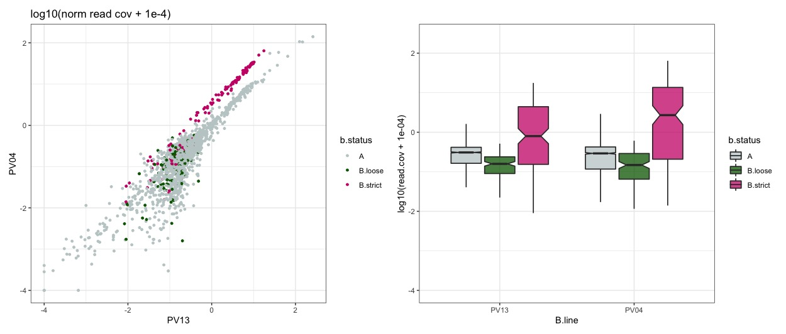

# Read this before you go through this document!

This analysis shows the original preprint assignment. We have revisited those assignment in an [updated document](3b_revisions_of_assignments.md).

We still use the same k-mer and assembly based assignments, but the coverage analysis was completelly redone. However, we do use the same input bam files. The extra checks and update comments are also included in this document and marked by **revisions update** header.

# Coverage analysis


	# working directory
	/data/ross/mealybugs/analyses/B_viburni_andres/2_short_read_DNA_seq/0_reads
	qlogin -pe smp64 32 -N bwa -l h=bigwig
    /ceph/software/utilities/sge/qlogin -pe smp 1 -N QLOGIN ok

## 1. Raw reads

	# Novaseq reads (/data/ross/mealybugs/analyses/B_viburni_andres/2_short_read_DNA_seq/0_reads)
	180608_A00291_0042_BH3CC3DRXX_2_11372RL0001L01_1.fastq.gz -> /data/ross/mealybugs/raw/transfer.genomics.ed.ac.uk/11372_Ross_Laura/raw_data/all_reads/18_13_1B_550/180608_A00291_0042_BH3CC3DRXX_2_11372RL0001L01_1.fastq.gz
	180608_A00291_0042_BH3CC3DRXX_2_11372RL0001L01_2.fastq.gz -> /data/ross/mealybugs/raw/transfer.genomics.ed.ac.uk/11372_Ross_Laura/raw_data/all_reads/18_13_1B_550/180608_A00291_0042_BH3CC3DRXX_2_11372RL0001L01_2.fastq.gz
	180608_A00291_0042_BH3CC3DRXX_2_11372RL0002L01_1.fastq.gz -> /data/ross/mealybugs/raw/transfer.genomics.ed.ac.uk/11372_Ross_Laura/raw_data/all_reads/18_13_1B_350/180608_A00291_0042_BH3CC3DRXX_2_11372RL0002L01_1.fastq.gz
	180608_A00291_0042_BH3CC3DRXX_2_11372RL0002L01_2.fastq.gz -> /data/ross/mealybugs/raw/transfer.genomics.ed.ac.uk/11372_Ross_Laura/raw_data/all_reads/18_13_1B_350/180608_A00291_0042_BH3CC3DRXX_2_11372RL0002L01_2.fastq.gz
	180608_A00291_0042_BH3CC3DRXX_2_11372RL0002L01_1.fastq.gz -> /data/ross/mealybugs/raw/transfer.genomics.ed.ac.uk/11372_Ross_Laura/raw_data/all_reads/18_13_1B_350/180608_A00291_0042_BH3CC3DRXX_2_11372RL0002L01_1.fastq.gz
	180608_A00291_0042_BH3CC3DRXX_2_11372RL0002L01_2.fastq.gz -> /data/ross/mealybugs/raw/transfer.genomics.ed.ac.uk/11372_Ross_Laura/raw_data/all_reads/18_13_1B_350/180608_A00291_0042_BH3CC3DRXX_2_11372RL0002L01_2.fastq.gz
	pviburni.1821.0B.350.r1.fastq.gz -> /data/ross/mealybugs/raw/transfer.genomics.ed.ac.uk/11372_Ross_Laura/raw_data/data_by_date/20180618/all_reads/18_21_0B/180608_A00291_0042_BH3CC3DRXX_2_11372RL0004L01_1.fastq.gz
	pviburni.1821.0B.350.r2.fastq.gz -> /data/ross/mealybugs/raw/transfer.genomics.ed.ac.uk/11372_Ross_Laura/raw_data/data_by_date/20180618/all_reads/18_21_0B/180608_A00291_0042_BH3CC3DRXX_2_11372RL0004L01_2.fastq.gz
	pviburni.1823.0B.350.r1.fastq.gz -> /data/ross/mealybugs/raw/transfer.genomics.ed.ac.uk/11372_Ross_Laura/raw_data/data_by_date/20180618/all_reads/18_23_0B/180608_A00291_0042_BH3CC3DRXX_2_11372RL0005L01_1.fastq.gz
	pviburni.1823.0B.350.r2.fastq.gz -> /data/ross/mealybugs/raw/transfer.genomics.ed.ac.uk/11372_Ross_Laura/raw_data/data_by_date/20180618/all_reads/18_23_0B/180608_A00291_0042_BH3CC3DRXX_2_11372RL0005L01_2.fastq.gz
	pviburni.184.2B.350.r1.fastq.gz -> /data/ross/mealybugs/raw/transfer.genomics.ed.ac.uk/11372_Ross_Laura/raw_data/data_by_date/20180618/all_reads/18_4_2B/180608_A00291_0042_BH3CC3DRXX_2_11372RL0003L01_1.fastq.gz
	pviburni.184.2B.350.r2.fastq.gz -> /data/ross/mealybugs/raw/transfer.genomics.ed.ac.uk/11372_Ross_Laura/raw_data/data_by_date/20180618/all_reads/18_4_2B/180608_A00291_0042_BH3CC3DRXX_2_11372RL0003L01_2.fastq.gz

## 2. Trim with fastp

	# fastp version 0.20.0 (conda env afilia)
	fastp -i 180608_A00291_0042_BH3CC3DRXX_2_11372RL0001L01_1.fastq.gz -I 180608_A00291_0042_BH3CC3DRXX_2_11372RL0001L01_2.fastq.gz -o /scratch/afilia/PV_18-13.Illumina.550.trimmed_1.fq.gz -O /scratch/afilia/PV_18-13.Illumina.550.trimmed_2.fq.gz --cut_by_quality5 --cut_by_quality3 --cut_window_size 4 --cut_mean_quality 20 --detect_adapter_for_pe --trim_poly_g
	fastp -i 180608_A00291_0042_BH3CC3DRXX_2_11372RL0002L01_1.fastq.gz -I 180608_A00291_0042_BH3CC3DRXX_2_11372RL0002L01_2.fastq.gz -o /scratch/afilia/PV_18-13.Illumina.350.trimmed_1.fq.gz -O /scratch/afilia/PV_18-13.Illumina.350.trimmed_2.fq.gz --cut_by_quality5 --cut_by_quality3 --cut_window_size 4 --cut_mean_quality 20 --detect_adapter_for_pe --trim_poly_g
	fastp -i pviburni.1821.0B.350.r1.fastq.gz -I pviburni.1821.0B.350.r2.fastq.gz -o /scratch/afilia/PV_18-21.Illumina.350.trimmed_1.fq.gz -O /scratch/afilia/PV_18-21.Illumina.350.trimmed_2.fq.gz --cut_by_quality5 --cut_by_quality3 --cut_window_size 4 --cut_mean_quality 20 --detect_adapter_for_pe --trim_poly_g
	fastp -i pviburni.1823.0B.350.r1.fastq.gz -I pviburni.1823.0B.350.r2.fastq.gz -o /scratch/afilia/PV_18-23.Illumina.350.trimmed_1.fq.gz -O /scratch/afilia/PV_18-23.Illumina.350.trimmed_2.fq.gz --cut_by_quality5 --cut_by_quality3 --cut_window_size 4 --cut_mean_quality 20 --detect_adapter_for_pe --trim_poly_g
	fastp -i pviburni.184.2B.350.r1.fastq.gz -I pviburni.184.2B.350.r2.fastq.gz -o /scratch/afilia/PV_18-04.Illumina.350.trimmed_1.fq.gz -O /scratch/afilia/PV_18-04.Illumina.350.trimmed_2.fq.gz --cut_by_quality5 --cut_by_quality3 --cut_window_size 4 --cut_mean_quality 20 --detect_adapter_for_pe --trim_poly_g

Some basic QC (M sequences, average read length). 18-04 has twice as much data than the other samples (same as 18-13 if we pool data from the 350 and 550 libraries, which is probably the way to go)

| PV_18-04.Illumina.350.trimmed_1 | 204.97M | 147.2 |
| PV_18-04.Illumina.350.trimmed_2 | 204.97M | 147.1 |
| PV_18-13.Illumina.350.trimmed_1 | 104.48M | 147.2 |
| PV_18-13.Illumina.350.trimmed_2 | 104.48M | 147.2 |
| PV_18-13.Illumina.550.trimmed_1 | 81.16M  | 146.8 |
| PV_18-13.Illumina.550.trimmed_2 | 81.16M  | 146.7 |
| PV_18-21.Illumina.350.trimmed_1 | 101.60M | 147.5 |
| PV_18-21.Illumina.350.trimmed_2 | 101.60M | 147.4 |
| PV_18-23.Illumina.350.trimmed_1 | 108.02M | 147.6 |
| PV_18-23.Illumina.350.trimmed_2 | 108.02M | 147.6 |

Based on the assembly size (435.3Mb), we are looking at estimated coverages between 68-73X (B- lines) and 125-140X (B+ lines). That's good!

## 3. Initial mapping

```
	# /data/ross/mealybugs/analyses/B_viburni_2020/2_short_read_DNA_seq/1_mapping
	bwa index /data/ross/mealybugs/analyses/B_viburni_2020/1_pacbio_assembly/8_freeze_v0/p.viburni.freeze.v0.softmasked.fa
	bwa mem -M -t 32 /data/ross/mealybugs/analyses/B_viburni_2020/1_pacbio_assembly/8_freeze_v0/p.viburni.freeze.v0.softmasked.fa ../0_reads/PV_18-13.Illumina.350.trimmed_1.fq.gz ../0_reads/PV_18-13.Illumina.350.trimmed_2.fq.gz | samtools sort -O BAM -o /scratch/afilia/PV_18-13.Illumina.350.sorted.bam
	bwa mem -M -t 32 /data/ross/mealybugs/analyses/B_viburni_2020/1_pacbio_assembly/8_freeze_v0/p.viburni.freeze.v0.softmasked.fa ../0_reads/PV_18-13.Illumina.550.trimmed_1.fq.gz ../0_reads/PV_18-13.Illumina.550.trimmed_2.fq.gz | samtools sort -O BAM -o /scratch/afilia/PV_18-13.Illumina.550.sorted.bam
	bwa mem -M -t 32 /data/ross/mealybugs/analyses/B_viburni_2020/1_pacbio_assembly/8_freeze_v0/p.viburni.freeze.v0.softmasked.fa ../0_reads/PV_18-04.Illumina.350.trimmed_1.fq.gz ../0_reads/PV_18-04.Illumina.350.trimmed_2.fq.gz | samtools sort -O BAM -o /scratch/afilia/PV_18-04.initial.sorted.bam
	bwa mem -M -t 32 /data/ross/mealybugs/analyses/B_viburni_2020/1_pacbio_assembly/8_freeze_v0/p.viburni.freeze.v0.softmasked.fa ../0_reads/PV_18-21.Illumina.350.trimmed_1.fq.gz ../0_reads/PV_18-21.Illumina.350.trimmed_2.fq.gz | samtools sort -O BAM -o /scratch/afilia/PV_18-21.initial.sorted.bam
	bwa mem -M -t 32 /data/ross/mealybugs/analyses/B_viburni_2020/1_pacbio_assembly/8_freeze_v0/p.viburni.freeze.v0.softmasked.fa ../0_reads/PV_18-23.Illumina.350.trimmed_1.fq.gz ../0_reads/PV_18-23.Illumina.350.trimmed_2.fq.gz | samtools sort -O BAM -o /scratch/afilia/PV_18-23.initial.sorted.bam
	rsync -av /scratch/afilia/*initial.sorted.bam .
```

Some initial mapping stats with ```samtools flagstat```:

```
	==> PV_18-04.initial.sorted.stats <==
	417074917 + 0 in total (QC-passed reads + QC-failed reads)
	7133797 + 0 secondary
	0 + 0 supplementary
	0 + 0 duplicates
	395178560 + 0 mapped (94.75% : N/A)
	409941120 + 0 paired in sequencing
	204970560 + 0 read1
	204970560 + 0 read2
	356671170 + 0 properly paired (87.01% : N/A)
	386220084 + 0 with itself and mate mapped

	==> PV_18-13.initial.sorted.stats <==
	375650036 + 0 in total (QC-passed reads + QC-failed reads)
	4383660 + 0 secondary
	0 + 0 supplementary
	0 + 0 duplicates
	367442808 + 0 mapped (97.82% : N/A)
	371266376 + 0 paired in sequencing
	185633188 + 0 read1
	185633188 + 0 read2
	338268374 + 0 properly paired (91.11% : N/A)
	361386096 + 0 with itself and mate mapped

	==> PV_18-21.initial.sorted.stats <==
	207025803 + 0 in total (QC-passed reads + QC-failed reads)
	3816983 + 0 secondary
	0 + 0 supplementary
	0 + 0 duplicates
	201661407 + 0 mapped (97.41% : N/A)
	203208820 + 0 paired in sequencing
	101604410 + 0 read1
	101604410 + 0 read2
	181141304 + 0 properly paired (89.14% : N/A)
	196881368 + 0 with itself and mate mapped

	==> PV_18-23.initial.sorted.stats <==
	220155946 + 0 in total (QC-passed reads + QC-failed reads)
	4107946 + 0 secondary
	0 + 0 supplementary
	0 + 0 duplicates
	212848740 + 0 mapped (96.68% : N/A)
	216048000 + 0 paired in sequencing
	108024000 + 0 read1
	108024000 + 0 read2
	190849052 + 0 properly paired (88.34% : N/A)
	207719570 + 0 with itself and mate mapped

		==> PV_18-13.Illumina.350.sorted.stats <==
	211557204 + 0 in total (QC-passed reads + QC-failed reads)
	2602832 + 0 secondary
	0 + 0 supplementary
	0 + 0 duplicates
	207064350 + 0 mapped (97.88% : N/A)
	208954372 + 0 paired in sequencing
	104477186 + 0 read1
	104477186 + 0 read2
	191120582 + 0 properly paired (91.47% : N/A)
	203695802 + 0 with itself and mate mapped

	==> PV_18-13.Illumina.550.sorted.stats <==
	164092832 + 0 in total (QC-passed reads + QC-failed reads)
	1780828 + 0 secondary
	0 + 0 supplementary
	0 + 0 duplicates
	160378458 + 0 mapped (97.74% : N/A)
	162312004 + 0 paired in sequencing
	81156002 + 0 read1
	81156002 + 0 read2
	147147792 + 0 properly paired (90.66% : N/A)
	157690294 + 0 with itself and mate mapped
```

It makes sense to keep primary mapped reads only, as secondary hits might map to A and B.

```
	# /data/ross/mealybugs/analyses/B_viburni_2020/4_cov_analysis/cov
	samtools view -@ 16 -F 256 -b PV_18-04.initial.sorted.bam -o /scratch/afilia/PV_18-04.initial.sorted.primary.only.bam
	samtools view -@ 16 -F 256 -b PV_18-13.initial.sorted.bam -o /scratch/afilia/PV_18-13.initial.sorted.primary.only.bam
	samtools view -@ 16 -F 256 -b PV_18-21.initial.sorted.bam -o /scratch/afilia/PV_18-21.initial.sorted.primary.only.bam
	samtools view -@ 16 -F 256 -b PV_18-23.initial.sorted.bam -o /scratch/afilia/PV_18-23.initial.sorted.primary.only.bam
```

To minimise false negatives, for now we want to keep reads that align with no mismatches only (Carvalho & Clark, 2013; Hall et al., 2013; Smeds et al., 2015; Vicoso et al., 2013).

```
	bamtools filter -tag NM:0 -in PV_18-04.initial.sorted.primary.only.bam -out /scratch/afilia/PV_18-04.initial.sorted.primary.only.no.mismatches.bam
	bamtools filter -tag NM:0 -in PV_18-13.initial.sorted.primary.only.bam -out /scratch/afilia/PV_18-13.initial.sorted.primary.only.no.mismatches.bam
	bamtools filter -tag NM:0 -in PV_18-21.initial.sorted.primary.only.bam -out /scratch/afilia/PV_18-21.initial.sorted.primary.only.no.mismatches.bam
	bamtools filter -tag NM:0 -in PV_18-23.initial.sorted.primary.only.bam -out /scratch/afilia/PV_18-23.initial.sorted.primary.only.no.mismatches.bam
```

Collect stats and ```samtools index```

Mapped reads per contig:

```
	samtools idxstats PV_18-04.initial.sorted.primary.only.bam > PV_18-04.primary.reads.mapped.count
	samtools idxstats PV_18-13.initial.sorted.primary.only.bam > PV_18-13.primary.reads.mapped.count
	samtools idxstats PV_18-21.initial.sorted.primary.only.bam > PV_18-21.primary.reads.mapped.count
	samtools idxstats PV_18-23.initial.sorted.primary.only.bam > PV_18-23.primary.reads.mapped.count
```

Alternatively, we could also collect coverage depths per contig:

```
	samtools depth PV_18-04.freeze.v0.sorted.bam | awk '/BEGIN/{scf='scaffold_1'; coverage_sum = 0; }{ if( scf != $1 ){ print scf "\t" coverage_sum; scf = $1; coverage_sum = $3 } else { scf = $1; coverage_sum += $3} }' > PV_18-04.scaffold.depth
	samtools depth PV_18-13.freeze.v0.sorted.bam | awk '/BEGIN/{scf='scaffold_1'; coverage_sum = 0; }{ if( scf != $1 ){ print scf "\t" coverage_sum; scf = $1; coverage_sum = $3 } else { scf = $1; coverage_sum += $3} }' > PV_18-13.scaffold.depth
	samtools depth PV_18-21.freeze.v0.sorted.bam | awk '/BEGIN/{scf='scaffold_1'; coverage_sum = 0; }{ if( scf != $1 ){ print scf "\t" coverage_sum; scf = $1; coverage_sum = $3 } else { scf = $1; coverage_sum += $3} }' > PV_18-21.scaffold.depth
	samtools depth PV_18-23.freeze.v0.sorted.bam | awk '/BEGIN/{scf='scaffold_1'; coverage_sum = 0; }{ if( scf != $1 ){ print scf "\t" coverage_sum; scf = $1; coverage_sum = $3 } else { scf = $1; coverage_sum += $3} }' > PV_18-23.scaffold.depth
```

The initial bam files will do for now. Alternatively, we can extract mapped reads with ```bamfilter``` (inclusion/exclusion list is needed, just made an empty one) and remap. Let's keep this there for now and see if we come back to it later.

```
	# /data/ross/mealybugs/analyses/B_viburni_2020/2_short_read_DNA_seq/1_mapping
	/ceph/software/blobtools/blobtools bamfilter -b PV_18-21.initial.sorted.bam -o /scratch/afilia/PV_18-21 -n -f fq -e no_contigs.txt
	/ceph/software/blobtools/blobtools bamfilter -b PV_18-23.initial.sorted.bam -o /scratch/afilia/PV_18-23 -n -f fq -e no_contigs.txt
	/ceph/software/blobtools/blobtools bamfilter -b PV_18-04.initial.sorted.bam -o /scratch/afilia/PV_18-04 -n -f fq -e no_contigs.txt -U
	/ceph/software/blobtools/blobtools bamfilter -b PV_18-13.Illumina.350.sorted.bam -o /scratch/afilia/PV_18-13.350 -n -f fq -e no_contigs.txt -U
	/ceph/software/blobtools/blobtools bamfilter -b PV_18-13.Illumina.550.sorted.bam -o /scratch/afilia/PV_18-13.550 -n -f fq -e no_contigs.txt -U

	# /data/ross/mealybugs/analyses/B_viburni_2020/2_short_read_DNA_seq/2_mapping_2nd
	bwa mem -M -t 32 /data/ross/mealybugs/analyses/B_viburni_2020/1_pacbio_assembly/8_freeze_v0/p.viburni.freeze.v0.softmasked.fa ../1_mapping/PV_18-13.350.PV_18-13.Illumina.350.sorted.bam.InIn.1.fq ../1_mapping/PV_18-13.350.PV_18-13.Illumina.350.sorted.bam.InIn.2.fq | samtools sort -O BAM -o /scratch/afilia/PV_18-13.350.freeze.v0.sorted.bam
	bwa mem -M -t 32 /data/ross/mealybugs/analyses/B_viburni_2020/1_pacbio_assembly/8_freeze_v0/p.viburni.freeze.v0.softmasked.fa ../1_mapping/PV_18-13.550.PV_18-13.Illumina.550.sorted.bam.InIn.1.fq ../1_mapping/PV_18-13.550.PV_18-13.Illumina.550.sorted.bam.InIn.2.fq | samtools sort -O BAM -o /scratch/afilia/PV_18-13.550.freeze.v0.sorted.bam
	bwa mem -M -t 32 /data/ross/mealybugs/analyses/B_viburni_2020/1_pacbio_assembly/8_freeze_v0/p.viburni.freeze.v0.softmasked.fa ../1_mapping/PV_18-04.PV_18-04.initial.sorted.bam.InIn.1.fq ../1_mapping/PV_18-04.PV_18-04.initial.sorted.bam.InIn.2.fq | samtools sort -O BAM -o /scratch/afilia/PV_18-04.freeze.v0.sorted.bam
	bwa mem -M -t 32 /data/ross/mealybugs/analyses/B_viburni_2020/1_pacbio_assembly/8_freeze_v0/p.viburni.freeze.v0.softmasked.fa ../1_mapping/PV_18-21.PV_18-21.initial.sorted.bam.InIn.1.fq ../1_mapping/PV_18-21.PV_18-21.initial.sorted.bam.InIn.2.fq | samtools sort -O BAM -o /scratch/afilia/PV_18-21.freeze.v0.sorted.bam
	bwa mem -M -t 32 /data/ross/mealybugs/analyses/B_viburni_2020/1_pacbio_assembly/8_freeze_v0/p.viburni.freeze.v0.softmasked.fa ../1_mapping/PV_18-23.PV_18-23.initial.sorted.bam.InIn.1.fq ../1_mapping/PV_18-23.PV_18-23.initial.sorted.bam.InIn.2.fq | samtools sort -O BAM -o /scratch/afilia/PV_18-23.freeze.v0.sorted.bam
	samtools merge /scratch/afilia/PV_18-13.freeze.v0.sorted.bam /scratch/afilia/PV_18-13.350.freeze.v0.sorted.bam /scratch/afilia/PV_18-13.550.freeze.v0.sorted.bam
```

## 4. Exploring coverages

We can explore per-contig coverage differences between lines: `log2((mapped reads line 1 + 1)/(mapped reads line 2 + 1))`. Indeed, when we compare B+ lines to B- lines, we see a few contigs that have much higher coverage in B+ lines:


while we see no such differences comparing B+ lines and B- lines:


This is promising. Before we carry on, let's normalise all samples by median coverage differences between pairs of lines

```
	# normalisation factors
	median(cov.13v21_norm) # 2.08
	median(cov.13v23_norm) # 1.91
	median(cov.04v21_norm) # 1.87
	median(cov.04v23_norm) # 1.77
	median(cov.04v13_norm) # 0.95
	median(cov.21v23_norm) # 0.94
```

And replot. Now the peak of the histogram is centered at 0:


We can define two preliminary sets of candidate B scaffolds based on coverage:

```
	b.candidates <- reads.all.lines[reads.all.lines$cov.13v21 >= 0.58 & reads.all.lines$cov.13v23 >= 0.58 & reads.all.lines$cov.04v21 >= 0.58 & reads.all.lines$cov.04v23 >= 0.58,] # assuming 1 B copy + 2 A copies
	b.candidates.strict <- reads.all.lines[reads.all.lines$cov.13v21 >= 2 & reads.all.lines$cov.13v23 >= 2 & reads.all.lines$cov.04v21 >= 2 & reads.all.lines$cov.04v23 >= 2,]
```

which gives us 145 putative B scaffolds with the more strict filtering (2.03Mb) and 136 with the looser filtering (4.42Mb).

Of course, some of these contigs may be highly repetitive sequences, which should show higher coverage. This is indeed what we see:



(note that the putative B linked scaffold have comparatively higher coverage in PV04, which is consistent with the expectation of 2B chromosomes)

| B status | Mean read cov ratio (PV04/PV13) | SD   |
|----------|---------------------------------|------|
| A        | 1.01                            | 0.65 |
| B loose  | 1.04                            | 0.72 |
| B strict | 2.64                            | 1.13 |

### 4.1. A detour with an alternative assemblies

Some B chromosomal contigs/scaffolds could have been misassembled during the assembly/correction process due to repetitive structure etc. Before proceeding with more sophisticated assignments, let's take a moment and see if we get a higher fraction of B-linked contigs using:

- the raw Pacbio assembly (quick dirty check; very similar profile to freeze.v0. Not worth pursuing this.) # /data/ross/mealybugs/analyses/B_viburni_2020/4_cov_analysis/cov/to_raw
- an alternative assembly (with flye) # /data/ross/mealybugs/analyses/B_viburni_2020/4_cov_analysis/cov/to_flye

This will simply follow the steps in sections 3 and 4, but let's not bother with filtering out reads with mismatches for now (commands below for the flye assembly)

```
	bwa index ../../1_pacbio_assembly/9_alternative/raw_flye/assembly.fasta
	bwa mem -M -t 32 ../../1_pacbio_assembly/9_alternative/raw_flye/assembly.fasta ../../../2_short_read_DNA_seq/0_reads/PV_18-13.Illumina.350.trimmed_1.fq.gz ../../../2_short_read_DNA_seq/0_reads/PV_	18-13.Illumina.350.trimmed_2.fq.gz | samtools sort -O BAM -o /scratch/afilia/PV_18-13.to_flye.350.sorted.bam
	bwa mem -M -t 32 ../../1_pacbio_assembly/9_alternative/raw_flye/assembly.fasta ../../../2_short_read_DNA_seq/0_reads/PV_18-13.Illumina.550.trimmed_1.fq.gz ../../../2_short_read_DNA_seq/0_reads/PV_	18-13.Illumina.550.trimmed_2.fq.gz | samtools sort -O BAM -o /scratch/afilia/PV_18-13.to_flye.550.sorted.bam
	bwa mem -M -t 32 ../../1_pacbio_assembly/9_alternative/raw_flye/assembly.fasta ../../../2_short_read_DNA_seq/0_reads/PV_18-04.Illumina.350.trimmed_1.fq.gz ../../../2_short_read_DNA_seq/0_reads/PV_	18-04.Illumina.350.trimmed_2.fq.gz | samtools sort -O BAM -o /scratch/afilia/PV_18-04.to_flye.sorted.bam
	bwa mem -M -t 32 ../../1_pacbio_assembly/9_alternative/raw_flye/assembly.fasta ../../../2_short_read_DNA_seq/0_reads/PV_18-21.Illumina.350.trimmed_1.fq.gz ../../../2_short_read_DNA_seq/0_reads/PV_	18-21.Illumina.350.trimmed_2.fq.gz | samtools sort -O BAM -o /scratch/afilia/PV_18-21.to_flye.sorted.bam
	bwa mem -M -t 32 ../../1_pacbio_assembly/9_alternative/raw_flye/assembly.fasta ../../../2_short_read_DNA_seq/0_reads/PV_18-23.Illumina.350.trimmed_1.fq.gz ../../../2_short_read_DNA_seq/0_reads/PV_	18-23.Illumina.350.trimmed_2.fq.gz | samtools sort -O BAM -o /scratch/afilia/PV_18-23.to_flye.sorted.bam
	samtools merge /scratch/afilia/PV_18-13.to_flye.sorted.bam /scratch/afilia/PV_18-13.to_flye.350.sorted.bam /scratch/afilia/PV_18-13.to_flye.550.sorted.bam
	rsync -av /scratch/afilia/*to_flye.sorted.bam .
	samtools index PV_18-04.to_flye.sorted.bam
	samtools index PV_18-13.to_flye.sorted.bam
	samtools index PV_18-21.to_flye.sorted.bam
	samtools index PV_18-23.to_flye.sorted.bam
	samtools flagstat PV_18-04.to_flye.sorted.bam > PV_18-04.to_flye.sorted.stats
	samtools flagstat PV_18-13.to_flye.sorted.bam > PV_18-13.to_flye.sorted.stats
	samtools flagstat PV_18-21.to_flye.sorted.bam > PV_18-21.to_flye.sorted.stats
	samtools flagstat PV_18-23.to_flye.sorted.bam > PV_18-23.to_flye.sorted.stats
	samtools idxstats PV_18-04.to_flye.sorted.bam > PV_18-04.to_flye.sorted.mapped.count
	samtools idxstats PV_18-13.to_flye.sorted.bam > PV_18-13.to_flye.sorted.mapped.count
	samtools idxstats PV_18-21.to_flye.sorted.bam > PV_18-21.to_flye.sorted.mapped.count
	samtools idxstats PV_18-23.to_flye.sorted.bam > PV_18-23.to_flye.sorted.mapped.count
```

Mapping to the new assembly gives a slightly bigger set of putative B chromosomal contigs is recovered (2.2Mb v 1.95Mb strict), but since the flye assembly is bigger the fraction is very similar. It doesn't seem worth pursuing further with this.

## 5. Mapping Illumina assemblies to reference

Let's build assemblies from the Illumina data and map them to the PacBio reference.

	# /data/ross/mealybugs/analyses/B_viburni_2020/2_short_read_DNA_seq/3_spades
	/ceph/software/spades/SPAdes-3.11.1-Linux/bin/spades.py -t 32 --only-assembler -k 21,33,55,77,99,127 -o 13_SPADES --pe1-1 ../0_reads/PV_18-13.Illumina.350.trimmed_1.fq.gz --pe1-2 ../0_reads/PV_18-13.Illumina.350.trimmed_2.fq.gz --pe2-1 ../0_reads/PV_18-13.Illumina.550.trimmed_1.fq.gz --pe2-2 ../0_reads/PV_18-13.Illumina.550.trimmed_2.fq.gz
	/ceph/software/spades/SPAdes-3.11.1-Linux/bin/spades.py -t 32 --only-assembler -k 21,33,55,77,99,127 -o 04_SPADES -1 ../0_reads/PV_18-04.Illumina.350.trimmed_1.fq.gz -2 ../0_reads/PV_18-04.Illumina.350.trimmed_2.fq.gz
	/ceph/software/spades/SPAdes-3.11.1-Linux/bin/spades.py -t 32 --only-assembler -k 21,33,55,77,99,127 -o 21_SPADES -1 ../0_reads/PV_18-21.Illumina.350.trimmed_1.fq.gz -2 ../0_reads/PV_18-21.Illumina.350.trimmed_2.fq.gz
	/ceph/software/spades/SPAdes-3.11.1-Linux/bin/spades.py -t 32 --only-assembler -k 21,33,55,77,99,127 -o 23_SPADES -1 ../0_reads/PV_18-23.Illumina.350.trimmed_1.fq.gz -2 ../0_reads/PV_18-23.Illumina.350.trimmed_2.fq.gz

Get some basic stats (N scaffolds and total length)

	ln -s 04_SPADES/scaffolds.fasta PV_18-04.spades.fa
	ln -s 13_SPADES/scaffolds.fasta PV_18-13.spades.fa
	ln -s 21_SPADES/scaffolds.fasta PV_18-21.spades.fa
	ln -s 23_SPADES/scaffolds.fasta PV_18-23.spades.fa
	/ceph/software/scripts/scaffold_stats.pl -f PV_18-04.spades.fa # For scaffolds longer than 200 bp: 305430, 549640993 / For scaffolds longer than 1000 bp: 96516, 461974611
	/ceph/software/scripts/scaffold_stats.pl -f PV_18-13.spades.fa # For scaffolds longer than 200 bp: 355134, 570873816 / For scaffolds longer than 1000 bp: 103237, 467583548
	/ceph/software/scripts/scaffold_stats.pl -f PV_18-21.spades.fa # For scaffolds longer than 200 bp: 143117, 486699088 / For scaffolds longer than 1000 bp: 77190, 454649006
	/ceph/software/scripts/scaffold_stats.pl -f PV_18-23.spades.fa # For scaffolds longer than 200 bp: 280419, 535634250 / For scaffolds longer than 1000 bp: 90609, 453841273

Map to reference (NUCmer version 4.0.0beta2 from mummer4)

	nucmer -p /scratch/afilia/04.spades.v.freeze.v0 -t 24 ../../1_pacbio_assembly/8_freeze_v0/p.viburni.freeze.v0.softmasked.fa PV_18-04.spades.fa
	nucmer -p /scratch/afilia/13.spades.v.freeze.v0 -t 24 ../../1_pacbio_assembly/8_freeze_v0/p.viburni.freeze.v0.softmasked.fa PV_18-13.spades.fa
	nucmer -p /scratch/afilia/21.spades.v.freeze.v0 -t 24 ../../1_pacbio_assembly/8_freeze_v0/p.viburni.freeze.v0.softmasked.fa PV_18-21.spades.fa
	nucmer -p /scratch/afilia/23.spades.v.freeze.v0 -t 24 ../../1_pacbio_assembly/8_freeze_v0/p.viburni.freeze.v0.softmasked.fa PV_18-23.spades.fa

	show-coords -clrT 04.spades.v.freeze.v0.delta > 04.spades.v.freeze.v0.delta.coords
	show-coords -clrT 13.spades.v.freeze.v0.delta > 13.spades.v.freeze.v0.delta.coords
	show-coords -clrT 21.spades.v.freeze.v0.delta > 21.spades.v.freeze.v0.delta.coords
	show-coords -clrT 23.spades.v.freeze.v0.delta > 23.spades.v.freeze.v0.delta.coords

Let's explore the output, quick and dirty: extract unique values of ref and query sequences (i.e. how many scaffolds in the reference have an alignment?)

	awk '{ a[$12]++ } END { for (b in a) { print b } }' 04.spades.v.freeze.v0.delta.coords > 04.spades.v.freeze.v0.scaffolds.list # 2312
	awk '{ a[$12]++ } END { for (b in a) { print b } }' 13.spades.v.freeze.v0.delta.coords > 13.spades.v.freeze.v0.scaffolds.list # 2335
	awk '{ a[$12]++ } END { for (b in a) { print b } }' 21.spades.v.freeze.v0.delta.coords > 21.spades.v.freeze.v0.scaffolds.list # 2235
	awk '{ a[$12]++ } END { for (b in a) { print b } }' 23.spades.v.freeze.v0.delta.coords > 23.spades.v.freeze.v0.scaffolds.list # 2256

Only 57 scaffolds are present in B+ lines and not B- lines, of which 49 correspond to B candidates (0.39Mb only). However, there is a problem with this approach -- it would be better to keep the best alignments instead of all of them. However (annoyingly!) I can't seem to find a way to get the alignment score from ```nucmer``` (just alignment length and identity). A possible workaround is using ```dnadiff```, which outputs (among other things) 1-to-1 and many-to-many alignments mapping of reference and query sequences.

	dnadiff -d 04.spades.v.freeze.v0.delta -p dnadiff -d /scratch/afilia/04.spades.v.freeze.v0.dnadiff
	dnadiff -d 13.spades.v.freeze.v0.delta -p dnadiff -d /scratch/afilia/13.spades.v.freeze.v0.dnadiff
	dnadiff -d 21.spades.v.freeze.v0.delta -p dnadiff -d /scratch/afilia/21.spades.v.freeze.v0.dnadiff
	dnadiff -d 23.spades.v.freeze.v0.delta -p dnadiff -d /scratch/afilia/23.spades.v.freeze.v0.dnadiff

One-to-one alignments - PV04: 177209, PV13: 180508, PV21: 114931, PV23: 172949.
Many-to-many alignments - PV04: 696533, PV13: 919725, PV21: 348865, PV23: 651283.

	awk '{ a[$12]++ } END { for (b in a) { print b } }' 04.spades.v.freeze.v0.dnadiff.mcoords > 04.spades.v.freeze.v0.dnadiff.mcoords.list # 2312
	awk '{ a[$12]++ } END { for (b in a) { print b } }' 13.spades.v.freeze.v0.dnadiff.mcoords > 13.spades.v.freeze.v0.dnadiff.mcoords.list # 2335
	awk '{ a[$12]++ } END { for (b in a) { print b } }' 21.spades.v.freeze.v0.dnadiff.mcoords > 21.spades.v.freeze.v0.dnadiff.mcoords.list # 2235
	awk '{ a[$12]++ } END { for (b in a) { print b } }' 23.spades.v.freeze.v0.dnadiff.mcoords > 23.spades.v.freeze.v0.dnadiff.mcoords.list # 2256

Same results using the m-to-m alignments. Only 57 scaffolds are present in B+ lines and not B- lines, of which 49 correspond to B candidates (0.39Mb only). Let's try 1-to-1 now:

	awk '{ a[$12]++ } END { for (b in a) { print b } }' 04.spades.v.freeze.v0.dnadiff.1coords > 04.spades.v.freeze.v0.dnadiff.1coords.list # 2231
	awk '{ a[$12]++ } END { for (b in a) { print b } }' 13.spades.v.freeze.v0.dnadiff.1coords > 13.spades.v.freeze.v0.dnadiff.1coords.list # 2298
	awk '{ a[$12]++ } END { for (b in a) { print b } }' 21.spades.v.freeze.v0.dnadiff.1coords > 21.spades.v.freeze.v0.dnadiff.1coords.list # 2074
	awk '{ a[$12]++ } END { for (b in a) { print b } }' 23.spades.v.freeze.v0.dnadiff.1coords > 23.spades.v.freeze.v0.dnadiff.1coords.list # 2141

107 scaffolds (1.03Mb) are unique to the PV04 and PV13 assemblies, of which 72 (0.68Mb) correspond to B strict candidates. If we incorporate this to our coverage based analysis, we get:


## 6. kmer method

Following Christina and Kamil's *Sciara* pipeline: https://github.com/RossLab/Sciara-L-chromosome/blob/master/analyses/assigment-of-L-X-A.md

	# /data/ross/mealybugs/analyses/B_viburni_2020/4_cov_analysis/kmer/initial
	# build kmer db with kmc v.3.1.1
	# generate alphabetically sorted dump of kmers and their coverages (directly from the bam file)
	kmc -fbam -k27 -t20 -m32 ../cov/PV_18-04.initial.sorted.bam /scratch/afilia/PV_18-04_kmer_counts /scratch/afilia/tmp04 && rsync -av /scratch/afilia/PV_18-04_kmer_counts .
	kmc -fbam -k27 -t20 -m32 ../cov/PV_18-13.initial.sorted.bam /scratch/afilia/PV_18-13_kmer_counts /scratch/afilia/tmp13 && rsync -av /scratch/afilia/PV_18-13_kmer_counts .
	kmc -fbam -k27 -t20 -m32 ../cov/PV_18-21.initial.sorted.bam /scratch/afilia/PV_18-21_kmer_counts /scratch/afilia/tmp21 && rsync -av /scratch/afilia/PV_18-21_kmer_counts .
	kmc -fbam -k27 -t20 -m32 ../cov/PV_18-23.initial.sorted.bam /scratch/afilia/PV_18-23_kmer_counts /scratch/afilia/tmp23 && rsync -av /scratch/afilia/PV_18-23_kmer_counts .
	# generate alphabetically sorted dump of kmers and their coverages (directly from the bam file)
	kmc_tools transform PV_18-04_kmer_counts histogram /scratch/afilia/PV_18-04_kmer_counts.hist dump -s /scratch/afilia/PV_18-04_kmer_counts.dump && rsync -av /scratch/afilia/PV_18-04_kmer_counts* .
	kmc_tools transform PV_18-13_kmer_counts histogram /scratch/afilia/PV_18-13_kmer_counts.hist dump -s /scratch/afilia/PV_18-13_kmer_counts.dump && rsync -av /scratch/afilia/PV_18-13_kmer_counts* .
	kmc_tools transform PV_18-21_kmer_counts histogram /scratch/afilia/PV_18-21_kmer_counts.hist dump -s /scratch/afilia/PV_18-21_kmer_counts.dump && rsync -av /scratch/afilia/PV_18-21_kmer_counts* .
	kmc_tools transform PV_18-23_kmer_counts histogram /scratch/afilia/PV_18-23_kmer_counts.hist dump -s /scratch/afilia/PV_18-23_kmer_counts.dump && rsync -av /scratch/afilia/PV_18-23_kmer_counts* .

This is what we get running this through Genomescope -- a bit disconcerting!


Why do the non-B lines get a higher genome size estimate than the B lines? The kmer distribution looks a bit off too. Talking to Kamil and Christina, they suggested a few ideas. First, let's do this again with 1) raw fastq files directly, contaminants and all and 2) a higher upper threshold.

	cat PV_18-04.Illumina.350.trimmed_1.fq.gz PV_18-04.Illumina.350.trimmed_2.fq.gz > ../../4_cov_analysis/kmer/PV_18-04.Illumina.trimmed_merged.fq.gz
	cat PV_18-21.Illumina.350.trimmed_1.fq.gz PV_18-21.Illumina.350.trimmed_2.fq.gz > ../../4_cov_analysis/kmer/PV_18-21.Illumina.trimmed_merged.fq.gz
	cat PV_18-23.Illumina.350.trimmed_1.fq.gz PV_18-23.Illumina.350.trimmed_2.fq.gz > ../../4_cov_analysis/kmer/PV_18-23.Illumina.trimmed_merged.fq.gz
	cat PV_18-13.Illumina.350.trimmed_1.fq.gz PV_18-13.Illumina.350.trimmed_2.fq.gz PV_18-13.Illumina.550.trimmed_1.fq.gz PV_18-13.Illumina.550.trimmed_2.fq.gz > ../../4_cov_analysis/kmer/PV_18-13.Illumina.trimmed.merged.fq.gz

	kmc -k27 -t24 -m32 -cs5000000 PV_18-04.Illumina.trimmed_merged.fq.gz /scratch/afilia/PV_18-04_kmer_counts_round2 /scratch/afilia/tmp04 && rsync -av /scratch/afilia/PV_18-04_kmer_counts_round2* .
	kmc -k27 -t24 -m32 -cs5000000 PV_18-13.Illumina.trimmed.merged.fq.gz /scratch/afilia/PV_18-13_kmer_counts_round2 /scratch/afilia/tmp13 && rsync -av /scratch/afilia/PV_18-13_kmer_counts_round2* .
	kmc -k27 -t24 -m32 -cs5000000 PV_18-21.Illumina.trimmed_merged.fq.gz /scratch/afilia/PV_18-21_kmer_counts_round2 /scratch/afilia/tmp21 && rsync -av /scratch/afilia/PV_18-21_kmer_counts_round2* .
	kmc -k27 -t24 -m32 -cs5000000 PV_18-23.Illumina.trimmed_merged.fq.gz /scratch/afilia/PV_18-23_kmer_counts_round2 /scratch/afilia/tmp23 && rsync -av /scratch/afilia/PV_18-23_kmer_counts_round2* .
	kmc_tools transform PV_18-04_kmer_counts_round2 histogram PV_18-04_kmer_counts_round2.max.hist -cx5000000
	kmc_tools transform PV_18-13_kmer_counts_round2 histogram PV_18-13_kmer_counts_round2.max.hist -cx5000000
	kmc_tools transform PV_18-21_kmer_counts_round2 histogram PV_18-21_kmer_counts_round2.max.hist -cx5000000
	kmc_tools transform PV_18-23_kmer_counts_round2 histogram PV_18-23_kmer_counts_round2.max.hist -cx5000000

	kmc_tools dump -s /scratch/afilia/PV_18-04_kmer_counts.dump && rsync -av /scratch/afilia/PV_18-04_kmer_counts* .
	kmc_tools dump -s /scratch/afilia/PV_18-13_kmer_counts.dump && rsync -av /scratch/afilia/PV_18-13_kmer_counts* .
	kmc_tools dump -s /scratch/afilia/PV_18-21_kmer_counts.dump && rsync -av /scratch/afilia/PV_18-21_kmer_counts* .
	kmc_tools dump -s /scratch/afilia/PV_18-23_kmer_counts.dump && rsync -av /scratch/afilia/PV_18-23_kmer_counts* .

Let's plot up to 1e6. It doesn't seem we were missing any high coverage kmers (kmers with >1e6 coverage misisng from the plot, but it's just a few hundreds):


And run genomescope again with cov up to 1e5:


The new genome estimate is closer to the assembly -- that's good. ALSO -- only the 18-13 library comes from a pool of 3 individuals! 18-4, 18-21 and 18-23 are from single females -- Isabelle needs to confirm this. Now this makes sense: the heterozygosity peak is broader in 18-13 (rather corresponding to minor allele freq!)

**Revisions update**

Let's rerun these estimates with GenomeScope 2.0, which has an improved convergence model

```
genomescope.R -i PV_18-04_kmer_counts_round2.max.hist -o . -n PV_18-04 -p 2 -k 21
genomescope.R -i PV_18-13_kmer_counts_round2.max.hist -o . -n PV_18-13 -p 2 -k 21 -l 38
genomescope.R -i PV_18-21_kmer_counts_round2.max.hist -o . -n PV_18-21 -p 2 -k 21
genomescope.R -i PV_18-23_kmer_counts_round2.max.hist -o . -n PV_18-23 -p 2 -k 21
```

The `04` and `23` are nice genome profiles and the one with two Bs is a lot larger (~45Mbp). However, the `PV_13` has about the same size as the two B-less genome profiles. However, both `13` and `21` are pools of multiple individuals and that will hinder the estimate. I am not sure if the two `PV 13` libraries are from the same isolation, so let's do `PV_18-13` per library with a tiny bit smaller k.

```bash
# /data/ross/mealybugs/analyses/B_viburni_2020/4_cov_analysis/kmer/per_library_PV_18-13
# conda activate default_genomics
mkdir reads_350 reads_550
ln -s /data/ross/mealybugs/analyses/B_viburni_2020/2_short_read_DNA_seq/0_reads/PV_18-13.Illumina.350.trimmed_[12].fq.gz ./reads_350
ln -s /data/ross/mealybugs/analyses/B_viburni_2020/2_short_read_DNA_seq/0_reads/PV_18-13.Illumina.550.trimmed_[12].fq.gz ./reads_350

mkdir kmer_hist_350 kmer_hist_550

qsub -o logs -e logs -cwd -b yes -N genome_profiling -V -pe smp64 16 'bash kmer_histogram_cluster.sh reads_350 kmer_hist_550'
qsub -o logs -e logs -cwd -b yes -N genome_profiling -V -pe smp64 16 'bash kmer_histogram_cluster.sh reads_550 kmer_hist_550'

# the script is a bit messed up and does not rsync the output files well, I renamed them afterwards
```

and again

```
genomescope.R -i PV13_350_kmer_k21_full.hist -o . -n PV_18-13_350 -p 2 -k 21
genomescope.R -i PV13_550_kmer_k21_full.hist -o . -n PV_18-13_550 -p 2 -k 21
```

Both are pools! However , the genome size estimates of the 350 library is ~11 Mbp longer, given the genome size estimate is (kmers * coverage) / (haploid_cov * ploidy), the size estimate difference will be just hakf of B chromosome size (assuming there is just one in this line). Hence, the B size estimate assuming 350 size estimate is correct would be ~22Mbp. However, the 550 library has the same size and needs to be investigated wether it contains the Bs at all.

### 6.1. 2d histograms of sample pairs

	# conda install -c bioconda/label/cf201901 kat (v2.4.1)
	kat comp -n -t 24 -o /scratch/afilia/04_vs_21_kat ../PV_18-04.Illumina.trimmed_merged.fq.gz ../PV_18-21.Illumina.trimmed_merged.fq.gz && rsync -av /scratch/afilia/04_vs_21_kat
	kat comp -n -t 24 -o /scratch/afilia/13_vs_21_kat ../PV_18-13.Illumina.trimmed.merged.fq.gz ../PV_18-21.Illumina.trimmed_merged.fq.gz && rsync -av /scratch/afilia/13_vs_21_kat
	kat comp -n -t 24 -o /scratch/afilia/04_vs_23_kat ../PV_18-04.Illumina.trimmed_merged.fq.gz ../PV_18-23.Illumina.trimmed_merged.fq.gz && rsync -av /scratch/afilia/04_vs_23_kat
	kat comp -n -t 24 -o /scratch/afilia/13_vs_23_kat ../PV_18-13.Illumina.trimmed.merged.fq.gz ../PV_18-23.Illumina.trimmed_merged.fq.gz && rsync -av /scratch/afilia/13_vs_23_kat
	kat comp -n -t 24 -o /scratch/afilia/04_vs_13_kat ../PV_18-04.Illumina.trimmed_merged.fq.gz ../PV_18-13.Illumina.trimmed.merged.fq.gz && rsync -av /scratch/afilia/04_vs_13_kat
	kat comp -n -t 24 -o /scratch/afilia/21_vs_23_kat ../PV_18-21.Illumina.trimmed_merged.fq.gz ../PV_18-23.Illumina.trimmed_merged.fq.gz && rsync -av /scratch/afilia/21_vs_23_kat

Here they are:


Plus, as a sanity check, let's male sure the 350 and the 550 18_13 libraries are not too different -- if they are, we have a problem. It looks good though:

	kat comp -n -t 8 -o 13.350_vs_13.550_kat '../../../2_short_read_DNA_seq/0_reads/PV_18-13.Illumina.350.trimmed_1.fq.gz ../../../2_short_read_DNA_seq/0_reads/PV_18-13.Illumina.350.trimmed_2.fq.gz' '../../../2_short_read_DNA_seq/0_reads/PV_18-13.Illumina.550.trimmed_1.fq.gz ../../../2_short_read_DNA_seq/0_reads/PV_18-13.Illumina.550.trimmed_2.fq.gz'

Now, let's get obtain a spectra-cn plot against the v0 reference.

	kat comp -t 16 -o 04_vs_freeze.v0 ../PV_18-04.Illumina.trimmed_merged.fq.gz ../../../1_pacbio_assembly/8_freeze_v0/p.viburni.freeze.v0.softmasked.fa
	kat comp -t 16 -o 13_vs_freeze.v0 ../PV_18-13.Illumina.trimmed.merged.fq.gz ../../../1_pacbio_assembly/8_freeze_v0/p.viburni.freeze.v0.softmasked.fa
	kat comp -t 16 -o 21_vs_freeze.v0 ../PV_18-21.Illumina.trimmed_merged.fq.gz ../../../1_pacbio_assembly/8_freeze_v0/p.viburni.freeze.v0.softmasked.fa
	kat comp -t 16 -o 23_vs_freeze.v0 ../PV_18-23.Illumina.trimmed.merged.fq.gz ../../../1_pacbio_assembly/8_freeze_v0/p.viburni.freeze.v0.softmasked.fa


### 6.2. kmer coverage (naive)

Let's generate the kmer dumps again with a lower threshold of 2 and an upper threshold of 1000:

	qsub -cwd -N kmc -V -pe smp64 20 -b yes 'L=5; U=1000; SCRATCH=/scratch/$USER/$JOB_ID; mkdir -p $SCRATCH; kmc_tools transform PV_18-04_kmer_counts_round2 -ci$L -cx$U dump -s $SCRATCH/PV_18-04_5to10k.dump && rsync $SCRATCH/PV_18-04_5to10k.dump .'
	qsub -cwd -N kmc -V -pe smp64 20 -b yes 'L=5; U=1000; SCRATCH=/scratch/$USER/$JOB_ID; mkdir -p $SCRATCH; kmc_tools transform PV_18-13_kmer_counts_round2 -ci$L -cx$U dump -s $SCRATCH/PV_18-13_5to10k.dump && rsync $SCRATCH/PV_18-13_5to10k.dump .'
	qsub -cwd -N kmc -V -pe smp64 20 -b yes 'L=5; U=1000; SCRATCH=/scratch/$USER/$JOB_ID; mkdir -p $SCRATCH; kmc_tools transform PV_18-21_kmer_counts_round2 -ci$L -cx$U dump -s $SCRATCH/PV_18-21_5to10k.dump && rsync $SCRATCH/PV_18-21_5to10k.dump .'
	qsub -cwd -N kmc -V -pe smp64 20 -b yes 'L=5; U=1000; SCRATCH=/scratch/$USER/$JOB_ID; mkdir -p $SCRATCH; kmc_tools transform PV_18-23_kmer_counts_round2 -ci$L -cx$U dump -s $SCRATCH/PV_18-23_5to10k.dump && rsync $SCRATCH/PV_18-23_5to10k.dump .'

To merge the 4 dumps into a single file:

	rm(list=ls())
	ls()
	PV_18.04_5to10k.dump <- read.delim("PV_18-04_5to10k.dump", header=FALSE)
	PV_18.13_5to10k.dump <- read.delim("PV_18-13_5to10k.dump", header=FALSE)
	PV_18.21_5to10k.dump <- read.delim("PV_18-21_5to10k.dump", header=FALSE)
	PV_18.23_5to10k.dump <- read.delim("PV_18-23_5to10k.dump", header=FALSE)
	colnames(PV_18.04_5to10k.dump)[1] <- "kmer"
	colnames(PV_18.13_5to10k.dump)[1] <- "kmer"
	colnames(PV_18.21_5to10k.dump)[1] <- "kmer"
	colnames(PV_18.23_5to10k.dump)[1] <- "kmer"
	colnames(PV_18.04_5to10k.dump)[2] <- "PV04"
	colnames(PV_18.13_5to10k.dump)[2] <- "PV13"
	colnames(PV_18.21_5to10k.dump)[2] <- "PV21"
	colnames(PV_18.23_5to10k.dump)[2] <- "PV23"
	head(PV_18.04_5to10k.dump)
	head(PV_18.13_5to10k.dump)
	head(PV_18.21_5to10k.dump)
	head(PV_18.23_5to10k.dump)
	a0 <- merge(PV_18.04_5to10k.dump,PV_18.13_5to10k.dump,by="kmer",all = TRUE)
	a1 <- merge(a0,PV_18.21_5to10k.dump,by="kmer",all = TRUE)
	all_lines_5to10k.dump <- merge(a1,PV_18.23_5to10k.dump,by="kmer",all = TRUE)
	write.table(all_lines_5to10k.dump, file = "all_lines_5to10k.dump", sep = "\t",row.names = F, col.names = TRUE, quote = FALSE)
	quit()

	R < merge_dumps.R --vanilla

We have a very healthy count of 587,590,720 27-mers in the merged file. Let's start by naively extracting kmers that are unique to PV_04 and PV_13 (putative B-unique kmers) and kmers that are shared by all lines (should be A)

	awk '{ if((($2 != "NA") && ($2 >= 5)) && (($3 != "NA") && ($3 >= 5)) && ($4 == "NA") && ($5 == "NA")) { print }}' all_lines_5to1k.dump > b_lines_unique_kmers.tsv
	awk '{ if(($2 != "NA") && ($3 != "NA") && ($4 != "NA") && ($5 != "NA")) { print }}' all_lines_5to1k.dump > all_lines_shared_kmers.tsv
	awk '{print $1}' b_lines_unique_kmers.tsv | awk '{ print ">B_"NR"\n"$0 }' > b_lines_unique_kmers.fasta # 44,305,008 kmers
	awk '{print $1}' all_lines_shared_kmers.tsv | awk '{ print ">A_"NR"\n"$0 }' > all_lines_shared_kmers.fasta # 343,163,864

Map the fasta files to our Pacbio reference:

	bwa mem -t 24 -k 27 -T 27 -a /data/ross/mealybugs/analyses/B_viburni_2020/1_pacbio_assembly/8_freeze_v0/p.viburni.freeze.v0.softmasked.fa ../b_lines_unique_kmers.fasta | samtools sort -@24 -O bam - > /scratch/afilia/Bput_kmers_vs_freeze.v0.sorted.bam # 44,305,008, of which 18,081,156 mapped
	bwa mem -t 24 -k 27 -T 27 -a /data/ross/mealybugs/analyses/B_viburni_2020/1_pacbio_assembly/8_freeze_v0/p.viburni.freeze.v0.softmasked.fa ../all_lines_shared_kmers.fasta | samtools sort -@24 -O bam - > /scratch/afilia/Aput_kmers_vs_freeze.v0.sorted.bam # 343,163,864 in total, of which 322,128,767 mapped (only 40.52%)

Index and count the numbers of A and B k-mers mapping to the assembly:

```
	samtools index *bam
	samtools idxstats *bam
```

Almost all scaffolds have kmers from both sets. The resolution is a bit crap -- it seems we'll need to define better coverage thresholds. However, a ray of light: we see very good agreement with the previous analyses.


### 6.3. kmer coverage (improved)

Let's generate everything again (genomescope, 2d histograms, dumps) but this time after filtering out reads that map to contaminants.

```
	# /data/ross/mealybugs/analyses/B_viburni_2020/4_cov_analysis/kmer/decon_kmers
	bwa index /data/ross/mealybugs/analyses/B_viburni_2020/1_pacbio_assembly/4_blobtools/hypo3.scubat.besst1.fa
	bwa mem -M -t 32 /data/ross/mealybugs/analyses/B_viburni_2020/1_pacbio_assembly/4_blobtools/hypo3.scubat.besst1.fa ../../../2_short_read_DNA_seq/0_reads/PV_18-13.Illumina.350.trimmed_1.fq.gz ../../../2_short_read_DNA_seq/0_reads/PV_18-13.Illumina.350.trimmed_2.fq.gz | samtools sort -O BAM -o /scratch/afilia/PV_18-13.to_hypo3.scubat.besst1.350.sorted.bam
	bwa mem -M -t 32 /data/ross/mealybugs/analyses/B_viburni_2020/1_pacbio_assembly/4_blobtools/hypo3.scubat.besst1.fa ../../../2_short_read_DNA_seq/0_reads/PV_18-13.Illumina.550.trimmed_1.fq.gz ../../../2_short_read_DNA_seq/0_reads/PV_18-13.Illumina.550.trimmed_2.fq.gz | samtools sort -O BAM -o /scratch/afilia/PV_18-13.to_hypo3.scubat.besst1.550.sorted.bam
	bwa mem -M -t 32 /data/ross/mealybugs/analyses/B_viburni_2020/1_pacbio_assembly/4_blobtools/hypo3.scubat.besst1.fa ../../../2_short_read_DNA_seq/0_reads/PV_18-04.Illumina.350.trimmed_1.fq.gz ../../../2_short_read_DNA_seq/0_reads/PV_18-04.Illumina.350.trimmed_2.fq.gz | samtools sort -O BAM -o /scratch/afilia/PV_18-04.to_hypo3.scubat.besst1.sorted.bam
	bwa mem -M -t 32 /data/ross/mealybugs/analyses/B_viburni_2020/1_pacbio_assembly/4_blobtools/hypo3.scubat.besst1.fa ../../../2_short_read_DNA_seq/0_reads/PV_18-21.Illumina.350.trimmed_1.fq.gz ../../../2_short_read_DNA_seq/0_reads/PV_18-21.Illumina.350.trimmed_2.fq.gz | samtools sort -O BAM -o /scratch/afilia/PV_18-21.to_hypo3.scubat.besst1.sorted.bam
	bwa mem -M -t 32 /data/ross/mealybugs/analyses/B_viburni_2020/1_pacbio_assembly/4_blobtools/hypo3.scubat.besst1.fa ../../../2_short_read_DNA_seq/0_reads/PV_18-23.Illumina.350.trimmed_1.fq.gz ../../../2_short_read_DNA_seq/0_reads/PV_18-23.Illumina.350.trimmed_2.fq.gz | samtools sort -O BAM -o /scratch/afilia/PV_18-23.to_hypo3.scubat.besst1.sorted.bam
	samtools merge /scratch/afilia/PV_18-13.to_hypo3.scubat.besst1.sorted.bam /scratch/afilia/PV_18-13.to_hypo3.scubat.besst1.350.sorted.bam /scratch/afilia/PV_18-13.to_hypo3.scubat.besst1.550.sorted.bam
	samtools flagstat /scratch/afilia/PV_18-04.to_hypo3.scubat.besst1.sorted.bam > PV_18-04.to_hypo3.scubat.besst1.sorted.stats
	samtools flagstat /scratch/afilia/PV_18-13.to_hypo3.scubat.besst1.sorted.bam > PV_18-13.to_hypo3.scubat.besst1.sorted.stats
	samtools flagstat /scratch/afilia/PV_18-21.to_hypo3.scubat.besst1.sorted.bam > PV_18-21.to_hypo3.scubat.besst1.sorted.stats
	samtools flagstat /scratch/afilia/PV_18-23.to_hypo3.scubat.besst1.sorted.bam > PV_18-23.to_hypo3.scubat.besst1.sorted.stats
	samtools index /scratch/afilia/PV_18-04.to_hypo3.scubat.besst1.sorted.bam
	samtools index /scratch/afilia/PV_18-13.to_hypo3.scubat.besst1.sorted.bam
	samtools index /scratch/afilia/PV_18-21.to_hypo3.scubat.besst1.sorted.bam
	samtools index /scratch/afilia/PV_18-23.to_hypo3.scubat.besst1.sorted.bam
	# with blobools v1.0 and an exclusion list without the >
	blobtools bamfilter -b PV_18-04.to_hypo3.scubat.besst1.sorted.bam -o /scratch/afilia/PV_18-04.decon -e contigs.to.remove.scaffolded.txt -u --threads 32
	blobtools bamfilter -b PV_18-13.to_hypo3.scubat.besst1.sorted.bam -o /scratch/afilia/PV_18-13.decon -e contigs.to.remove.scaffolded.txt -u --threads 32
	blobtools bamfilter -b PV_18-21.to_hypo3.scubat.besst1.sorted.bam -o /scratch/afilia/PV_18-21.decon -e contigs.to.remove.scaffolded.txt -u --threads 32
	blobtools bamfilter -b PV_18-23.to_hypo3.scubat.besst1.sorted.bam -o /scratch/afilia/PV_18-23.decon -e contigs.to.remove.scaffolded.txt -u --threads 32
	rsync -av /scratch/afilia/*fq /data/ross/mealybugs/analyses/B_viburni_2020/4_cov_analysis/kmer/decon_kmers,reads_bamfiltered
	kmc -fq -k27 -t32 -m32 -cs1000000 @PV04.txt /scratch/afilia/PV04_decon_kmer_counts /scratch/afilia/tmp04/
	kmc -fq -k27 -t32 -m32 -cs1000000 @PV13.txt /scratch/afilia/PV13_decon_kmer_counts /scratch/afilia/tmp13
	kmc -fq -k27 -t32 -m32 -cs1000000 @PV21.txt /scratch/afilia/PV21_decon_kmer_counts /scratch/afilia/tmp21
	kmc -fq -k27 -t32 -m32 -cs1000000 @PV23.txt /scratch/afilia/PV23_decon_kmer_counts /scratch/afilia/tmp23
	kmc_tools transform /scratch/afilia/PV04_decon_kmer_counts histogram /scratch/afilia/PV04_decon_kmer_counts.hist -cx1000000 -t32
	kmc_tools transform /scratch/afilia/PV13_decon_kmer_counts histogram /scratch/afilia/PV13_decon_kmer_counts.hist -cx1000000 -t32
	kmc_tools transform /scratch/afilia/PV21_decon_kmer_counts histogram /scratch/afilia/PV21_decon_kmer_counts.hist -cx1000000 -t32
	kmc_tools transform /scratch/afilia/PV23_decon_kmer_counts histogram /scratch/afilia/PV23_decon_kmer_counts.hist -cx1000000 -t32
```

Both the GenomeScope output and the kat 2v2 comparisons are virtually identical after removing contaminants -- it looks like the noise in the plots is coming from real biological variation in the mealybug genome rather than endosymbionts, etc. Can't say this was much of a surprise:


Let's dump the kmers with a lower threshold of 3 and a upper threshold of 100,000.

	dump -s /scratch/afilia/PV04_decon_kmer_counts.dump && rsync -av /scratch/afilia/PV04_decon_kmer_counts* .
	dump -s /scratch/afilia/PV13_decon_kmer_counts.dump && rsync -av /scratch/afilia/PV13_decon_kmer_counts* .
	dump -s /scratch/afilia/PV21_decon_kmer_counts.dump && rsync -av /scratch/afilia/PV21_decon_kmer_counts* .
	dump -s /scratch/afilia/PV23_decon_kmer_counts.dump && rsync -av /scratch/afilia/PV23_decon_kmer_counts* .

	qsub -cwd -N kmc -V -pe smp64 20 -b yes 'L=3; U=100000; kmc_tools transform PV04_decon_kmer_counts -ci$L -cx$U dump -s /scratch/afilia/PV04_decon_kmer.dump && rsync /scratch/afilia/PV04_decon_kmer.dump .'
	qsub -cwd -N kmc -V -pe smp64 20 -b yes 'L=3; U=100000; kmc_tools transform PV13_decon_kmer_counts -ci$L -cx$U dump -s /scratch/afilia/PV13_decon_kmer.dump && rsync /scratch/afilia/PV13_decon_kmer.dump .'
	qsub -cwd -N kmc -V -pe smp64 20 -b yes 'L=3; U=100000; kmc_tools transform PV21_decon_kmer_counts -ci$L -cx$U dump -s /scratch/afilia/PV21_decon_kmer.dump && rsync /scratch/afilia/PV21_decon_kmer.dump .'
	qsub -cwd -N kmc -V -pe smp64 20 -b yes 'L=3; U=100000; kmc_tools transform PV23_decon_kmer_counts -ci$L -cx$U dump -s /scratch/afilia/PV23_decon_kmer.dump && rsync /scratch/afilia/PV23_decon_kmer.dump .'

Instead of defining A/B kmer as above, we can try with coverage ratios. As above, we can speculate that a B kmer may be unique to Bs or shared between A and B. Therefore, we could expect anything with a log2(B lines/non-B lines) >= 0.58 to be a putative B kmer. We can also define a stricter thresfold of >= 2. Therefore, we can generate this set. To do so, we need to normalise the kmer data (Kamil suggested haploid coverage estimated by genomescope, which sounds good) and establish a threshold of kmer coverage.

- PV04 = 42.5
- PV13 = 40.1
- PV21 = 22.7
- PV23 = 24.7

Since we set our lower threshold to 3, anything with normalised coverage < 3 can be assigned a value of 3 before estimating the ratios. We can discard all kmers with norm cov < 5 in all four lines. This leaves 553,816,347 kmers. After doing that and calculating coverages, these are our sets:

 - a.candidates.loose.tsv = 504040879
 - b.candidates.loose.tsv = 49775468
 - a.candidates.strict.tsv = 529588545
 - b.candidates.strict.tsv = 24227802

Let's map:

	awk '{print $1}' a.candidates.loose.tsv | awk '{ print ">A_"NR"\n"$0 }' > a.candidates.loose.fasta
	awk '{print $1}' b.candidates.loose.tsv | awk '{ print ">B_"NR"\n"$0 }' > b.candidates.loose.fasta
	awk '{print $1}' a.candidates.strict.tsv | awk '{ print ">A_"NR"\n"$0 }' > a.candidates.strict.fasta
	awk '{print $1}' b.candidates.strict.tsv | awk '{ print ">B_"NR"\n"$0 }' > b.candidates.strict.fasta
	bwa mem -t 24 -k 27 -T 27 -a /data/ross/mealybugs/analyses/B_viburni_2020/1_pacbio_assembly/8_freeze_v0/p.viburni.freeze.v0.softmasked.fa a.candidates.loose.fasta | samtools sort -@24 -O bam - > /scratch/afilia/a.candidates.loose.bam
	bwa mem -t 24 -k 27 -T 27 -a /data/ross/mealybugs/analyses/B_viburni_2020/1_pacbio_assembly/8_freeze_v0/p.viburni.freeze.v0.softmasked.fa a.candidates.strict.fasta | samtools sort -@24 -O bam - > /scratch/afilia/a.candidates.strict.bam
	bwa mem -t 24 -k 27 -T 27 -a /data/ross/mealybugs/analyses/B_viburni_2020/1_pacbio_assembly/8_freeze_v0/p.viburni.freeze.v0.softmasked.fa b.candidates.loose.fasta | samtools sort -@24 -O bam - > /scratch/afilia/b.candidates.loose.bam
	bwa mem -t 24 -k 27 -T 27 -a /data/ross/mealybugs/analyses/B_viburni_2020/1_pacbio_assembly/8_freeze_v0/p.viburni.freeze.v0.softmasked.fa b.candidates.strict.fasta | samtools sort -@24 -O bam - > /scratch/afilia/b.candidates.strict.bam

 - a.candidates.loose.stats: 391725014 + 0 mapped (66.56% : N/A)
 - a.candidates.strict.stats: 409470537 + 0 mapped (66.51% : N/A)
 - b.candidates.loose.stats: 32425150 + 0 mapped (62.60% : N/A)
 - b.candidates.strict.stats: 14679627 + 0 mapped (59.40% : N/A)

58 scaffolds have a log2(B loose / A loose) >= 0. I am not super convinced this is the best approach but it will have to do for now.

### 7. Preprint assignment

We can use evidence from the three approaches (mapping coverage, Illumina assemblies, kmers) to assign B status to candidate scaffolds with decreasing degrees of confidence. WB-linked sequences should be present in higher coverage in PV04 than in PV13, although we can't incorporate this as a formalised rule due to the lack of direct karyotyping. Our assignment criteria could be the following:

	scaffolds.final.assignment$b.status.final <- ifelse(scaffolds.final.assignment$cov.04v13 > 0 &
                                                      (scaffolds.final.assignment$b.status == "B.strict") &
                                                      (scaffolds.final.assignment$b.status.asn == "B" | scaffolds.final.assignment$b.status.kmer == "B"),
                                                      "B1", scaffolds.final.assignment$b.status.final)
	scaffolds.final.assignment$b.status.final <- ifelse(scaffolds.final.assignment$b.status.final == "A" & scaffolds.final.assignment$cov.04v13 > 0 &
                                                      (scaffolds.final.assignment$b.status != "A" |
                                                         scaffolds.final.assignment$b.status.asn == "B" |
                                                         scaffolds.final.assignment$b.status.kmer == "B"),
                                                    "B2", scaffolds.final.assignment$b.status.final)
	scaffolds.final.assignment$b.status.final <- ifelse(scaffolds.final.assignment$b.status.final == "A" &
                                                      (scaffolds.final.assignment$b.status != "A" |
                                                         scaffolds.final.assignment$b.status.asn == "B" |
                                                         scaffolds.final.assignment$b.status.kmer == "B"),
                                                    "B3", scaffolds.final.assignment$b.status.final)

 - A: 2084, 428.2Mb
 - B1 set: 103, 1.37Mb
 - B2 set: 106, 3.16Mb
 - B3 set: 99, 2.58Mb


**Revisions update**

Check [3b_revisions_of_assignments](3b_revisions_of_assignments.md) for updated assignments.

### 8. Coverage by windows

It is possible that some of our A/B scaffolds are chimeras. It would be good to check this in case we are missing some chunks of B-linked sequences that are assembled into an A scaffold or, conversely, if a fragment of a B scaffold is autosomal. To do so, let's computer the coverage depth across 1kb windows and plot it. The R script to do this lives [here](https://github.com/RossLab/B_viburni/blob/master/R_scripts/Coverage_by_windows.R).

	sambamba depth window --nthreads=8 --window-size=1000 ../cov/PV_18-04.initial.sorted.primary.only.no.mismatches.bam -o /scratch/afilia/PV_18-04.coverage.per.1kb.window && rsync -av /scratch/afilia/PV_18-04.coverage.per.1kb.window .
	sambamba depth window --nthreads=8 --window-size=1000 ../cov/PV_18-13.initial.sorted.primary.only.no.mismatches.bam -o /scratch/afilia/PV_18-13.coverage.per.1kb.window && rsync -av /scratch/afilia/PV_18-13.coverage.per.1kb.window .
	sambamba depth window --nthreads=8 --window-size=1000 ../cov/PV_18-21.initial.sorted.primary.only.no.mismatches.bam -o /scratch/afilia/PV_18-21.coverage.per.1kb.window && rsync -av /scratch/afilia/PV_18-21.coverage.per.1kb.window .
	sambamba depth window --nthreads=8 --window-size=1000 ../cov/PV_18-23.initial.sorted.primary.only.no.mismatches.bam -o /scratch/afilia/PV_18-23.coverage.per.1kb.window && rsync -av /scratch/afilia/PV_18-23.coverage.per.1kb.window .

 - [Plots for A scaffolds](https://github.com/RossLab/B_viburni/blob/master/misc/A.scaffold.by.window.pdf).
 - [Plots for B1 scaffolds](https://github.com/RossLab/B_viburni/blob/master/misc/B1.scaffold.by.window.pdf).
 - [Plots for B2 scaffolds](https://github.com/RossLab/B_viburni/blob/master/misc/B2.scaffold.by.window.pdf).
 - [Plots for B3 scaffolds](https://github.com/RossLab/B_viburni/blob/master/misc/B3.scaffold.by.window.pdf).

 I have manually inspected the B1 scaffolds and they look good (no obvious chimeras). We can check any problem scaffolds later on. The plots look like this:

 

 where the x axis are the windows along the scaffold and the dots represent log2 average cov ratios between B+ and B- lines (blue) and log2(cov PV04/cov PV13) (red). The first plot is from an A scaffold; the second plot is a B1 scaffold. The idea is that a B scaffold should have of course an inflated log2(B+/B-) but also a high log2(cov PV04/cov PV13) (let's say above 1, which is the second dashed line). A B region should meet these criteria, because a high log2(B+/B-) might also represent a region where reads from PV13 map better than the other samples (e.g. see the one in the first plot). I have also plotted log10(average cov ratio across all samples) (not log2) in order to diagnose regions where the ratios drop to 0 due to lack of reads mapping to those windows (e.g. see the rightmost part of the second plot). This is not an A region: this just didn't get reads mapping to it and therefore is not particularly concerning.


**Revisions update**

This analyses made us revisit the assignments we originally made.

### Coverage sanity check

Re-mapping using the same approach.

```
qsub -o logs -e logs -cwd -b yes -N map_PV21_350 -V -pe smp64 32 'bwa mem -M -t 32 /data/ross/mealybugs/analyses/B_viburni_2020/1_pacbio_assembly/8_freeze_v0/p.viburni.freeze.v0.softmasked.fa ../0_reads/PV_18-21.Illumina.350.trimmed_1.fq.gz ../0_reads/PV_18-21.Illumina.350.trimmed_2.fq.gz | samtools sort -O BAM -o /scratch/kjaron/PV_18-21.Illumina.350.sorted.bam && samtools index PV_18-21.Illumina.350.sorted.bam && rsync -av --remove-source-files /scratch/kjaron/PV_18-21.Illumina.350.sorted.bam* .'

qsub -o logs -e logs -cwd -b yes -N map_PV23_350 -V -pe smp64 32 'bwa mem -M -t 32 /data/ross/mealybugs/analyses/B_viburni_2020/1_pacbio_assembly/8_freeze_v0/p.viburni.freeze.v0.softmasked.fa ../0_reads/PV_18-23.Illumina.350.trimmed_1.fq.gz ../0_reads/PV_18-23.Illumina.350.trimmed_2.fq.gz | samtools sort -O BAM -o /scratch/kjaron/PV_18-23.Illumina.350.sorted.bam && samtools index /scratch/kjaron/PV_18-23.Illumina.350.sorted.bam && rsync -av --remove-source-files /scratch/kjaron/PV_18-23.Illumina.350.sorted.bam* .'
```


```
qsub -o logs -e logs -cwd -b yes -N depth -V -pe smp64 1 'samtools depth PV_18-13.Illumina.350.sorted.bam | perl scripts/depth2windows.pl 10000 > PV_18-13.Illumina.350_window_coverages.tsv'
qsub -o logs -e logs -cwd -b yes -N depth -V -pe smp64 1 'samtools depth PV_18-13.Illumina.550.sorted.bam | perl scripts/depth2windows.pl 10000 > PV_18-13.Illumina.550_window_coverages.tsv'
qsub -o logs -e logs -cwd -b yes -N depth -V -pe smp64 1 'samtools depth PV_18-04.freeze.v0.sorted.bam | perl scripts/depth2windows.pl 10000 > PV_18-04.freeze.v0_window_coverages.tsv'
```

Now, I will plot coverage distributions per window, while using coloring per chromosome type (A, B1, B2, B3).

```{R}
coverage_files <- c('PV_18-13.Illumina.350_window_coverages.tsv', 'PV_18-13.Illumina.550_window_coverages.tsv', 'PV_18-04.freeze.v0_window_coverages.tsv', 'PV_18-21.freeze.v0_window_coverages.tsv', 'PV_18-23.freeze.v0_window_coverages.tsv')

assignments <- read.csv('scaffolds.final.assignment.table.csv')
row.names(assignments) <- assignments$seq

load_table_with_assignments <- function(filename){
	tab <- read.table(filename, header = F, col.names = c('scf', 'range', 'cov'))
	tab$chr <- assignments[tab[, 'scf'], 'b.status.final']
	return(tab)
}

coverage_tabs <- lapply(coverage_files, load_table_with_assignments)

plot_hist <- function(tab, chr, cov_filter = 150, breaks = 60, add = F, col = 'gray', main = ''){
	data_to_plot <- tab[tab$chr == chr, 'cov']
	data_to_plot <- data_to_plot[data_to_plot < cov_filter]
	if (length(data_to_plot) > 300){
		data_to_plot <- sample(data_to_plot, 300)
	}
	hist(data_to_plot, breaks = breaks, add = add, col = col, main = main, xlab = 'Coverage')
}

plot_log_hist <- function(tab, chr, breaks = 60, add = F, col = 'gray', main = ''){
	data_to_plot <- tab[tab$chr == chr, 'cov']
	if (length(data_to_plot) > 300){
		data_to_plot <- sample(data_to_plot, 300)
	}
	hist(log10(data_to_plot), breaks = breaks, add = add, col = col, main = main, xlab = 'Coverage')
}

tab <- coverage_tabs[[1]]
PV13_1n_cov = (median(tab[tab$chr == 'A', 'cov']) / 2)

B1_col <- 'dodgerblue4'
B2_col <- 'deepskyblue1'
B3_col <- 'darkcyan'

plot_hist(tab, 'A', main = 'PV13 (B)')
plot_hist(tab, 'B3', col = B3_col, add = T)
plot_hist(tab, 'B2', col = B2_col, add = T)
plot_hist(tab, 'B1', col = B1_col, add = T)

plot_log_hist(tab, 'A', main = 'PV13 (B)')
plot_log_hist(tab, 'B3', col = B3_col, add = T)
plot_log_hist(tab, 'B2', col = B2_col, add = T)
plot_log_hist(tab, 'B1', col = B1_col, add = T)

tab <- coverage_tabs[[3]]
PV04_1n_cov = (median(tab[tab$chr == 'A', 'cov']) / 2)

plot_hist(tab, 'A', main = 'PV04 (BB)', cov_filter = 300)
plot_hist(tab, 'B3', col = B3_col, add = T, cov_filter = 300)
plot_hist(tab, 'B2', col = B2_col, add = T, cov_filter = 300)
plot_hist(tab, 'B1', col = B1_col, add = T, cov_filter = 300)

plot_log_hist(tab, 'A', main = 'PV04 (BB)')
plot_log_hist(tab, 'B3', col = B3_col, add = T)
plot_log_hist(tab, 'B2', col = B2_col, add = T)
plot_log_hist(tab, 'B1', col = B1_col, add = T)

tab <- coverage_tabs[[4]]
PV21_1n_cov = (median(tab[tab$chr == 'A', 'cov']) / 2)

plot_hist(tab, 'A', main = 'PV21 (no B)', cov_filter = 150)
plot_hist(tab, 'B3', col = B3_col, add = T, cov_filter = 150)
plot_hist(tab, 'B2', col = B2_col, add = T, cov_filter = 150)
plot_hist(tab, 'B1', col = B1_col, add = T, cov_filter = 150)

plot_log_hist(tab, 'A', main = 'PV21 (no B)')
plot_log_hist(tab, 'B3', col = B3_col, add = T)
plot_log_hist(tab, 'B2', col = B2_col, add = T)
plot_log_hist(tab, 'B1', col = B1_col, add = T)

tab <- coverage_tabs[[5]]
PV23_1n_cov = (median(tab[tab$chr == 'A', 'cov']) / 2)

plot_hist(tab, 'A', main = 'PV23 (no B)', cov_filter = 150)
plot_hist(tab, 'B3', col = B3_col, add = T, cov_filter = 150)
plot_hist(tab, 'B2', col = B2_col, add = T, cov_filter = 150)
plot_hist(tab, 'B1', col = B1_col, add = T, cov_filter = 150)

plot_log_hist(tab, 'A', main = 'PV23 (no B)')
plot_log_hist(tab, 'B3', col = B3_col, add = T)
plot_log_hist(tab, 'B2', col = B2_col, add = T)
plot_log_hist(tab, 'B1', col = B1_col, add = T)

PV13_B <- coverage_tabs[[1]][coverage_tabs[[1]][, 'chr'] != 'A',]
PV04_B <- coverage_tabs[[3]][coverage_tabs[[3]][, 'chr'] != 'A',]
PV21_B <- coverage_tabs[[4]][coverage_tabs[[4]][, 'chr'] != 'A',]
PV23_B <- coverage_tabs[[5]][coverage_tabs[[5]][, 'chr'] != 'A',]

rownames(PV04_B) <- paste(PV04_B$scf, PV04_B$range, sep = ' ')
rownames(PV13_B) <- paste(PV13_B$scf, PV13_B$range, sep = ' ')
rownames(PV21_B) <- paste(PV21_B$scf, PV21_B$range, sep = ' ')
rownames(PV23_B) <- paste(PV23_B$scf, PV23_B$range, sep = ' ')

all_windows <- unique(c(rownames(PV04_B), rownames(PV13_B), rownames(PV21_B), rownames(PV23_B))) # we need to create a table that will contain all the windows in all the coverage files
scfs <- sapply(strsplit(all_windows, split = ' '), function(x){ return(x[1]) } ) # then we cut the scaffold name out of the IDs we just created
windows <- sapply(strsplit(all_windows, split = ' '), function(x){ return(x[2]) } ) # the same with windows

B_covs <- data.frame(scf = scfs, window = windows) # making the table
rownames(B_covs) <- all_windows # naming the rows so we can easily add there the infomation
B_covs <- B_covs[order(sapply(strsplit(scfs, '_'), function(x){as.numeric(x[2])} )), ] # just reordering the table so the rows are sorted by the scaffold ID
B_covs$chr <- assignments[B_covs[, 'scf'], 'b.status.final']

B_covs[, c('cov_04', 'cov_13', 'cov_21', 'cov_23')] <- 0

B_covs[rownames(PV04_B), 'cov_04'] <- PV04_B$cov
B_covs[rownames(PV13_B), 'cov_13'] <- PV13_B$cov
B_covs[rownames(PV21_B), 'cov_21'] <- PV21_B$cov
B_covs[rownames(PV23_B), 'cov_23'] <- PV23_B$cov
rownames(B_covs) <- 1:nrow(B_covs)

B_covs$PV04_copies <- B_covs$cov_04 / PV04_1n_cov
B_covs$PV13_copies <- B_covs$cov_13 / PV13_1n_cov
B_covs$PV21_copies <- B_covs$cov_21 / PV21_1n_cov
B_covs$PV23_copies <- B_covs$cov_23 / PV23_1n_cov

plot_coverages_scf_highlighting <- function(x_cov, y_cov, scf = 'scaffold_295', main = F){
	plot(B_covs[, x_cov], B_covs[, y_cov], xlim = c(0, 10), ylim = c(0, 10), xlab = x_cov, ylab = y_cov)
	lines(c(0, 1000), c(0, 1000))
	lines(c(0, 100), c(0, 10), lty = 2)
	scf_points <- B_covs$scf == scf
	points(B_covs[scf_points, x_cov], B_covs[scf_points, y_cov], col = 'red', pch = 20) # pal[col]

	if ( main ){
		title(scf)
	}
}

par(mfrow = c(1, 3))
plot_coverages_scf_highlighting('PV04_copies', 'PV13_copies')
plot_coverages_scf_highlighting('PV04_copies', 'PV21_copies', main = T)
plot_coverages_scf_highlighting('PV04_copies', 'PV23_copies')

colMeans(B_covs[B_covs$scf == 'scaffold_295', c('cov_04', 'cov_13', 'cov_21', 'cov_21')])
#    cov_04    cov_13    cov_21  cov_21.1
# 134.35226  64.99765  60.81548  60.81548

# copypased from Andres' assignment table
# seq 	length 	PV04.mapped 	PV13.mapped 	PV21.mapped 	PV23.mapped 	cov.13v21 	cov.13v23 	cov.04v21 	cov.04v23 	cov.04v13 	cov.21v23 	b.status 	PV04.asn 	PV13.asn 	PV21.asn 	PV23.asn 	b.status.asn 	b.status.cov.asn 	A.lo 	B.lo 	A.st 	B.st 	AB.ratio.st 	AB.ratio.lo 	b.status.kmer 	b.status.final
# scaffold_295 	464503 	283238 	218973 	65508 	72703 	0.684418136865128 	0.657086292925758 	1.20922105819278 	1.13816784462625 	0.445260673936596 	-0.0610755972912348 	B.loose 	Y 	Y 	Y 	Y 	A 	B.loose 	373001 	89399 	397191 	65209 	-2.6066714404242 	-2.06083662956879 	A 	B2
# > (283238 * 150) / 464503
# [1] 91.46486
# >
# > (218973 * 150) / 464503
# [1] 70.71203
# >
# > (65508 * 150) / 464503
# [1] 21.15422
# >
# > (72703 * 150) / 464503
# [1] 23.47767

# PV_18-04.primary.reads.mapped.count:scaffold_295        464503  419839  2683
# PV_18-13.primary.reads.mapped.count:scaffold_295        464503  365383  3155
# PV_18-21.primary.reads.mapped.count:scaffold_295        464503  193959  1438
# PV_18-23.primary.reads.mapped.count:scaffold_295        464503  201582  1410


# the coverage naively calculated from the number of mapped reads does not correspond at all to the coverages I calculated
# this might be the real source of problem

B1s <- B_covs$chr == 'B1'
B2s <- B_covs$chr == 'B2'
B3s <- B_covs$chr == 'B3'

plot(B_covs$PV13_copies, B_covs$PV04_copies, xlim = c(0, 100), ylim = c(0, 100), xlab = 'Normalised PV13 coverage', ylab = 'Normalised PV04 coverage')
lines(c(0, 100), c(0, 100))
lines(c(0, 100), c(0, 200), lty = 2)
points(B_covs$PV13_copies[B3s], B_covs$PV04_copies[B3s], col = B3_col, pch = 20)
points(B_covs$PV13_copies[B2s], B_covs$PV04_copies[B2s], col = B2_col, pch = 20)
points(B_covs$PV13_copies[B1s], B_covs$PV04_copies[B1s], col = B1_col, pch = 20)
legend('bottomright', lty = c(NA, NA, NA, 1, 2), pch = c(20, 20, 20, NA, NA), col = c(B1_col, B2_col, B3_col,'black','black'), bty = 'n', c('B1', 'B2', 'B3', '1:1', '1:2'))

plot(B_covs$PV13_copies, B_covs$PV04_copies, xlim = c(0, 10), ylim = c(0, 10), xlab = 'Normalised PV13 coverage', ylab = 'Normalised PV04 coverage')
lines(c(0, 100), c(0, 100))
lines(c(0, 100), c(0, 200), lty = 2)
points(B_covs$PV13_copies[B3s], B_covs$PV04_copies[B3s], col = B3_col, pch = 20)
points(B_covs$PV13_copies[B2s], B_covs$PV04_copies[B2s], col = B2_col, pch = 20)
points(B_covs$PV13_copies[B1s], B_covs$PV04_copies[B1s], col = B1_col, pch = 20)
legend('bottomright', lty = c(NA, NA, NA, 1, 2), pch = c(20, 20, 20, NA, NA), col = c(B1_col, B2_col, B3_col,'black','black'), bty = 'n', c('B1', 'B2', 'B3', '1:1', '1:2'))
```

Let's check how many scaffolds are actually affected. Plot where the coloring will be per scaffold.

```{R}
library(RColorBrewer)

plot_coverages_scf_highlighting <- function(x_cov, y_cov, scf = 'scaffold_295'){
	plot(B_covs[, x_cov], B_covs[, y_cov], xlim = c(0, 10), ylim = c(0, 10), xlab = x_cov, ylab = y_cov)
	lines(c(0, 100), c(0, 100))
	lines(c(0, 100), c(0, 200), lty = 2)
	# scaffolds_with_colors <- names(table(B_covs$scf)[table(B_covs$scf) > 15])
	# number_of_scfs <- length(scaffolds_with_colors)
	# pal = palette(rainbow(number_of_scfs))
	# col <- 1
	# for (scf in scaffolds_with_colors){
		# scf = 'scaffold_295'
		scf_points <- B_covs$scf == scf
		points(B_covs[scf_points, x_cov], B_covs[scf_points, y_cov], col = 'red', pch = 20) # pal[col]
		# col <- col + 1
	# }
}

plot_coverages_scf_highlighting('PV13_copies', 'PV13_copies')
legend('bottomright', lty = c(rep(NA, number_of_scfs), 1, 2), pch = c(rep(20, number_of_scfs), NA, NA), col = c(pal,'black','black'), bty = 'n', c(scaffolds_with_colors, '1:1', '1:2'))
```
