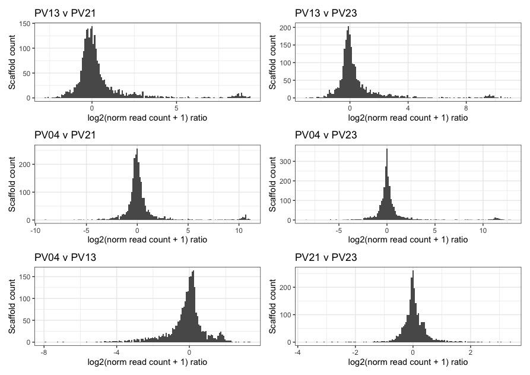

# Coverage analysis

	# working directory	
	/data/ross/mealybugs/analyses/B_viburni_andres/2_short_read_DNA_seq/0_reads
	qlogin -pe smp 24 -N busco
    /ceph/software/utilities/sge/qlogin -pe smp 16 -l h=c5 -N samtools

## 1. Raw reads

	# Novaseq reads (/data/ross/mealybugs/analyses/B_viburni_andres/2_short_read_DNA_seq/0_reads)
	180608_A00291_0042_BH3CC3DRXX_2_11372RL0001L01_1.fastq.gz -> /data/ross/mealybugs/raw/transfer.genomics.ed.ac.uk/11372_Ross_Laura/raw_data/all_reads/18_13_1B_550/180608_A00291_0042_BH3CC3DRXX_2_11372RL0001L01_1.fastq.gz
	180608_A00291_0042_BH3CC3DRXX_2_11372RL0001L01_2.fastq.gz -> /data/ross/mealybugs/raw/transfer.genomics.ed.ac.uk/11372_Ross_Laura/raw_data/all_reads/18_13_1B_550/180608_A00291_0042_BH3CC3DRXX_2_11372RL0001L01_2.fastq.gz
	180608_A00291_0042_BH3CC3DRXX_2_11372RL0002L01_1.fastq.gz -> /data/ross/mealybugs/raw/transfer.genomics.ed.ac.uk/11372_Ross_Laura/raw_data/all_reads/18_13_1B_350/180608_A00291_0042_BH3CC3DRXX_2_11372RL0002L01_1.fastq.gz
	180608_A00291_0042_BH3CC3DRXX_2_11372RL0002L01_2.fastq.gz -> /data/ross/mealybugs/raw/transfer.genomics.ed.ac.uk/11372_Ross_Laura/raw_data/all_reads/18_13_1B_350/180608_A00291_0042_BH3CC3DRXX_2_11372RL0002L01_2.fastq.gz
	180608_A00291_0042_BH3CC3DRXX_2_11372RL0002L01_1.fastq.gz -> /data/ross/mealybugs/raw/transfer.genomics.ed.ac.uk/11372_Ross_Laura/raw_data/all_reads/18_13_1B_350/180608_A00291_0042_BH3CC3DRXX_2_11372RL0002L01_1.fastq.gz
	180608_A00291_0042_BH3CC3DRXX_2_11372RL0002L01_2.fastq.gz -> /data/ross/mealybugs/raw/transfer.genomics.ed.ac.uk/11372_Ross_Laura/raw_data/all_reads/18_13_1B_350/180608_A00291_0042_BH3CC3DRXX_2_11372RL0002L01_2.fastq.gz
	pviburni.1821.0B.350.r1.fastq.gz -> /data/ross/mealybugs/raw/transfer.genomics.ed.ac.uk/11372_Ross_Laura/raw_data/data_by_date/20180618/all_reads/18_21_0B/180608_A00291_0042_BH3CC3DRXX_2_11372RL0004L01_1.fastq.gz
	pviburni.1821.0B.350.r2.fastq.gz -> /data/ross/mealybugs/raw/transfer.genomics.ed.ac.uk/11372_Ross_Laura/raw_data/data_by_date/20180618/all_reads/18_21_0B/180608_A00291_0042_BH3CC3DRXX_2_11372RL0004L01_2.fastq.gz
	pviburni.1823.0B.350.r1.fastq.gz -> /data/ross/mealybugs/raw/transfer.genomics.ed.ac.uk/11372_Ross_Laura/raw_data/data_by_date/20180618/all_reads/18_23_0B/180608_A00291_0042_BH3CC3DRXX_2_11372RL0005L01_1.fastq.gz
	pviburni.1823.0B.350.r2.fastq.gz -> /data/ross/mealybugs/raw/transfer.genomics.ed.ac.uk/11372_Ross_Laura/raw_data/data_by_date/20180618/all_reads/18_23_0B/180608_A00291_0042_BH3CC3DRXX_2_11372RL0005L01_2.fastq.gz
	pviburni.184.2B.350.r1.fastq.gz -> /data/ross/mealybugs/raw/transfer.genomics.ed.ac.uk/11372_Ross_Laura/raw_data/data_by_date/20180618/all_reads/18_4_2B/180608_A00291_0042_BH3CC3DRXX_2_11372RL0003L01_1.fastq.gz
	pviburni.184.2B.350.r2.fastq.gz -> /data/ross/mealybugs/raw/transfer.genomics.ed.ac.uk/11372_Ross_Laura/raw_data/data_by_date/20180618/all_reads/18_4_2B/180608_A00291_0042_BH3CC3DRXX_2_11372RL0003L01_2.fastq.gz

## 2. Trim with fastp

	# fastp version 0.20.0 (conda env afilia)
	fastp -i 180608_A00291_0042_BH3CC3DRXX_2_11372RL0001L01_1.fastq.gz -I 180608_A00291_0042_BH3CC3DRXX_2_11372RL0001L01_2.fastq.gz -o /scratch/afilia/PV_18-13.Illumina.550.trimmed_1.fq.gz -O /scratch/afilia/PV_18-13.Illumina.550.trimmed_2.fq.gz --cut_by_quality5 --cut_by_quality3 --cut_window_size 4 --cut_mean_quality 20 --detect_adapter_for_pe --trim_poly_g
	fastp -i 180608_A00291_0042_BH3CC3DRXX_2_11372RL0002L01_1.fastq.gz -I 180608_A00291_0042_BH3CC3DRXX_2_11372RL0002L01_2.fastq.gz -o /scratch/afilia/PV_18-13.Illumina.350.trimmed_1.fq.gz -O /scratch/afilia/PV_18-13.Illumina.350.trimmed_2.fq.gz --cut_by_quality5 --cut_by_quality3 --cut_window_size 4 --cut_mean_quality 20 --detect_adapter_for_pe --trim_poly_g
	fastp -i pviburni.1821.0B.350.r1.fastq.gz -I pviburni.1821.0B.350.r2.fastq.gz -o /scratch/afilia/PV_18-21.Illumina.350.trimmed_1.fq.gz -O /scratch/afilia/PV_18-21.Illumina.350.trimmed_2.fq.gz --cut_by_quality5 --cut_by_quality3 --cut_window_size 4 --cut_mean_quality 20 --detect_adapter_for_pe --trim_poly_g
	fastp -i pviburni.1823.0B.350.r1.fastq.gz -I pviburni.1823.0B.350.r2.fastq.gz -o /scratch/afilia/PV_18-23.Illumina.350.trimmed_1.fq.gz -O /scratch/afilia/PV_18-23.Illumina.350.trimmed_2.fq.gz --cut_by_quality5 --cut_by_quality3 --cut_window_size 4 --cut_mean_quality 20 --detect_adapter_for_pe --trim_poly_g
	fastp -i pviburni.184.2B.350.r1.fastq.gz -I pviburni.184.2B.350.r2.fastq.gz -o /scratch/afilia/PV_18-04.Illumina.350.trimmed_1.fq.gz -O /scratch/afilia/PV_18-04.Illumina.350.trimmed_2.fq.gz --cut_by_quality5 --cut_by_quality3 --cut_window_size 4 --cut_mean_quality 20 --detect_adapter_for_pe --trim_poly_g

Some basic QC (M sequences, average read length). 18-04 has twice as much data than the other samples (same as 18-13 if we pool data from the 350 and 550 libraries, which is probably the way to go)

| PV_18-04.Illumina.350.trimmed_1 | 204.97M | 147.2 |
| PV_18-04.Illumina.350.trimmed_2 | 204.97M | 147.1 |
| PV_18-13.Illumina.350.trimmed_1 | 104.48M | 147.2 |
| PV_18-13.Illumina.350.trimmed_2 | 104.48M | 147.2 |
| PV_18-13.Illumina.550.trimmed_1 | 81.16M  | 146.8 |
| PV_18-13.Illumina.550.trimmed_2 | 81.16M  | 146.7 |
| PV_18-21.Illumina.350.trimmed_1 | 101.60M | 147.5 |
| PV_18-21.Illumina.350.trimmed_2 | 101.60M | 147.4 |
| PV_18-23.Illumina.350.trimmed_1 | 108.02M | 147.6 |
| PV_18-23.Illumina.350.trimmed_2 | 108.02M | 147.6 |

Based on the assembly size (435.3Mb), we are looking at estimated coverages between 68-73X (B- lines) and 125-140X (B+ lines). That's good!

## 3. Initial mapping

	bwa index /data/ross/mealybugs/analyses/B_viburni_2020/1_pacbio_assembly/8_freeze_v0/p.viburni.freeze.v0.softmasked.fa
	bwa mem -M -t 32 /data/ross/mealybugs/analyses/B_viburni_2020/1_pacbio_assembly/8_freeze_v0/p.viburni.freeze.v0.softmasked.fa ../0_reads/PV_18-13.Illumina.350.trimmed_1.fq.gz ../0_reads/PV_18-13.Illumina.350.trimmed_2.fq.gz | samtools sort -O BAM -o /scratch/afilia/PV_18-13.Illumina.350.sorted.bam
	bwa mem -M -t 32 /data/ross/mealybugs/analyses/B_viburni_2020/1_pacbio_assembly/8_freeze_v0/p.viburni.freeze.v0.softmasked.fa ../0_reads/PV_18-13.Illumina.550.trimmed_1.fq.gz ../0_reads/PV_18-13.Illumina.550.trimmed_2.fq.gz | samtools sort -O BAM -o /scratch/afilia/PV_18-13.Illumina.550.sorted.bam
	bwa mem -M -t 32 /data/ross/mealybugs/analyses/B_viburni_2020/1_pacbio_assembly/8_freeze_v0/p.viburni.freeze.v0.softmasked.fa ../0_reads/PV_18-04.Illumina.350.trimmed_1.fq.gz ../0_reads/PV_18-04.Illumina.350.trimmed_2.fq.gz | samtools sort -O BAM -o /scratch/afilia/PV_18-04.initial.sorted.bam
	bwa mem -M -t 32 /data/ross/mealybugs/analyses/B_viburni_2020/1_pacbio_assembly/8_freeze_v0/p.viburni.freeze.v0.softmasked.fa ../0_reads/PV_18-21.Illumina.350.trimmed_1.fq.gz ../0_reads/PV_18-21.Illumina.350.trimmed_2.fq.gz | samtools sort -O BAM -o /scratch/afilia/PV_18-21.initial.sorted.bam
	bwa mem -M -t 32 /data/ross/mealybugs/analyses/B_viburni_2020/1_pacbio_assembly/8_freeze_v0/p.viburni.freeze.v0.softmasked.fa ../0_reads/PV_18-23.Illumina.350.trimmed_1.fq.gz ../0_reads/PV_18-23.Illumina.350.trimmed_2.fq.gz | samtools sort -O BAM -o /scratch/afilia/PV_18-23.initial.sorted.bam
	rsync -av /scratch/afilia/*initial.sorted.bam .

Some initial mapping stats with ```samtools flagstat```:

	==> PV_18-04.initial.sorted.stats <==
	417074917 + 0 in total (QC-passed reads + QC-failed reads)
	7133797 + 0 secondary
	0 + 0 supplementary
	0 + 0 duplicates
	395178560 + 0 mapped (94.75% : N/A)
	409941120 + 0 paired in sequencing
	204970560 + 0 read1
	204970560 + 0 read2
	356671170 + 0 properly paired (87.01% : N/A)
	386220084 + 0 with itself and mate mapped
	
	==> PV_18-13.Illumina.350.sorted.stats <==
	211557204 + 0 in total (QC-passed reads + QC-failed reads)
	2602832 + 0 secondary
	0 + 0 supplementary
	0 + 0 duplicates
	207064350 + 0 mapped (97.88% : N/A)
	208954372 + 0 paired in sequencing
	104477186 + 0 read1
	104477186 + 0 read2
	191120582 + 0 properly paired (91.47% : N/A)
	203695802 + 0 with itself and mate mapped
	
	==> PV_18-13.Illumina.550.sorted.stats <==
	164092832 + 0 in total (QC-passed reads + QC-failed reads)
	1780828 + 0 secondary
	0 + 0 supplementary
	0 + 0 duplicates
	160378458 + 0 mapped (97.74% : N/A)
	162312004 + 0 paired in sequencing
	81156002 + 0 read1
	81156002 + 0 read2
	147147792 + 0 properly paired (90.66% : N/A)
	157690294 + 0 with itself and mate mapped
	
	==> PV_18-13.initial.sorted.stats <==
	375650036 + 0 in total (QC-passed reads + QC-failed reads)
	4383660 + 0 secondary
	0 + 0 supplementary
	0 + 0 duplicates
	367442808 + 0 mapped (97.82% : N/A)
	371266376 + 0 paired in sequencing
	185633188 + 0 read1
	185633188 + 0 read2
	338268374 + 0 properly paired (91.11% : N/A)
	361386096 + 0 with itself and mate mapped

	==> PV_18-21.initial.sorted.stats <==
	207025803 + 0 in total (QC-passed reads + QC-failed reads)
	3816983 + 0 secondary
	0 + 0 supplementary
	0 + 0 duplicates
	201661407 + 0 mapped (97.41% : N/A)
	203208820 + 0 paired in sequencing
	101604410 + 0 read1
	101604410 + 0 read2
	181141304 + 0 properly paired (89.14% : N/A)
	196881368 + 0 with itself and mate mapped
	
	==> PV_18-23.initial.sorted.stats <==
	220155946 + 0 in total (QC-passed reads + QC-failed reads)
	4107946 + 0 secondary
	0 + 0 supplementary
	0 + 0 duplicates
	212848740 + 0 mapped (96.68% : N/A)
	216048000 + 0 paired in sequencing
	108024000 + 0 read1
	108024000 + 0 read2
	190849052 + 0 properly paired (88.34% : N/A)
	207719570 + 0 with itself and mate mapped

It makes sense to keep primary mapped reads only, as secondary hits might map to A and B.

	samtools view -@ 16 -F 256 -b PV_18-04.initial.sorted.bam -o /scratch/afilia/PV_18-04.initial.sorted.primary.only.bam
	samtools view -@ 16 -F 256 -b PV_18-13.initial.sorted.bam -o /scratch/afilia/PV_18-13.initial.sorted.primary.only.bam
	samtools view -@ 16 -F 256 -b PV_18-21.initial.sorted.bam -o /scratch/afilia/PV_18-21.initial.sorted.primary.only.bam
	samtools view -@ 16 -F 256 -b PV_18-23.initial.sorted.bam -o /scratch/afilia/PV_18-23.initial.sorted.primary.only.bam

Collect stats and ```samtools index```

Mapped reads per contig:

	samtools idxstats PV_18-04.initial.sorted.primary.only.bam > PV_18-04.primary.reads.mapped.count
	samtools idxstats PV_18-13.initial.sorted.primary.only.bam > PV_18-13.primary.reads.mapped.count
	samtools idxstats PV_18-21.initial.sorted.primary.only.bam > PV_18-21.primary.reads.mapped.count
	samtools idxstats PV_18-23.initial.sorted.primary.only.bam > PV_18-23.primary.reads.mapped.count

Alternatively, we could also collect coverage depths per contig:

	samtools depth PV_18-04.freeze.v0.sorted.bam | awk '/BEGIN/{scf='scaffold_1'; coverage_sum = 0; }{ if( scf != $1 ){ print scf "\t" coverage_sum; scf = $1; coverage_sum = $3 } else { scf = $1; coverage_sum += $3} }' > PV_18-04.scaffold.depth
	samtools depth PV_18-13.freeze.v0.sorted.bam | awk '/BEGIN/{scf='scaffold_1'; coverage_sum = 0; }{ if( scf != $1 ){ print scf "\t" coverage_sum; scf = $1; coverage_sum = $3 } else { scf = $1; coverage_sum += $3} }' > PV_18-13.scaffold.depth
	samtools depth PV_18-21.freeze.v0.sorted.bam | awk '/BEGIN/{scf='scaffold_1'; coverage_sum = 0; }{ if( scf != $1 ){ print scf "\t" coverage_sum; scf = $1; coverage_sum = $3 } else { scf = $1; coverage_sum += $3} }' > PV_18-21.scaffold.depth
	samtools depth PV_18-23.freeze.v0.sorted.bam | awk '/BEGIN/{scf='scaffold_1'; coverage_sum = 0; }{ if( scf != $1 ){ print scf "\t" coverage_sum; scf = $1; coverage_sum = $3 } else { scf = $1; coverage_sum += $3} }' > PV_18-23.scaffold.depth

Extract mapped reads with ```bamfilter``` (inclusion/exclusion list is needed, just made an empty one)

	/ceph/software/blobtools/blobtools bamfilter -b PV_18-21.initial.sorted.bam -o /scratch/afilia/PV_18-21 -n -f fq -e no_contigs.txt
	/ceph/software/blobtools/blobtools bamfilter -b PV_18-23.initial.sorted.bam -o /scratch/afilia/PV_18-23 -n -f fq -e no_contigs.txt
	/ceph/software/blobtools/blobtools bamfilter -b PV_18-04.initial.sorted.bam -o /scratch/afilia/PV_18-04 -n -f fq -e no_contigs.txt -U
	/ceph/software/blobtools/blobtools bamfilter -b PV_18-13.Illumina.350.sorted.bam -o /scratch/afilia/PV_18-13.350 -n -f fq -e no_contigs.txt -U
	/ceph/software/blobtools/blobtools bamfilter -b PV_18-13.Illumina.550.sorted.bam -o /scratch/afilia/PV_18-13.550 -n -f fq -e no_contigs.txt -U

## 4. Remapping

	bwa mem -M -t 32 /data/ross/mealybugs/analyses/B_viburni_2020/1_pacbio_assembly/8_freeze_v0/p.viburni.freeze.v0.softmasked.fa ../1_mapping/PV_18-13.350.PV_18-13.Illumina.350.sorted.bam.InIn.1.fq ../1_mapping/PV_18-13.350.PV_18-13.Illumina.350.sorted.bam.InIn.2.fq | samtools sort -O BAM -o /scratch/afilia/PV_18-13.350.freeze.v0.sorted.bam
	bwa mem -M -t 32 /data/ross/mealybugs/analyses/B_viburni_2020/1_pacbio_assembly/8_freeze_v0/p.viburni.freeze.v0.softmasked.fa ../1_mapping/PV_18-13.550.PV_18-13.Illumina.550.sorted.bam.InIn.1.fq ../1_mapping/PV_18-13.550.PV_18-13.Illumina.550.sorted.bam.InIn.2.fq | samtools sort -O BAM -o /scratch/afilia/PV_18-13.550.freeze.v0.sorted.bam
	bwa mem -M -t 32 /data/ross/mealybugs/analyses/B_viburni_2020/1_pacbio_assembly/8_freeze_v0/p.viburni.freeze.v0.softmasked.fa ../1_mapping/PV_18-04.PV_18-04.initial.sorted.bam.InIn.1.fq ../1_mapping/PV_18-04.PV_18-04.initial.sorted.bam.InIn.2.fq | samtools sort -O BAM -o /scratch/afilia/PV_18-04.freeze.v0.sorted.bam
	bwa mem -M -t 32 /data/ross/mealybugs/analyses/B_viburni_2020/1_pacbio_assembly/8_freeze_v0/p.viburni.freeze.v0.softmasked.fa ../1_mapping/PV_18-21.PV_18-21.initial.sorted.bam.InIn.1.fq ../1_mapping/PV_18-21.PV_18-21.initial.sorted.bam.InIn.2.fq | samtools sort -O BAM -o /scratch/afilia/PV_18-21.freeze.v0.sorted.bam
	bwa mem -M -t 32 /data/ross/mealybugs/analyses/B_viburni_2020/1_pacbio_assembly/8_freeze_v0/p.viburni.freeze.v0.softmasked.fa ../1_mapping/PV_18-23.PV_18-23.initial.sorted.bam.InIn.1.fq ../1_mapping/PV_18-23.PV_18-23.initial.sorted.bam.InIn.2.fq | samtools sort -O BAM -o /scratch/afilia/PV_18-23.freeze.v0.sorted.bam
	samtools merge /scratch/afilia/PV_18-13.freeze.v0.sorted.bam /scratch/afilia/PV_18-13.350.freeze.v0.sorted.bam /scratch/afilia/PV_18-13.550.freeze.v0.sorted.bam

## 5. Exploring coverages

We can explore per-contig coverage differences between lines: log2((mapped reads line 1 + 1)/(mapped reads line 2 + 1)). Indeed, when we compare B+ lines to B- lines, we see a few contigs that have much higher coverage in B+ lines:


while we see no such differences comparing B+ lines and B- lines:


This is promising. Before we carry on, let's normalise all libraries by lowest number of reads (PV_18-21)

	# mapped read count
	sum(reads.all.lines[, 'PV04.mapped']) # 388044763
	sum(reads.all.lines[, 'PV13.mapped']) # 363059148
	sum(reads.all.lines[, 'PV21.mapped']) # 197844424
	sum(reads.all.lines[, 'PV23.mapped']) # 208740794
	# normalisation factor
	norm.04 <- sum(reads.all.lines[, 'PV21.mapped']) / sum(reads.all.lines[, 'PV04.mapped']) # 0.51
	norm.13 <- sum(reads.all.lines[, 'PV21.mapped']) / sum(reads.all.lines[, 'PV13.mapped']) # 0.55
	norm.23 <- sum(reads.all.lines[, 'PV21.mapped']) / sum(reads.all.lines[, 'PV23.mapped']) # 0.95
	norm.21 <- 1

And replot. Now the peak of the histogram is centered at 0:



We can define two preliminary sets of candidate B scaffolds based on coverage:

	b.candidates <- reads.all.lines[reads.all.lines$cov.13v21 >= 0.58 & reads.all.lines$cov.13v23 >= 0.58 & reads.all.lines$cov.04v21 >= 0.58 & reads.all.lines$cov.04v23 >= 0.58,] # assuming 1 B copy + 2 A copies
	b.candidates.strict <- reads.all.lines[reads.all.lines$cov.13v21 >= 2 & reads.all.lines$cov.13v23 >= 2 & reads.all.lines$cov.04v21 >= 2 & reads.all.lines$cov.04v23 >= 2,]

which gives us 109 putative B scaffolds with the more strict filtering (1.46Mb) and 198 with the losser filtering (3.06Mb). That's not a lot...

Of course, some of these contigs may be highly repetitive sequences, which should show higher coverage. This is indeed what we see:


(note that the putative B linked scaffold have comparatively higher coverage in PV04, which is consistent with the expectation of 2B chromosomes)

| B status | Mean read cov ratio (PV04/PV13) | SD   |
|----------|---------------------------------|------|
| A        | 0.99                            | 0.50 |
| B loose  | 1.08                            | 0.55 |
| B strict | 2.61                            | 0.71 |


## 5.1. Only primary reads

samtools view -F 256 input.bam

samtools view -@ 16 -F 256 -b PV_18-04.initial.sorted.bam -o /scratch/afilia/PV_18-04.initial.sorted.primary.only.bam
samtools view -@ 16 -F 256 -b PV_18-13.initial.sorted.bam -o /scratch/afilia/PV_18-13.initial.sorted.primary.only.bam
samtools view -@ 16 -F 256 -b PV_18-21.initial.sorted.bam -o /scratch/afilia/PV_18-21.initial.sorted.primary.only.bam
samtools view -@ 16 -F 256 -b PV_18-23.initial.sorted.bam -o /scratch/afilia/PV_18-23.initial.sorted.primary.only.bam
rsync -av /scratch/afilia/*primary.only* .

## 6. kmer method


## 6. kmer method

Following Christina and Kamil's *Sciara* pipeline: https://github.com/RossLab/Sciara-L-chromosome/blob/master/analyses/assigment-of-L-X-A.md

	conda activate default_genomics
	# build kmer db
	qsub -cwd -N kmc_heads -V -pe smp64 20 -b yes 'L=5; U=175; SCRATCH=/scratch/$USER/$JOB_ID/; mkdir -p $SCRATCH/tmp data/L-X-A-kmers/kmer_db; kmc -k27 -t20 -m64 -ci$L -cs$U data/L-X-A-kmers/raw_reads/bamfilter.head2.clc.mar29.scop.head2.vs.scop.clc.sorted.bam.InIn.fq.gz $SCRATCH/head_kmer_counts $SCRATCH/tmp && mv $SCRATCH/head_kmer_counts* data/L-X-A-kmers/kmer_db'
	# generate alphabetically sorted dump of kmers and their coverages
	qsub -cwd -N kmc_dump_heads -V -pe smp64 20 -b yes 'L=5; U=174; SCRATCH=/scratch/$USER/$JOB_ID; mkdir -p $SCRATCH; kmc_tools transform data/L-X-A-kmers/kmer_db/head_kmer_counts -ci$L -cx$U dump -s $SCRATCH/head_k27.dump && mv $SCRATCH/head_k27.dump data/L-X-A-kmers/kmer_db'
	qsub -cwd -N kmc_testes -V -pe smp64 20 -b yes 'L=5; U=175; SCRATCH=/scratch/$USER/$JOB_ID/; mkdir -p $SCRATCH/tmp data/L-X-A-kmers/kmer_db; kmc -k27 -t20 -m64 -ci$L -cs$U data/L-X-A-kmers/raw_reads/bamfilter.testes.clc.mar29.scop.testes.vs.scop.clc.sorted.bam.InIn.fq.gz $SCRATCH/testes_kmer_counts $SCRATCH/tmp && mv $SCRATCH/testes_kmer_counts* data/L-X-A-kmers/kmer_db'
	qsub -cwd -N kmc_dump_testes -V -pe smp64 20 -b yes 'L=5; U=174; SCRATCH=/scratch/$USER/$JOB_ID/; mkdir -p $SCRATCH; kmc_tools transform data/L-X-A-kmers/kmer_db/testes_kmer_counts -ci$L -cx$U dump -s $SCRATCH/testes_k27.dump && mv $SCRATCH/testes_k27.dump data/L-X-A-kmers/kmer_db'

	kmc -k27 -t20 -m64 data/L-X-A-kmers/raw_reads/bamfilter.testes.clc.mar29.scop.testes.vs.scop.clc.sorted.bam.InIn.fq.gz $SCRATCH/testes_kmer_counts $SCRATCH/tmp && rsync -av /scratch/afilia/testes_kmer_counts* data/L-X-A-kmers/kmer_db'
	kmc -k27 -t20 -m64 data/L-X-A-kmers/raw_reads/bamfilter.testes.clc.mar29.scop.testes.vs.scop.clc.sorted.bam.InIn.fq.gz $SCRATCH/testes_kmer_counts $SCRATCH/tmp && rsync -av /scratch/afilia/testes_kmer_counts* data/L-X-A-kmers/kmer_db'
	kmc -k27 -t20 -m64 data/L-X-A-kmers/raw_reads/bamfilter.testes.clc.mar29.scop.testes.vs.scop.clc.sorted.bam.InIn.fq.gz $SCRATCH/testes_kmer_counts $SCRATCH/tmp && rsync -av /scratch/afilia/testes_kmer_counts* data/L-X-A-kmers/kmer_db'
	kmc -k27 -t20 -m64 data/L-X-A-kmers/raw_reads/bamfilter.testes.clc.mar29.scop.testes.vs.scop.clc.sorted.bam.InIn.fq.gz $SCRATCH/testes_kmer_counts $SCRATCH/tmp && rsync -av /scratch/afilia/testes_kmer_counts* data/L-X-A-kmers/kmer_db'

	ln -s ../../2_short_read_DNA_seq/1_mapping/PV_18-04.initial.sorted.bam 
	ln -s ../../2_short_read_DNA_seq/1_mapping/PV_18-13.Illumina.350.sorted.bam 
	ln -s ../../2_short_read_DNA_seq/1_mapping/PV_18-13.Illumina.550.sorted.bam 
	ln -s ../../2_short_read_DNA_seq/1_mapping/PV_18-21.initial.sorted.bam 
	ln -s ../../2_short_read_DNA_seq/1_mapping/PV_18-23.initial.sorted.bam 

