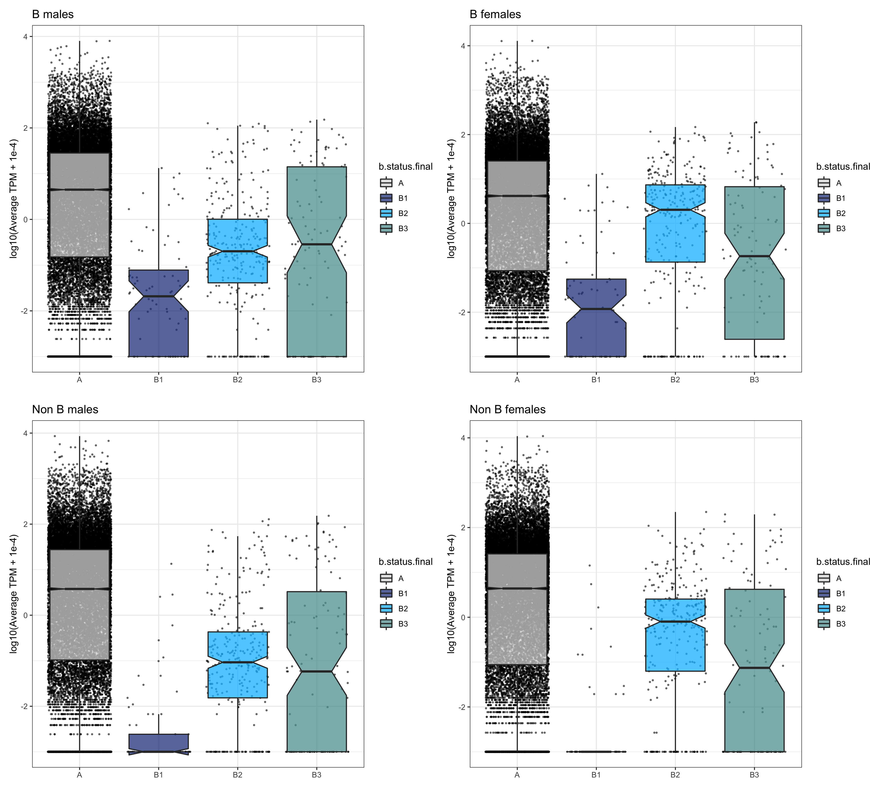

# Exploring B genes

	# working directory	
	/data/ross/mealybugs/analyses/B_viburni_2020/5_B_genes
	qlogin -pe smp64 32 -N bwa -l h=bigwig
    /ceph/software/utilities/sge/qlogin -pe smp64 32 -N bamfilter

We now have: 1) a genome assembly with an annotation (from blast, diamond, interproscan -- see 1_Genome_assembly), 2) a list of candidate B scaffolds (see 3_Coverage_analysis.md) and 3) lists of differentially expressed genes between B-carrying and non-carrying males and females. We can combine all this data and see what we can learn about the gene content of our putative B sequences.

## 1. Review our master annotation

Let's prepare a master file with annotated genes. For now, we are going to collapse transcripts into genes and add what we know from the different annotation sources [(R script here)](https://github.com/RossLab/B_viburni/blob/master/R_scripts/Gene_annotation.R). 8,914 genes have BLAST annotations, 10,915 have diamond annotations and 12,524 have a function assigned by interproscan (ignoring for now GO annotations, etc). In total, 13,515 genes are annotated, which is 57% of the 23,629 predicted genes.

## 2. Genes on the B scaffolds

The R script is [here](https://github.com/RossLab/B_viburni/blob/master/R_scripts/Exploring_AB_genes.R). Let's start by exploring which genes fall in B candidate regions.

| Status | Genes | Of which annotated |
|--------|-------|--------------------|
| A      | 23143 | 13309 (58%)        |
| B1     | 78    | 32 (41%)           |
| B2     | 297   | 112 (37%)          |
| B3     | 111   | 62 (56%)           |

These are the genes with annotation features located on candidate B scaffolds:

|gene  |b.status.final|seq          |gene_len|blast                           |diamond              |interpro                                                                                                                                                                                                                                                                        |
|------|--------------|-------------|--------|--------------------------------|---------------------|--------------------------------------------------------------------------------------------------------------------------------------------------------------------------------------------------------------------------------------------------------------------------------|
|g16324|B1            |scaffold_1148|797     |KIF23_HUMAN                     |K7J331               |Kinesin motor domain                                                                                                                                                                                                                                                            |
|g16323|B1            |scaffold_1148|725     |KIF23_HUMAN                     |K7J331               |Kinesin motor domain                                                                                                                                                                                                                                                            |
|g12159|B1            |scaffold_1269|1076    |NA                              |A0A226CTZ9           |NA                                                                                                                                                                                                                                                                              |
|g12160|B1            |scaffold_1269|1038    |NA                              |A0A226DDY8           |hAT family C-terminal dimerisation region                                                                                                                                                                                                                                       |
|g16455|B1            |scaffold_1425|3374    |PAIN_DROME                      |A0A482WJY3           |Ion transport protein,Ankyrin repeats (3 copies)                                                                                                                                                                                                                                |
|g16456|B1            |scaffold_1425|788     |NA                              |A0A2P8Z590           |Ion transport protein                                                                                                                                                                                                                                                           |
|g17664|B1            |scaffold_1508|1238    |RM38_MOUSE                      |A0A067QJE0           |Phosphatidylethanolamine-binding protein                                                                                                                                                                                                                                        |
|g17662|B1            |scaffold_1508|1823    |SUCB2_COLLI                     |R4G3Z4               |ATP-grasp domain                                                                                                                                                                                                                                                                |
|g17661|B1            |scaffold_1508|267     |NA                              |A0A482VIA6           |NA                                                                                                                                                                                                                                                                              |
|g15851|B1            |scaffold_1514|2339    |NA                              |J9K4F9               |NA                                                                                                                                                                                                                                                                              |
|g23391|B1            |scaffold_1768|2182    |NA                              |J9LQI3               |NA                                                                                                                                                                                                                                                                              |
|g13953|B1            |scaffold_2040|1483    |EP300_HUMAN                     |A0A3B3RK67           |Histone acetylation protein                                                                                                                                                                                                                                                     |
|g1208 |B1            |scaffold_2293|283     |FAS_CHICK                       |A0A2J7PFW7           |NA                                                                                                                                                                                                                                                                              |
|g20100|B1            |scaffold_552 |3042    |NA                              |A0A087T926           |Immunoglobulin I-set domain,MULE transposase domain                                                                                                                                                                                                                             |
|g20092|B1            |scaffold_552 |2589    |NA                              |A0A0R3QBG2           |Endonuclease-reverse transcriptase,Reverse transcriptase (RNA-dependent DNA polymerase)                                                                                                                                                                                         |
|g20103|B1            |scaffold_552 |842     |NA                              |J9L5G6               |NA                                                                                                                                                                                                                                                                              |
|g20090|B1            |scaffold_552 |686     |NA                              |NA                   |Protein of unknown function (DUF1759)                                                                                                                                                                                                                                           |
|g20111|B1            |scaffold_552 |965     |NA                              |NA                   |Immunoglobulin I-set domain                                                                                                                                                                                                                                                     |
|g20115|B1            |scaffold_552 |482     |NA                              |J9KK61               |NA                                                                                                                                                                                                                                                                              |
|g20084|B1            |scaffold_552 |1170    |NA                              |A0A0J7N8Y6           |Integrase zinc binding domain                                                                                                                                                                                                                                                   |
|g20112|B1            |scaffold_552 |971     |NA                              |NA                   |Immunoglobulin domain                                                                                                                                                                                                                                                           |
|g20097|B1            |scaffold_552 |552     |NA                              |T1HLH9               |NA                                                                                                                                                                                                                                                                              |
|g20106|B1            |scaffold_552 |1316    |YMD2_CAEEL                      |A0A151IDY8           |NA                                                                                                                                                                                                                                                                              |
|g20110|B1            |scaffold_552 |641     |NA                              |D6WQK2               |NA                                                                                                                                                                                                                                                                              |
|g20108|B1            |scaffold_552 |2547    |NA                              |A0A0R3QAL5           |Integrase core domain                                                                                                                                                                                                                                                           |
|g2644 |B1            |scaffold_786 |4614    |PGBD4_HUMAN                     |X1X046               |Transposase IS4                                                                                                                                                                                                                                                                 |
|g9063 |B1            |scaffold_848 |327     |TRET1_DROPS                     |A0A3Q0J369           |Sugar (and other) transporter                                                                                                                                                                                                                                                   |
|g9061 |B1            |scaffold_848 |1328    |NA                              |NA                   |Predicted AAA-ATPase                                                                                                                                                                                                                                                            |
|g9062 |B1            |scaffold_848 |1025    |NA                              |A0A1H8D3N8           |Predicted AAA-ATPase                                                                                                                                                                                                                                                            |
|g2155 |B1            |scaffold_887 |3164    |NA                              |J9KIL6               |NA                                                                                                                                                                                                                                                                              |
|g5582 |B1            |scaffold_897 |663     |FAS_ANSAN                       |A0A158NZW8           |Beta-ketoacyl synthase, N-terminal domain                                                                                                                                                                                                                                       |
|g19061|B1            |scaffold_902 |1061    |NA                              |K7JWY9               |Reverse transcriptase (RNA-dependent DNA polymerase)                                                                                                                                                                                                                            |

Genes in B2 and B3 are [here.](https://github.com/RossLab/B_viburni/blob/master/output/genes.in.Bs.anno.csv)

## 3. Examining differentially expressed genes

### 3.1 Genes that are overexpressed in B males compared to the other three groups

|gene  |seq          |gene_len|blast      |diamond   |interpro                                                                      |anno|length |b.status.final|cov.04v13   |b.status|b.status.asn|b.status.kmer|
|------|-------------|--------|-----------|----------|------------------------------------------------------------------------------|----|-------|--------------|------------|--------|------------|-------------|
|g11147|scaffold_751 |1109    |NA         |NA        |NA                                                                            |N   |61138  |A             |0.77159731  |A       |A           |A            |
|g1124 |scaffold_605 |432     |NA         |NA        |NA                                                                            |N   |140797 |A             |-2.176253484|A       |A           |A            |
|g1125 |scaffold_605 |317     |NA         |NA        |NA                                                                            |N   |140797 |A             |-2.176253484|A       |A           |A            |
|g1126 |scaffold_605 |403     |NA         |NA        |NA                                                                            |N   |140797 |A             |-2.176253484|A       |A           |A            |
|g1127 |scaffold_605 |394     |NA         |NA        |NA                                                                            |N   |140797 |A             |-2.176253484|A       |A           |A            |
|g11727|scaffold_168 |1733    |NA         |X1WKK7    |Transposase IS4                                                               |Y   |815591 |A             |-0.735291064|A       |A           |A            |
|g11911|scaffold_74  |1326    |NA         |NA        |NA                                                                            |N   |1279699|A             |-0.154455423|A       |A           |A            |
|g12210|scaffold_449 |1160    |NA         |Q8A7P0    |Predicted AAA-ATPase                                                          |Y   |264459 |A             |0.417029185 |A       |A           |A            |
|g13773|scaffold_1833|1288    |NA         |K7JKD4    |Haemolysin E (HlyE)                                                           |Y   |8794   |A             |-4.417022   |A       |A           |A            |
|g13953|scaffold_2040|1483    |EP300_HUMAN|A0A3B3RK67|Histone acetylation protein                                                   |Y   |6888   |B1            |1.200703    |B.strict|A           |B            |
|g14433|scaffold_344 |1424    |NA         |A0A2P8XL08|FLYWCH zinc finger domain,MULE transposase domain                             |Y   |387431 |A             |-0.252071193|A       |A           |A            |
|g14861|scaffold_33  |2292    |CMTR2_MOUSE|A0A2P8ZED2|FtsJ-like methyltransferase                                                   |Y   |1685622|A             |0.059508347 |A       |A           |A            |
|g15418|scaffold_133 |786     |NA         |NA        |Eukaryotic-type carbonic anhydrase                                            |Y   |943319 |A             |0.108656035 |A       |A           |A            |
|g1752 |scaffold_1732|1061    |NA         |NA        |gag-polypeptide of LTR copia-type,Zinc knuckle                                |Y   |9831   |A             |0.8821506   |A       |A           |A            |
|g17908|scaffold_983 |1353    |CP4G1_DROME|J9JU30    |Cytochrome P450                                                               |Y   |25831  |A             |-4.409886326|A       |A           |A            |
|g18037|scaffold_507 |368     |NA         |NA        |NA                                                                            |N   |218151 |A             |-0.061883271|A       |A           |A            |
|g18767|scaffold_114 |377     |NA         |NA        |NA                                                                            |N   |1045659|A             |-0.645628229|A       |A           |A            |
|g20946|scaffold_91  |1541    |NA         |A0A2P8Z519|MULE transposase domain,FLYWCH zinc finger domain                             |Y   |1192111|A             |-0.163877665|A       |A           |A            |
|g21055|scaffold_1221|748     |NA         |NA        |gag-polypeptide of LTR copia-type                                             |Y   |17992  |A             |-1.537484   |A       |A           |A            |
|g2153 |scaffold_1275|1472    |NA         |NA        |NA                                                                            |N   |17055  |A             |1.28001     |A       |A           |A            |
|g22019|scaffold_124 |3066    |NA         |NA        |NA                                                                            |N   |971564 |A             |-0.484528266|A       |A           |A            |
|g22863|scaffold_37  |1097    |SPOPB_XENLA|A0A1I8Q4G3|BTB/POZ domain                                                                |Y   |1648890|A             |-0.516654036|A       |A           |A            |
|g23373|scaffold_470 |2003    |NA         |NA        |Sugar (and other) transporter                                                 |Y   |246332 |A             |-0.027165255|A       |A           |A            |
|g2571 |scaffold_90  |1849    |NA         |E2A388    |DDE superfamily endonuclease                                                  |Y   |1197345|A             |-0.385385508|A       |A           |A            |
|g2736 |scaffold_51  |890     |NA         |NA        |NA                                                                            |N   |1437107|A             |0.002535954 |A       |A           |A            |
|g3147 |scaffold_338 |549     |NA         |NA        |NA                                                                            |N   |393854 |A             |-0.665898142|A       |A           |A            |
|g4426 |scaffold_94  |1000    |NA         |A0A2P8XIJ0|Transposase IS4                                                               |Y   |1173942|A             |-0.107697128|A       |A           |A            |
|g5181 |scaffold_504 |1548    |NA         |NA        |NA                                                                            |N   |220088 |A             |0.432674571 |A       |A           |A            |
|g5312 |scaffold_1578|879     |NA         |NA        |Transposase IS4                                                               |Y   |11811  |B2            |0.2228978   |B.loose |A           |A            |
|g5555 |scaffold_530 |1219    |NA         |NA        |NA                                                                            |N   |203235 |A             |0.179661075 |A       |A           |A            |
|g5653 |scaffold_1013|2682    |POLX_TOBAC |A0A182GA29|Reverse transcriptase (RNA-dependent DNA polymerase),Integrase core domain    |Y   |24300  |A             |0.09870272  |A       |A           |A            |
|g5671 |scaffold_555 |2120    |NA         |A0A2P8ZLW3|Transposase IS4                                                               |Y   |186860 |A             |-0.278888281|A       |A           |A            |
|g627  |scaffold_132 |434     |NA         |NA        |NA                                                                            |N   |944065 |A             |0.057401898 |A       |A           |A            |
|g6708 |scaffold_179 |217     |NA         |NA        |NA                                                                            |N   |784024 |A             |-0.047199162|A       |A           |A            |
|g6828 |scaffold_81  |1985    |NA         |A0A1U8N8I4|Domain of unknown function (DUF4371),hAT family C-terminal dimerisation region|Y   |1225220|A             |0.215128728 |A       |A           |A            |
|g7913 |scaffold_46  |666     |NA         |NA        |NA                                                                            |N   |1511820|A             |0.268979898 |A       |A           |A            |
|g8501 |scaffold_543 |761     |NA         |NA        |NA                                                                            |N   |195591 |B3            |-0.047139289|B.loose |A           |A            |
|g8748 |scaffold_194 |342     |NA         |NA        |NA                                                                            |N   |708625 |A             |0.044440259 |A       |A           |A            |
|g8749 |scaffold_194 |721     |NA         |NA        |NA                                                                            |N   |708625 |A             |0.044440259 |A       |A           |A            |
|g9431 |scaffold_434 |1442    |NA         |NA        |NA                                                                            |N   |283348 |A             |-0.046589381|A       |A           |A            |

Only three of these 40 genes fall in B candidate regions -- including a Histone acetylation protein which has a homolog in humans, EP300, which is a coactivator of gene expression. See also https://www.ebi.ac.uk/interpro/entry/InterPro/IPR013178/ This is potentially interesting!

On the other hand, 3 genes are downregulated in B males compared to the rest of the groups. Of these only one is annotated: g4126 in scaffold_70: SH2B2_MOUSE/A0A482WUF0	SH2 domain,PH domain,Phenylalanine zipper.

### 3.2 B males v non-B males

Over expressed genes in B males:

| Status | Genes | Of which annotated |
|--------|-------|--------------------|
| A      | 155   | 85                 |
| B1     | 5     | 4                  |
| B2     | 3     | 2                  |
| B3     | 5     | 3                  |

The complete list of genes is [here](https://github.com/RossLab/B_viburni/blob/master/output/diff_expr/de.over.B.males.vs.nonB.males.anno.csv). Of note, these are the overexpressed genes that are located on B scaffolds:

|gene  |logFC      |seq          |gene_len|blast      |diamond   |interpro                                                  |anno|length|b.status.final|
|------|-----------|-------------|--------|-----------|----------|----------------------------------------------------------|----|------|--------------|
|g9061 |4.94156601 |scaffold_848 |1328    |NA         |NA        |Predicted AAA-ATPase                                      |Y   |36415 |B1            |
|g1208 |5.577602003|scaffold_2293|283     |FAS_CHICK  |A0A2J7PFW7|NA                                                        |Y   |4891  |B1            |
|g5582 |6.425348137|scaffold_897 |663     |FAS_ANSAN  |A0A158NZW8|Beta-ketoacyl synthase, N-terminal domain                 |Y   |31263 |B1            |
|g20085|6.287153573|scaffold_552 |1087    |NA         |NA        |NA                                                        |N   |189883|B1            |
|g13953|6.322935117|scaffold_2040|1483    |EP300_HUMAN|A0A3B3RK67|Histone acetylation protein                               |Y   |6888  |B1            |
|g5312 |3.456026577|scaffold_1578|879     |NA         |NA        |Transposase IS4                                           |Y   |11811 |B2            |
|g507  |6.593941871|scaffold_816 |601     |NA         |NA        |ERAP1-like C-terminal domain                              |Y   |42994 |B2            |
|g88   |4.351603979|scaffold_360 |1055    |NA         |NA        |NA                                                        |N   |372701|B2            |
|g18439|8.518124548|scaffold_1579|577     |CSN4_DANRE |A0A2J7R0G0|CSN4/RPN5/eIF3a helix turn helix domain,PCI domain        |Y   |11810 |B3            |
|g2645 |8.806049822|scaffold_1454|894     |NA         |J9K3D3    |Thioesterase domain                                       |Y   |13677 |B3            |
|g15527|6.359588098|scaffold_1202|446     |NA         |NA        |NA                                                        |N   |18321 |B3            |
|g8501 |3.277392   |scaffold_543 |761     |NA         |NA        |NA                                                        |N   |195591|B3            |
|g5232 |10.97762972|scaffold_2160|2567    |NA         |NA        |Transactive response DNA-binding protein N-terminal domain|Y   |5884  |B3            |

Under expressed genes in B males (list [here)](https://github.com/RossLab/B_viburni/blob/master/output/diff_expr/de.under.B.males.vs.nonB.males.anno.csv):

| Status | Genes | Of which annotated |
|--------|-------|--------------------|
| A      | 77    | 35                 |
| B1     | 0     | 0                  |
| B2     | 1     | 1                  |
| B3     | 1     | 1                  |

Of course we shouldn't expect any underexpressed genes to fall within B candidate regions. It would be good to explore the scaffolds and see what's going on there. The genes are g7421 (scaffold_526, B3; RCBT1_MOUSE - A0A232EN37 - BTB/POZ domain,Regulator of chromosome condensation (RCC1) repeat) and g5248 (scaffold_814, B4; CATA_ASCSU - A0A2J7REJ5 - Catalase-related immune-responsive,Catalase	Y)

### 3.3 B females v non-B females

Do we find any evidence of expression of B linked genes in females?

Over expressed genes in B females (list [here)](https://github.com/RossLab/B_viburni/blob/master/output/diff_expr/de.over.B.females.vs.nonB.females.anno.csv):

| Status | Genes | Of which annotated |
|--------|-------|--------------------|
| A      | 124   | 68                 |
| B1     | 7     | 4                  |
| B2     | 3     | 3                  |
| B3     | 4     | 3                  |

Under expressed genes in B females (list [here)](https://github.com/RossLab/B_viburni/blob/master/output/diff_expr/de.under.B.females.vs.nonB.females.anno.csv):

| Status | Genes | Of which annotated |
|--------|-------|--------------------|
| A      | 81    | 31                 |
| B1     | 0     | 0                  |
| B2     | 1     | 1                  |
| B3     | 0     | 0                  |

The B3 gene is also g7421.

### 3.4 Other comparisons

Let's ignore for now the many differentially expressed genes between males and females that differ in their B status. The vast majority of these genes are predicted to be due to sex, so it doesn't make much sense to go through all these lists individually. Here they are (note that these lists of differentially expressed genes: overexpressed genes in the focal group are those with a positive logFC):

 - [B males vs B females](https://github.com/RossLab/B_viburni/blob/master/output/diff_expr/de.B.males.vs.B.females.anno.csv)
 - [B males vs non B females](https://github.com/RossLab/B_viburni/blob/master/output/diff_expr/de.B.males.vs.nonB.females.anno.csv)
 - [Non B males vs non B females](https://github.com/RossLab/B_viburni/blob/output/diff_expr/misc/de.nonB.males.vs.nonB.females.anno.csv)

 (Note: non B males v B females is missing -- are we interested in this one?)

 Still, let's do something with this data. We can start by looking at the genes in putative B regions that are overexpressed in B-carrying males and females (again, positive logFC are overexpressed in males, negative in females). Our old friend g13953 is the only annotated gene in a high confidence B scaffold that differs between sexes.

 |gene  |logFC       |seq          |gene_len|blast      |diamond   |interpro                                                    |anno|length|b.status.final|
|------|------------|-------------|--------|-----------|----------|------------------------------------------------------------|----|------|--------------|-
|g13953|6.950348098 |scaffold_2040|1483    |EP300_HUMAN|A0A3B3RK67|Histone acetylation protein                                 |Y   |6888  |B1            |
|g9552 |-3.525249076|scaffold_1388|1646    |NA         |NA        |NA                                                          |N   |14907 |B1            |
|g19187|6.642309779 |scaffold_1000|386     |NA         |NA        |NA                                                          |N   |25048 |B2            |
|g5309 |6.413330994 |scaffold_1578|398     |NA         |NA        |NA                                                          |N   |11811 |B2            |
|g6857 |6.320049976 |scaffold_1082|954     |NA         |J9LMH3    |Transposase IS4                                             |Y   |21822 |B2            |
|g5312 |6.304707425 |scaffold_1578|879     |NA         |NA        |Transposase IS4                                             |Y   |11811 |B2            |
|g5311 |5.737844319 |scaffold_1578|1420    |NA         |A0A087T137|Transposase IS4                                             |Y   |11811 |B2            |
|g113  |3.522231021 |scaffold_360 |1199    |NA         |NA        |NA                                                          |N   |372701|B2            |
|g114  |3.47837827  |scaffold_360 |551     |NA         |NA        |NA                                                          |N   |372701|B2            |
|g17806|2.515742651 |scaffold_295 |645     |BHE22_XENTR|A0A1S3D3L0|Helix-loop-helix DNA-binding domain                         |Y   |464503|B2            |
|g6318 |-2.35674744 |scaffold_1079|1126    |NA         |NA        |NA                                                          |N   |21898 |B2            |
|g13962|-2.591672845|scaffold_632 |337     |NA         |NA        |NA                                                          |N   |119487|B2            |
|g507  |-3.492535293|scaffold_816 |601     |NA         |NA        |ERAP1-like C-terminal domain                                |Y   |42994 |B2            |
|g506  |-3.641744567|scaffold_816 |905     |NA         |A0A2J7RAG5|Peptidase family M1 domain                                  |Y   |42994 |B2            |
|g149  |-3.785467503|scaffold_360 |607     |NA         |NA        |Zinc finger, C3HC4 type (RING finger)                       |Y   |372701|B2            |
|g163  |-3.932521953|scaffold_360 |248     |NA         |NA        |NA                                                          |N   |372701|B2            |
|g168  |-3.992395734|scaffold_360 |506     |NA         |NA        |NA                                                          |N   |372701|B2            |
|g153  |-4.037033233|scaffold_360 |821     |NA         |NA        |NA                                                          |N   |372701|B2            |
|g194  |-4.400058573|scaffold_360 |365     |NA         |NA        |NA                                                          |N   |372701|B2            |
|g157  |-4.60931545 |scaffold_360 |3449    |NA         |NA        |NA                                                          |N   |372701|B2            |
|g111  |-4.646106848|scaffold_360 |704     |NA         |NA        |NA                                                          |N   |372701|B2            |
|g226  |-4.729088813|scaffold_360 |2471    |NA         |NA        |NA                                                          |N   |372701|B2            |
|g127  |-4.786336961|scaffold_360 |1667    |NA         |NA        |NA                                                          |N   |372701|B2            |
|g990  |-4.79916007 |scaffold_1966|725     |4CLL7_ARATH|K7IVI9    |AMP-binding enzyme,AMP-binding enzyme C-terminal domain     |Y   |7531  |B2            |
|g215  |-4.898807395|scaffold_360 |569     |NA         |NA        |NA                                                          |N   |372701|B2            |
|g192  |-5.215766063|scaffold_360 |1736    |NA         |NA        |NA                                                          |N   |372701|B2            |
|g183  |-5.223573252|scaffold_360 |1457    |NA         |NA        |NA                                                          |N   |372701|B2            |
|g188  |-5.312836472|scaffold_360 |362     |NA         |NA        |NA                                                          |N   |372701|B2            |
|g173  |-5.505807588|scaffold_360 |815     |NA         |NA        |NA                                                          |N   |372701|B2            |
|g121  |-5.687330037|scaffold_360 |1523    |NA         |NA        |NA                                                          |N   |372701|B2            |
|g8501 |9.043806914 |scaffold_543 |761     |NA         |NA        |NA                                                          |N   |195591|B3            |
|g8513 |4.934868595 |scaffold_1484|1055    |MURF_BACSU |Q5GT47    |Mur ligase family, catalytic domain,Mur ligase middle domain|Y   |13285 |B3            |
|g23625|4.571505218 |scaffold_497 |1584    |MYRO1_BREBR|A0A067RC84|Glycosyl hydrolase family 1                                 |Y   |224833|B3            |
|g12541|3.209432558 |scaffold_2066|1166    |RDX_DROME  |A0A484BP37|BTB/POZ domain                                              |Y   |6652  |B3            |
|g23629|2.709273262 |scaffold_497 |1468    |MYRO1_BREBR|A0A2J7PTJ0|Glycosyl hydrolase family 1                                 |Y   |224833|B3            |
|g4587 |-1.615785794|scaffold_640 |292     |NA         |NA        |NA                                                          |N   |113869|B3            |
|g5248 |-2.689830335|scaffold_814 |1116    |CATA_ASCSU |A0A2J7REJ5|Catalase-related immune-responsive,Catalase                 |Y   |43109 |B3            |
|g4588 |-2.797195306|scaffold_640 |375     |NA         |NA        |NA                                                          |N   |113869|B3            |
|g9860 |-2.985628107|scaffold_423 |2813    |NA         |NA        |NA                                                          |N   |294159|B3            |
|g23628|-4.467369103|scaffold_497 |2865    |LPH_RAT    |A0A3Q0J5H8|Glycosyl hydrolase family 1                                 |Y   |224833|B3            |

### 3.5 Re-evaluating genes in B scaffolds

Now we should integrate the RSEM expression/differential expression data with our original list of putative linked genes. We have seen that B3 and B4 might not be very reliable assignments, since they are overexpressed in some non B samples. The few B1 genes that have surfaced, however, do seem to behave as we expect.

When we integrate expression data (I have taken the TPM estimates from RSEM -- we cannot use the expression data estimates from voom because genes that didn't pass the filter won't be shown), this is what we see:

22 genes on B1 scaffold passed the filter -- indeed, for the remaining 56 TPM values are typically very low (<0.01). These would correspond to genes without expression in any of the samples at this stage. Let's look at expression data and differential expression from our dt contrast table (1 - overexpressed in focal group, -1 - underexpressed, 0 - no differential expression). The first gene is g13953; the next four genes show differential expression patterns consistent with expression from B in both males and females. For the others, TPM values are usually small and there is some moderate expression from the non B lines, which can be due to 1) incorrect scaffold assignment, 2) multimapping reads to paralogs, 3) A/B shared regions.

|gene  |B.males.tpm|B.females.tpm|nonB.males.tpm|nonB.females.tpm|seq          |gene_len|blast      |diamond   |interpro                                        |anno|length|b.status.final|cov.04v13  |BmalevnoBmale|BmalevsfemaleB|BmalevsfemalenoB|BfemalevsnoBfemale|noBmalevsnoBfemale|
|------|-----------|-------------|--------------|----------------|-------------|--------|-----------|----------|------------------------------------------------|----|------|--------------|-----------|-------------|--------------|----------------|------------------|------------------|
|g13953|2.071428571|0.01         |0.097142857   |0               |scaffold_2040|1483    |EP300_HUMAN|A0A3B3RK67|Histone acetylation protein                     |Y   |6888  |B1            |1.200707954|1            |1             |1               |0                 |0                 |
|g1208 |8.225714286|6.5          |0.117142857   |0               |scaffold_2293|283     |FAS_CHICK  |A0A2J7PFW7|NA                                              |Y   |4891  |B1            |0.31966567 |1            |0             |1               |1                 |0                 |
|g20085|1.675714286|2.303333333  |0.005714286   |0               |scaffold_552 |1087    |NA         |NA        |NA                                              |N   |189883|B1            |1.946634817|1            |0             |1               |1                 |0                 |
|g5582 |3.544285714|3.578333333  |0.01          |0               |scaffold_897 |663     |FAS_ANSAN  |A0A158NZW8|Beta-ketoacyl synthase, N-terminal domain       |Y   |31263 |B1            |0.421715689|1            |0             |1               |1                 |0                 |
|g9061 |0.431428571|1.135        |0             |0               |scaffold_848 |1328    |NA         |NA        |Predicted AAA-ATPase                            |Y   |36415 |B1            |1.388582994|1            |0             |1               |1                 |0                 |
|g16455|0.581428571|3.126666667  |0.597142857   |5.461666667     |scaffold_1425|3374    |PAIN_DROME |A0A482WJY3|Ion transport protein,Ankyrin repeats (3 copies)|Y   |14282 |B1            |0.554890628|0            |0             |0               |0                 |0                 |
|g16456|0          |0.053333333  |0.008571429   |0.146666667     |scaffold_1425|788     |NA         |A0A2P8Z590|Ion transport protein                           |Y   |14282 |B1            |0.554890628|0            |0             |0               |0                 |0                 |
|g17661|2.86       |1.911666667  |0             |0               |scaffold_1508|267     |NA         |A0A482VIA6|NA                                              |Y   |12965 |B1            |0.435768941|0            |0             |0               |0                 |0                 |
|g17662|10.07857143|7.116666667  |0             |0               |scaffold_1508|1823    |SUCB2_COLLI|R4G3Z4    |ATP-grasp domain                                |Y   |12965 |B1            |0.435768941|0            |0             |0               |0                 |0                 |
|g17664|13.25714286|12.975       |13.46         |14.23833333     |scaffold_1508|1238    |RM38_MOUSE |A0A067QJE0|Phosphatidylethanolamine-binding protein        |Y   |12965 |B1            |0.435768941|0            |0             |0               |0                 |0                 |
|g19189|0.044285714|0.02         |0.002857143   |0               |scaffold_1124|2414    |NA         |NA        |NA                                              |N   |20190 |B1            |1.711547876|0            |0             |0               |0                 |0                 |
|g20084|0.202857143|0.13         |0             |0               |scaffold_552 |1170    |NA         |A0A0J7N8Y6|Integrase zinc binding domain                   |Y   |189883|B1            |1.946634817|0            |0             |0               |0                 |0                 |
|g20089|0.044285714|0.026666667  |0             |0               |scaffold_552 |1599    |NA         |NA        |NA                                              |N   |189883|B1            |1.946634817|0            |0             |0               |0                 |0                 |
|g20106|0.055714286|0.01         |0             |0               |scaffold_552 |1316    |YMD2_CAEEL |A0A151IDY8|NA                                              |Y   |189883|B1            |1.946634817|0            |0             |0               |0                 |0                 |
|g2155 |0.032857143|0.033333333  |0             |0               |scaffold_887 |3164    |NA         |J9KIL6    |NA                                              |Y   |31880 |B1            |1.87492882 |0            |0             |1               |0                 |0                 |
|g2644 |0.674285714|0.641666667  |2.538571429   |1.653333333     |scaffold_786 |4614    |PGBD4_HUMAN|X1X046    |Transposase IS4                                 |Y   |48770 |B1            |1.384852645|0            |0             |0               |0                 |0                 |
|g4636 |0.33       |0.068333333  |0.28          |0.018333333     |scaffold_2174|664     |NA         |NA        |NA                                              |N   |5755  |B1            |0.834761835|0            |0             |1               |0                 |0                 |
|g9062 |0.275714286|0.521666667  |0             |0               |scaffold_848 |1025    |NA         |A0A1H8D3N8|Predicted AAA-ATPase                            |Y   |36415 |B1            |1.388582994|0            |0             |1               |1                 |0                 |
|g9063 |3.757142857|1.961666667  |2.837142857   |0.551666667     |scaffold_848 |327     |TRET1_DROPS|A0A3Q0J369|Sugar (and other) transporter                   |Y   |36415 |B1            |1.388582994|0            |0             |0               |0                 |0                 |
|g9550 |0.212857143|0.375        |0.028571429   |0.22            |scaffold_1388|683     |NA         |NA        |NA                                              |N   |14907 |B1            |0.602684262|0            |0             |0               |0                 |0                 |
|g9551 |0.09       |0.218333333  |0.005714286   |0.026666667     |scaffold_1388|1631    |NA         |NA        |NA                                              |N   |14907 |B1            |0.602684262|0            |0             |0               |1                 |0                 |
|g9552 |0.317142857|1.956666667  |0.002857143   |0.145           |scaffold_1388|1646    |NA         |NA        |NA                                              |N   |14907 |B1            |0.602684262|0            |-1            |0               |1                 |0                 |

Let's ignore the B3/B4 genes for now. We can also look at the A genes and see which ones seem to behave consistently in response to presence of B. We have 18,421 that passed the filters (out of 23,143). Let's first select those that are differentially expressed in B samples regardless of sex:

