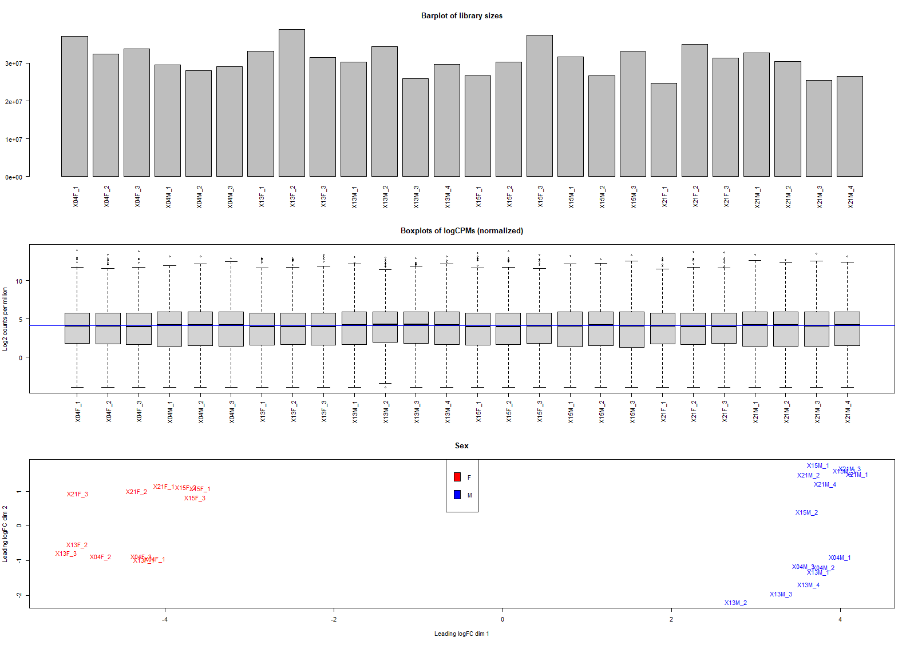
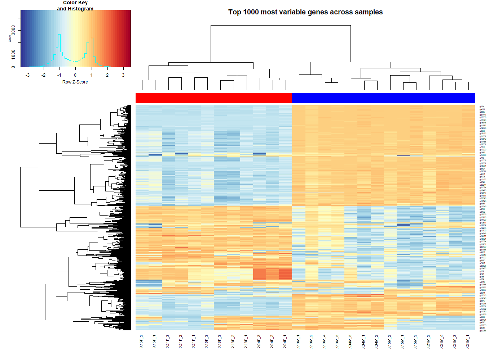
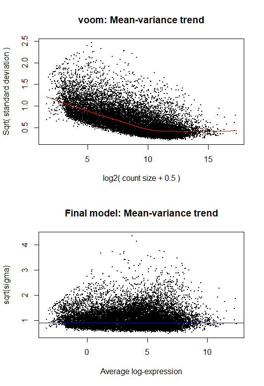
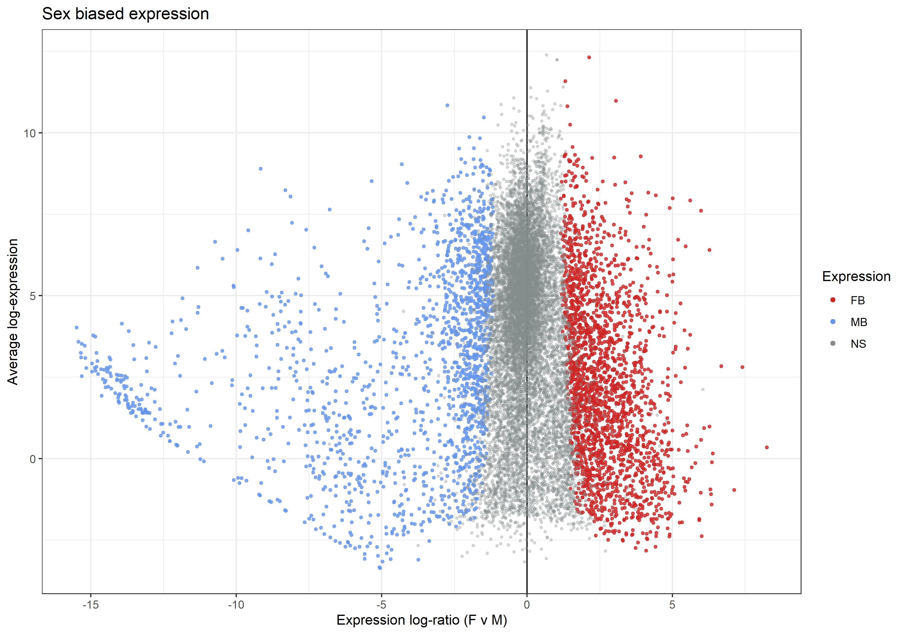

# Sex specific expression

The male and females transcriptomes are a good opportunity to study sex-biased and sex-specific expression in second instar mealybugs. This analysis broadly follows the framework in 2_transcriptome -- it's a differential expression analysis between sexes, regardless of B presence or absence. We'll use the RSEM matrix generated by Isabelle.

### Preprocessing

Out of the 18,843 genes with at least a count in a single sample, if we do filtering with default settings (min.count = 10) we are left with 15,673 genes. The reason for choosing the default threshold is that now we are not that bothered by lowly expressed genes in both M and F.

QC and MDS plots: 

### Running the model

Voom plots:

Differentially expressed genes

| Diff expr     | FvsM (FDR < 0.05, logFC > 1 |
|---------------|-----------------------------|
| Down          | 1644                        |
| NotSig        | 11843                       |
| Up            | 2186                        |

Volcano plot:

### GO term analysis

A hypergeometric test was applied using GOstats (pval < 0.01)