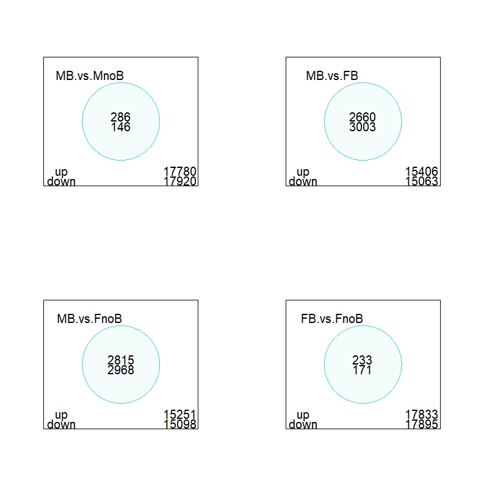
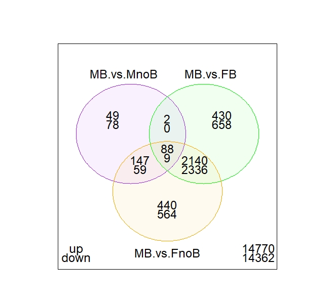
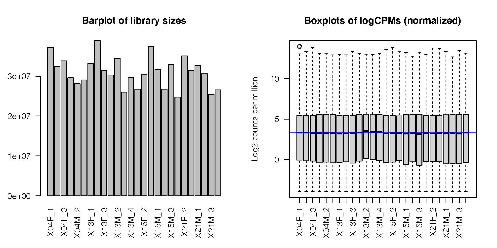
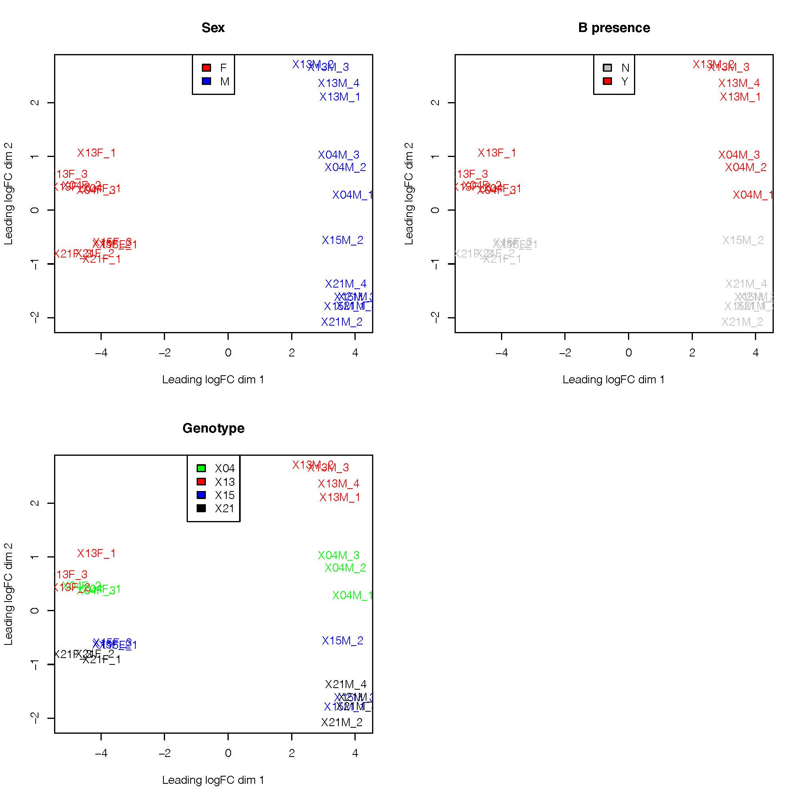
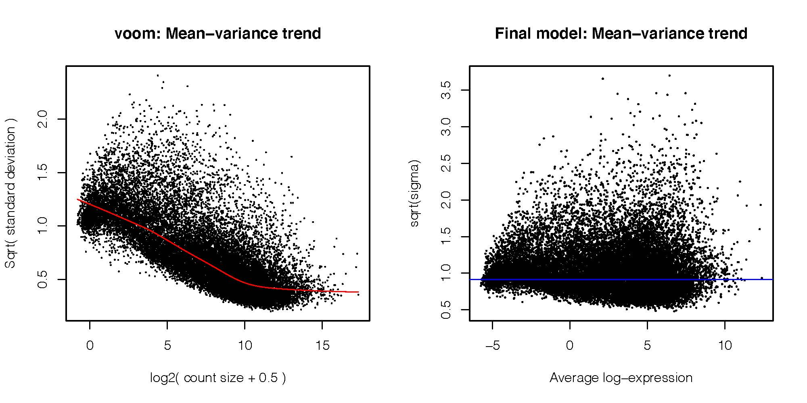
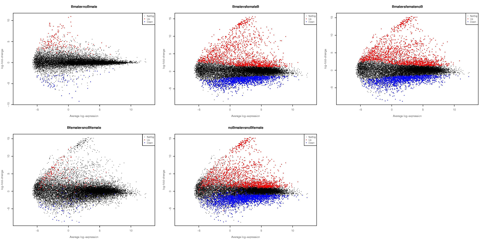
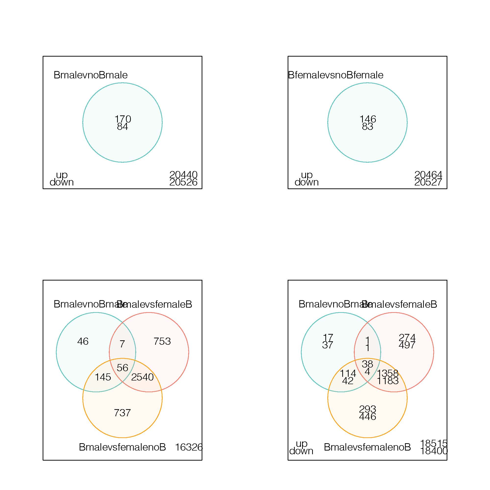
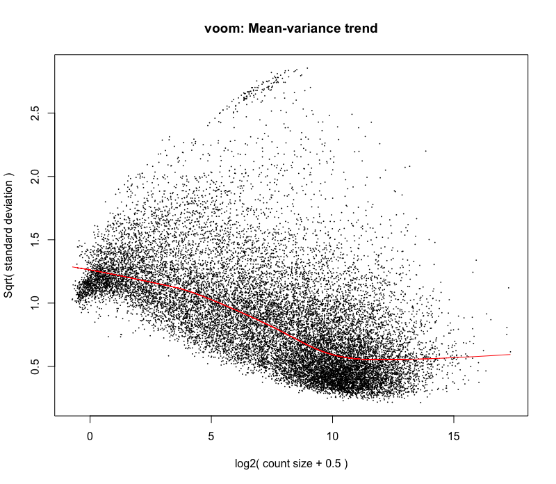
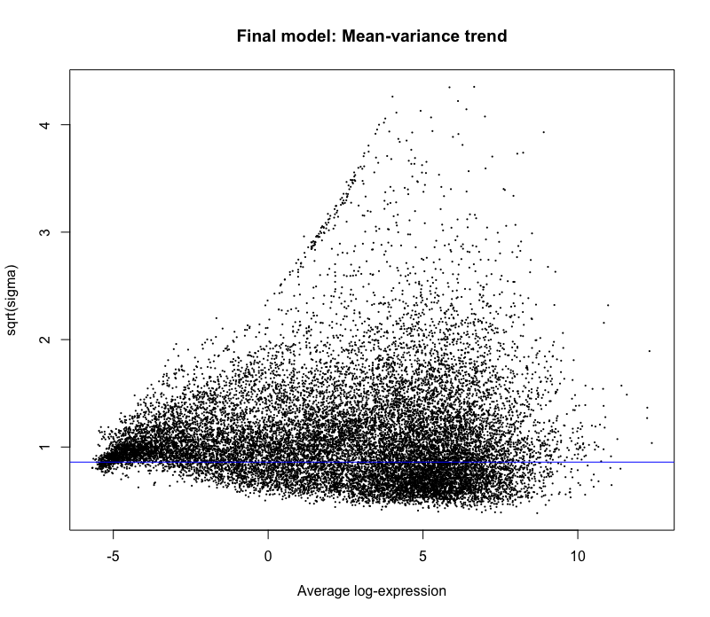
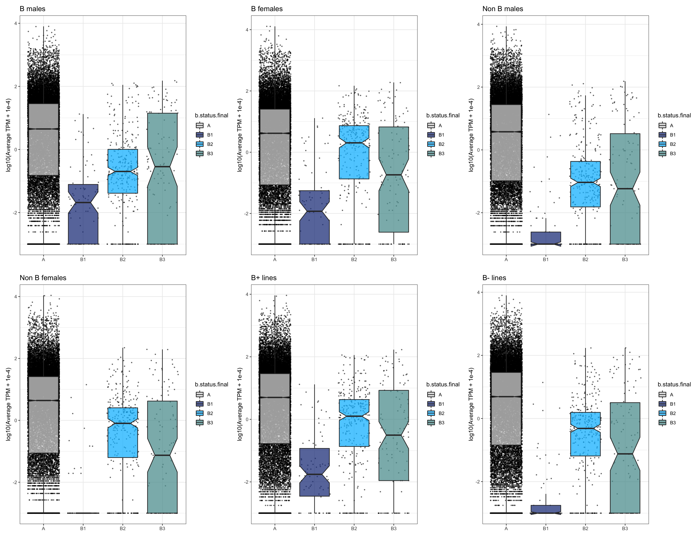

# B differential expression for manuscript

Here I am going to repeat the voom/limma analysis on 2_Transcriptome with a different significance threshold (FDR and log2(1.5)). The idea if that we have a shared B gene between A and B, we might naively expect it to be overexpressed in B+ lines by a factor of 1.5 (rather than the factor of 2 that we originally used). This will be the analysis included in the manuscript. See 2_Transcriptome for in-depth details of the analysis.

### Preprocessing

Number of genes with expression in at least one sample: 21236. 2393 genes with TPM = 0 in all samples (10.1%). NOTE: this percentage might have been misreported before, check the previous markdown files. This is due to an error in the original script -- this is the right one.

Filtering options:

```{r}
keep.exprs.group <- filterByExpr(x, group=x$samples$group,min.count=5)
keep.exprs.group[keep.exprs.group == FALSE]
x1 <- x[keep.exprs.group, keep.lib.sizes=FALSE]
dim(x1)
```
18066 genes left.

QC and MDS plots


### Model design

```{r}
group1=c("FB","FB","FB","MB","MB","MB","FB","FB","FB","MB","MB","MB","MB","FnoB","FnoB","FnoB","MnoB","MnoB","MnoB","FnoB","FnoB","FnoB","MnoB","MnoB","MnoB","MnoB")

design1 <- model.matrix(~0 + group1)

```

limma fit and contrast matrix

```{r}
cont.matrix1 <- makeContrasts(MB.vs.MnoB = group1MB - group1MnoB, MB.vs.FB = group1MB - group1FB, MB.vs.FnoB = group1MB - group1FnoB, FB.vs.FnoB = group1FB - group1FnoB, levels=design1)

```
Differentially expressed genes (FDR <0.05 and log2FC > 0.58)

|Genes  |MB.vs.MnoB |MB.vs.FB |MB.vs.FnoB |FB.vs.FnoB|
|-------|-----------|---------|-----------|----------|
|Down   |       147 |    2971 |      2952 |       168|
|NotSig |     23166 |   18016 |     17848 |     23216|
|Up     |       316 |    2642 |      2829 |       245|





Not sure why the Venn diagram show 43 DE genes that are B male.

List of annotated Bmale only transcripts are in misc/rsem_gene__Bmale_annot2.csv

Here is the top 50 from the cvs file

| gene   | tid       | V4          | V5           | V6                                             | V13                                             | V14                                            |
|--------|-----------|-------------|--------------|------------------------------------------------|-------------------------------------------------|------------------------------------------------|
| g10773 | g10773.t1 | Pfam        | PF00135      | Carboxylesterase family                        | Carboxylesterase, type B                        |                                                |
| g10773 | g10773.t2 | Pfam        | PF00135      | Carboxylesterase family                        | Carboxylesterase, type B                        |                                                |
| g10773 | g10773.t1 | Pfam        | PF00135      | Carboxylesterase family                        | Carboxylesterase, type B                        |                                                |
| g10773 | g10773.t2 | Pfam        | PF00135      | Carboxylesterase family                        | Carboxylesterase, type B                        |                                                |
| g10968 | g10968.t1 | SignalP_EUK | SignalP-noTM |                                                |                                                 |                                                |
| g1124  | g1124.t1  | SignalP_EUK | SignalP-noTM |                                                |                                                 |                                                |
| g11244 | g11244.t1 | Pfam        | PF13873      | Myb/SANT-like DNA-binding domain               | Myb/SANT-like DNA-binding domain                |                                                |
| g1125  | g1125.t1  | SignalP_EUK | SignalP-noTM |                                                |                                                 |                                                |
| g11727 | g11727.t1 | Pfam        | PF13843      | Transposase IS4                                | PiggyBac transposable   element-derived protein |                                                |
| g11901 | g11901.t1 | SignalP_EUK | SignalP-noTM |                                                |                                                 |                                                |
| g11911 | g11911.t1 | SignalP_EUK | SignalP-noTM |                                                |                                                 |                                                |
| g12210 | g12210.t1 | Pfam        | PF09820      | Predicted AAA-ATPase                           | AAA-ATPase-like domain                          |                                                |
| g13191 | g13191.t1 | SignalP_EUK | SignalP-noTM |                                                |                                                 |                                                |
| g13773 | g13773.t1 | Pfam        | PF06109      | Haemolysin E (HlyE)                            | Hemolysin E                                     | GO:0009405\|GO:0044179                         |
| g13773 | g13773.t1 | SignalP_EUK | SignalP-noTM |                                                |                                                 |                                                |
| g13953 | g13953.t1 | Pfam        | PF08214      | Histone acetylation protein                    | Histone acetyltransferase Rtt109/CBP            | GO:0004402\|GO:0006355\|GO:0016573             |
| g13953 | g13953.t2 | Pfam        | PF08214      | Histone acetylation protein                    | Histone acetyltransferase Rtt109/CBP            | GO:0004402\|GO:0006355\|GO:0016573             |
| g13953 | g13953.t3 | Pfam        | PF08214      | Histone acetylation protein                    | Histone acetyltransferase Rtt109/CBP            | GO:0004402\|GO:0006355\|GO:0016573             |
| g14433 | g14433.t1 | Pfam        | PF10551      | MULE transposase domain                        | MULE transposase domain                         |                                                |
| g14433 | g14433.t1 | Pfam        | PF04500      | FLYWCH zinc finger domain                      | Zinc finger, FLYWCH-type                        |                                                |
| g1484  | g1484.t1  | Pfam        | PF07722      | Peptidase C26                                  | Peptidase C26                                   | GO:0016787                                     |
| g1484  | g1484.t1  | Pfam        | PF07722      | Peptidase C26                                  | Peptidase C26                                   | GO:0016787                                     |
| g14861 | g14861.t1 | Pfam        | PF01728      | FtsJ-like methyltransferase                    | Ribosomal RNA methyltransferase FtsJ domain     | GO:0008168\|GO:0032259                         |
| g15418 | g15418.t2 | Pfam        | PF00194      | Eukaryotic-type carbonic anhydrase             | Alpha carbonic anhydrase domain                 |                                                |
| g15418 | g15418.t1 | Pfam        | PF00194      | Eukaryotic-type carbonic anhydrase             | Alpha carbonic anhydrase domain                 |                                                |
| g15418 | g15418.t1 | SignalP_EUK | SignalP-noTM |                                                |                                                 |                                                |
| g1592  | g1592.t1  | Pfam        | PF05585      | Putative peptidase (DUF1758)                   | Peptidase aspartic, putative                    |                                                |
| g17216 | g17216.t1 | Pfam        | PF07690      | Major Facilitator Superfamily                  | Major facilitator superfamily                   | GO:0016021\|GO:0055085                         |
| g1752  | g1752.t1  | Pfam        | PF00098      | Zinc knuckle                                   | Zinc finger, CCHC-type                          | GO:0003676\|GO:0008270                         |
| g1752  | g1752.t1  | Pfam        | PF14223      | gag-polypeptide of LTR copia-type              |                                                 |                                                |
| g17634 | g17634.t1 | SignalP_EUK | SignalP-noTM |                                                |                                                 |                                                |
| g17634 | g17634.t1 | Pfam        | PF13895      | Immunoglobulin domain                          | Immunoglobulin-like domain                      |                                                |
| g17634 | g17634.t1 | Pfam        | PF07679      | Immunoglobulin I-set domain                    | Immunoglobulin I-set                            |                                                |
| g17869 | g17869.t1 | Pfam        | PF00067      | Cytochrome P450                                | Cytochrome P450                                 | GO:0005506\|GO:0016705\|GO:0020037\|GO:0055114 |
| g17908 | g17908.t1 | Pfam        | PF00067      | Cytochrome P450                                | Cytochrome P450                                 | GO:0005506\|GO:0016705\|GO:0020037\|GO:0055114 |
| g18500 | g18500.t1 | SignalP_EUK | SignalP-noTM |                                                |                                                 |                                                |
| g18500 | g18500.t1 | Pfam        | PF00194      | Eukaryotic-type carbonic anhydrase             | Alpha carbonic anhydrase domain                 |                                                |
| g19261 | g19261.t1 | Pfam        | PF09820      | Predicted AAA-ATPase                           | AAA-ATPase-like domain                          |                                                |
| g19773 | g19773.t1 | SignalP_EUK | SignalP-noTM |                                                |                                                 |                                                |
| g19773 | g19773.t1 | Pfam        | PF01094      | Receptor family ligand binding region          | Receptor, ligand binding region                 |                                                |
| g19773 | g19773.t1 | Pfam        | PF07562      | Nine Cysteines Domain of family 3 GPCR         | GPCR, family 3, nine cysteines domain           | GO:0004930\|GO:0007186                         |
| g19773 | g19773.t1 | Pfam        | PF01094      | Receptor family ligand binding region          | Receptor, ligand binding region                 |                                                |
| g19773 | g19773.t1 | Pfam        | PF00003      | 7 transmembrane sweet-taste receptor of 3 GCPR | GPCR family 3, C-terminal                       | GO:0004930\|GO:0007186\|GO:0016021             |
| g19949 | g19949.t1 | Pfam        | PF13843      | Transposase IS4                                | PiggyBac transposable   element-derived protein |                                                |
| g19949 | g19949.t1 | Pfam        | PF13843      | Transposase IS4                                | PiggyBac transposable   element-derived protein |                                                |
| g2001  | g2001.t1  | Pfam        | PF07690      | Major Facilitator Superfamily                  | Major facilitator superfamily                   | GO:0016021\|GO:0055085                         |
| g20017 | g20017.t1 | Pfam        | PF00118      | TCP-1/cpn60 chaperonin family                  | Chaperonin Cpn60/TCP-1 family                   | GO:0005524                                     |
| g20018 | g20018.t1 | Pfam        | PF00118      | TCP-1/cpn60 chaperonin family                  | Chaperonin Cpn60/TCP-1 family                   | GO:0005524                                     |
| g20279 | g20279.t2 | Pfam        | PF00083      | Sugar (and other) transporter                  | Major facilitator,  sugar   transporter-like    | GO:0016021\|GO:0022857\|GO:0055085             |

Andrés taking over here: this looks very promising and I have replicated the analysis up to here. Above Isabelle has extracted the genes that *are differentially expressed* between B males and the other three groups, but not necessarily overexpressed or only expressed in B males. If we do:

	de.over.B.males <- which(dt[,1]==1 & dt[,2]==1 &dt[,3]==1)
	de.under.B.males <- which(dt[,1]==-1 & dt[,2]==-1 &dt[,3]==-1)
	length(de.over.B.males) # B genes overexpressed in B males compared to the rest of the groups (40)
	length(de.under.B.males) # B genes underexpressed in B males compared to the rest of the groups (3)

This makes sense now -- these are the 43 genes that Isabelle got in the 3-way intersection.

Also, there is a problem with extracting differentially expressed genes. Inspecting the files Isabelle produced, things don't add out.  For example, if we do:

	maleB.noB<-topTable(fit.cont1, coef=1, n = summary(dt)[1]+summary(dt)[3])

This gives us a list of 247 genes (as given by n = summary(dt)[1]+summary(dt)[3])) that should correspond to the 168 overexpressed genes + 79 underexpressed in B males with FDR < 0.05 and abs(logFC) > 1. However, by doing the above we get a list of differentially expressed genes ordered by increasing FDR (up to 0.0002). Some of these genes, however, have logFC < 1, and only 155 have positive fold changes (instead of the expected 168). So the line of code above will just give us the top 168 DE genes based on FDR only.

What we have to do is use the topTreat function with the treat object:

	maleB.noB<-topTreat(tfit, coef=1,number = summary(dt)[1]+summary(dt)[3])

### 5. Calculate differentially expressed isoforms (fdr<0.05)

Created matrix for isoform count
```
wc -l *.isoforms.results

```
25678 04F_1.isoforms.results
   25678 04F_2.isoforms.results
   25678 04F_3.isoforms.results
   25678 04M_1.isoforms.results
   25678 04M_2.isoforms.results
   25678 04M_3.isoforms.results
   25678 13F_1.isoforms.results
   25678 13F_2.isoforms.results
   25678 13F_3.isoforms.results
   25678 13M_1.isoforms.results
   25678 13M_2.isoforms.results
   25678 13M_3.isoforms.results
   25678 13M_4.isoforms.results
   25678 15F_1.isoforms.results
   25678 15F_2.isoforms.results
   25678 15F_3.isoforms.results
   25678 15M_1.isoforms.results
   25678 15M_2.isoforms.results
   25678 15M_3.isoforms.results
   25678 21F_1.isoforms.results
   25678 21F_2.isoforms.results
   25678 21F_3.isoforms.results
   25678 21M_1.isoforms.results
   25678 21M_2.isoforms.results
   25678 21M_3.isoforms.results
   25678 21M_4.isoforms.results
  667628 total


```
rsem-generate-data-matrix 04F_1.isoforms.results 04F_2.isoforms.results 04F_3.isoforms.results 04M_1.isoforms.results 04M_2.isoforms.results 04M_3.isoforms.results 13F_1.isoforms.results 13F_2.isoforms.results 13F_3.isoforms.results 13M_1.isoforms.results 13M_2.isoforms.results 13M_3.isoforms.results 13M_4.isoforms.results 15F_1.isoforms.results 15F_2.isoforms.results 15F_3.isoforms.results 15M_1.isoforms.results 15M_2.isoforms.results 15M_3.isoforms.results 21F_1.isoforms.results 21F_2.isoforms.results 21F_3.isoforms.results 21M_1.isoforms.results 21M_2.isoforms.results 21M_3.isoforms.results 21M_4.isoforms.results  >RSEM_digi_isoform.counts.matrix
```

Using this count matrix and R script (EdgeR-PviburniB_ISOFORM.Rmd) to run the same analysis as gene level. 


3. Filtered out low counts

Filtering options
```{r}
keep.exprs.sample <- filterByExpr(x, group=rownames(x$samples),min.count=5, min.prop = 20) 

```

Before filtering, we had 25677 transcript counts, after filtering 20610 transcripts counts are left.

3. Distribution normalization



4. MDS plots




5. Hierachical clustering heatmap of 1000 most variable transcript expression


6. Model design

First, I defined groups that I want to compare. The first one is carrying out DE analysis using sex and B presence or absence only, that means that genotype 04 and 13 are put together (Group1). In group 2, I want to compare DE with the number of Bs, so if we assume that 04 has 2B, 04 and 13 are then separated. This scenario might be more tricky since we are not 100% sure about the numbers of B in these samples but also, we don't know if that would matter. If having different numbers of B changes the expression profiles of the samples, then this would be taken into account.


```{r}
group1=c("FB","FB","FB","MB","MB","MB","FB","FB","FB","MB","MB","MB","MB","FnoB","FnoB","FnoB","MnoB","MnoB","MnoB","FnoB","FnoB","FnoB","MnoB","MnoB","MnoB","MnoB")

design1 <- model.matrix(~0 + group1)

```

7. limma fit and contrast matrix

```{r}
cont.matrix1 <- makeContrasts(BmalevnoBmale = group1MB - group1MnoB, BmalevsfemaleB = group1MB - group1FB, BmalevsfemalenoB = group1MB - group1FnoB,BfemalevsnoBfemale = group1FB - group1FnoB, noBmalevsnoBfemale = group1MnoB - group1FnoB, levels=design1)

```

8. Mean variance trend plots



9. MD plots for each comparison defined in the contrast matrix



10. Differentially expressed genes per 2-group comparison

FDR <0.05 and log2FC > 1


| BmalevnoBmale | BmalevsfemaleB | BmalevsfemalenoB | BfemalevsnoBfemale | noBmalevsnoBfemale |       |
|---------------|----------------|------------------|--------------------|--------------------|-------|
| Down          | 84             | 1685             | 1675               | 83                 | 2214  |
| NotSig        | 20356          | 17254            | 17132              | 20381              | 16639 |
| Up            | 170            | 1671             | 1803               | 146                | 1757  |

All DE genes lists were annotated and exported as csv files in misc/


10. DE only in male with B

To obtain the transcript only expressed in male with B, I selected all the differentially expressed genes that are found in all the three comparisons.

```{r}
tfit <- treat(fit.cont1, lfc=1)
dt <- decideTests(tfit)
summary(dt)
de.common <- which(dt[,1]!=0 & dt[,2]!=0 &dt[,3]!=0)
length(de.common)

```





Venn diagram doesn't show all the DE genes or transcripts if I add the option that shows up and down regulated.

List of annotated Bmale only transcripts are in misc/rsem_isoform_Bmale_annot2.csv

| transcript | V4          | V5           | V6                                                   | V13                                                 | V14                                            |
|------------|-------------|--------------|------------------------------------------------------|-----------------------------------------------------|------------------------------------------------|
| g10773.t1  | Pfam        | PF00135      | Carboxylesterase family                              | Carboxylesterase, type B                            |                                                |
| g10773.t1  | Pfam        | PF00135      | Carboxylesterase family                              | Carboxylesterase, type B                            |                                                |
| g1124.t1   | SignalP_EUK | SignalP-noTM |                                                      |                                                     |                                                |
| g1125.t1   | SignalP_EUK | SignalP-noTM |                                                      |                                                     |                                                |
| g11727.t1  | Pfam        | PF13843      | Transposase IS4                                      | PiggyBac transposable element-derived protein       |                                                |
| g11901.t1  | SignalP_EUK | SignalP-noTM |                                                      |                                                     |                                                |
| g11911.t1  | SignalP_EUK | SignalP-noTM |                                                      |                                                     |                                                |
| g12210.t1  | Pfam        | PF09820      | Predicted AAA-ATPase                                 | AAA-ATPase-like domain                              |                                                |
| g13191.t1  | SignalP_EUK | SignalP-noTM |                                                      |                                                     |                                                |
| g13773.t1  | Pfam        | PF06109      | Haemolysin E (HlyE)                                  | Hemolysin E                                         | GO:0009405\|GO:0044179                         |
| g13773.t1  | SignalP_EUK | SignalP-noTM |                                                      |                                                     |                                                |
| g13953.t2  | Pfam        | PF08214      | Histone acetylation protein                          | Histone acetyltransferase Rtt109/CBP                | GO:0004402\|GO:0006355\|GO:0016573             |
| g14433.t1  | Pfam        | PF10551      | MULE transposase domain                              | MULE transposase domain                             |                                                |
| g14433.t1  | Pfam        | PF04500      | FLYWCH zinc finger domain                            | Zinc finger, FLYWCH-type                            |                                                |
| g1484.t1   | Pfam        | PF07722      | Peptidase C26                                        | Peptidase C26                                       | GO:0016787                                     |
| g1484.t1   | Pfam        | PF07722      | Peptidase C26                                        | Peptidase C26                                       | GO:0016787                                     |
| g14861.t1  | Pfam        | PF01728      | FtsJ-like methyltransferase                          | Ribosomal RNA methyltransferase FtsJ domain         | GO:0008168\|GO:0032259                         |
| g17216.t1  | Pfam        | PF07690      | Major Facilitator Superfamily                        | Major facilitator superfamily                       | GO:0016021\|GO:0055085                         |
| g1752.t1   | Pfam        | PF14223      | gag-polypeptide of LTR copia-type                    |                                                     |                                                |
| g1752.t1   | Pfam        | PF00098      | Zinc knuckle                                         | Zinc finger, CCHC-type                              | GO:0003676\|GO:0008270                         |
| g17908.t1  | Pfam        | PF00067      | Cytochrome P450                                      | Cytochrome P450                                     | GO:0005506\|GO:0016705\|GO:0020037\|GO:0055114 |
| g19773.t1  | Pfam        | PF01094      | Receptor family ligand binding region                | Receptor, ligand binding region                     |                                                |
| g19773.t1  | Pfam        | PF00003      | 7 transmembrane sweet-taste receptor of 3 GCPR       | GPCR family 3, C-terminal                           | GO:0004930\|GO:0007186\|GO:0016021             |
| g19773.t1  | Pfam        | PF07562      | Nine Cysteines Domain of family 3 GPCR               | GPCR, family 3, nine cysteines domain               | GO:0004930\|GO:0007186                         |
| g19773.t1  | SignalP_EUK | SignalP-noTM |                                                      |                                                     |                                                |
| g19773.t1  | Pfam        | PF01094      | Receptor family ligand binding region                | Receptor, ligand binding region                     |                                                |
| g20279.t1  | Pfam        | PF00083      | Sugar (and other) transporter                        | Major facilitator,  sugar   transporter-like        | GO:0016021\|GO:0022857\|GO:0055085             |
| g20279.t2  | Pfam        | PF00083      | Sugar (and other) transporter                        | Major facilitator,  sugar   transporter-like        | GO:0016021\|GO:0022857\|GO:0055085             |
| g20946.t1  | Pfam        | PF04500      | FLYWCH zinc finger domain                            | Zinc finger, FLYWCH-type                            |                                                |
| g20946.t1  | Pfam        | PF10551      | MULE transposase domain                              | MULE transposase domain                             |                                                |
| g21055.t1  | Pfam        | PF14223      | gag-polypeptide of LTR copia-type                    |                                                     |                                                |
| g22863.t1  | Pfam        | PF00651      | BTB/POZ domain                                       | BTB/POZ domain                                      | GO:0005515                                     |
| g23072.t1  | Pfam        | PF01833      | IPT/TIG domain                                       | IPT domain                                          |                                                |
| g23072.t1  | SignalP_EUK | SignalP-noTM |                                                      |                                                     |                                                |
| g23072.t1  | Pfam        | PF01833      | IPT/TIG domain                                       | IPT domain                                          |                                                |
| g23373.t1  | Pfam        | PF00083      | Sugar (and other) transporter                        | Major facilitator,  sugar   transporter-like        | GO:0016021\|GO:0022857\|GO:0055085             |
| g2460.t2   | Pfam        | PF00406      | Adenylate kinase                                     |                                                     |                                                |
| g2571.t1   | Pfam        | PF03184      | DDE superfamily endonuclease                         | DDE superfamily endonuclease domain                 | GO:0003676                                     |
| g2938.t1   | Pfam        | PF03221      | Tc5 transposase DNA-binding domain                   | HTH CenpB-type DNA-binding domain                   |                                                |
| g2938.t1   | Pfam        | PF05225      | helix-turn-helix, Psq domain                         | DNA binding HTH domain, Psq-type                    | GO:0003677                                     |
| g3239.t1   | Pfam        | PF07993      | Male sterility protein                               | Male sterility, NAD-binding                         |                                                |
| g3239.t1   | Pfam        | PF03015      | Male sterility protein                               | Fatty acyl-CoA reductase, C-terminal                |                                                |
| g4426.t1   | Pfam        | PF13843      | Transposase IS4                                      | PiggyBac transposable element-derived protein       |                                                |
| g4593.t1   | Pfam        | PF00194      | Eukaryotic-type carbonic anhydrase                   | Alpha carbonic anhydrase domain                     |                                                |
| g5036.t1   | Pfam        | PF02958      | Ecdysteroid kinase                                   | Ecdysteroid kinase-like                             |                                                |
| g507.t1    | Pfam        | PF11838      | ERAP1-like C-terminal domain                         | ERAP1-like C-terminal domain                        |                                                |
| g5248.t1   | Pfam        | PF00199      | Catalase                                             | Catalase core domain                                | GO:0004096\|GO:0020037\|GO:0055114             |
| g5248.t1   | Pfam        | PF06628      | Catalase-related immune-responsive                   | Catalase immune-responsive domain                   |                                                |
| g5312.t1   | Pfam        | PF13843      | Transposase IS4                                      | PiggyBac transposable element-derived protein       |                                                |
| g5653.t1   | Pfam        | PF07727      | Reverse transcriptase (RNA-dependent DNA polymerase) | Reverse transcriptase, RNA-dependent DNA polymerase |                                                |
| g5653.t1   | Pfam        | PF00665      | Integrase core domain                                | Integrase, catalytic core                           | GO:0015074                                     |
| g5671.t1   | Pfam        | PF13843      | Transposase IS4                                      | PiggyBac transposable element-derived protein       |                                                |
| g5671.t1   | Pfam        | PF13843      | Transposase IS4                                      | PiggyBac transposable element-derived protein       |                                                |
| g6828.t2   | Pfam        | PF05699      | hAT family C-terminal dimerisation region            | HAT, C-terminal dimerisation domain                 | GO:0046983                                     |
| g6828.t2   | Pfam        | PF14291      | Domain of unknown function (DUF4371)                 | Domain of unknown function DUF4371                  |                                                |
| g864.t1    | Pfam        | PF15868      | Transcription activator MBF2                         | Transcription activator MBF2                        |                                                |
| g9431.t1   | SignalP_EUK | SignalP-noTM |                                                      |                                                     |                                                |

# DEGs B vs non B lines regardless of sex

## Using edgeR script

To obtain the DEGs in B compared to non B lines, the same data prep was made and a new Design was created (design2 in R script)
```
group2=c("B","B","B","B","B","B","B","B","B","B","B","B","B","noB","noB","noB","noB","noB","noB","noB","noB","noB","noB","noB","noB","noB")
design2 <- model.matrix(~0 + group2)
```

*Voom plot before contrast matrix*




*Contrast matrix*
```
cont.matrix2 <- makeContrasts(BnoB = group2B - group2noB, levels= design2)
```

*Voom plot after model fit*



* Venn Diagram *


There were 178 overexpressed and 70 underexpressed genes if we compared presence or absence of B, regardless of sex

The list of overexpressed genes was exported to output/


## Using exploring_AB_genes R script

I edited the script by just adding the B vs non B list.

There are 160 A genes overexpressed and 68 underexpressed genes between B and non B lines regarless of sex

*Distribution to type of gene in the overexpressed genes*
```
 A  B1  B2  B3 
160   8   6   4 

```
List: output/over.B.vs.noB.csv


Distribution to type of gene in the underexpressed genes*
```
 A B2 B3 
68  1  1
```
List: output/under.B.vs.noB.csv


*Plot expression by type of gene*



