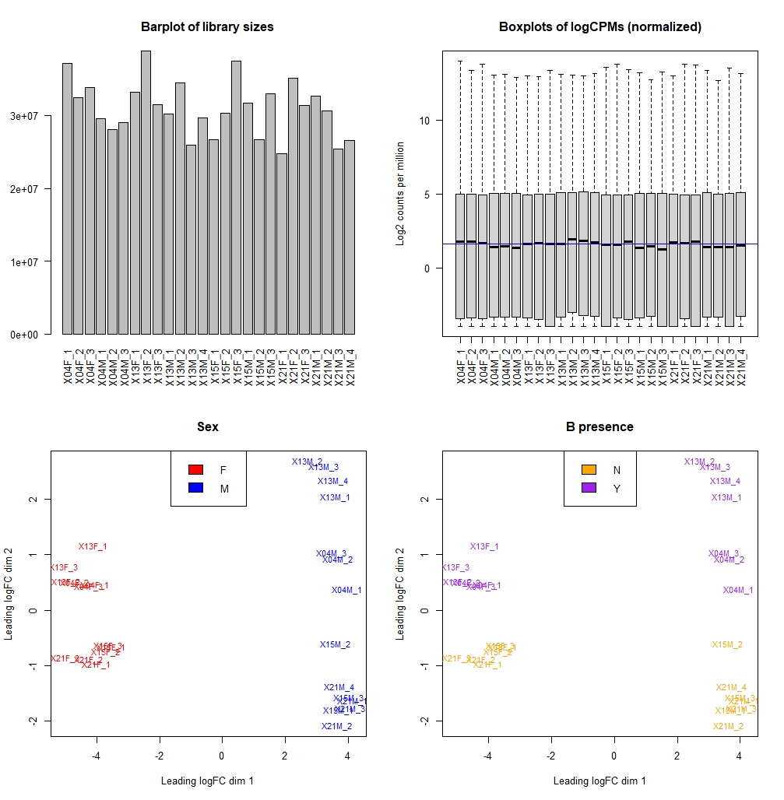
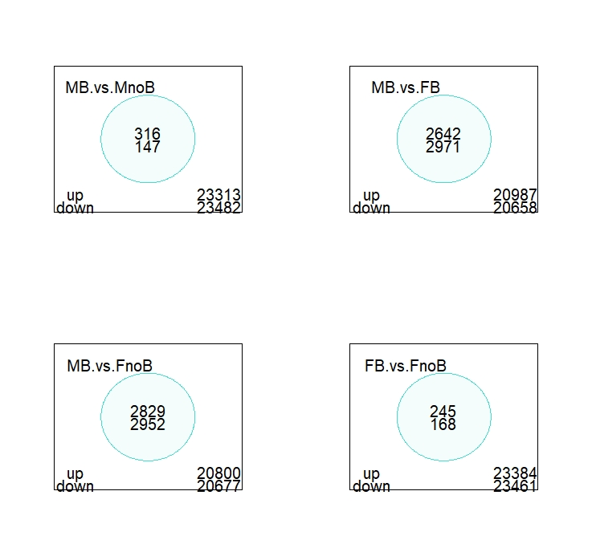
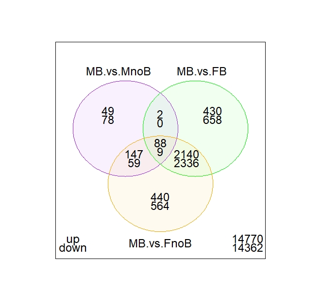
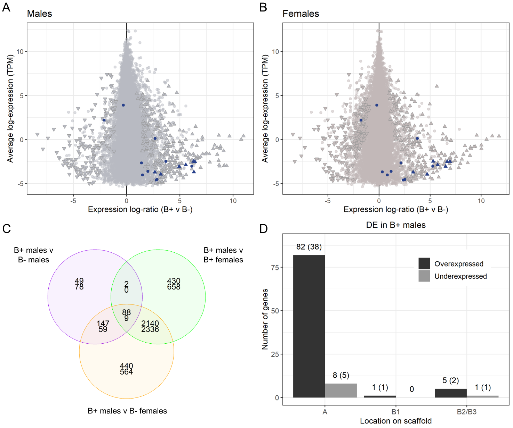

# B differential expression for manuscript

Here I am going to repeat the voom/limma analysis on 2_Transcriptome with a different significance threshold (FDR and log2(1.5)). The idea if that we have a shared B gene between A and B, we might naively expect it to be overexpressed in B+ lines by a factor of 1.5 (rather than the factor of 2 that we originally used). This will be the analysis included in the manuscript. See 2_Transcriptome for in-depth details of the analysis.

### Preprocessing

Number of genes with expression in at least one sample: 21236. 2393 genes with TPM = 0 in all samples (10.1%). NOTE: this percentage might have been misreported before, check the previous markdown files. This is due to an error in the original script -- this is the right one.

The script for the analysis is here: [B_differential_expression_manuscript.R](R_scripts/B_differential_expression_manuscript.R). Hopefully this will be the final version.

Filtering options:

```{r}
keep.exprs.group <- filterByExpr(x, group=x$samples$group,min.count=5)
keep.exprs.group[keep.exprs.group == FALSE]
x1 <- x[keep.exprs.group, keep.lib.sizes=FALSE]
dim(x1)
```
18066 genes left.

QC and MDS plots



### Model design

```{r}
group1=c("FB","FB","FB","MB","MB","MB","FB","FB","FB","MB","MB","MB","MB","FnoB","FnoB","FnoB","MnoB","MnoB","MnoB","FnoB","FnoB","FnoB","MnoB","MnoB","MnoB","MnoB")

design1 <- model.matrix(~0 + group1)

```

limma fit and contrast matrix

```{r}
cont.matrix1 <- makeContrasts(MB.vs.MnoB = group1MB - group1MnoB, MB.vs.FB = group1MB - group1FB, MB.vs.FnoB = group1MB - group1FnoB, FB.vs.FnoB = group1FB - group1FnoB, levels=design1)

```
Differentially expressed genes (FDR <0.05 and log2FC > 0.58)

|Genes  |MB.vs.MnoB |MB.vs.FB |MB.vs.FnoB |FB.vs.FnoB|
|-------|-----------|---------|-----------|----------|
|Down   |      146  |  3003   |   2968    |   171    |
|NotSig |    17634  | 12403   |  12283    | 17662    |
|Up     |      286  |  2660   |   2815    |   233    |




### Analysis

I wrote this directly on the manuscript:

We performed a differential expression analysis for 18,066 genes which included four contrasts: B-carrying males versus the other three sample groups (B- males, B+ females and B- females) and, additionally, B+ females versus B- females (18,066 genes with significantly differential expression set to |log2FC > 0.58| and FDR < 0.01; Table 3; SuppfigD; Supplementary file S1.7).

Table 3 is the table above and SuppfigD the first figure (distributions or library sizes and MDS).

SuppfigD:


Supplementary file S1.7 is the full results table: https://github.com/RossLab/B_viburni/blob/master/output/B_diff_expr/results.txt

We found 432 differentially expressed genes between B+ males and B- males, 232 of which are annotated (Fig 4A; Supplementary file S1.8). Among the 286 genes that are overexpressed in B+ males, we found seven located on B1 scaffolds. These genes include five annotated genes: a histone acetyltransferase Rtt109/CBP (g13953), two fatty acid synthases (g1208, g5582) and two contiguous genes with predicted AAA-ATPase-like domains (g9061, g9062). As expected, we did not find any B1-linked genes among the 146 genes that are overexpressed in B- samples. A GO term enrichment analysis revealed that the differentially expressed genes between B+ and B- males are enriched in four biological processes: DNA integration (GO:0015074), transposition, DNA-mediated (GO:0006313), proteasome assembly (GO:0043248) and  nuclear-transcribed mRNA catabolic process, nonsense-mediated decay (GO:0000184) (122 genes with associated GO terms out of 7,375 annotated genes in the background population, Supplementary file S1.9).

Fig 4:



Supplementary file S1.8 (annonated DE genes): https://github.com/RossLab/B_viburni/blob/master/output/B_diff_expr/MB.vs.MnoB.de.annotated.csv

Supplementary file S1.9 (GO analysis): https://github.com/RossLab/B_viburni/blob/master/output/B_diff_expr/GO.enriched.BvsnoB.M.csv

The results in females were similar, with 233 genes overexpressed in B+ (7 on B1 scaffolds, including g1208, g5582, g9061 and g9062) and 171 in B- (none on B1) (Fig 4B; Supplementary file S1.10). The differentially expressed genes are enriched in DNA metabolic process (GO:0006259) and telomere maintenance (GO:0000723) (119 genes with associated GO terms out of 7,375 annotated genes in the background population, Supplementary file S1.11).

Supplementary file S1.10 (annonated DE genes): https://github.com/RossLab/B_viburni/blob/master/output/B_diff_expr/FB.vs.FnoB.de.annotated.csv

Supplementary file S1.11: https://github.com/RossLab/B_viburni/blob/master/output/B_diff_expr/GO.enriched.BvsnoB.F.csv

We then focused on the genes that are differentially expressed in B+ males compared to the other three sample groups (Figs. 4C-D, Table 4). Among the 88 genes that are overexpressed in B+ males, we found a single B1 gene: the histone acetyltransferase g13953. Additionally, we found two annotated genes located on low-confidence B-linked scaffolds: g5312 (B2), a transposase IS4; and g5232 (B3), which contains a N-terminal domain of TAR DNA-Binding Protein 43. The remaining annotated genes are located on A scaffolds. 9 genes are underexpressed in B+ males, including 5 genes on A scaffolds and a catalase gene, g5248, located on a B3 scaffold.

Table 4 is this one, simplified: https://github.com/RossLab/B_viburni/blob/master/output/B_diff_expr/over.Bmales.vs.all.csv
